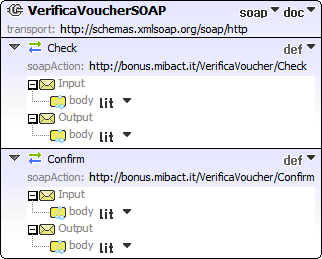
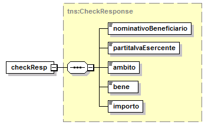
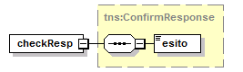
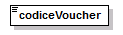

.. _header-added-by-pandoc-11:

header added by pandoc
----------------------

.. _header-added-by-pandoc-12:

header added by pandoc
~~~~~~~~~~~~~~~~~~~~~~

.. _header-added-by-pandoc-13:

header added by pandoc
^^^^^^^^^^^^^^^^^^^^^^

`VerificaVouc <#_bookmark0>`__ `her <#_bookmark0>`__
''''''''''''''''''''''''''''''''''''''''''''''''''''

`VerificaVoucherS <#_bookmark2>`__\ `OAP <#_bookmark2>`__

`VerificaVouc <#_bookmark3>`__\ `her <#_bookmark3>`__

`CheckRequest <#_bookmark6>`__\ `Check <#_bookmark18>`__

`CheckRespons <#_bookmark7>`__\ `e <#_bookmark7>`__\ `ConfirmReque <#_bookmark8>`__\ `st <#_bookmark8>`__\ `ConfirmRespo <#_bookmark9>`__\ `nse <#_bookmark9>`__

`CheckRequestObj <#_bookmark10>`__\ `CheckResponse <#_bookmark22>`__

`CheckResponseO <#_bookmark12>`__\ `bj <#_bookmark12>`__

`Confirm <#_bookmark28>`__\ `ConfirmRequestO <#_bookmark14>`__\ `bj <#_bookmark14>`__

`ConfirmResponse <#_bookmark32>`__

`ConfirmResponse <#_bookmark16>`__\ `Obj <#_bookmark16>`__

attributeFormDefault: elementFormDefault:

targetNamespace: http://bonus.mibact.it/VerificaVoucher/

Elements Complex types

`CheckRequestObj <#_bookmark10>`__\ `Check <#_bookmark18>`__\ `CheckResponseObj <#_bookmark12>`__\ `CheckResponse <#_bookmark22>`__\ `ConfirmRequestObj <#_bookmark14>`__\ `Confirm <#_bookmark28>`__\ `ConfirmResponseObj <#_bookmark16>`__\ `ConfirmResponse <#_bookmark32>`__

service **VerificaVoucher**

+---------+-----------------------------------------------------------------------------+
| diagram | |image3|                                                                    |
+=========+=============================================================================+
| ports   | **VerificaVoucherSOAP**                                                     |
|         |                                                                             |
|         | binding `tns:VerificaVoucherSOAP <#_bookmark2>`__                           |
|         |                                                                             |
|         | extensibility <soap:address                                                 |
|         |                                                                             |
|         | location="\ https://bonus.mibact.it/VerificaVoucherWEB/VerificaVoucher%22/> |
+---------+-----------------------------------------------------------------------------+
| source  | <wsdl:service name="VerificaVoucher">                                       |
|         |                                                                             |
|         | <wsdl:port name="VerificaVoucherSOAP" binding="tns:VerificaVoucherSOAP">    |
+---------+-----------------------------------------------------------------------------+

APPLICAZIONE 18APP ALLEGATO

LINEE GUIDA PER ESERCENTI PAG. 16 DI 26

+--+-------------------------------------------------------------------------------------------+
|  | <soap:address location="\ https://bonus.mibact.it/VerificaVoucherWEB/VerificaVoucher%22/> |
|  |                                                                                           |
|  | </wsdl:port>                                                                              |
|  |                                                                                           |
|  | </wsdl:service>                                                                           |
+--+-------------------------------------------------------------------------------------------+

binding **VerificaVoucherSOAP**

+---------------+----------------------------------------------------------------------------------------------------------------------------------+
| diagram       | |image4|                                                                                                                         |
+===============+==================================================================================================================================+
| type          | `tns:VerificaVoucher <#_bookmark3>`__                                                                                            |
+---------------+----------------------------------------------------------------------------------------------------------------------------------+
| extensibility | <soap:binding style="document" transport=\ `"http://schemas.xmlsoap.org/soap/http <http://schemas.xmlsoap.org/soap/http>`__"/>   |
+---------------+----------------------------------------------------------------------------------------------------------------------------------+
| operations    | **Check**                                                                                                                        |
|               |                                                                                                                                  |
|               | extensibility <soap:operation                                                                                                    |
|               |                                                                                                                                  |
|               | soapAction="\ http://bonus.mibact.it/VerificaVoucher/Check%22/>                                                                  |
|               |                                                                                                                                  |
|               | input <soap:body use="literal"/>                                                                                                 |
|               |                                                                                                                                  |
|               | output <soap:body use="literal"/>                                                                                                |
|               |                                                                                                                                  |
|               | **Confirm**                                                                                                                      |
|               |                                                                                                                                  |
|               | extensibility <soap:operation                                                                                                    |
|               |                                                                                                                                  |
|               | soapAction="\ http://bonus.mibact.it/VerificaVoucher/Confirm%22/>                                                                |
|               |                                                                                                                                  |
|               | input <soap:body use="literal"/>                                                                                                 |
|               |                                                                                                                                  |
|               | output <soap:body use="literal"/>                                                                                                |
+---------------+----------------------------------------------------------------------------------------------------------------------------------+
| used by       | Port `VerificaVoucherSOAP <#_bookmark1>`__ in Service `VerificaVoucher <#_bookmark0>`__                                          |
+---------------+----------------------------------------------------------------------------------------------------------------------------------+
| source        | <wsdl:binding name="VerificaVoucherSOAP" type="tns:VerificaVoucher">                                                             |
|               |                                                                                                                                  |
|               | <soap:binding style="document" transport=\ `"http://schemas.xmlsoap.org/soap/http <http://schemas.xmlsoap.org/soap/http>`__"/>   |
|               |                                                                                                                                  |
|               | <wsdl:operation name="Check">                                                                                                    |
|               |                                                                                                                                  |
|               | <soap:operation soapAction=\ `"http://bonus.mibact.it/VerificaVoucher/Check <http://bonus.mibact.it/VerificaVoucher/Check>`__"/> |
|               |                                                                                                                                  |
|               | <wsdl:input>                                                                                                                     |
|               |                                                                                                                                  |
|               | <soap:body use="literal"/>                                                                                                       |
+---------------+----------------------------------------------------------------------------------------------------------------------------------+

APPLICAZIONE 18APP ALLEGATO

LINEE GUIDA PER ESERCENTI PAG. 17 DI 26

+--+--------------------------------------------------------------------------------------------------------------------------------------+
|  | </wsdl:input>                                                                                                                        |
|  |                                                                                                                                      |
|  | <wsdl:output>                                                                                                                        |
|  |                                                                                                                                      |
|  | <soap:body use="literal"/>                                                                                                           |
|  |                                                                                                                                      |
|  | </wsdl:output>                                                                                                                       |
|  |                                                                                                                                      |
|  | </wsdl:operation>                                                                                                                    |
|  |                                                                                                                                      |
|  | <wsdl:operation name="Confirm">                                                                                                      |
|  |                                                                                                                                      |
|  | <soap:operation soapAction=\ `"http://bonus.mibact.it/VerificaVoucher/Confirm <http://bonus.mibact.it/VerificaVoucher/Confirm>`__"/> |
|  |                                                                                                                                      |
|  | <wsdl:input>                                                                                                                         |
|  |                                                                                                                                      |
|  | <soap:body use="literal"/>                                                                                                           |
|  |                                                                                                                                      |
|  | </wsdl:input>                                                                                                                        |
|  |                                                                                                                                      |
|  | <wsdl:output>                                                                                                                        |
|  |                                                                                                                                      |
|  | <soap:body use="literal"/>                                                                                                           |
|  |                                                                                                                                      |
|  | </wsdl:output>                                                                                                                       |
|  |                                                                                                                                      |
|  | </wsdl:operation>                                                                                                                    |
|  |                                                                                                                                      |
|  | </wsdl:binding>                                                                                                                      |
+--+--------------------------------------------------------------------------------------------------------------------------------------+

porttype **VerificaVoucher**

+------------+-----------------------------------------------+
| diagram    | |image5|                                      |
+============+===============================================+
| operations | **Check**                                     |
|            |                                               |
|            | input `tns:CheckRequest <#_bookmark6>`__      |
|            |                                               |
|            | output `tns:CheckResponse <#_bookmark7>`__    |
|            |                                               |
|            | **Confirm**                                   |
|            |                                               |
|            | input `tns:ConfirmRequest <#_bookmark8>`__    |
|            |                                               |
|            | output `tns:ConfirmResponse <#_bookmark9>`__  |
+------------+-----------------------------------------------+
| used by    | binding `VerificaVoucherSOAP <#_bookmark2>`__ |
+------------+-----------------------------------------------+
| source     | <wsdl:portType name="VerificaVoucher">        |
|            |                                               |
|            | <wsdl:operation name="Check">                 |
|            |                                               |
|            | <wsdl:input message="tns:CheckRequest"/>      |
|            |                                               |
|            | <wsdl:output message="tns:CheckResponse"/>    |
|            |                                               |
|            | </wsdl:operation>                             |
|            |                                               |
|            | <wsdl:operation name="Confirm">               |
+------------+-----------------------------------------------+

APPLICAZIONE 18APP ALLEGATO

LINEE GUIDA PER ESERCENTI PAG. 18 DI 26

+--+----------------------------------------------+
|  | <wsdl:input message="tns:ConfirmRequest"/>   |
|  |                                              |
|  | <wsdl:output message="tns:ConfirmResponse"/> |
|  |                                              |
|  | </wsdl:operation>                            |
|  |                                              |
|  | </wsdl:portType>                             |
+--+----------------------------------------------+

message **CheckRequest**

+---------+---------------------------------------------------------------------------------------+
| parts   | **parameters**                                                                        |
|         |                                                                                       |
|         | element `tns:CheckRequestObj <#_bookmark10>`__                                        |
+=========+=======================================================================================+
| used by | Operation `Check <#_bookmark4>`__ in PortType `VerificaVouche <#_bookmark3>`__\ **r** |
+---------+---------------------------------------------------------------------------------------+
| source  | <wsdl:message name="CheckRequest">                                                    |
|         |                                                                                       |
|         | <wsdl:part name="parameters" element="tns:CheckRequestObj"/>                          |
|         |                                                                                       |
|         | </wsdl:message>                                                                       |
+---------+---------------------------------------------------------------------------------------+

message **CheckResponse**

+---------+---------------------------------------------------------------------------------------+
| parts   | **parameters**                                                                        |
|         |                                                                                       |
|         | element `tns:CheckResponseObj <#_bookmark12>`__                                       |
+=========+=======================================================================================+
| used by | Operation `Check <#_bookmark4>`__ in PortType `VerificaVouche <#_bookmark3>`__\ **r** |
+---------+---------------------------------------------------------------------------------------+
| source  | <wsdl:message name="CheckResponse">                                                   |
|         |                                                                                       |
|         | <wsdl:part name="parameters" element="tns:CheckResponseObj"/>                         |
|         |                                                                                       |
|         | </wsdl:message>                                                                       |
+---------+---------------------------------------------------------------------------------------+

message **ConfirmRequest**

+---------+-----------------------------------------------------------------------------------------+
| parts   | **parameters**                                                                          |
|         |                                                                                         |
|         | element `tns:ConfirmRequestObj <#_bookmark14>`__                                        |
+=========+=========================================================================================+
| used by | Operation `Confirm <#_bookmark5>`__ in PortType `VerificaVouche <#_bookmark3>`__\ **r** |
+---------+-----------------------------------------------------------------------------------------+
| source  | <wsdl:message name="ConfirmRequest">                                                    |
|         |                                                                                         |
|         | <wsdl:part name="parameters" element="tns:ConfirmRequestObj"/>                          |
|         |                                                                                         |
|         | </wsdl:message>                                                                         |
+---------+-----------------------------------------------------------------------------------------+

message **ConfirmResponse**

**Codice campo modificato Codice campo modificato**

**Codice campo modificato Codice campo modificato**

**Codice campo modificato Codice campo modificato**

**Codice campo modificato Codice campo modificato**

APPLICAZIONE 18APP ALLEGATO

LINEE GUIDA PER ESERCENTI PAG. 19 DI 26

element **CheckRequestObj**

+------------+-------------------------------------------------+
| diagram    | |image6|                                        |
+============+=================================================+
| namespace  | http://bonus.mibact.it/VerificaVoucher/         |
+------------+-------------------------------------------------+
| properties | content complex                                 |
+------------+-------------------------------------------------+
| children   | `checkReq <#_bookmark11>`__                     |
+------------+-------------------------------------------------+
| source     | <xsd:element name="CheckRequestObj">            |
|            |                                                 |
|            | <xsd:complexType>                               |
|            |                                                 |
|            | <xsd:sequence>                                  |
|            |                                                 |
|            | <xsd:element name="checkReq" type="tns:Check"/> |
|            |                                                 |
|            | </xsd:sequence>                                 |
|            |                                                 |
|            | </xsd:complexType>                              |
|            |                                                 |
|            | </xsd:element>                                  |
+------------+-------------------------------------------------+

element **CheckRequestObj/checkReq**

+------------+-------------------------------------------------------------------------------------------------------------+
| diagram    | |image7|                                                                                                    |
+============+=============================================================================================================+
| type       | `tns:Check <#_bookmark18>`__                                                                                |
+------------+-------------------------------------------------------------------------------------------------------------+
| properties | content complex                                                                                             |
+------------+-------------------------------------------------------------------------------------------------------------+
| children   | `tipoOperazione <#_bookmark19>`__\ `codiceVoucher <#_bookmark20>`__\ `partitaIvaEsercente <#_bookmark21>`__ |
+------------+-------------------------------------------------------------------------------------------------------------+
| source     | <xsd:element name="checkReq" type="tns:Check"/>                                                             |
+------------+-------------------------------------------------------------------------------------------------------------+

element **CheckResponseObj**

+------------+-----------------------------------------+
| diagram    | |image8|                                |
+============+=========================================+
| namespace  | http://bonus.mibact.it/VerificaVoucher/ |
+------------+-----------------------------------------+
| properties | content complex                         |
+------------+-----------------------------------------+
| children   | `checkResp <#_bookmark13>`__            |
+------------+-----------------------------------------+
| source     | <xsd:element name="CheckResponseObj">   |
+------------+-----------------------------------------+

APPLICAZIONE 18APP ALLEGATO

LINEE GUIDA PER ESERCENTI PAG. 20 DI 26

+--+----------------------------------------------------------+
|  | <xsd:complexType>                                        |
|  |                                                          |
|  | <xsd:sequence>                                           |
|  |                                                          |
|  | <xsd:element name="checkResp" type="tns:CheckResponse"/> |
|  |                                                          |
|  | </xsd:sequence>                                          |
|  |                                                          |
|  | </xsd:complexType>                                       |
|  |                                                          |
|  | </xsd:element>                                           |
+--+----------------------------------------------------------+

element **CheckResponseObj/checkResp**

+------------+---------------------------------------------------------------------------------------------------------------------------------------------------------------------------------------------------+
| diagram    | |image9|                                                                                                                                                                                          |
+============+===================================================================================================================================================================================================+
| type       | `tns:CheckResponse <#_bookmark22>`__                                                                                                                                                              |
+------------+---------------------------------------------------------------------------------------------------------------------------------------------------------------------------------------------------+
| properties | content complex                                                                                                                                                                                   |
+------------+---------------------------------------------------------------------------------------------------------------------------------------------------------------------------------------------------+
| children   | `nominativoBeneficiario <#element-checkresponsenominativobeneficiario>`__\ `partitaIvaEsercente <#_bookmark24>`__\ `ambito <#_bookmark25>`__\ `bene <#_bookmark26>`__\ `importo <#_bookmark27>`__ |
+------------+---------------------------------------------------------------------------------------------------------------------------------------------------------------------------------------------------+
| source     | <xsd:element name="checkResp" type="tns:CheckResponse"/>                                                                                                                                          |
+------------+---------------------------------------------------------------------------------------------------------------------------------------------------------------------------------------------------+

element **ConfirmRequestObj**

+------------+---------------------------------------------------+
| diagram    | |image10|                                         |
+============+===================================================+
| namespace  | http://bonus.mibact.it/VerificaVoucher/           |
+------------+---------------------------------------------------+
| properties | content complex                                   |
+------------+---------------------------------------------------+
| children   | `checkReq <#_bookmark15>`__                       |
+------------+---------------------------------------------------+
| source     | <xsd:element name="ConfirmRequestObj">            |
|            |                                                   |
|            | <xsd:complexType>                                 |
|            |                                                   |
|            | <xsd:sequence>                                    |
|            |                                                   |
|            | <xsd:element name="checkReq" type="tns:Confirm"/> |
|            |                                                   |
|            | </xsd:sequence>                                   |
|            |                                                   |
|            | </xsd:complexType>                                |
|            |                                                   |
|            | </xsd:element>                                    |
+------------+---------------------------------------------------+

APPLICAZIONE 18APP ALLEGATO

LINEE GUIDA PER ESERCENTI PAG. 21 DI 26

element **ConfirmRequestObj/checkReq**

+------------+-------------------------------------------------------------------------------------------------+
| diagram    | |image11|                                                                                       |
+============+=================================================================================================+
| type       | `tns:Confirm <#_bookmark28>`__                                                                  |
+------------+-------------------------------------------------------------------------------------------------+
| properties | content complex                                                                                 |
+------------+-------------------------------------------------------------------------------------------------+
| children   | `tipoOperazione <#_bookmark29>`__\ `codiceVoucher <#_bookmark30>`__\ `importo <#_bookmark31>`__ |
+------------+-------------------------------------------------------------------------------------------------+
| source     | <xsd:element name="checkReq" type="tns:Confirm"/>                                               |
+------------+-------------------------------------------------------------------------------------------------+

element **ConfirmResponseObj**

+------------+------------------------------------------------------------+
| diagram    | |image12|                                                  |
+============+============================================================+
| namespace  | http://bonus.mibact.it/VerificaVoucher/                    |
+------------+------------------------------------------------------------+
| properties | content complex                                            |
+------------+------------------------------------------------------------+
| children   | `checkResp <#_bookmark17>`__                               |
+------------+------------------------------------------------------------+
| source     | <xsd:element name="ConfirmResponseObj">                    |
|            |                                                            |
|            | <xsd:complexType>                                          |
|            |                                                            |
|            | <xsd:sequence>                                             |
|            |                                                            |
|            | <xsd:element name="checkResp" type="tns:ConfirmResponse"/> |
|            |                                                            |
|            | </xsd:sequence>                                            |
|            |                                                            |
|            | </xsd:complexType>                                         |
|            |                                                            |
|            | </xsd:element>                                             |
+------------+------------------------------------------------------------+

element **ConfirmResponseObj/checkResp**

+---------+----------------------------------------+
| diagram | |image13|                              |
+=========+========================================+
| type    | `tns:ConfirmResponse <#_bookmark32>`__ |
+---------+----------------------------------------+

APPLICAZIONE 18APP ALLEGATO

LINEE GUIDA PER ESERCENTI PAG. 22 DI 26

+------------+------------------------------------------------------------+
| properties | content complex                                            |
+============+============================================================+
| children   | `esito <#_bookmark33>`__                                   |
+------------+------------------------------------------------------------+
| source     | <xsd:element name="checkResp" type="tns:ConfirmResponse"/> |
+------------+------------------------------------------------------------+

complexType **Check**

+-----------+-------------------------------------------------------------------------------------------------------------+
| diagram   | |image14|                                                                                                   |
+===========+=============================================================================================================+
| namespace | http://bonus.mibact.it/VerificaVoucher/                                                                     |
+-----------+-------------------------------------------------------------------------------------------------------------+
| children  | `tipoOperazione <#_bookmark19>`__\ `codiceVoucher <#_bookmark20>`__\ `partitaIvaEsercente <#_bookmark21>`__ |
+-----------+-------------------------------------------------------------------------------------------------------------+
| used by   | element `CheckRequestObj/checkReq <#_bookmark11>`__                                                         |
+-----------+-------------------------------------------------------------------------------------------------------------+
| source    | <xsd:complexType name="Check">                                                                              |
|           |                                                                                                             |
|           | <xsd:sequence>                                                                                              |
|           |                                                                                                             |
|           | <xsd:element name="tipoOperazione" type="xsd:string" minOccurs="1" maxOccurs="1"/>                          |
|           |                                                                                                             |
|           | <xsd:element name="codiceVoucher" type="xsd:string" minOccurs="1" maxOccurs="1"/>                           |
|           |                                                                                                             |
|           | <xsd:element name="partitaIvaEsercente" type="xsd:string" minOccurs="0" maxOccurs="1"/>                     |
|           |                                                                                                             |
|           | </xsd:sequence>                                                                                             |
|           |                                                                                                             |
|           | </xsd:complexType>                                                                                          |
+-----------+-------------------------------------------------------------------------------------------------------------+

element **Check/tipoOperazione**

+------------+------------------------------------------------------------------------------------+
| diagram    | |image15|                                                                          |
+============+====================================================================================+
| type       | **xsd:string**                                                                     |
+------------+------------------------------------------------------------------------------------+
| properties | content simple                                                                     |
+------------+------------------------------------------------------------------------------------+
| source     | <xsd:element name="tipoOperazione" type="xsd:string" minOccurs="1" maxOccurs="1"/> |
+------------+------------------------------------------------------------------------------------+

element **Check/codiceVoucher**

+---------+-----------+
| diagram | |image16| |
+---------+-----------+

APPLICAZIONE 18APP ALLEGATO

LINEE GUIDA PER ESERCENTI PAG. 23 DI 26

+------------+-----------------------------------------------------------------------------------+
| type       | **xsd:string**                                                                    |
+============+===================================================================================+
| properties | content simple                                                                    |
+------------+-----------------------------------------------------------------------------------+
| source     | <xsd:element name="codiceVoucher" type="xsd:string" minOccurs="1" maxOccurs="1"/> |
+------------+-----------------------------------------------------------------------------------+

element **Check/partitaIvaEsercente**

+------------+-----------------------------------------------------------------------------------------+
| diagram    | |image17|                                                                               |
+============+=========================================================================================+
| type       | **xsd:string**                                                                          |
+------------+-----------------------------------------------------------------------------------------+
| properties | minOcc 0                                                                                |
|            |                                                                                         |
|            | maxOcc 1 content simple                                                                 |
+------------+-----------------------------------------------------------------------------------------+
| source     | <xsd:element name="partitaIvaEsercente" type="xsd:string" minOccurs="0" maxOccurs="1"/> |
+------------+-----------------------------------------------------------------------------------------+

complexType **CheckResponse**

+-----------+---------------------------------------------------------------------------------------------------------------------------------------------------------------------------------------------------+
| diagram   | |image18|                                                                                                                                                                                         |
+===========+===================================================================================================================================================================================================+
| namespace | http://bonus.mibact.it/VerificaVoucher/                                                                                                                                                           |
+-----------+---------------------------------------------------------------------------------------------------------------------------------------------------------------------------------------------------+
| children  | `nominativoBeneficiario <#element-checkresponsenominativobeneficiario>`__\ `partitaIvaEsercente <#_bookmark24>`__\ `ambito <#_bookmark25>`__\ `bene <#_bookmark26>`__\ `importo <#_bookmark27>`__ |
+-----------+---------------------------------------------------------------------------------------------------------------------------------------------------------------------------------------------------+
| used by   | element `CheckResponseObj/checkResp <#_bookmark13>`__                                                                                                                                             |
+-----------+---------------------------------------------------------------------------------------------------------------------------------------------------------------------------------------------------+
| source    | <xsd:complexType name="CheckResponse">                                                                                                                                                            |
|           |                                                                                                                                                                                                   |
|           | <xsd:sequence>                                                                                                                                                                                    |
|           |                                                                                                                                                                                                   |
|           | <xsd:element name="nominativoBeneficiario" type="xsd:string" minOccurs="1" maxOccurs="1"/>                                                                                                        |
|           |                                                                                                                                                                                                   |
|           | <xsd:element name="partitaIvaEsercente" type="xsd:string" minOccurs="1" maxOccurs="1"/>                                                                                                           |
|           |                                                                                                                                                                                                   |
|           | <xsd:element name="ambito" type="xsd:string" minOccurs="1" maxOccurs="1"/>                                                                                                                        |
|           |                                                                                                                                                                                                   |
|           | <xsd:element name="bene" type="xsd:string" minOccurs="1" maxOccurs="1"/>                                                                                                                          |
|           |                                                                                                                                                                                                   |
|           | <xsd:element name="importo" type="xsd:double" minOccurs="1" maxOccurs="1"/>                                                                                                                       |
|           |                                                                                                                                                                                                   |
|           | </xsd:sequence>                                                                                                                                                                                   |
|           |                                                                                                                                                                                                   |
|           | </xsd:complexType>                                                                                                                                                                                |
+-----------+---------------------------------------------------------------------------------------------------------------------------------------------------------------------------------------------------+

APPLICAZIONE 18APP ALLEGATO

LINEE GUIDA PER ESERCENTI PAG. 24 DI 26

element CheckResponse/nominativoBeneficiario
''''''''''''''''''''''''''''''''''''''''''''

+------------+--------------------------------------------------------------------------------------------+
| diagram    | |image19|                                                                                  |
+============+============================================================================================+
| type       | **xsd:string**                                                                             |
+------------+--------------------------------------------------------------------------------------------+
| properties | content simple                                                                             |
+------------+--------------------------------------------------------------------------------------------+
| source     | <xsd:element name="nominativoBeneficiario" type="xsd:string" minOccurs="1" maxOccurs="1"/> |
+------------+--------------------------------------------------------------------------------------------+

element **CheckResponse/partitaIvaEsercente**

+------------+-----------------------------------------------------------------------------------------+
| diagram    | |image20|                                                                               |
+============+=========================================================================================+
| type       | **xsd:string**                                                                          |
+------------+-----------------------------------------------------------------------------------------+
| properties | content simple                                                                          |
+------------+-----------------------------------------------------------------------------------------+
| source     | <xsd:element name="partitaIvaEsercente" type="xsd:string" minOccurs="1" maxOccurs="1"/> |
+------------+-----------------------------------------------------------------------------------------+

element **CheckResponse/ambito**

+------------+----------------------------------------------------------------------------+
| diagram    | |image21|                                                                  |
+============+============================================================================+
| type       | **xsd:string**                                                             |
+------------+----------------------------------------------------------------------------+
| properties | content simple                                                             |
+------------+----------------------------------------------------------------------------+
| source     | <xsd:element name="ambito" type="xsd:string" minOccurs="1" maxOccurs="1"/> |
+------------+----------------------------------------------------------------------------+

element **CheckResponse/bene**

+------------+--------------------------------------------------------------------------+
| diagram    | |image22|                                                                |
+============+==========================================================================+
| type       | **xsd:string**                                                           |
+------------+--------------------------------------------------------------------------+
| properties | content simple                                                           |
+------------+--------------------------------------------------------------------------+
| source     | <xsd:element name="bene" type="xsd:string" minOccurs="1" maxOccurs="1"/> |
+------------+--------------------------------------------------------------------------+

APPLICAZIONE 18APP ALLEGATO

LINEE GUIDA PER ESERCENTI PAG. 25 DI 26

element **CheckResponse/importo**

+------------+-----------------------------------------------------------------------------+
| diagram    | |image23|                                                                   |
+============+=============================================================================+
| type       | **xsd:double**                                                              |
+------------+-----------------------------------------------------------------------------+
| properties | content simple                                                              |
+------------+-----------------------------------------------------------------------------+
| source     | <xsd:element name="importo" type="xsd:double" minOccurs="1" maxOccurs="1"/> |
+------------+-----------------------------------------------------------------------------+

complexType **Confirm**

+-----------+-------------------------------------------------------------------------------------------------+
| diagram   | |image24|                                                                                       |
+===========+=================================================================================================+
| namespace | http://bonus.mibact.it/VerificaVoucher/                                                         |
+-----------+-------------------------------------------------------------------------------------------------+
| children  | `tipoOperazione <#_bookmark29>`__\ `codiceVoucher <#_bookmark30>`__\ `importo <#_bookmark31>`__ |
+-----------+-------------------------------------------------------------------------------------------------+
| used by   | element `ConfirmRequestObj/checkReq <#_bookmark15>`__                                           |
+-----------+-------------------------------------------------------------------------------------------------+
| source    | <xsd:complexType name="Confirm">                                                                |
|           |                                                                                                 |
|           | <xsd:sequence>                                                                                  |
|           |                                                                                                 |
|           | <xsd:element name="tipoOperazione" type="xsd:string" minOccurs="1" maxOccurs="1"/>              |
|           |                                                                                                 |
|           | <xsd:element name="codiceVoucher" type="xsd:string" minOccurs="1" maxOccurs="1"/>               |
|           |                                                                                                 |
|           | <xsd:element name="importo" type="xsd:double" minOccurs="1" maxOccurs="1"/>                     |
|           |                                                                                                 |
|           | </xsd:sequence>                                                                                 |
|           |                                                                                                 |
|           | </xsd:complexType>                                                                              |
+-----------+-------------------------------------------------------------------------------------------------+

element **Confirm/tipoOperazione**

+------------+------------------------------------------------------------------------------------+
| diagram    | |image25|                                                                          |
+============+====================================================================================+
| type       | **xsd:string**                                                                     |
+------------+------------------------------------------------------------------------------------+
| properties | content simple                                                                     |
+------------+------------------------------------------------------------------------------------+
| source     | <xsd:element name="tipoOperazione" type="xsd:string" minOccurs="1" maxOccurs="1"/> |
+------------+------------------------------------------------------------------------------------+

APPLICAZIONE 18APP ALLEGATO

LINEE GUIDA PER ESERCENTI PAG. 26 DI 26

element **Confirm/codiceVoucher**

+------------+-----------------------------------------------------------------------------------+
| diagram    | |image26|                                                                         |
+============+===================================================================================+
| type       | **xsd:string**                                                                    |
+------------+-----------------------------------------------------------------------------------+
| properties | content simple                                                                    |
+------------+-----------------------------------------------------------------------------------+
| source     | <xsd:element name="codiceVoucher" type="xsd:string" minOccurs="1" maxOccurs="1"/> |
+------------+-----------------------------------------------------------------------------------+

element **Confirm/importo**

+------------+-----------------------------------------------------------------------------+
| diagram    | |image27|                                                                   |
+============+=============================================================================+
| type       | **xsd:double**                                                              |
+------------+-----------------------------------------------------------------------------+
| properties | content simple                                                              |
+------------+-----------------------------------------------------------------------------+
| source     | <xsd:element name="importo" type="xsd:double" minOccurs="1" maxOccurs="1"/> |
+------------+-----------------------------------------------------------------------------+

complexType **ConfirmResponse**

+-----------+---------------------------------------------------------------------------+
| diagram   | |image28|                                                                 |
+===========+===========================================================================+
| namespace | http://bonus.mibact.it/VerificaVoucher/                                   |
+-----------+---------------------------------------------------------------------------+
| children  | `esito <#_bookmark33>`__                                                  |
+-----------+---------------------------------------------------------------------------+
| used by   | element `ConfirmResponseObj/checkResp <#_bookmark17>`__                   |
+-----------+---------------------------------------------------------------------------+
| source    | <xsd:complexType name="ConfirmResponse">                                  |
|           |                                                                           |
|           | <xsd:sequence>                                                            |
|           |                                                                           |
|           | <xsd:element name="esito" type="xsd:string" minOccurs="1" maxOccurs="1"/> |
|           |                                                                           |
|           | </xsd:sequence>                                                           |
|           |                                                                           |
|           | </xsd:complexType>                                                        |
+-----------+---------------------------------------------------------------------------+

element **ConfirmResponse/esito**

+------------+---------------------------------------------------------------------------+
| diagram    | |image29|                                                                 |
+============+===========================================================================+
| type       | **xsd:string**                                                            |
+------------+---------------------------------------------------------------------------+
| properties | content simple                                                            |
+------------+---------------------------------------------------------------------------+
| source     | <xsd:element name="esito" type="xsd:string" minOccurs="1" maxOccurs="1"/> |
+------------+---------------------------------------------------------------------------+

.. |image3| image:: ./media/image4.png

.. |image5| image:: ./media/image6.png
.. |image6| image:: ./media/image7.png
.. |image7| image:: ./media/image8.png
.. |image8| image:: ./media/image9.png

.. |image10| image:: ./media/image11.png
.. |image11| image:: ./media/image12.png
.. |image12| image:: ./media/image13.png

.. |image14| image:: ./media/image15.png
.. |image15| image:: ./media/image16.png

.. |image17| image:: ./media/image18.png
.. |image18| image:: ./media/image19.png
.. |image19| image:: ./media/image20.png
.. |image20| image:: ./media/image21.png
.. |image21| image:: ./media/image22.png
.. |image22| image:: ./media/image23.png
.. |image23| image:: ./media/image24.png
.. |image24| image:: ./media/image25.png
.. |image25| image:: ./media/image16.png

.. |image27| image:: ./media/image24.png
.. |image28| image:: ./media/image26.png
.. |image29| image:: ./media/image27.png
