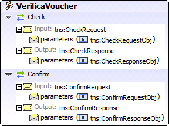
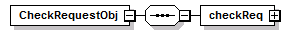
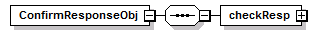
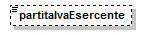
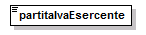
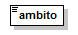
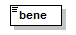
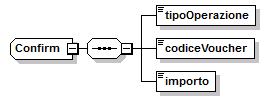

.. _header-added-by-pandoc-11:

header added by pandoc
----------------------

.. _header-added-by-pandoc-12:

header added by pandoc
~~~~~~~~~~~~~~~~~~~~~~

.. _header-added-by-pandoc-13:

header added by pandoc
^^^^^^^^^^^^^^^^^^^^^^

`VerificaVouc <#_bookmark0>`__ `her <#_bookmark0>`__
''''''''''''''''''''''''''''''''''''''''''''''''''''

`VerificaVoucherS <#_bookmark2>`__\ `OAP <#_bookmark2>`__

`VerificaVouc <#_bookmark3>`__\ `her <#_bookmark3>`__

`CheckRequest <#_bookmark6>`__\ `Check <#_bookmark18>`__

`CheckRespons <#_bookmark7>`__\ `e <#_bookmark7>`__\ `ConfirmReque <#_bookmark8>`__\ `st <#_bookmark8>`__\ `ConfirmRespo <#_bookmark9>`__\ `nse <#_bookmark9>`__

`CheckRequestObj <#_bookmark10>`__\ `CheckResponse <#_bookmark22>`__

`CheckResponseO <#_bookmark12>`__\ `bj <#_bookmark12>`__

`Confirm <#_bookmark28>`__\ `ConfirmRequestO <#_bookmark14>`__\ `bj <#_bookmark14>`__

`ConfirmResponse <#_bookmark32>`__

`ConfirmResponse <#_bookmark16>`__\ `Obj <#_bookmark16>`__

attributeFormDefault: elementFormDefault:

targetNamespace: http://bonus.mibact.it/VerificaVoucher/

Elements Complex types

`CheckRequestObj <#_bookmark10>`__\ `Check <#_bookmark18>`__\ `CheckResponseObj <#_bookmark12>`__\ `CheckResponse <#_bookmark22>`__\ `ConfirmRequestObj <#_bookmark14>`__\ `Confirm <#_bookmark28>`__\ `ConfirmResponseObj <#_bookmark16>`__\ `ConfirmResponse <#_bookmark32>`__

service **VerificaVoucher**

+-------+--------------------------------------------------------------+
| diagr | |image3|                                                     |
| am    |                                                              |
+=======+==============================================================+
| ports | **VerificaVoucherSOAP**                                      |
|       |                                                              |
|       | binding `tns:VerificaVoucherSOAP <#_bookmark2>`__            |
|       |                                                              |
|       | extensibility <soap:address                                  |
|       |                                                              |
|       | location="\ https://bonus.mibact.it/VerificaVoucherWEB/Verif |
|       | icaVoucher%22/>                                              |
+-------+--------------------------------------------------------------+
| sourc | <wsdl:service name="VerificaVoucher">                        |
| e     |                                                              |
|       | <wsdl:port name="VerificaVoucherSOAP"                        |
|       | binding="tns:VerificaVoucherSOAP">                           |
+-------+--------------------------------------------------------------+

APPLICAZIONE 18APP ALLEGATO

LINEE GUIDA PER ESERCENTI PAG. 16 DI 26

+---+--------------------------------------------------------------------+
|   | <soap:address                                                      |
|   | location="\ https://bonus.mibact.it/VerificaVoucherWEB/VerificaVou |
|   | cher%22/>                                                          |
|   |                                                                    |
|   | </wsdl:port>                                                       |
|   |                                                                    |
|   | </wsdl:service>                                                    |
+---+--------------------------------------------------------------------+

binding **VerificaVoucherSOAP**

+------+---------------------------------------------------------------+
| diag | |image4|                                                      |
| ram  |                                                               |
+======+===============================================================+
| type | `tns:VerificaVoucher <#_bookmark3>`__                         |
+------+---------------------------------------------------------------+
| exte | <soap:binding style="document"                                |
| nsib | transport=\ `"http://schemas.xmlsoap.org/soap/http <http://sc |
| ilit | hemas.xmlsoap.org/soap/http>`__"/>                            |
| y    |                                                               |
+------+---------------------------------------------------------------+
| oper | **Check**                                                     |
| atio |                                                               |
| ns   | extensibility <soap:operation                                 |
|      |                                                               |
|      | soapAction="\ http://bonus.mibact.it/VerificaVoucher/Check%22 |
|      | />                                                            |
|      |                                                               |
|      | input <soap:body use="literal"/>                              |
|      |                                                               |
|      | output <soap:body use="literal"/>                             |
|      |                                                               |
|      | **Confirm**                                                   |
|      |                                                               |
|      | extensibility <soap:operation                                 |
|      |                                                               |
|      | soapAction="\ http://bonus.mibact.it/VerificaVoucher/Confirm% |
|      | 22/>                                                          |
|      |                                                               |
|      | input <soap:body use="literal"/>                              |
|      |                                                               |
|      | output <soap:body use="literal"/>                             |
+------+---------------------------------------------------------------+
| used | Port `VerificaVoucherSOAP <#_bookmark1>`__ in Service         |
| by   | `VerificaVoucher <#_bookmark0>`__                             |
+------+---------------------------------------------------------------+
| sour | <wsdl:binding name="VerificaVoucherSOAP"                      |
| ce   | type="tns:VerificaVoucher">                                   |
|      |                                                               |
|      | <soap:binding style="document"                                |
|      | transport=\ `"http://schemas.xmlsoap.org/soap/http <http://sc |
|      | hemas.xmlsoap.org/soap/http>`__"/>                            |
|      |                                                               |
|      | <wsdl:operation name="Check">                                 |
|      |                                                               |
|      | <soap:operation                                               |
|      | soapAction=\ `"http://bonus.mibact.it/VerificaVoucher/Check < |
|      | http://bonus.mibact.it/VerificaVoucher/Check>`__"/>           |
|      |                                                               |
|      | <wsdl:input>                                                  |
|      |                                                               |
|      | <soap:body use="literal"/>                                    |
+------+---------------------------------------------------------------+

APPLICAZIONE 18APP ALLEGATO

LINEE GUIDA PER ESERCENTI PAG. 17 DI 26

+---+---------------------------------------------------------------------+
|   | </wsdl:input>                                                       |
|   |                                                                     |
|   | <wsdl:output>                                                       |
|   |                                                                     |
|   | <soap:body use="literal"/>                                          |
|   |                                                                     |
|   | </wsdl:output>                                                      |
|   |                                                                     |
|   | </wsdl:operation>                                                   |
|   |                                                                     |
|   | <wsdl:operation name="Confirm">                                     |
|   |                                                                     |
|   | <soap:operation                                                     |
|   | soapAction=\ `"http://bonus.mibact.it/VerificaVoucher/Confirm <http |
|   | ://bonus.mibact.it/VerificaVoucher/Confirm>`__"/>                   |
|   |                                                                     |
|   | <wsdl:input>                                                        |
|   |                                                                     |
|   | <soap:body use="literal"/>                                          |
|   |                                                                     |
|   | </wsdl:input>                                                       |
|   |                                                                     |
|   | <wsdl:output>                                                       |
|   |                                                                     |
|   | <soap:body use="literal"/>                                          |
|   |                                                                     |
|   | </wsdl:output>                                                      |
|   |                                                                     |
|   | </wsdl:operation>                                                   |
|   |                                                                     |
|   | </wsdl:binding>                                                     |
+---+---------------------------------------------------------------------+

porttype **VerificaVoucher**

+------------+-----------------------------------------------+
| diagram    | |image5|                                      |
+============+===============================================+
| operations | **Check**                                     |
|            |                                               |
|            | input `tns:CheckRequest <#_bookmark6>`__      |
|            |                                               |
|            | output `tns:CheckResponse <#_bookmark7>`__    |
|            |                                               |
|            | **Confirm**                                   |
|            |                                               |
|            | input `tns:ConfirmRequest <#_bookmark8>`__    |
|            |                                               |
|            | output `tns:ConfirmResponse <#_bookmark9>`__  |
+------------+-----------------------------------------------+
| used by    | binding `VerificaVoucherSOAP <#_bookmark2>`__ |
+------------+-----------------------------------------------+
| source     | <wsdl:portType name="VerificaVoucher">        |
|            |                                               |
|            | <wsdl:operation name="Check">                 |
|            |                                               |
|            | <wsdl:input message="tns:CheckRequest"/>      |
|            |                                               |
|            | <wsdl:output message="tns:CheckResponse"/>    |
|            |                                               |
|            | </wsdl:operation>                             |
|            |                                               |
|            | <wsdl:operation name="Confirm">               |
+------------+-----------------------------------------------+

APPLICAZIONE 18APP ALLEGATO

LINEE GUIDA PER ESERCENTI PAG. 18 DI 26

+---+----------------------------------------------+
|   | <wsdl:input message="tns:ConfirmRequest"/>   |
|   |                                              |
|   | <wsdl:output message="tns:ConfirmResponse"/> |
|   |                                              |
|   | </wsdl:operation>                            |
|   |                                              |
|   | </wsdl:portType>                             |
+---+----------------------------------------------+

message **CheckRequest**

+------+---------------------------------------------------------------+
| part | **parameters**                                                |
| s    |                                                               |
|      | element `tns:CheckRequestObj <#_bookmark10>`__                |
+======+===============================================================+
| used | Operation `Check <#_bookmark4>`__ in PortType                 |
| by   | `VerificaVouche <#_bookmark3>`__\ **r**                       |
+------+---------------------------------------------------------------+
| sour | <wsdl:message name="CheckRequest">                            |
| ce   |                                                               |
|      | <wsdl:part name="parameters" element="tns:CheckRequestObj"/>  |
|      |                                                               |
|      | </wsdl:message>                                               |
+------+---------------------------------------------------------------+

message **CheckResponse**

+------+---------------------------------------------------------------+
| part | **parameters**                                                |
| s    |                                                               |
|      | element `tns:CheckResponseObj <#_bookmark12>`__               |
+======+===============================================================+
| used | Operation `Check <#_bookmark4>`__ in PortType                 |
| by   | `VerificaVouche <#_bookmark3>`__\ **r**                       |
+------+---------------------------------------------------------------+
| sour | <wsdl:message name="CheckResponse">                           |
| ce   |                                                               |
|      | <wsdl:part name="parameters" element="tns:CheckResponseObj"/> |
|      |                                                               |
|      | </wsdl:message>                                               |
+------+---------------------------------------------------------------+

message **ConfirmRequest**

+------+---------------------------------------------------------------+
| part | **parameters**                                                |
| s    |                                                               |
|      | element `tns:ConfirmRequestObj <#_bookmark14>`__              |
+======+===============================================================+
| used | Operation `Confirm <#_bookmark5>`__ in PortType               |
| by   | `VerificaVouche <#_bookmark3>`__\ **r**                       |
+------+---------------------------------------------------------------+
| sour | <wsdl:message name="ConfirmRequest">                          |
| ce   |                                                               |
|      | <wsdl:part name="parameters"                                  |
|      | element="tns:ConfirmRequestObj"/>                             |
|      |                                                               |
|      | </wsdl:message>                                               |
+------+---------------------------------------------------------------+

message **ConfirmResponse**

**Codice campo modificato Codice campo modificato**

**Codice campo modificato Codice campo modificato**

**Codice campo modificato Codice campo modificato**

**Codice campo modificato Codice campo modificato**

APPLICAZIONE 18APP ALLEGATO

LINEE GUIDA PER ESERCENTI PAG. 19 DI 26

element **CheckRequestObj**

+------------+-------------------------------------------------+
| diagram    | |image6|                                        |
+============+=================================================+
| namespace  | http://bonus.mibact.it/VerificaVoucher/         |
+------------+-------------------------------------------------+
| properties | content complex                                 |
+------------+-------------------------------------------------+
| children   | `checkReq <#_bookmark11>`__                     |
+------------+-------------------------------------------------+
| source     | <xsd:element name="CheckRequestObj">            |
|            |                                                 |
|            | <xsd:complexType>                               |
|            |                                                 |
|            | <xsd:sequence>                                  |
|            |                                                 |
|            | <xsd:element name="checkReq" type="tns:Check"/> |
|            |                                                 |
|            | </xsd:sequence>                                 |
|            |                                                 |
|            | </xsd:complexType>                              |
|            |                                                 |
|            | </xsd:element>                                  |
+------------+-------------------------------------------------+

element **CheckRequestObj/checkReq**

+------+---------------------------------------------------------------+
| diag | |image7|                                                      |
| ram  |                                                               |
+======+===============================================================+
| type | `tns:Check <#_bookmark18>`__                                  |
+------+---------------------------------------------------------------+
| prop | content complex                                               |
| erti |                                                               |
| es   |                                                               |
+------+---------------------------------------------------------------+
| chil | `tipoOperazione <#_bookmark19>`__\ `codiceVoucher <#_bookmark |
| dren | 20>`__\ `partitaIvaEsercente <#_bookmark21>`__                |
+------+---------------------------------------------------------------+
| sour | <xsd:element name="checkReq" type="tns:Check"/>               |
| ce   |                                                               |
+------+---------------------------------------------------------------+

element **CheckResponseObj**

+------------+-----------------------------------------+
| diagram    | |image8|                                |
+============+=========================================+
| namespace  | http://bonus.mibact.it/VerificaVoucher/ |
+------------+-----------------------------------------+
| properties | content complex                         |
+------------+-----------------------------------------+
| children   | `checkResp <#_bookmark13>`__            |
+------------+-----------------------------------------+
| source     | <xsd:element name="CheckResponseObj">   |
+------------+-----------------------------------------+

APPLICAZIONE 18APP ALLEGATO

LINEE GUIDA PER ESERCENTI PAG. 20 DI 26

+---+----------------------------------------------------------+
|   | <xsd:complexType>                                        |
|   |                                                          |
|   | <xsd:sequence>                                           |
|   |                                                          |
|   | <xsd:element name="checkResp" type="tns:CheckResponse"/> |
|   |                                                          |
|   | </xsd:sequence>                                          |
|   |                                                          |
|   | </xsd:complexType>                                       |
|   |                                                          |
|   | </xsd:element>                                           |
+---+----------------------------------------------------------+

element **CheckResponseObj/checkResp**

+---+------------------------------------------------------------------+
| d | |image9|                                                         |
| i |                                                                  |
| a |                                                                  |
| g |                                                                  |
| r |                                                                  |
| a |                                                                  |
| m |                                                                  |
+===+==================================================================+
| t | `tns:CheckResponse <#_bookmark22>`__                             |
| y |                                                                  |
| p |                                                                  |
| e |                                                                  |
+---+------------------------------------------------------------------+
| p | content complex                                                  |
| r |                                                                  |
| o |                                                                  |
| p |                                                                  |
| e |                                                                  |
| r |                                                                  |
| t |                                                                  |
| i |                                                                  |
| e |                                                                  |
| s |                                                                  |
+---+------------------------------------------------------------------+
| c | `nominativoBeneficiario <#element-checkresponsenominativobenefic |
| h | iario>`__\ `partitaIvaEsercente <#_bookmark24>`__\ `ambito <#_bo |
| i | okmark25>`__\ `bene <#_bookmark26>`__\ `importo <#_bookmark27>`_ |
| l | _                                                                |
| d |                                                                  |
| r |                                                                  |
| e |                                                                  |
| n |                                                                  |
+---+------------------------------------------------------------------+
| s | <xsd:element name="checkResp" type="tns:CheckResponse"/>         |
| o |                                                                  |
| u |                                                                  |
| r |                                                                  |
| c |                                                                  |
| e |                                                                  |
+---+------------------------------------------------------------------+

element **ConfirmRequestObj**

+------------+---------------------------------------------------+
| diagram    | |image10|                                         |
+============+===================================================+
| namespace  | http://bonus.mibact.it/VerificaVoucher/           |
+------------+---------------------------------------------------+
| properties | content complex                                   |
+------------+---------------------------------------------------+
| children   | `checkReq <#_bookmark15>`__                       |
+------------+---------------------------------------------------+
| source     | <xsd:element name="ConfirmRequestObj">            |
|            |                                                   |
|            | <xsd:complexType>                                 |
|            |                                                   |
|            | <xsd:sequence>                                    |
|            |                                                   |
|            | <xsd:element name="checkReq" type="tns:Confirm"/> |
|            |                                                   |
|            | </xsd:sequence>                                   |
|            |                                                   |
|            | </xsd:complexType>                                |
|            |                                                   |
|            | </xsd:element>                                    |
+------------+---------------------------------------------------+

APPLICAZIONE 18APP ALLEGATO

LINEE GUIDA PER ESERCENTI PAG. 21 DI 26

element **ConfirmRequestObj/checkReq**

+-------+--------------------------------------------------------------+
| diagr | |image11|                                                    |
| am    |                                                              |
+=======+==============================================================+
| type  | `tns:Confirm <#_bookmark28>`__                               |
+-------+--------------------------------------------------------------+
| prope | content complex                                              |
| rties |                                                              |
+-------+--------------------------------------------------------------+
| child | `tipoOperazione <#_bookmark29>`__\ `codiceVoucher <#_bookmar |
| ren   | k30>`__\ `importo <#_bookmark31>`__                          |
+-------+--------------------------------------------------------------+
| sourc | <xsd:element name="checkReq" type="tns:Confirm"/>            |
| e     |                                                              |
+-------+--------------------------------------------------------------+

element **ConfirmResponseObj**

+-----------+----------------------------------------------------------+
| diagram   | |image12|                                                |
+===========+==========================================================+
| namespace | http://bonus.mibact.it/VerificaVoucher/                  |
+-----------+----------------------------------------------------------+
| propertie | content complex                                          |
| s         |                                                          |
+-----------+----------------------------------------------------------+
| children  | `checkResp <#_bookmark17>`__                             |
+-----------+----------------------------------------------------------+
| source    | <xsd:element name="ConfirmResponseObj">                  |
|           |                                                          |
|           | <xsd:complexType>                                        |
|           |                                                          |
|           | <xsd:sequence>                                           |
|           |                                                          |
|           | <xsd:element name="checkResp"                            |
|           | type="tns:ConfirmResponse"/>                             |
|           |                                                          |
|           | </xsd:sequence>                                          |
|           |                                                          |
|           | </xsd:complexType>                                       |
|           |                                                          |
|           | </xsd:element>                                           |
+-----------+----------------------------------------------------------+

element **ConfirmResponseObj/checkResp**

+---------+----------------------------------------+
| diagram | |image13|                              |
+=========+========================================+
| type    | `tns:ConfirmResponse <#_bookmark32>`__ |
+---------+----------------------------------------+

APPLICAZIONE 18APP ALLEGATO

LINEE GUIDA PER ESERCENTI PAG. 22 DI 26

+-----------+----------------------------------------------------------+
| propertie | content complex                                          |
| s         |                                                          |
+===========+==========================================================+
| children  | `esito <#_bookmark33>`__                                 |
+-----------+----------------------------------------------------------+
| source    | <xsd:element name="checkResp"                            |
|           | type="tns:ConfirmResponse"/>                             |
+-----------+----------------------------------------------------------+

complexType **Check**

+------+---------------------------------------------------------------+
| diag | |image14|                                                     |
| ram  |                                                               |
+======+===============================================================+
| name | http://bonus.mibact.it/VerificaVoucher/                       |
| spac |                                                               |
| e    |                                                               |
+------+---------------------------------------------------------------+
| chil | `tipoOperazione <#_bookmark19>`__\ `codiceVoucher <#_bookmark |
| dren | 20>`__\ `partitaIvaEsercente <#_bookmark21>`__                |
+------+---------------------------------------------------------------+
| used | element `CheckRequestObj/checkReq <#_bookmark11>`__           |
| by   |                                                               |
+------+---------------------------------------------------------------+
| sour | <xsd:complexType name="Check">                                |
| ce   |                                                               |
|      | <xsd:sequence>                                                |
|      |                                                               |
|      | <xsd:element name="tipoOperazione" type="xsd:string"          |
|      | minOccurs="1" maxOccurs="1"/>                                 |
|      |                                                               |
|      | <xsd:element name="codiceVoucher" type="xsd:string"           |
|      | minOccurs="1" maxOccurs="1"/>                                 |
|      |                                                               |
|      | <xsd:element name="partitaIvaEsercente" type="xsd:string"     |
|      | minOccurs="0" maxOccurs="1"/>                                 |
|      |                                                               |
|      | </xsd:sequence>                                               |
|      |                                                               |
|      | </xsd:complexType>                                            |
+------+---------------------------------------------------------------+

element **Check/tipoOperazione**

+--------+-------------------------------------------------------------+
| diagra | |image15|                                                   |
| m      |                                                             |
+========+=============================================================+
| type   | **xsd:string**                                              |
+--------+-------------------------------------------------------------+
| proper | content simple                                              |
| ties   |                                                             |
+--------+-------------------------------------------------------------+
| source | <xsd:element name="tipoOperazione" type="xsd:string"        |
|        | minOccurs="1" maxOccurs="1"/>                               |
+--------+-------------------------------------------------------------+

element **Check/codiceVoucher**

+---------+-----------+
| diagram | |image16| |
+---------+-----------+

APPLICAZIONE 18APP ALLEGATO

LINEE GUIDA PER ESERCENTI PAG. 23 DI 26

+--------+-------------------------------------------------------------+
| type   | **xsd:string**                                              |
+========+=============================================================+
| proper | content simple                                              |
| ties   |                                                             |
+--------+-------------------------------------------------------------+
| source | <xsd:element name="codiceVoucher" type="xsd:string"         |
|        | minOccurs="1" maxOccurs="1"/>                               |
+--------+-------------------------------------------------------------+

element **Check/partitaIvaEsercente**

+--------+-------------------------------------------------------------+
| diagra | |image17|                                                   |
| m      |                                                             |
+========+=============================================================+
| type   | **xsd:string**                                              |
+--------+-------------------------------------------------------------+
| proper | minOcc 0                                                    |
| ties   |                                                             |
|        | maxOcc 1 content simple                                     |
+--------+-------------------------------------------------------------+
| source | <xsd:element name="partitaIvaEsercente" type="xsd:string"   |
|        | minOccurs="0" maxOccurs="1"/>                               |
+--------+-------------------------------------------------------------+

complexType **CheckResponse**

+---+------------------------------------------------------------------+
| d | |image18|                                                        |
| i |                                                                  |
| a |                                                                  |
| g |                                                                  |
| r |                                                                  |
| a |                                                                  |
| m |                                                                  |
+===+==================================================================+
| n | http://bonus.mibact.it/VerificaVoucher/                          |
| a |                                                                  |
| m |                                                                  |
| e |                                                                  |
| s |                                                                  |
| p |                                                                  |
| a |                                                                  |
| c |                                                                  |
| e |                                                                  |
+---+------------------------------------------------------------------+
| c | `nominativoBeneficiario <#element-checkresponsenominativobenefic |
| h | iario>`__\ `partitaIvaEsercente <#_bookmark24>`__\ `ambito <#_bo |
| i | okmark25>`__\ `bene <#_bookmark26>`__\ `importo <#_bookmark27>`_ |
| l | _                                                                |
| d |                                                                  |
| r |                                                                  |
| e |                                                                  |
| n |                                                                  |
+---+------------------------------------------------------------------+
| u | element `CheckResponseObj/checkResp <#_bookmark13>`__            |
| s |                                                                  |
| e |                                                                  |
| d |                                                                  |
| b |                                                                  |
| y |                                                                  |
+---+------------------------------------------------------------------+
| s | <xsd:complexType name="CheckResponse">                           |
| o |                                                                  |
| u | <xsd:sequence>                                                   |
| r |                                                                  |
| c | <xsd:element name="nominativoBeneficiario" type="xsd:string"     |
| e | minOccurs="1" maxOccurs="1"/>                                    |
|   |                                                                  |
|   | <xsd:element name="partitaIvaEsercente" type="xsd:string"        |
|   | minOccurs="1" maxOccurs="1"/>                                    |
|   |                                                                  |
|   | <xsd:element name="ambito" type="xsd:string" minOccurs="1"       |
|   | maxOccurs="1"/>                                                  |
|   |                                                                  |
|   | <xsd:element name="bene" type="xsd:string" minOccurs="1"         |
|   | maxOccurs="1"/>                                                  |
|   |                                                                  |
|   | <xsd:element name="importo" type="xsd:double" minOccurs="1"      |
|   | maxOccurs="1"/>                                                  |
|   |                                                                  |
|   | </xsd:sequence>                                                  |
|   |                                                                  |
|   | </xsd:complexType>                                               |
+---+------------------------------------------------------------------+

APPLICAZIONE 18APP ALLEGATO

LINEE GUIDA PER ESERCENTI PAG. 24 DI 26

element CheckResponse/nominativoBeneficiario
''''''''''''''''''''''''''''''''''''''''''''

+-------+--------------------------------------------------------------+
| diagr | |image19|                                                    |
| am    |                                                              |
+=======+==============================================================+
| type  | **xsd:string**                                               |
+-------+--------------------------------------------------------------+
| prope | content simple                                               |
| rties |                                                              |
+-------+--------------------------------------------------------------+
| sourc | <xsd:element name="nominativoBeneficiario" type="xsd:string" |
| e     | minOccurs="1" maxOccurs="1"/>                                |
+-------+--------------------------------------------------------------+

element **CheckResponse/partitaIvaEsercente**

+--------+-------------------------------------------------------------+
| diagra | |image20|                                                   |
| m      |                                                             |
+========+=============================================================+
| type   | **xsd:string**                                              |
+--------+-------------------------------------------------------------+
| proper | content simple                                              |
| ties   |                                                             |
+--------+-------------------------------------------------------------+
| source | <xsd:element name="partitaIvaEsercente" type="xsd:string"   |
|        | minOccurs="1" maxOccurs="1"/>                               |
+--------+-------------------------------------------------------------+

element **CheckResponse/ambito**

+---------+------------------------------------------------------------+
| diagram | |image21|                                                  |
+=========+============================================================+
| type    | **xsd:string**                                             |
+---------+------------------------------------------------------------+
| propert | content simple                                             |
| ies     |                                                            |
+---------+------------------------------------------------------------+
| source  | <xsd:element name="ambito" type="xsd:string" minOccurs="1" |
|         | maxOccurs="1"/>                                            |
+---------+------------------------------------------------------------+

element **CheckResponse/bene**

+---------+------------------------------------------------------------+
| diagram | |image22|                                                  |
+=========+============================================================+
| type    | **xsd:string**                                             |
+---------+------------------------------------------------------------+
| propert | content simple                                             |
| ies     |                                                            |
+---------+------------------------------------------------------------+
| source  | <xsd:element name="bene" type="xsd:string" minOccurs="1"   |
|         | maxOccurs="1"/>                                            |
+---------+------------------------------------------------------------+

APPLICAZIONE 18APP ALLEGATO

LINEE GUIDA PER ESERCENTI PAG. 25 DI 26

element **CheckResponse/importo**

+---------+------------------------------------------------------------+
| diagram | |image23|                                                  |
+=========+============================================================+
| type    | **xsd:double**                                             |
+---------+------------------------------------------------------------+
| propert | content simple                                             |
| ies     |                                                            |
+---------+------------------------------------------------------------+
| source  | <xsd:element name="importo" type="xsd:double"              |
|         | minOccurs="1" maxOccurs="1"/>                              |
+---------+------------------------------------------------------------+

complexType **Confirm**

+------+---------------------------------------------------------------+
| diag | |image24|                                                     |
| ram  |                                                               |
+======+===============================================================+
| name | http://bonus.mibact.it/VerificaVoucher/                       |
| spac |                                                               |
| e    |                                                               |
+------+---------------------------------------------------------------+
| chil | `tipoOperazione <#_bookmark29>`__\ `codiceVoucher <#_bookmark |
| dren | 30>`__\ `importo <#_bookmark31>`__                            |
+------+---------------------------------------------------------------+
| used | element `ConfirmRequestObj/checkReq <#_bookmark15>`__         |
| by   |                                                               |
+------+---------------------------------------------------------------+
| sour | <xsd:complexType name="Confirm">                              |
| ce   |                                                               |
|      | <xsd:sequence>                                                |
|      |                                                               |
|      | <xsd:element name="tipoOperazione" type="xsd:string"          |
|      | minOccurs="1" maxOccurs="1"/>                                 |
|      |                                                               |
|      | <xsd:element name="codiceVoucher" type="xsd:string"           |
|      | minOccurs="1" maxOccurs="1"/>                                 |
|      |                                                               |
|      | <xsd:element name="importo" type="xsd:double" minOccurs="1"   |
|      | maxOccurs="1"/>                                               |
|      |                                                               |
|      | </xsd:sequence>                                               |
|      |                                                               |
|      | </xsd:complexType>                                            |
+------+---------------------------------------------------------------+

element **Confirm/tipoOperazione**

+--------+-------------------------------------------------------------+
| diagra | |image25|                                                   |
| m      |                                                             |
+========+=============================================================+
| type   | **xsd:string**                                              |
+--------+-------------------------------------------------------------+
| proper | content simple                                              |
| ties   |                                                             |
+--------+-------------------------------------------------------------+
| source | <xsd:element name="tipoOperazione" type="xsd:string"        |
|        | minOccurs="1" maxOccurs="1"/>                               |
+--------+-------------------------------------------------------------+

APPLICAZIONE 18APP ALLEGATO

LINEE GUIDA PER ESERCENTI PAG. 26 DI 26

element **Confirm/codiceVoucher**

+--------+-------------------------------------------------------------+
| diagra | |image26|                                                   |
| m      |                                                             |
+========+=============================================================+
| type   | **xsd:string**                                              |
+--------+-------------------------------------------------------------+
| proper | content simple                                              |
| ties   |                                                             |
+--------+-------------------------------------------------------------+
| source | <xsd:element name="codiceVoucher" type="xsd:string"         |
|        | minOccurs="1" maxOccurs="1"/>                               |
+--------+-------------------------------------------------------------+

element **Confirm/importo**

+---------+------------------------------------------------------------+
| diagram | |image27|                                                  |
+=========+============================================================+
| type    | **xsd:double**                                             |
+---------+------------------------------------------------------------+
| propert | content simple                                             |
| ies     |                                                            |
+---------+------------------------------------------------------------+
| source  | <xsd:element name="importo" type="xsd:double"              |
|         | minOccurs="1" maxOccurs="1"/>                              |
+---------+------------------------------------------------------------+

complexType **ConfirmResponse**

+--------+-------------------------------------------------------------+
| diagra | |image28|                                                   |
| m      |                                                             |
+========+=============================================================+
| namesp | http://bonus.mibact.it/VerificaVoucher/                     |
| ace    |                                                             |
+--------+-------------------------------------------------------------+
| childr | `esito <#_bookmark33>`__                                    |
| en     |                                                             |
+--------+-------------------------------------------------------------+
| used   | element `ConfirmResponseObj/checkResp <#_bookmark17>`__     |
| by     |                                                             |
+--------+-------------------------------------------------------------+
| source | <xsd:complexType name="ConfirmResponse">                    |
|        |                                                             |
|        | <xsd:sequence>                                              |
|        |                                                             |
|        | <xsd:element name="esito" type="xsd:string" minOccurs="1"   |
|        | maxOccurs="1"/>                                             |
|        |                                                             |
|        | </xsd:sequence>                                             |
|        |                                                             |
|        | </xsd:complexType>                                          |
+--------+-------------------------------------------------------------+

element **ConfirmResponse/esito**

+---------+------------------------------------------------------------+
| diagram | |image29|                                                  |
+=========+============================================================+
| type    | **xsd:string**                                             |
+---------+------------------------------------------------------------+
| propert | content simple                                             |
| ies     |                                                            |
+---------+------------------------------------------------------------+
| source  | <xsd:element name="esito" type="xsd:string" minOccurs="1"  |
|         | maxOccurs="1"/>                                            |
+---------+------------------------------------------------------------+

.. |image3| image:: media/media/image4.png
.. |image4| image:: media/media/image5.png

.. |image7| image:: media/media/image8.png
.. |image8| image:: media/media/image9.png
.. |image9| image:: media/media/image10.png
.. |image10| image:: media/media/image11.png
.. |image11| image:: media/media/image12.png

.. |image13| image:: media/media/image14.png
.. |image14| image:: media/media/image15.png
.. |image15| image:: media/media/image16.png
.. |image16| image:: media/media/image17.png

.. |image18| image:: media/media/image19.png
.. |image19| image:: media/media/image20.png

.. |image23| image:: media/media/image24.png

.. |image25| image:: media/media/image16.png
.. |image26| image:: media/media/image17.png
.. |image27| image:: media/media/image24.png
.. |image28| image:: media/media/image26.png
.. |image29| image:: media/media/image27.png
