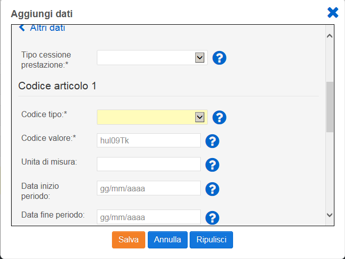

header added by pandoc
----------------------

Quindi cliccare su >Vai a Dati Fattura
~~~~~~~~~~~~~~~~~~~~~~~~~~~~~~~~~~~~~~

**Passo 3**

**DATI DELLA FATTURA** (Inserisci i dati della fattura)

I. **Valorizzare i campi come descritto di seguito**

   -  Tipo documento: Dal menù a tendina selezionare <Fattura>
   -  Numero: Numero che identifica univocamente la fattura
   -  Data: Inserire data

|image5|

II.  **Nel campo Beni e Servizi cliccare su Aggiungi**
III. **Valorizzare i campi come descritto di seguito**

     -  Descrizione: Pagamento Buono
     -  Quantità: 1
     -  Prezzo unitario: Inserire importo in euro del singolo buono es. 10,00
     -  Aliquota IVA: 0%
     -  |image6|\ Natura: Non soggette Quindi cliccare su >\ **Altri Dati**

IV.  **Valorizzare i campi come descritto di seguito**

     -  Codice Tipo: 18APP
     -  Codice Valore: **Inserire esclusivamente il codice del buono (sensibile alla differenza tra caratteri maiuscoli e minuscoli) senza ulteriori valori (come riportato nella successiva immagine).**\ 1 **NB:**. Per prevenire il rischio di errore suggeriamo di inserire i codici dei buoni attraverso le funzionalità di copia/incolla direttamente dal portale.

Quindi cliccare su Salva
~~~~~~~~~~~~~~~~~~~~~~~~

|image7|

**È possibile inserire in fattura più di un buono cliccando di nuovo su <Aggiungi> nel Campo Beni e Servizi**

1 Campo obbligatorio al fine di ottenere il rimborso per la fattura. Attenzione: alcuni software potrebbero riportare campi nominati diversamente.

.. _nel-campo-altri-dati-cliccare-su-aggiungi-1:

Nel campo Altri dati cliccare su Aggiungi
~~~~~~~~~~~~~~~~~~~~~~~~~~~~~~~~~~~~~~~~~

|image8|

VI. **Spuntare “Dati di Pagamento” quindi cliccare su Seleziona**

|image9|

VII. **Inserire i dati relativi al pagamento come descritto di seguito:**

-  Condizioni pagamento: Pagamento completo
-  Beneficiario: Inserire il beneficiario es. Mario Rossi
-  Modalità di pagamento: Bonifico
-  Importo Pagamento: Inserire importo totale della fattura
-  IBAN: Inserire IBAN es. IT00000000000000002

|image10|

Quindi cliccare su >Verifica Dati
~~~~~~~~~~~~~~~~~~~~~~~~~~~~~~~~~

2 **Attenzione**: L’omissione di IBAN o la sua errata compilazione non è segnalata come errore dal sistema. Accertarsi di averlo compilato correttamente prima di inviare la fattura.

Passo 4
=======

.. |image5| image:: ./media/image6.png
   :width: 6.31661in
   :height: 2.03646in
.. |image6| image:: ./media/image7.png
   :width: 5.54583in
   :height: 3.26653in

.. |image8| image:: ./media/image9.png
   :width: 6.43932in
   :height: 2.72708in
.. |image9| image:: ./media/image10.png
   :width: 6.36253in
   :height: 4.29167in
.. |image10| image:: ./media/image11.jpeg
   :width: 6.40927in
   :height: 3.08729in