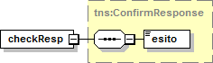
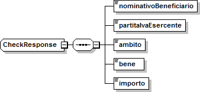
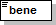
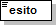

WSDL VerificaVoucher.wsdl
=========================

targetnamespace: http://bonus.miur.it/VerificaVoucher/

services bindings porttypes messages types

`VerificaVouc <#_bookmark0>`__\ `her <#_bookmark0>`__

`VerificaVoucherS <#_bookmark1>`__\ `OAP <#_bookmark1>`__

`VerificaVouc <#_bookmark2>`__\ `her <#_bookmark2>`__

`CheckRequest <#_bookmark3>`__\ `Check <#_bookmark11>`__

`CheckRespons <#_bookmark4>`__\ `e <#_bookmark4>`__\ `ConfirmReque <#_bookmark5>`__\ `st <#_bookmark5>`__\ `ConfirmRespo <#_bookmark6>`__\ `nse <#_bookmark6>`__

`CheckRequestObj <#_bookmark7>`__

`CheckResponse <#_bookmark12>`__

`CheckResponseO <#_bookmark8>`__\ `bj <#_bookmark8>`__

`Confirm <#_bookmark13>`__\ `ConfirmRequestO <#_bookmark9>`__\ `bj <#_bookmark9>`__\ `ConfirmResponse <#_bookmark14>`__\ `ConfirmResponse <#_bookmark10>`__\ `Obj <#_bookmark10>`__

attributeFormDefault: elementFormDefault:

targetNamespace: http://bonus.miur.it/VerificaVoucher/

Elements Complex types

**CheckRequestObj Check CheckResponseObj CheckResponse ConfirmRequestObj
Confirm ConfirmResponseObj ConfirmResponse**

service **VerificaVoucher**

+-----+-----------------------------------------------------------------+
| dia | |image3|                                                        |
| gra |                                                                 |
|     |                                                                 |
| m   |                                                                 |
+=====+=================================================================+
| por | **VerificaVoucherSOAP**                                         |
| ts  |                                                                 |
|     | binding **tns:VerificaVoucherSOAP**                             |
|     |                                                                 |
|     | extensibil <soap:address                                        |
|     |                                                                 |
|     | ity                                                             |
|     | location="\ https://ws.cartadeldocente.istruzione.it/VerificaVo |
|     | ucherDocWEB/V                                                   |
|     | erificaVoucher"/>                                               |
+-----+-----------------------------------------------------------------+

binding **VerificaVoucherSOAP**

+----------+-----------------------------------------------------------+
| diagram  | |image4|                                                  |
+==========+===========================================================+
| type     | **tns:VerificaVoucher**                                   |
+----------+-----------------------------------------------------------+
| extensib | <soap:binding style="document"                            |
| ility    | transport="\ http://schemas.xmlsoap.org/soap/http%22/>    |
+----------+-----------------------------------------------------------+
| operatio | **Check**                                                 |
| ns       |                                                           |
|          | extensibility <soap:operation                             |
|          |                                                           |
|          | soapAction="\ http://bonus.miur.it/VerificaVoucher/Check% |
|          | 22/>                                                      |
|          |                                                           |
|          | input <soap:body use="literal"/>                          |
|          |                                                           |
|          | output <soap:body use="literal"/>                         |
|          |                                                           |
|          | **Confirm**                                               |
|          |                                                           |
|          | extensibility <soap:operation                             |
|          |                                                           |
|          | soapAction="\ http://bonus.miur.it/VerificaVoucher/Confir |
|          | m%22/>                                                    |
|          |                                                           |
|          | input <soap:body use="literal"/>                          |
|          |                                                           |
|          | output <soap:body use="literal"/>                         |
+----------+-----------------------------------------------------------+
| used by  | Port **VerificaVoucherSOAP** in Service                   |
|          | **VerificaVoucher**                                       |
+----------+-----------------------------------------------------------+
| source   | <wsdl:binding name="VerificaVoucherSOAP"                  |
|          | type="tns:VerificaVoucher">                               |
|          |                                                           |
|          | <soap:binding style="document"                            |
|          | transport="\ http://schemas.xmlsoap.org/soap/http%22/>    |
|          |                                                           |
|          | <wsdl:operation name="Check">                             |
+----------+-----------------------------------------------------------+

+---+--------------------------------------------------------------------+
|   | <soap:operation                                                    |
|   | soapAction="\ http://bonus.miur.it/VerificaVoucher/Check%22/>      |
|   |                                                                    |
|   | <wsdl:input>                                                       |
|   |                                                                    |
|   | <soap:body use="literal"/>                                         |
|   |                                                                    |
|   | </wsdl:input>                                                      |
|   |                                                                    |
|   | <wsdl:output>                                                      |
|   |                                                                    |
|   | <soap:body use="literal"/>                                         |
|   |                                                                    |
|   | </wsdl:output>                                                     |
|   |                                                                    |
|   | </wsdl:operation>                                                  |
|   |                                                                    |
|   | <wsdl:operation name="Confirm">                                    |
|   |                                                                    |
|   | <soap:operation                                                    |
|   | soapAction="\ http://bonus.miur.it/VerificaVoucher/Confirm%22/>    |
|   |                                                                    |
|   | <wsdl:input>                                                       |
|   |                                                                    |
|   | <soap:body use="literal"/>                                         |
|   |                                                                    |
|   | </wsdl:input>                                                      |
|   |                                                                    |
|   | <wsdl:output>                                                      |
|   |                                                                    |
|   | <soap:body use="literal"/>                                         |
|   |                                                                    |
|   | </wsdl:output>                                                     |
|   |                                                                    |
|   | </wsdl:operation>                                                  |
|   |                                                                    |
|   | </wsdl:binding>                                                    |
+---+--------------------------------------------------------------------+

porttype **VerificaVoucher**

+------------+------------------------------------------+
| diagram    | |image5|                                 |
+============+==========================================+
| operations | **Check**                                |
|            |                                          |
|            | input **tns:CheckRequest**               |
|            |                                          |
|            | output **tns:CheckResponse**             |
|            |                                          |
|            | **Confirm**                              |
|            |                                          |
|            | input **tns:ConfirmRequest**             |
|            |                                          |
|            | output **tns:ConfirmResponse**           |
+------------+------------------------------------------+
| used by    | binding **VerificaVoucherSOAP**          |
+------------+------------------------------------------+
| source     | <wsdl:portType name="VerificaVoucher">   |
|            |                                          |
|            | <wsdl:operation name="Check">            |
|            |                                          |
|            | <wsdl:input message="tns:CheckRequest"/> |
+------------+------------------------------------------+

+---+----------------------------------------------+
|   | <wsdl:output message="tns:CheckResponse"/>   |
|   |                                              |
|   | </wsdl:operation>                            |
|   |                                              |
|   | <wsdl:operation name="Confirm">              |
|   |                                              |
|   | <wsdl:input message="tns:ConfirmRequest"/>   |
|   |                                              |
|   | <wsdl:output message="tns:ConfirmResponse"/> |
|   |                                              |
|   | </wsdl:operation>                            |
|   |                                              |
|   | </wsdl:portType>                             |
+---+----------------------------------------------+

message **CheckRequest**

+--------+-------------------------------------------------------------+
| parts  | **parameters**                                              |
|        |                                                             |
|        | element **tns:CheckRequestObj**                             |
+========+=============================================================+
| used   | Operation **Check** in PortType **VerificaVoucher**         |
| by     |                                                             |
+--------+-------------------------------------------------------------+
| source | <wsdl:message name="CheckRequest">                          |
|        |                                                             |
|        | <wsdl:part name="parameters"                                |
|        | element="tns:CheckRequestObj"/>                             |
|        |                                                             |
|        | </wsdl:message>                                             |
+--------+-------------------------------------------------------------+

message **CheckResponse**

+--------+-------------------------------------------------------------+
| parts  | **parameters**                                              |
|        |                                                             |
|        | element **tns:CheckResponseObj**                            |
+========+=============================================================+
| used   | Operation **Check** in PortType **VerificaVoucher**         |
| by     |                                                             |
+--------+-------------------------------------------------------------+
| source | <wsdl:message name="CheckResponse">                         |
|        |                                                             |
|        | <wsdl:part name="parameters"                                |
|        | element="tns:CheckResponseObj"/>                            |
|        |                                                             |
|        | </wsdl:message>                                             |
+--------+-------------------------------------------------------------+

message **ConfirmRequest**

+--------+-------------------------------------------------------------+
| parts  | **parameters**                                              |
|        |                                                             |
|        | element **tns:ConfirmRequestObj**                           |
+========+=============================================================+
| used   | Operation **Confirm** in PortType **VerificaVoucher**       |
| by     |                                                             |
+--------+-------------------------------------------------------------+
| source | <wsdl:message name="ConfirmRequest">                        |
|        |                                                             |
|        | <wsdl:part name="parameters"                                |
|        | element="tns:ConfirmRequestObj"/>                           |
|        |                                                             |
|        | </wsdl:message>                                             |
+--------+-------------------------------------------------------------+

message **ConfirmResponse**

+---------+-------------------------------------------------------+
| parts   | **parameters**                                        |
|         |                                                       |
|         | element **tns:ConfirmResponseObj**                    |
+=========+=======================================================+
| used by | Operation **Confirm** in PortType **VerificaVoucher** |
+---------+-------------------------------------------------------+
| source  | <wsdl:message name="ConfirmResponse">                 |
+---------+-------------------------------------------------------+

+---+-----------------------------------------------------------------+
|   | <wsdl:part name="parameters" element="tns:ConfirmResponseObj"/> |
|   |                                                                 |
|   | </wsdl:message>                                                 |
+---+-----------------------------------------------------------------+

element **CheckRequestObj**

+------------+-------------------------------------------------+
| diagram    | |image6|                                        |
+============+=================================================+
| namespace  | http://bonus.miur.it/VerificaVoucher/           |
+------------+-------------------------------------------------+
| properties | content complex                                 |
+------------+-------------------------------------------------+
| children   | **checkReq**                                    |
+------------+-------------------------------------------------+
| source     | <xsd:element name="CheckRequestObj">            |
|            |                                                 |
|            | <xsd:complexType>                               |
|            |                                                 |
|            | <xsd:sequence>                                  |
|            |                                                 |
|            | <xsd:element name="checkReq" type="tns:Check"/> |
|            |                                                 |
|            | </xsd:sequence>                                 |
|            |                                                 |
|            | </xsd:complexType>                              |
|            |                                                 |
|            | </xsd:element>                                  |
+------------+-------------------------------------------------+

element **CheckRequestObj/checkReq**

+------------+------------------------------------------------------+
| diagram    | |image7|                                             |
+============+======================================================+
| type       | **tns:Check**                                        |
+------------+------------------------------------------------------+
| properties | content complex                                      |
+------------+------------------------------------------------------+
| children   | **tipoOperazione codiceVoucher partitaIvaEsercente** |
+------------+------------------------------------------------------+
| source     | <xsd:element name="checkReq" type="tns:Check"/>      |
+------------+------------------------------------------------------+

element **CheckResponseObj**

+-----------+---------------------------------------+
| diagram   | |image8|                              |
+===========+=======================================+
| namespace | http://bonus.miur.it/VerificaVoucher/ |
+-----------+---------------------------------------+

+------------+----------------------------------------------------------+
| properties | content complex                                          |
+============+==========================================================+
| children   | **checkResp**                                            |
+------------+----------------------------------------------------------+
| source     | <xsd:element name="CheckResponseObj">                    |
|            |                                                          |
|            | <xsd:complexType>                                        |
|            |                                                          |
|            | <xsd:sequence>                                           |
|            |                                                          |
|            | <xsd:element name="checkResp" type="tns:CheckResponse"/> |
|            |                                                          |
|            | </xsd:sequence>                                          |
|            |                                                          |
|            | </xsd:complexType>                                       |
|            |                                                          |
|            | </xsd:element>                                           |
+------------+----------------------------------------------------------+

element **CheckResponseObj/checkResp**

+----------+-----------------------------------------------------------+
| diagram  | |image9|                                                  |
+==========+===========================================================+
| type     | **tns:CheckResponse**                                     |
+----------+-----------------------------------------------------------+
| properti | content complex                                           |
| es       |                                                           |
+----------+-----------------------------------------------------------+
| children | **nominativoBeneficiario partitaIvaEsercente ambito bene  |
|          | importo**                                                 |
+----------+-----------------------------------------------------------+
| source   | <xsd:element name="checkResp" type="tns:CheckResponse"/>  |
+----------+-----------------------------------------------------------+

element **ConfirmRequestObj**

+------------+---------------------------------------------------+
| diagram    | |image10|                                         |
+============+===================================================+
| namespace  | http://bonus.miur.it/VerificaVoucher/             |
+------------+---------------------------------------------------+
| properties | content complex                                   |
+------------+---------------------------------------------------+
| children   | **checkReq**                                      |
+------------+---------------------------------------------------+
| source     | <xsd:element name="ConfirmRequestObj">            |
|            |                                                   |
|            | <xsd:complexType>                                 |
|            |                                                   |
|            | <xsd:sequence>                                    |
|            |                                                   |
|            | <xsd:element name="checkReq" type="tns:Confirm"/> |
+------------+---------------------------------------------------+

+---+--------------------+
|   | </xsd:sequence>    |
|   |                    |
|   | </xsd:complexType> |
|   |                    |
|   | </xsd:element>     |
+---+--------------------+

element **ConfirmRequestObj/checkReq**

+------------+---------------------------------------------------+
| diagram    | |image11|                                         |
+============+===================================================+
| type       | **tns:Confirm**                                   |
+------------+---------------------------------------------------+
| properties | content complex                                   |
+------------+---------------------------------------------------+
| children   | **tipoOperazione codiceVoucher importo**          |
+------------+---------------------------------------------------+
| source     | <xsd:element name="checkReq" type="tns:Confirm"/> |
+------------+---------------------------------------------------+

element **ConfirmResponseObj**

+-----------+----------------------------------------------------------+
| diagram   | |image12|                                                |
+===========+==========================================================+
| namespace | http://bonus.miur.it/VerificaVoucher/                    |
+-----------+----------------------------------------------------------+
| propertie | content complex                                          |
| s         |                                                          |
+-----------+----------------------------------------------------------+
| children  | **checkResp**                                            |
+-----------+----------------------------------------------------------+
| source    | <xsd:element name="ConfirmResponseObj">                  |
|           |                                                          |
|           | <xsd:complexType>                                        |
|           |                                                          |
|           | <xsd:sequence>                                           |
|           |                                                          |
|           | <xsd:element name="checkResp"                            |
|           | type="tns:ConfirmResponse"/>                             |
|           |                                                          |
|           | </xsd:sequence>                                          |
|           |                                                          |
|           | </xsd:complexType>                                       |
|           |                                                          |
|           | </xsd:element>                                           |
+-----------+----------------------------------------------------------+

element **ConfirmResponseObj/checkResp**

+-----------+----------------------------------------------------------+
| diagram   | |image13|                                                |
+===========+==========================================================+
| type      | **tns:ConfirmResponse**                                  |
+-----------+----------------------------------------------------------+
| propertie | content complex                                          |
| s         |                                                          |
+-----------+----------------------------------------------------------+
| children  | **esito**                                                |
+-----------+----------------------------------------------------------+
| source    | <xsd:element name="checkResp"                            |
|           | type="tns:ConfirmResponse"/>                             |
+-----------+----------------------------------------------------------+

complexType **Check**

+-------+--------------------------------------------------------------+
| diagr | |image14|                                                    |
| am    |                                                              |
+=======+==============================================================+
| names | http://bonus.miur.it/VerificaVoucher/                        |
| pace  |                                                              |
+-------+--------------------------------------------------------------+
| child | **tipoOperazione codiceVoucher partitaIvaEsercente**         |
| ren   |                                                              |
+-------+--------------------------------------------------------------+
| used  | element **CheckRequestObj/checkReq**                         |
| by    |                                                              |
+-------+--------------------------------------------------------------+
| sourc | <xsd:complexType name="Check">                               |
| e     |                                                              |
|       | <xsd:sequence>                                               |
|       |                                                              |
|       | <xsd:element name="tipoOperazione" type="xsd:string"         |
|       | minOccurs="1" maxOccurs="1"/>                                |
|       |                                                              |
|       | <xsd:element name="codiceVoucher" type="xsd:string"          |
|       | minOccurs="1" maxOccurs="1"/>                                |
|       |                                                              |
|       | <xsd:element name="partitaIvaEsercente" type="xsd:string"    |
|       | minOccurs="0" maxOccurs="1"/>                                |
|       |                                                              |
|       | </xsd:sequence>                                              |
|       |                                                              |
|       | </xsd:complexType>                                           |
+-------+--------------------------------------------------------------+

element **Check/tipoOperazione**

+----------+-----------------------------------------------------------+
| diagram  | |image15|                                                 |
+==========+===========================================================+
| type     | **xsd:string**                                            |
+----------+-----------------------------------------------------------+
| properti | content simple                                            |
| es       |                                                           |
+----------+-----------------------------------------------------------+
| source   | <xsd:element name="tipoOperazione" type="xsd:string"      |
|          | minOccurs="1"                                             |
+----------+-----------------------------------------------------------+

+---+-----------------+
|   | maxOccurs="1"/> |
+---+-----------------+

element **Check/codiceVoucher**

+--------+-------------------------------------------------------------+
| diagra | |image16|                                                   |
| m      |                                                             |
+========+=============================================================+
| type   | **xsd:string**                                              |
+--------+-------------------------------------------------------------+
| proper | content simple                                              |
| ties   |                                                             |
+--------+-------------------------------------------------------------+
| source | <xsd:element name="codiceVoucher" type="xsd:string"         |
|        | minOccurs="1" maxOccurs="1"/>                               |
+--------+-------------------------------------------------------------+

element **Check/partitaIvaEsercente**

+--------+-------------------------------------------------------------+
| diagra | |image17|                                                   |
| m      |                                                             |
+========+=============================================================+
| type   | **xsd:string**                                              |
+--------+-------------------------------------------------------------+
| proper | minOcc 0                                                    |
| ties   |                                                             |
|        | maxOcc 1 content simple                                     |
+--------+-------------------------------------------------------------+
| source | <xsd:element name="partitaIvaEsercente" type="xsd:string"   |
|        | minOccurs="0" maxOccurs="1"/>                               |
+--------+-------------------------------------------------------------+

complexType **CheckResponse**

+--------+-------------------------------------------------------------+
| diagra | |image18|                                                   |
| m      |                                                             |
+========+=============================================================+
| namesp | http://bonus.miur.it/VerificaVoucher/                       |
| ace    |                                                             |
+--------+-------------------------------------------------------------+
| childr | **nominativoBeneficiario partitaIvaEsercente ambito bene    |
| en     | importo**                                                   |
+--------+-------------------------------------------------------------+
| used   | element **CheckResponseObj/checkResp**                      |
| by     |                                                             |
+--------+-------------------------------------------------------------+
| source | <xsd:complexType name="CheckResponse">                      |
|        |                                                             |
|        | <xsd:sequence>                                              |
|        |                                                             |
|        | <xsd:element name="nominativoBeneficiario"                  |
|        | type="xsd:string" minOccurs="1"                             |
+--------+-------------------------------------------------------------+

+---+--------------------------------------------------------------------+
|   | maxOccurs="1"/>                                                    |
|   |                                                                    |
|   | <xsd:element name="partitaIvaEsercente" type="xsd:string"          |
|   | minOccurs="1" maxOccurs="1"/>                                      |
|   |                                                                    |
|   | <xsd:element name="ambito" type="xsd:string" minOccurs="1"         |
|   | maxOccurs="1"/>                                                    |
|   |                                                                    |
|   | <xsd:element name="bene" type="xsd:string" minOccurs="1"           |
|   | maxOccurs="1"/>                                                    |
|   |                                                                    |
|   | <xsd:element name="importo" type="xsd:double" minOccurs="1"        |
|   | maxOccurs="1"/>                                                    |
|   |                                                                    |
|   | </xsd:sequence>                                                    |
|   |                                                                    |
|   | </xsd:complexType>                                                 |
+---+--------------------------------------------------------------------+

element **CheckResponse/nominativoBeneficiario**

+-------+--------------------------------------------------------------+
| diagr | |image19|                                                    |
| am    |                                                              |
+=======+==============================================================+
| type  | **xsd:string**                                               |
+-------+--------------------------------------------------------------+
| prope | content simple                                               |
| rties |                                                              |
+-------+--------------------------------------------------------------+
| sourc | <xsd:element name="nominativoBeneficiario" type="xsd:string" |
| e     | minOccurs="1" maxOccurs="1"/>                                |
+-------+--------------------------------------------------------------+

element **CheckResponse/partitaIvaEsercente**

+--------+-------------------------------------------------------------+
| diagra | |image20|                                                   |
| m      |                                                             |
+========+=============================================================+
| type   | **xsd:string**                                              |
+--------+-------------------------------------------------------------+
| proper | content simple                                              |
| ties   |                                                             |
+--------+-------------------------------------------------------------+
| source | <xsd:element name="partitaIvaEsercente" type="xsd:string"   |
|        | minOccurs="1" maxOccurs="1"/>                               |
+--------+-------------------------------------------------------------+

element **CheckResponse/ambito**

+---------+------------------------------------------------------------+
| diagram | |image21|                                                  |
+=========+============================================================+
| type    | **xsd:string**                                             |
+---------+------------------------------------------------------------+
| propert | content simple                                             |
| ies     |                                                            |
+---------+------------------------------------------------------------+
| source  | <xsd:element name="ambito" type="xsd:string" minOccurs="1" |
|         | maxOccurs="1"/>                                            |
+---------+------------------------------------------------------------+

element **CheckResponse/bene**

+---------+------------------------------------------------------------+
| diagram | |image22|                                                  |
+=========+============================================================+
| type    | **xsd:string**                                             |
+---------+------------------------------------------------------------+
| propert | content simple                                             |
| ies     |                                                            |
+---------+------------------------------------------------------------+
| source  | <xsd:element name="bene" type="xsd:string" minOccurs="1"   |
|         | maxOccurs="1"/>                                            |
+---------+------------------------------------------------------------+

element **CheckResponse/importo**

+---------+------------------------------------------------------------+
| diagram | |image23|                                                  |
+=========+============================================================+
| type    | **xsd:double**                                             |
+---------+------------------------------------------------------------+
| propert | content simple                                             |
| ies     |                                                            |
+---------+------------------------------------------------------------+
| source  | <xsd:element name="importo" type="xsd:double"              |
|         | minOccurs="1" maxOccurs="1"/>                              |
+---------+------------------------------------------------------------+

complexType **Confirm**

+-------+--------------------------------------------------------------+
| diagr | |image24|                                                    |
| am    |                                                              |
+=======+==============================================================+
| names | http://bonus.miur.it/VerificaVoucher/                        |
| pace  |                                                              |
+-------+--------------------------------------------------------------+
| child | **tipoOperazione codiceVoucher importo**                     |
| ren   |                                                              |
+-------+--------------------------------------------------------------+
| used  | element **ConfirmRequestObj/checkReq**                       |
| by    |                                                              |
+-------+--------------------------------------------------------------+
| sourc | <xsd:complexType name="Confirm">                             |
| e     |                                                              |
|       | <xsd:sequence>                                               |
|       |                                                              |
|       | <xsd:element name="tipoOperazione" type="xsd:string"         |
|       | minOccurs="1" maxOccurs="1"/>                                |
|       |                                                              |
|       | <xsd:element name="codiceVoucher" type="xsd:string"          |
|       | minOccurs="1" maxOccurs="1"/>                                |
|       |                                                              |
|       | <xsd:element name="importo" type="xsd:double" minOccurs="1"  |
|       | maxOccurs="1"/>                                              |
|       |                                                              |
|       | </xsd:sequence>                                              |
|       |                                                              |
|       | </xsd:complexType>                                           |
+-------+--------------------------------------------------------------+

element **Confirm/tipoOperazione**

+--------+-------------------------------------------------------------+
| diagra | |image25|                                                   |
| m      |                                                             |
+========+=============================================================+
| type   | **xsd:string**                                              |
+--------+-------------------------------------------------------------+
| proper | content simple                                              |
| ties   |                                                             |
+--------+-------------------------------------------------------------+
| source | <xsd:element name="tipoOperazione" type="xsd:string"        |
|        | minOccurs="1" maxOccurs="1"/>                               |
+--------+-------------------------------------------------------------+

element **Confirm/codiceVoucher**

+--------+-------------------------------------------------------------+
| diagra | |image26|                                                   |
| m      |                                                             |
+========+=============================================================+
| type   | **xsd:string**                                              |
+--------+-------------------------------------------------------------+
| proper | content simple                                              |
| ties   |                                                             |
+--------+-------------------------------------------------------------+
| source | <xsd:element name="codiceVoucher" type="xsd:string"         |
|        | minOccurs="1" maxOccurs="1"/>                               |
+--------+-------------------------------------------------------------+

element **Confirm/importo**

+---------+------------------------------------------------------------+
| diagram | |image27|                                                  |
+=========+============================================================+
| type    | **xsd:double**                                             |
+---------+------------------------------------------------------------+
| propert | content simple                                             |
| ies     |                                                            |
+---------+------------------------------------------------------------+
| source  | <xsd:element name="importo" type="xsd:double"              |
|         | minOccurs="1" maxOccurs="1"/>                              |
+---------+------------------------------------------------------------+

complexType **ConfirmResponse**

+--------+-------------------------------------------------------------+
| diagra | |image28|                                                   |
| m      |                                                             |
+========+=============================================================+
| namesp | http://bonus.miur.it/VerificaVoucher/                       |
| ace    |                                                             |
+--------+-------------------------------------------------------------+
| childr | **esito**                                                   |
| en     |                                                             |
+--------+-------------------------------------------------------------+
| used   | element **ConfirmResponseObj/checkResp**                    |
| by     |                                                             |
+--------+-------------------------------------------------------------+
| source | <xsd:complexType name="ConfirmResponse">                    |
|        |                                                             |
|        | <xsd:sequence>                                              |
|        |                                                             |
|        | <xsd:element name="esito" type="xsd:string" minOccurs="1"   |
|        | maxOccurs="1"/>                                             |
|        |                                                             |
|        | </xsd:sequence>                                             |
|        |                                                             |
|        | </xsd:complexType>                                          |
+--------+-------------------------------------------------------------+

element **ConfirmResponse/esito**

+---------+------------------------------------------------------------+
| diagram | |image29|                                                  |
+=========+============================================================+
| type    | **xsd:string**                                             |
+---------+------------------------------------------------------------+
| propert | content simple                                             |
| ies     |                                                            |
+---------+------------------------------------------------------------+
| source  | <xsd:element name="esito" type="xsd:string" minOccurs="1"  |
|         | maxOccurs="1"/>                                            |
+---------+------------------------------------------------------------+

.. |image3| image:: media/media/image4.png
   :width: 4.88542in
   :height: 0.59375in
.. |image4| image:: media/media/image5.png
   :width: 3.23958in
   :height: 2.69792in
.. |image5| image:: media/media/image6.png
   :width: 3in
   :height: 2.25in
.. |image6| image:: media/media/image7.png
   :width: 2.82292in
   :height: 0.26042in
.. |image7| image:: media/media/image8.png
   :width: 3.1875in
   :height: 1.41667in
.. |image8| image:: media/media/image9.png
   :width: 3in
   :height: 0.26042in
.. |image9| image:: media/media/image10.png
   :width: 3.46875in
   :height: 2.10417in
.. |image10| image:: media/media/image11.png
   :width: 2.92708in
   :height: 0.26042in
.. |image11| image:: media/media/image12.png
   :width: 2.95833in
   :height: 1.41667in
.. |image12| image:: media/media/image13.png
   :width: 3.10417in
   :height: 0.26042in

.. |image14| image:: media/media/image15.png
   :width: 2.72917in
   :height: 0.94792in
.. |image15| image:: media/media/image16.png
   :width: 1.08333in
   :height: 0.26042in
.. |image16| image:: media/media/image17.png
   :width: 1.07292in
   :height: 0.26042in
.. |image17| image:: media/media/image18.png
   :width: 1.3125in
   :height: 0.26042in

.. |image19| image:: media/media/image20.png
   :width: 1.52083in
   :height: 0.26042in
.. |image20| image:: media/media/image21.png
   :width: 1.3125in
   :height: 0.26042in
.. |image21| image:: media/media/image22.png
   :width: 0.60417in
   :height: 0.26042in

.. |image23| image:: media/media/image24.png
   :width: 0.66667in
   :height: 0.26042in
.. |image24| image:: media/media/image25.png
   :width: 2.60417in
   :height: 0.94792in
.. |image25| image:: media/media/image26.png
   :width: 1.08333in
   :height: 0.26042in
.. |image26| image:: media/media/image27.png
   :width: 1.07292in
   :height: 0.26042in
.. |image27| image:: media/media/image28.png
   :width: 0.66667in
   :height: 0.26042in
.. |image28| image:: media/media/image29.png
   :width: 2.54167in
   :height: 0.27083in
