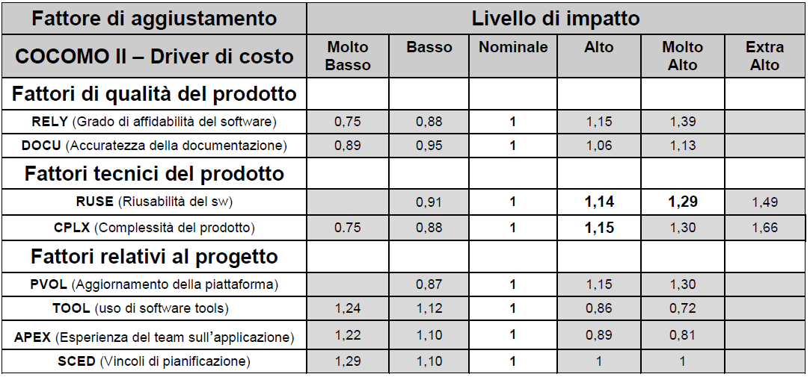

Il tavolo di lavoro
-------------------

Il presente documento è stato redatto dal Tavolo di lavoro dell’Agenzia per l’Italia Digitale, istituito con determinazione del Direttore generale n. 165 del 9 giugno 2017. Al Tavolo di lavoro, coordinato da Francesco Grasso, hanno partecipato per l’AgID Francesca Villani, Gaetano Bruno, Salvatore Del Pizzo, Giovanni Di Iasio.

Hanno fatto parte del Tavolo di lavoro anche i seguenti esperti esterni, nominati nella medesima determinazione n. 165 e selezionati tra quanti avevano presentato la propria candidatura a seguito dell’avviso pubblicato dall’Agenzia sul proprio sito web il 4 maggio 2017:

-  Ivana Beni, Almaviva;
-  Giulio Borsari, Ministero della Giustizia:sup:4\ `#fn4 <#fn4>`__;
-  Luigi Buglione, GUFPI-ISMA;
-  Michele Canalini, Consip;
-  Marco Caprio, Agenzia delle Entrate;
-  Carlo Contavalli, Digital Team (PCM);
-  Iginia De Fent, Insiel;
-  Sergio Di Martino, Università degli Studi di Napoli;
-  Gianluca Ferri:sup:5\ `#fn5 <#fn5>`__, SQS;
-  Marco Geraci, CAST;
-  Vittorio Goletti, FID;
-  Gianfranco Lanza, CSI Piemonte;
-  Gabriele Massarelli, Consip;
-  Roberto Meli, DPO:sup:6\ `#fn6 <#fn6>`__;
-  Antonio Messina, Agenzia delle Entrate;
-  Domenico Natale, UNINFO;
-  Simone Piunno, Digital Team (PCM);
-  Antonella Rampini, Consip;
-  Michele Slocovich, OMG-CISQ.

Nel corso delle attività, svoltesi tra il giugno 2017 e il febbraio 2018, il Tavolo di lavoro ha effettuato 5 riunioni aperte ai componenti esterni. Nel luglio 2017 si è tenuta un’audizione di Francesco Teseo e Giuseppe Lo Presti di Accenture, durante la quale è stata illustrata l’esperienza di detta società nel campo oggetto d’indagine. Nel febbraio 2018 si è tenuta un’audizione di Andrea Gelli, della società QSM Switzerland, che ha rappresentato lo stato dell’arte delle gare pubbliche nella Confederazione Elvetica. Oltre a tali incontri, l’interazione tra i componenti del Tavolo di lavoro è avvenuta tramite scambio di documenti e strumenti di *collaboration* remota.

Le attività del Tavolo di lavoro si sono articolate nelle seguenti fasi:

1. ricognizione a livello internazionale di esperienze e casi di studio sulle metriche del software;
2. ricognizione di metriche non funzionali, confronto di strumenti, metodologie, proposte a disposizione;
3. analisi del modello strategico del Piano Triennale, con lo studio delle possibili applicazioni a tale modello delle metriche non funzionali;
4. studio dell’impatto delle metriche non funzionali su capitolati e schemi contrattuali delle pubbliche amministrazioni;
5. redazione del testo finale del documento.

La guida tecnica è stata approvata dall’Agenzia per l’Italia Digitale con determinazione n. xx del xxx.

Analogamente ad altri documenti di natura tecnica pubblicati in passato dall’Agenzia, la presente guida tecnica sarà aggiornata in rapporto all’evoluzione delle tecnologie ICT e del contesto normativo/organizzativo delle pubbliche amministrazioni italiane.

Ricognizione a livello internazionale
~~~~~~~~~~~~~~~~~~~~~~~~~~~~~~~~~~~~~

Come prima attività, il Tavolo di lavoro ha effettuato una ricognizione presso alcune pubbliche amministrazioni estere che svolgono funzioni analoghe ad AgID e organismi di altri Paesi che si occupano di standard per la misurazione del software.

I destinatari della ricognizione sono stati individuati nel corso della prima riunione del Tavolo di lavoro, attingendo a riferimenti istituzionali e all’esperienza dei partecipanti esterni del Tavolo che fanno parte di comitati e organizzazioni internazionali. Ai destinatari è stata inoltrata una richiesta a mezzo posta elettronica, illustrando le finalità dello studio in corso e chiedendo contributi sulla tematica.

In particolare sono state chieste:

-  informazioni riguardo le modalità utilizzate per la misurazione del software;
-  se sono state sperimentate metriche per le caratteristiche non funzionali del software.

Nella tabella che segue sono riepilogati i destinatari della ricognizione.

Tabella 1: destinatari della ricognizione internazionale

+--------------------------------------------------+-------------------+
| **Organizzazione**                               | **Riferimento**   |
+==================================================+===================+
| Directeur de l’Agence du numérique – Francia     | agence.numerique@ |
|                                                  | finances.gouv.fr  |
+--------------------------------------------------+-------------------+
| Secretary at the Federal Ministry of the         | Besucherdienst@bm |
| Interior and Federal Government Commissioner for | i.bund.de         |
| Information Technology - Germania                |                   |
+--------------------------------------------------+-------------------+
| Government Digital Service – UK                  | kevin.cunnington@ |
|                                                  | digital.cabinet-o |
|                                                  | ffice.gov.uk      |
+--------------------------------------------------+-------------------+
| Office of the Government Chief Information       | barry.lowry@per.g |
| Officer (OGCIO) - Irlanda                        | ov.ie             |
+--------------------------------------------------+-------------------+
| Director of the Digital Services Unit; National  | Kristiina.Luukkon |
| Architecture for Digital Services – Finlandia    | en@vm.fi          |
+--------------------------------------------------+-------------------+
| KERC - Korea-EU Research Centre                  | ockwon@etri.re.kr |
+--------------------------------------------------+-------------------+
| EU-Japan Centre for Industrial Cooperation       | fabrizio.mura@eu- |
|                                                  | japan.gr.jp       |
+--------------------------------------------------+-------------------+
| Ministerio de Modernización Gobierno Digital -   | digital@moderniza |
| Argentina                                        | cion.gob.ar       |
+--------------------------------------------------+-------------------+
| Ministerio de Hacienda y Función Pública -       | secretaria.sgiads |
| Secretaría General de Administración Digital -   | c@seap.minhap.es  |
| Subdirección General de Impulso de la            |                   |
| Administración Digital y Servicios al Ciudadano  |                   |
| – Spagna                                         |                   |
+--------------------------------------------------+-------------------+
| Minister of Digital Affairs – Polonia            | apiasecki@ibemag. |
|                                                  | pl                |
+--------------------------------------------------+-------------------+
| Minister of Entrepreneurship and Information     | info@mkm.ee       |
| Technology of the Republic of Estonia            |                   |
+--------------------------------------------------+-------------------+
| AEMES (associazione spagnola per la governance,  | admon@aemes.org   |
| la misurazione delle tecnologie                  |                   |
| dell'informazione e la gestione)                 |                   |
+--------------------------------------------------+-------------------+
| ASSEMI                                           | Secretariat@assem |
| (ASSociation pour l'Etude des Métriques Informat | i.org             |
| iques)                                           |                   |
| - Francia                                        |                   |
+--------------------------------------------------+-------------------+
| DASMA (Deutschsprachige Anwendergruppe für       | info@dasma.org    |
| Software-Metrik und Aufwandschätzung e.V.) –     |                   |
| Germania                                         |                   |
+--------------------------------------------------+-------------------+
| ITSA (Korea Information Technology Service       | hijeong@itsa.or.k |
| Industry Association)                            | r                 |
+--------------------------------------------------+-------------------+
| NESMA (Netherlands Software Metrics users        | office@nesma.org; |
| Association) - Olanda                            | \ https://nesma.o |
|                                                  | rg/2018/01/non-fu |
|                                                  | nctional-requirem |
|                                                  | ents/             |
+--------------------------------------------------+-------------------+
| PSMO (Associazione polacca per le misure del     | kontakt@psmo.pl   |
| software)                                        |                   |
+--------------------------------------------------+-------------------+
| JFPUG (Japan Function Point User Group)          | office@jfpug.gr.j |
|                                                  | p                 |
+--------------------------------------------------+-------------------+
| Programme Office eGovernment Switzerland         | info@egovernment. |
|                                                  | ch                |
|                                                  | anna.faoro@egover |
|                                                  | nment.ch          |
+--------------------------------------------------+-------------------+

Non tutti gli interpellati hanno risposto. In alcuni casi, forse a causa della insufficiente conoscenza della tematica, le risposte ricevute non sono sembrate pertinenti. Nella tabella che segue sono sintetizzati i contributi più significativi tra quelli acquisiti.

Tabella 2: esiti della ricognizione internazionale

+-----+----------------------------------------------------------------+
| **N | **Sintesi delle informazioni trasmesse**                       |
| azi |                                                                |
| one |                                                                |
| /   |                                                                |
| Ris |                                                                |
| pon |                                                                |
| den |                                                                |
| te* |                                                                |
| *   |                                                                |
+=====+================================================================+
| Est | Abbiamo ricevuto informazioni e alcuni documenti riguardanti   |
| oni | la gestione dei processi e la definizione di standard          |
| a   | nazionali per i contratti stipulati dalle P.A. estoni. Il      |
|     | rispondente non si è espresso sulle metriche non funzionali e  |
|     | sul loro eventuale utilizzo.                                   |
+-----+----------------------------------------------------------------+
| Gra | La risposta riguarda essenzialmente la piattaforma utilizzata  |
| n   | per misurare la qualità dei servizi offerti dalle              |
| Bre | amministrazioni. Nulla è stato detto dell’utilizzo di metriche |
| tag | del software.                                                  |
| na  |                                                                |
+-----+----------------------------------------------------------------+
| Gia | Il rispondente ha precisato che la sua organizzazione è        |
| ppo | piccola e non svolge misurazioni del software. Le motivazioni  |
| ne  | sono:                                                          |
| (EU |                                                                |
| -Ja | -  lo scarso budget a disposizione;                            |
| pan | -  l’acquisto di prodotti software e/o servizi di sviluppo     |
| Cen |    software avviene unicamente con il criterio del prezzo più  |
| tre |    basso.                                                      |
| for | -  scarso interesse da parte del top management nei confronti  |
| Ind |    di programmi di lungo termine relativi al software.         |
| ust |                                                                |
| ria |                                                                |
| l   |                                                                |
| Coo |                                                                |
| per |                                                                |
| ati |                                                                |
| on) |                                                                |
+-----+----------------------------------------------------------------+
| Gia | Il Japanese Function Point User Group conferma quanto alla     |
| ppo | riga precedente. Da parte dell’industria ICT si segnala        |
| ne  | interesse per la tematica, ma in sostanza non sono state       |
| (IF | avviate azioni concrete. JFPUG conferma inoltre che i          |
| PUG | requisiti non funzionali sono molto spesso trascurati nelle    |
| )   | fasi iniziali dei progetti, per poi emergere nelle fasi        |
|     | successive.                                                    |
|     |                                                                |
|     | Riguardo a SNAP, JFPUG è stato piuttosto esplicito             |
|     | nell’affermare che il metodo presenta criticità.               |
+-----+----------------------------------------------------------------+
| Irl | Gli irlandesi riconoscono che i requisiti non funzionali siano |
| and | spesso trascurati nella fase di analisi, creando seri problemi |
| a   | nelle fasi successive dei progetti di realizzazione del        |
|     | software.                                                      |
|     |                                                                |
|     | Peraltro, essi nutrono dubbi sulla possibilità di misurarli    |
|     | agevolmente. In particolare hanno una conoscenza solo teorica  |
|     | del metodo SNAP, che appare, a loro giudizio, piuttosto        |
|     | complesso e strettamente collegato alla metrica dei Punti      |
|     | Funzione.                                                      |
|     |                                                                |
|     | In conclusione, esprimono perplessità sui benefici             |
|     | dell’applicazione di SNAP, soprattutto in considerazione dello |
|     | sforzo necessario alla sua applicazione in progetti ICT        |
|     | complessi come quelli tipici delle P.A.; ritengono più         |
|     | importante che i requisiti non funzionali siano tutti          |
|     | correttamente identificati nella fase di analisi e             |
|     | implementati nelle fasi successive dei progetti.               |
+-----+----------------------------------------------------------------+
| Ola | Il NESMA (Nederlands Software Metrics users Association)       |
| nda | segnala che al suo interno è attivo un gruppo di specialisti e |
|     | architetti software che stanno lavorando sull’argomento delle  |
|     | metriche non funzionali.                                       |
|     |                                                                |
|     | Il NESMA ha messo a punto un framework, presentato alla        |
|     | conferenza IWSM (International Workshop on Statistical         |
|     | Modelling) di Göteborg. La presentazione e il relativo         |
|     | articolo sono stati trasmessi e acquisiti dal Tavolo di        |
|     | lavoro. In estrema sintesi, essi propongono un approccio       |
|     | teorico sulla misurazione della dimensione funzionale / non    |
|     | funzionale del software e la stima dei corrispondenti costi di |
|     | realizzazione. Esprimono inoltre riserve sul metodo SNAP       |
|     | (considerato ancora non stabile) e su COSMIC (giudicato        |
|     | incompleto).                                                   |
+-----+----------------------------------------------------------------+
| Svi | Nella Confederazione Elvetica le procedure di appalto sono     |
| zze | regolate dall’Ufficio federale delle costruzioni e della       |
| ra  | logistica (UFCL) in base all’Accordo sugli appalti pubblici    |
|     | (GATT-WTO) entrato in vigore per la Svizzera il 1° gennaio     |
|     | 1996. Obiettivo delle PA è ottenere una stima dei costi del    |
|     | progetto prima della gara d’appalto, considerando:             |
|     |                                                                |
|     | – Le funzionalità, misurate con la FPA;                        |
|     |                                                                |
|     | – I tempi progettuali desiderati;                              |
|     |                                                                |
|     | – Le disponibilità di budget;                                  |
|     |                                                                |
|     | – La qualità richiesta durante l’esercizio.                    |
|     |                                                                |
|     | Gli schemi contrattuali prevedono, in genere, che la           |
|     | remunerazione dei fornitori aggiudicatari venga effettuata a   |
|     | corpo, pur con la possibilità di introdurre varianti al        |
|     | progetto con il meccanismo delle “change request”. Ciò è       |
|     | giustificato dal fatto che la determinazione delle basi d’asta |
|     | è sufficientemente precisa.                                    |
|     |                                                                |
|     | In genere le Pubbliche Amministrazioni svizzere si affidano a  |
|     | società esterne che le affiancano nelle fasi di preparazione   |
|     | delle procedure di gara e di determinazione della basi d’asta, |
|     | e che si occupano del monitoraggio successivo                  |
|     | all’aggiudicazione.                                            |
+-----+----------------------------------------------------------------+

A seguito della ricognizione effettuata e dalla lettura dei contributi pervenuti, si può affermare quanto segue:

-  poter misurare i requisiti non funzionali di un software è un’esigenza sentita dalla maggior parte delle amministrazioni pubbliche dei Paesi rispondenti, tuttavia non sembra emergere un reale impiego di metriche o sperimentazioni degne di nota;
-  i metodi attualmente disponibili sono giudicati non sufficientemente maturi; si avverte la necessità di un loro consolidamento, o almeno di una loro integrazione, prima di suggerirne l’uso;
-  l’Italia, con la costituzione del presente Tavolo di lavoro, può ritenersi in posizione più avanzata sull’argomento rispetto alle nazioni interpellate.

Ricognizione delle metriche non funzionali disponibili
~~~~~~~~~~~~~~~~~~~~~~~~~~~~~~~~~~~~~~~~~~~~~~~~~~~~~~

La seconda attività svolta dal Tavolo di lavoro è stata la raccolta di documentazione tecnica inerente l’oggetto dello studio, in particolare inerente le metriche per quantificare le caratteristiche non funzionali del software.

Si è proceduto:

-  ricercando documentazione in rete;
-  acquisendo contributi proposti dai componenti non AgID del Tavolo di lavoro;
-  tramite confronto con altri tavoli di lavoro presenti in AgID o a cui l’AgID partecipa (es. GLU – Gruppo di Lavoro sull’Usabilità della Funzione Pubblica e MiSE);
-  svolgendo due audizioni di società private.

I documenti raccolti sono elencati nella tabella che segue.

Tabella 3: elenco documenti acquisiti

+------------------------------------------------------------+-------+---+
| **Titolo**                                                 | **Aut | * |
|                                                            | ore/F | * |
|                                                            | onte* | D |
|                                                            | *     | a |
|                                                            |       | t |
|                                                            |       | a |
|                                                            |       | * |
|                                                            |       | * |
+============================================================+=======+===+
| “Il Software non è un frutto” dalla rivista “il Project    | Rober | a |
| Manager”                                                   | to    | p |
|                                                            | Meli  | r |
|                                                            |       | - |
|                                                            |       | 1 |
|                                                            |       | 5 |
+------------------------------------------------------------+-------+---+
| “Metric Views”                                             | IFPUG | a |
|                                                            |       | g |
|                                                            |       | o |
|                                                            |       | - |
|                                                            |       | 1 |
|                                                            |       | 2 |
+------------------------------------------------------------+-------+---+
| 10 metrics for improving the level of management           | Pekka | 2 |
|                                                            | Forse | 0 |
|                                                            | lius  | 1 |
|                                                            | -     | 2 |
|                                                            | Risto |   |
|                                                            | Neval |   |
|                                                            | ainen |   |
|                                                            | (FISM |   |
|                                                            | A     |   |
|                                                            | Finla |   |
|                                                            | ndia) |   |
+------------------------------------------------------------+-------+---+
| 8 Steps to Measure ADM Vendor Deliverables                 | CAST  |   |
+------------------------------------------------------------+-------+---+
| A fact-based approach to portfolio rationalization         | Bill  | 2 |
|                                                            | Dicke | 0 |
|                                                            | nson  | 1 |
|                                                            | (Stra | 5 |
|                                                            | tegyo |   |
|                                                            | nthew |   |
|                                                            | eb.co |   |
|                                                            | m)    |   |
|                                                            | -     |   |
|                                                            | Scott |   |
|                                                            | Moore |   |
|                                                            | (IBM) |   |
|                                                            | -     |   |
|                                                            | Grego |   |
|                                                            | ry    |   |
|                                                            | J     |   |
|                                                            | Chiar |   |
|                                                            | ella  |   |
|                                                            | (IBM) |   |
+------------------------------------------------------------+-------+---+
| A Shortcut to estimating Non-functional Requirements?      | Frank | 2 |
|                                                            | Vogel | 5 |
|                                                            | ezang | / |
|                                                            | –     | 1 |
|                                                            | NESMA | 0 |
|                                                            | (Olan | / |
|                                                            | da)   | 2 |
|                                                            |       | 0 |
|                                                            |       | 1 |
|                                                            |       | 7 |
+------------------------------------------------------------+-------+---+
| A Shortcut to Estimating Non-Functional Requirements? -    | F.W.  | o |
| Architecture Driven Estimation as the Key to Good Cost     | Vogel | t |
| Predictions                                                | ezang | t |
|                                                            | - E.  | - |
|                                                            | van   | 1 |
|                                                            | der   | 7 |
|                                                            | Vliet |   |
|                                                            | - R.  |   |
|                                                            | Nijla |   |
|                                                            | nd    |   |
|                                                            | -     |   |
|                                                            | E.R.P |   |
|                                                            | oort  |   |
|                                                            | -     |   |
|                                                            | H.R.J |   |
|                                                            | .Mols |   |
|                                                            | - J.  |   |
|                                                            | de    |   |
|                                                            | Vries |   |
|                                                            | (Olan |   |
|                                                            | da)   |   |
+------------------------------------------------------------+-------+---+
| Accord cadre 2016 pour le support et la maintenance du si  | Minis | 2 |
| chorus ccme partie 1 : cahier des clauses administratives  | tero  | 0 |
| particulieres ET partie 2 : cahier des clauses techniques  | delle | 1 |
| particulieres                                              | Finan | 6 |
|                                                            | ze    |   |
|                                                            | e dei |   |
|                                                            | conti |   |
|                                                            | Pubbl |   |
|                                                            | ici   |   |
|                                                            | (Fran |   |
|                                                            | cia)  |   |
+------------------------------------------------------------+-------+---+
| Agile-4-FSM - Improving estimates by a 4-pieces puzzle     | Luigi | 1 |
|                                                            | Bugli | 7 |
|                                                            | one   | / |
|                                                            |       | 0 |
|                                                            |       | 5 |
|                                                            |       | / |
|                                                            |       | 2 |
|                                                            |       | 0 |
|                                                            |       | 1 |
|                                                            |       | 2 |
+------------------------------------------------------------+-------+---+
| Agility-and-Reliability-Need-Not-Be-Mutual-Exclusive       | Satis | 2 |
|                                                            | h     | 0 |
|                                                            | Dani  | 1 |
|                                                            | -     | 5 |
|                                                            | Venka |   |
|                                                            | t     |   |
|                                                            | Nagar |   |
|                                                            | ajan  |   |
|                                                            | (CAST |   |
|                                                            | )     |   |
+------------------------------------------------------------+-------+---+
| Agreement for the provision of Services (Sole Entity       | Victo | 2 |
| Multiple Purchase)                                         | rian  | 0 |
|                                                            | Gover | 1 |
|                                                            | nment | 7 |
|                                                            | Purch |   |
|                                                            | asing |   |
|                                                            | Board |   |
|                                                            | (VGPB |   |
|                                                            | )     |   |
|                                                            | –     |   |
|                                                            | Dipar |   |
|                                                            | timen |   |
|                                                            | to    |   |
|                                                            | del   |   |
|                                                            | Tesor |   |
|                                                            | o     |   |
|                                                            | e     |   |
|                                                            | della |   |
|                                                            | Finan |   |
|                                                            | za    |   |
+------------------------------------------------------------+-------+---+
| Allegato 1.5 Regole di programmazione                      | RAI   | 2 |
|                                                            |       | 0 |
|                                                            |       | 1 |
|                                                            |       | 6 |
+------------------------------------------------------------+-------+---+
| Allegato 2 CAPITOLATO TECNICO RdO MEPA per l’acquisizione  | Banca | 2 |
| di servizi professionali per il supporto alla validazione  | d’Ita | 0 |
| delle stime dimensionali per lo sviluppo applicativo e la  | lia   | 1 |
| manutenzione evolutiva - 15154SVI - N007/15 -              | -     | 6 |
|                                                            | Euros |   |
|                                                            | istem |   |
|                                                            | a     |   |
+------------------------------------------------------------+-------+---+
| Allegato 2.1 LOTTO 2 – Descrizione Sistemi componenti e    | RAI   | 2 |
| dimensioni della fornitura                                 |       | 0 |
|                                                            |       | 1 |
|                                                            |       | 6 |
+------------------------------------------------------------+-------+---+
| Allegato 2.7 Strumenti a supporto                          | RAI   | 2 |
|                                                            |       | 0 |
|                                                            |       | 1 |
|                                                            |       | 5 |
+------------------------------------------------------------+-------+---+
| Amendment of solicitation/modification of contract         | Dipar | 0 |
|                                                            | timen | 6 |
|                                                            | to    | / |
|                                                            | di    | 0 |
|                                                            | Stato | 2 |
|                                                            | U.S.  | / |
|                                                            |       | 2 |
|                                                            |       | 0 |
|                                                            |       | 1 |
|                                                            |       | 7 |
+------------------------------------------------------------+-------+---+
| Application sourcing vendor performance report             | CAST  | 2 |
|                                                            |       | 0 |
|                                                            |       | 1 |
|                                                            |       | 5 |
+------------------------------------------------------------+-------+---+
| Appmarq: Benchmark Your Applications - To Industry Peers   | CAST  | 2 |
|                                                            |       | 0 |
|                                                            |       | / |
|                                                            |       | 0 |
|                                                            |       | 7 |
|                                                            |       | / |
|                                                            |       | 2 |
|                                                            |       | 0 |
|                                                            |       | 1 |
|                                                            |       | 7 |
+------------------------------------------------------------+-------+---+
| Asset Management Accountability Framework                  | Victo | f |
|                                                            | rian  | e |
|                                                            | Gover | b |
|                                                            | nment | - |
|                                                            | Purch | 1 |
|                                                            | asing | 6 |
|                                                            | Board |   |
|                                                            | (VGPB |   |
|                                                            | )     |   |
|                                                            | –     |   |
|                                                            | Dipar |   |
|                                                            | timen |   |
|                                                            | to    |   |
|                                                            | del   |   |
|                                                            | Tesor |   |
|                                                            | o     |   |
|                                                            | e     |   |
|                                                            | della |   |
|                                                            | Finan |   |
|                                                            | za    |   |
+------------------------------------------------------------+-------+---+
| ATDM Workshop - CISQ Automated Technical Debt Measure      | CISQ  | g |
| presentation                                               |       | i |
|                                                            |       | u |
|                                                            |       | - |
|                                                            |       | 1 |
|                                                            |       | 6 |
+------------------------------------------------------------+-------+---+
| Automated Enhancement Points 1.0 Specification             | CISQ  |   |
| presentation                                               |       |   |
+------------------------------------------------------------+-------+---+
| Automated Enhancement Points V1.0                          | OMG   | 0 |
|                                                            |       | 3 |
|                                                            |       | / |
|                                                            |       | 0 |
|                                                            |       | 4 |
|                                                            |       | / |
|                                                            |       | 2 |
|                                                            |       | 0 |
|                                                            |       | 1 |
|                                                            |       | 7 |
+------------------------------------------------------------+-------+---+
| Automated Function Points (AFP) Version 1.0                | OMG   | 0 |
|                                                            |       | 3 |
|                                                            |       | / |
|                                                            |       | 0 |
|                                                            |       | 1 |
|                                                            |       | / |
|                                                            |       | 2 |
|                                                            |       | 0 |
|                                                            |       | 1 |
|                                                            |       | 4 |
+------------------------------------------------------------+-------+---+
| Automated Function Points Calculation - Dimensional        | CAST  |   |
| Software Measurement Program                               |       |   |
+------------------------------------------------------------+-------+---+
| Automated Source Code (in Reliability, Performance         | CISQ  |   |
| Efficiency, Security, Maintainability) Measures 1.0        |       |   |
+------------------------------------------------------------+-------+---+
| Automated Source Code Maintainability MeasureTM (ASCMMTM)  | OMG   | 0 |
| V1.0                                                       |       | 1 |
|                                                            |       | / |
|                                                            |       | 0 |
|                                                            |       | 1 |
|                                                            |       | / |
|                                                            |       | 2 |
|                                                            |       | 0 |
|                                                            |       | 1 |
|                                                            |       | 6 |
+------------------------------------------------------------+-------+---+
| Automated Source Code Performance Efficiency Measure TM    | OMG   | 0 |
| (ASCPEMTM) V1.0                                            |       | 2 |
|                                                            |       | / |
|                                                            |       | 0 |
|                                                            |       | 1 |
|                                                            |       | / |
|                                                            |       | 2 |
|                                                            |       | 0 |
|                                                            |       | 1 |
|                                                            |       | 6 |
+------------------------------------------------------------+-------+---+
| Automated Source Code Reliability Measure TM (ASCRMTM)     | OMG   | 0 |
| V1.0                                                       |       | 3 |
|                                                            |       | / |
|                                                            |       | 0 |
|                                                            |       | 1 |
|                                                            |       | / |
|                                                            |       | 2 |
|                                                            |       | 0 |
|                                                            |       | 1 |
|                                                            |       | 6 |
+------------------------------------------------------------+-------+---+
| Automated Source Code Security Measure TM (ASCSMTM) V1.0   | OMG   | 0 |
|                                                            |       | 4 |
|                                                            |       | / |
|                                                            |       | 0 |
|                                                            |       | 1 |
|                                                            |       | / |
|                                                            |       | 2 |
|                                                            |       | 0 |
|                                                            |       | 1 |
|                                                            |       | 6 |
+------------------------------------------------------------+-------+---+
| Balancing uncertainty of context in ERP project            | Maya  | 2 |
| estimation: an approach and a case study                   | Danev | 0 |
|                                                            | a     | 1 |
|                                                            | (Comp | 0 |
|                                                            | uter  |   |
|                                                            | Scien |   |
|                                                            | ce    |   |
|                                                            | Depar |   |
|                                                            | tment |   |
|                                                            | ,     |   |
|                                                            | Unive |   |
|                                                            | rsity |   |
|                                                            | of    |   |
|                                                            | Twent |   |
|                                                            | e)    |   |
+------------------------------------------------------------+-------+---+
| Best Practices Contrattuali -Vol. 1: Principi ed           | Luigi | 2 |
| Assunzioni - Linee guida e suggerimenti per un uso         | Bugli | 5 |
| corretto delle misure e degli aspetti di misurazione nei   | one   | / |
| contratti ICT. (document, presentazione ed excel di        | -     | 0 |
| appendice)                                                 | Miche | 2 |
|                                                            | le    | / |
|                                                            | Canal | 2 |
|                                                            | ini   | 0 |
|                                                            | -     | 1 |
|                                                            | Tomma | 6 |
|                                                            | so    |   |
|                                                            | Iorio |   |
|                                                            | -     |   |
|                                                            | Gianf |   |
|                                                            | ranco |   |
|                                                            | Lanza |   |
|                                                            | -     |   |
|                                                            | Guido |   |
|                                                            | Moret |   |
|                                                            | to    |   |
+------------------------------------------------------------+-------+---+
| Boosting Software Quality in Insurance IT Systems:         | Paul  | m |
| Practical Solutions to Application Quality Problems        | Camil | a |
|                                                            | le    | r |
|                                                            | Bentz | - |
|                                                            | (Alli | 1 |
|                                                            | anz)  | 0 |
+------------------------------------------------------------+-------+---+
| Capitolato Tecnico – Procedura aperta per l’affidamento    | RAI   | 2 |
| dei servizi per la gestione degli strumenti – lotto 3      |       | 0 |
|                                                            |       | 1 |
|                                                            |       | 4 |
+------------------------------------------------------------+-------+---+
| CAPITOLATO TECNICO e ALLEGATO 1–LIVELLI DI SERVIZIO al     | INPS  | 2 |
| Capitolato Tecnico - Procedura aperta, di carattere        |       | 0 |
| comunitario, ai sensi dell’\ `art. 55, comma 5, del D.L.vo |       | 1 |
| 163/2006 <http://www.normattiva.it/uri-res/N2Ls?urn:nir:st |       | 6 |
| ato:decreto.legislativo:2006;163~art55-com5>`__            |       |   |
| per l’affidamento di servizi di Application Development    |       |   |
| and Maintenance del software applicativo - Indicatori di   |       |   |
| qualità della fornitura                                    |       |   |
+------------------------------------------------------------+-------+---+
| Capitolato TecnicoLotto1“Servizi a progetto per lo         | RAI   | 2 |
| sviluppodei Sistemi Informativi RAI–Ambito Istituzionale”  |       | 0 |
|                                                            |       | 1 |
|                                                            |       | 5 |
+------------------------------------------------------------+-------+---+
| Case Study: Bank of New York Mellon adopt CAST Application | CAST  | 2 |
| Intelligence Platform (AIP) to speed time to market and    |       | 0 |
| improve governance of outsourcing relationships            |       | 1 |
|                                                            |       | 1 |
+------------------------------------------------------------+-------+---+
| CAST AIP – Health Factors Overview                         | CAST  |   |
+------------------------------------------------------------+-------+---+
| CAST Application Intelligence Platform Overview for the    | CAST  | 2 |
| Architect                                                  |       | 0 |
|                                                            |       | 1 |
|                                                            |       | 3 |
+------------------------------------------------------------+-------+---+
| CAST brings transparency and quality assurance to Spanish  | CAST  |   |
| Social Services IT                                         |       |   |
+------------------------------------------------------------+-------+---+
| CAST Business Case                                         | CAST  | n |
|                                                            |       | o |
|                                                            |       | v |
|                                                            |       | - |
|                                                            |       | 1 |
|                                                            |       | 6 |
+------------------------------------------------------------+-------+---+
| CAST CWE for FDA                                           | CAST  |   |
+------------------------------------------------------------+-------+---+
| CAST Implementazioni reali degli standard OMG/CISQ -       | Marco | 2 |
| AgID-Tavolo di lavoro sulle Metriche                       | Gerac | 8 |
|                                                            | i     | / |
|                                                            |       | 0 |
|                                                            |       | 7 |
|                                                            |       | / |
|                                                            |       | 2 |
|                                                            |       | 0 |
|                                                            |       | 1 |
|                                                            |       | 7 |
+------------------------------------------------------------+-------+---+
| CAST improves efficiencies in a multi-sourced environment  | CAST  |   |
| for Government of Catalonia                                |       |   |
+------------------------------------------------------------+-------+---+
| CAST Mips Reduction Index                                  | CAST  | l |
|                                                            |       | u |
|                                                            |       | g |
|                                                            |       | - |
|                                                            |       | 1 |
|                                                            |       | 7 |
+------------------------------------------------------------+-------+---+
| CAST Worldwide Application Software Quality Study – 2010   | CAST  | 2 |
|                                                            |       | 0 |
|                                                            |       | 1 |
|                                                            |       | 0 |
+------------------------------------------------------------+-------+---+
| CISQ in azione per Agile & DevOpsContributo CAST al Gruppo | CAST  | m |
| 3                                                          |       | a |
|                                                            |       | r |
|                                                            |       | - |
|                                                            |       | 1 |
|                                                            |       | 7 |
+------------------------------------------------------------+-------+---+
| CISQ Quality Characteristic Measures and the ISO/IEC 25000 | Bill  |   |
| Series                                                     | Curti |   |
|                                                            | s     |   |
|                                                            | (Cons |   |
|                                                            | ortiu |   |
|                                                            | m     |   |
|                                                            | for   |   |
|                                                            | IT    |   |
|                                                            | Softw |   |
|                                                            | are   |   |
|                                                            | Quali |   |
|                                                            | ty)   |   |
+------------------------------------------------------------+-------+---+
| CISQ Recommendation Guide - Effective Software Quality     | CISQ  |   |
| Metrics for ADM Service Level Agreements                   |       |   |
+------------------------------------------------------------+-------+---+
| CloudReady Index (CRI)                                     | CAST  |   |
+------------------------------------------------------------+-------+---+
| Come governare meglio i contratti dell'Ict                 | Luigi | g |
|                                                            | Bugli | e |
|                                                            | one   | n |
|                                                            | sulla | - |
|                                                            | rivis | 1 |
|                                                            | ta    | 7 |
|                                                            | CORCO |   |
|                                                            | M     |   |
+------------------------------------------------------------+-------+---+
| Conclusions and recommendations of the Dutch temporary     | Camer | 1 |
| committee on government ICT projects                       | a     | 5 |
|                                                            | dei   | / |
|                                                            | rappr | 1 |
|                                                            | esent | 0 |
|                                                            | anti  | / |
|                                                            | dei   | 2 |
|                                                            | Paesi | 0 |
|                                                            | Bassi | 1 |
|                                                            |       | 4 |
+------------------------------------------------------------+-------+---+
| Considerazioni e commenti sulla disamina dell’ISO 25023.   | Domen | o |
|                                                            | ico   | t |
|                                                            | Natal | t |
|                                                            | e     | - |
|                                                            |       | 1 |
|                                                            |       | 7 |
+------------------------------------------------------------+-------+---+
| Consular Systems Modernization Solicitation -              | Dipar | 0 |
| SAQMMA16Q0152                                              | timen | 5 |
|                                                            | to    | / |
|                                                            | di    | 0 |
|                                                            | Stato | 5 |
|                                                            | U.S.  | / |
|                                                            |       | 2 |
|                                                            |       | 0 |
|                                                            |       | 1 |
|                                                            |       | 7 |
+------------------------------------------------------------+-------+---+
| Consulta Licitações de TIC                                 | Gover | 2 |
|                                                            | no    | 3 |
|                                                            | del   | / |
|                                                            | Brasi | 0 |
|                                                            | le    | 5 |
|                                                            |       | / |
|                                                            |       | 2 |
|                                                            |       | 0 |
|                                                            |       | 1 |
|                                                            |       | 6 |
+------------------------------------------------------------+-------+---+
| Contributo GUFPI-ISMA per un modello di integrazione       | GUFPI | 2 |
|                                                            | -ISMA | 0 |
|                                                            |       | 1 |
|                                                            |       | 7 |
+------------------------------------------------------------+-------+---+
| Contributo GUFPI-ISMA per un modello di integrazione - Il  | Luigi | 2 |
| Quadro Generale: un progetto di...”servizio”! v03/v04      | Bugli | 0 |
|                                                            | one   | 1 |
|                                                            |       | 7 |
+------------------------------------------------------------+-------+---+
| Contributo GUFPI-ISMA per un modello di integrazione -     | Luigi |   |
| Schema ‘123’+Schema ‘ABC’...è la somma che fa il totale!   | Bugli |   |
| Alcuni spunti per le modalità di gestione e corresponsione | one   |   |
+------------------------------------------------------------+-------+---+
| CRASH Benchmark Report 2015 – SAP(CAST Research on         | CAST  | 2 |
| Application Software Health)                               |       | 0 |
|                                                            |       | 1 |
|                                                            |       | 5 |
+------------------------------------------------------------+-------+---+
| CRASH Report2017 Global Sample                             | CAST  | 2 |
|                                                            |       | 0 |
|                                                            |       | 1 |
|                                                            |       | 7 |
+------------------------------------------------------------+-------+---+
| CRASH Special Report - Impact of Java EE Frameworks on the | CAST  | a |
| Structural Quality of Applications                         |       | p |
|                                                            |       | r |
|                                                            |       | - |
|                                                            |       | 1 |
|                                                            |       | 3 |
+------------------------------------------------------------+-------+---+
| Data Manipulation: la componente assente della misura      | Luigi | 1 |
| funzionale!isura funzionale!                               | Lavaz | 5 |
|                                                            | za    | / |
|                                                            | (Univ | 1 |
|                                                            | ersit | 2 |
|                                                            | à     | / |
|                                                            | degli | 2 |
|                                                            | Studi | 0 |
|                                                            | dellÍ | 1 |
|                                                            | nsubr | 6 |
|                                                            | ia)   |   |
|                                                            | -     |   |
|                                                            | Rober |   |
|                                                            | to    |   |
|                                                            | Meli  |   |
+------------------------------------------------------------+-------+---+
| Deep Dive on Sizing with:-Automated Function Points        | CAST  |   |
| -Automated Enhancement Points                              |       |   |
+------------------------------------------------------------+-------+---+
| Designing a Measurement Method for the Portability         | Feras | 2 |
| Non-Functional Requirement (NFR)                           | AbuTa | 0 |
|                                                            | lib   | 1 |
|                                                            | -     | 3 |
|                                                            | Alain |   |
|                                                            | Abran |   |
|                                                            | -     |   |
|                                                            | Denni |   |
|                                                            | s     |   |
|                                                            | Giann |   |
|                                                            | acopo |   |
|                                                            | ulos  |   |
+------------------------------------------------------------+-------+---+
| Developing ICT Investments – Technical Guidance            | Victo | 2 |
|                                                            | rian  | 0 |
|                                                            | Gover | 1 |
|                                                            | nment | 2 |
|                                                            | Purch |   |
|                                                            | asing |   |
|                                                            | Board |   |
|                                                            | (VGPB |   |
|                                                            | )     |   |
|                                                            | –     |   |
|                                                            | Dipar |   |
|                                                            | timen |   |
|                                                            | to    |   |
|                                                            | del   |   |
|                                                            | Tesor |   |
|                                                            | o     |   |
|                                                            | e     |   |
|                                                            | della |   |
|                                                            | Finan |   |
|                                                            | za    |   |
+------------------------------------------------------------+-------+---+
| DevOps &ITIL - Friends or Foes?                            | Chiar | 2 |
|                                                            | a     | 8 |
|                                                            | Maino | / |
|                                                            | lfi   | 0 |
|                                                            | -     | 2 |
|                                                            | Luigi | / |
|                                                            | Bugli | 2 |
|                                                            | one   | 0 |
|                                                            | (itSM | 1 |
|                                                            | F     | 7 |
|                                                            | Itali |   |
|                                                            | a)    |   |
+------------------------------------------------------------+-------+---+
| DevOps Motivations and Barriers: Costs and Quality More    | Hewle | 2 |
| Important Than Speed                                       | tt    | 0 |
|                                                            | Packa | 1 |
|                                                            | rd    | 6 |
+------------------------------------------------------------+-------+---+
| Documentazione della Gara a “Procedura aperta per la       | CONSI | l |
| conclusione di un accordo quadro, suddiviso in 7 lotti,    | P     | u |
| avente a oggetto l’affidamento dei servizi applicativi it  |       | g |
| per le pubbliche amministrazioni”                          |       | - |
|                                                            |       | 1 |
|                                                            |       | 7 |
+------------------------------------------------------------+-------+---+
| Documenti vari su casi comuni di applicazioni di punti     | IFPUG |   |
| funzione FPA e SNAP (http://www.ifpug.org/itips-utips/)    |       |   |
+------------------------------------------------------------+-------+---+
| Documents Eligible for IFPUG Certification Extension       | IFPUG |   |
| Credits (CEC) - Step Procedura Conteggio IFPUG CPM v4.3.x  |       |   |
+------------------------------------------------------------+-------+---+
| DRAFT MANUAL ON POLICIES AND PROCEDURES FOR PROCUREMENT IN | Minis | 2 |
| EGOVERNANCE                                                | tero  | 0 |
|                                                            | dell' | 1 |
|                                                            | Indus | 6 |
|                                                            | tria  |   |
|                                                            | e     |   |
|                                                            | dell' |   |
|                                                            | Infor |   |
|                                                            | matio |   |
|                                                            | n     |   |
|                                                            | Techn |   |
|                                                            | ology |   |
|                                                            | (Deit |   |
|                                                            | Y)    |   |
|                                                            | Gover |   |
|                                                            | no    |   |
|                                                            | dell' |   |
|                                                            | India |   |
+------------------------------------------------------------+-------+---+
| Dramatically Reducing Software Vulnerabilities - Report to | Paul  |   |
| the White House Office of Science and Technology Policy    | E.    |   |
|                                                            | Black |   |
|                                                            | - Lee |   |
|                                                            | Badge |   |
|                                                            | r     |   |
|                                                            | -     |   |
|                                                            | Barba |   |
|                                                            | ra    |   |
|                                                            | Guttm |   |
|                                                            | an    |   |
|                                                            | -     |   |
|                                                            | Eliza |   |
|                                                            | beth  |   |
|                                                            | Fong  |   |
|                                                            | (Nati |   |
|                                                            | onal  |   |
|                                                            | Insti |   |
|                                                            | tute  |   |
|                                                            | of    |   |
|                                                            | Stand |   |
|                                                            | ards  |   |
|                                                            | and   |   |
|                                                            | Techn |   |
|                                                            | ology |   |
|                                                            | )     |   |
+------------------------------------------------------------+-------+---+
| E&QFP® - Early & Quick Function Points for IFPUG method -  | DPO   | 2 |
| Reference Manual 1.1                                       |       | 0 |
|                                                            |       | 1 |
|                                                            |       | 2 |
+------------------------------------------------------------+-------+---+
| eCommerce Benchmark Report - Sample Benchmark Report       | CAST  | 2 |
|                                                            |       | 8 |
|                                                            |       | / |
|                                                            |       | 0 |
|                                                            |       | 9 |
|                                                            |       | / |
|                                                            |       | 2 |
|                                                            |       | 0 |
|                                                            |       | 1 |
|                                                            |       | 6 |
+------------------------------------------------------------+-------+---+
| Effective Productivity:Manual and Automatic Functional     | Franc | 1 |
| Measures, “Risk -Adjusted”                                 | esco  | 9 |
|                                                            | della | / |
|                                                            | Gatta | 0 |
|                                                            | –     | 5 |
|                                                            | Miche | / |
|                                                            | le    | 2 |
|                                                            | Sloco | 0 |
|                                                            | vich  | 1 |
|                                                            |       | 7 |
+------------------------------------------------------------+-------+---+
| Elaborazione DPO su COSMIC/IFPUG Glossary of NFR and       | Rober | l |
| Project terms v1                                           | to    | u |
|                                                            | Meli  | g |
|                                                            |       | - |
|                                                            |       | 1 |
|                                                            |       | 7 |
+------------------------------------------------------------+-------+---+
| Elenco dei riferimenti di utilizzo di Function Points e    | Polon | 2 |
| Cosmic nelle attività governative                          | ia    | 0 |
|                                                            |       | 1 |
|                                                            |       | 3 |
+------------------------------------------------------------+-------+---+
| Estimating Packaged Software a Framework - Version1.0      | NESMA | 0 |
|                                                            | (Olan | 3 |
|                                                            | da)   | / |
|                                                            |       | 1 |
|                                                            |       | 0 |
|                                                            |       | / |
|                                                            |       | 2 |
|                                                            |       | 0 |
|                                                            |       | 1 |
|                                                            |       | 6 |
+------------------------------------------------------------+-------+---+
| Estimating Packaged Softwarea Framework                    | NESMA | 2 |
|                                                            |       | 0 |
|                                                            |       | 1 |
|                                                            |       | 6 |
+------------------------------------------------------------+-------+---+
| Estimation                                                 | Luigi | 2 |
|                                                            | Bugli | 5 |
|                                                            | one   | / |
|                                                            | -     | 0 |
|                                                            | Chris | 6 |
|                                                            | tof   | / |
|                                                            | Ebert | 2 |
|                                                            |       | 0 |
|                                                            |       | 1 |
|                                                            |       | 2 |
+------------------------------------------------------------+-------+---+
| Flavors of the CAST Business Case - Measured value among   | CAST  |   |
| CAST customers                                             |       |   |
+------------------------------------------------------------+-------+---+
| IFPUG SNAP v2.3.0 (Software Non-functional Assessment      | IFPUG | 2 |
| Process) Quick Guide                                       |       | 0 |
|                                                            |       | 1 |
|                                                            |       | 5 |
+------------------------------------------------------------+-------+---+
| From Software Sizing to Productivity Measurement           | CAST  |   |
+------------------------------------------------------------+-------+---+
| Gara 3/2014/LI -Procedura aperta ai sensi del `D.Lgs. n.   | Lomba | 2 |
| 163/2006 <http://www.normattiva.it/uri-res/N2Ls?urn:nir:st | rdia  | 0 |
| ato:decreto.legislativo:2006;163>`__                       | Infor | 1 |
| per l’affidamento dei servizi di supporto al demand        | matic | 5 |
| management, sviluppo, manutenzione, assistenzaper la       | a     |   |
| realizzazione dei modelli di e-government (allegati 1.2,   |       |   |
| 1.3, 1.4, 1.6, 1A, 1B, 1C, 1D)                             |       |   |
+------------------------------------------------------------+-------+---+
| Gara n. 9103 Servizi informatici per la manutenzione       | Gesto | 2 |
| ordinaria ed evolutiva delle Applicazioni informatiche del | re    | 0 |
| GSE SPECIFICA TECNICA                                      | dei   | 1 |
|                                                            | Servi | 6 |
|                                                            | zi    |   |
|                                                            | Energ |   |
|                                                            | etici |   |
|                                                            | – GSE |   |
|                                                            | S.p.A |   |
|                                                            | .     |   |
+------------------------------------------------------------+-------+---+
| General conditions for the provision of Services           | Victo | 2 |
|                                                            | rian  | 0 |
|                                                            | Gover | 1 |
|                                                            | nment | 7 |
|                                                            | Purch |   |
|                                                            | asing |   |
|                                                            | Board |   |
|                                                            | (VGPB |   |
|                                                            | )     |   |
|                                                            | –     |   |
|                                                            | Dipar |   |
|                                                            | timen |   |
|                                                            | to    |   |
|                                                            | del   |   |
|                                                            | Tesor |   |
|                                                            | o     |   |
|                                                            | e     |   |
|                                                            | della |   |
|                                                            | Finan |   |
|                                                            | za    |   |
+------------------------------------------------------------+-------+---+
| Glossary of terms for Non-Functional Requirements and      | COSMI | s |
| Project Requirements used in software project performance  | C/IFP | e |
| measurement, benchmarking and estimating                   | UG    | t |
|                                                            |       | - |
|                                                            |       | 1 |
|                                                            |       | 5 |
+------------------------------------------------------------+-------+---+
| Governance della Qualità e misurazione FP, l’esperienza di | Crist | 1 |
| GSE                                                        | iano  | 4 |
|                                                            | Nicol | / |
|                                                            | a     | 0 |
|                                                            | Sticc | 5 |
|                                                            | a     | / |
|                                                            |       | 2 |
|                                                            |       | 0 |
|                                                            |       | 1 |
|                                                            |       | 5 |
+------------------------------------------------------------+-------+---+
| Green IT Index - CAST                                      | CAST  |   |
+------------------------------------------------------------+-------+---+
| Guideline for the use of COSMIC FSM to manage AGILE        | COSMI | s |
| projects                                                   | C     | e |
|                                                            |       | t |
|                                                            |       | - |
|                                                            |       | 1 |
|                                                            |       | 1 |
+------------------------------------------------------------+-------+---+
| Guideline for the use of software metrics in contract      | NESMA | 2 |
|                                                            |       | 0 |
|                                                            |       | 1 |
|                                                            |       | 5 |
+------------------------------------------------------------+-------+---+
| Guidelines - Specific guidance on how to use the COSMIC    | COSMI |   |
| method                                                     | C     |   |
+------------------------------------------------------------+-------+---+
| IBM and CAST improve quality, reduce risk and costs of     | IBM   | o |
| application portfolio at National Grid                     |       | t |
|                                                            |       | t |
|                                                            |       | - |
|                                                            |       | 1 |
|                                                            |       | 1 |
+------------------------------------------------------------+-------+---+
| Improving the User Story Agile Technique Using the INVEST  | Luigi | 2 |
| Criteria                                                   | Bugli | 0 |
|                                                            | one   | 1 |
|                                                            | -     | 3 |
|                                                            | Alain |   |
|                                                            | Abran |   |
+------------------------------------------------------------+-------+---+
| Improving the User Story Agile Technique Using the INVEST  | Luigi | 2 |
| Criteria (23° International Workshop on Software           | Bugli | 3 |
| Measurement (IWSM) and 8th International Conference on     | one   | / |
| Software Process and Product Measurement (MENSURA))        | -     | 1 |
|                                                            | Alain | 0 |
|                                                            | Abran | / |
|                                                            |       | 2 |
|                                                            |       | 0 |
|                                                            |       | 1 |
|                                                            |       | 3 |
+------------------------------------------------------------+-------+---+
| Incorporating CAST Outputs into Service Level Agreements   | CAST  |   |
| (SLAs)                                                     |       |   |
+------------------------------------------------------------+-------+---+
| Information technology — Software measurement — Functional | ISO/I | 0 |
| size measurement — Part 5: Determination of functional     | EC    | 1 |
| domains for use with functional size measurement           | TR    | / |
|                                                            | 14143 | 0 |
|                                                            | -5    | 4 |
|                                                            |       | / |
|                                                            |       | 2 |
|                                                            |       | 0 |
|                                                            |       | 0 |
|                                                            |       | 4 |
+------------------------------------------------------------+-------+---+
| Is a ‘fixed price’ Agile contract possible? How function   | Ian   | 1 |
| points can be used to help create contracts for tech       | Brigh | 0 |
| projects where Agile methodologies are being used          | twell | / |
|                                                            | (CIO) | 0 |
|                                                            |       | 8 |
|                                                            |       | / |
|                                                            |       | 2 |
|                                                            |       | 0 |
|                                                            |       | 1 |
|                                                            |       | 7 |
+------------------------------------------------------------+-------+---+
| IT Policy Report                                           | Innov | m |
|                                                            | ation | a |
|                                                            | and   | g |
|                                                            | Techn | - |
|                                                            | ology | 1 |
|                                                            | Caucu | 7 |
|                                                            | s     |   |
|                                                            | (Texa |   |
|                                                            | s)    |   |
+------------------------------------------------------------+-------+---+
| Kodeks dobrych praktyk Polskiego Stowarzyszenia Miar       | Jaros |   |
| Oprogramowania                                             | ław   |   |
|                                                            | Świer |   |
|                                                            | czek  |   |
|                                                            | (Pres |   |
|                                                            | ident |   |
|                                                            | e     |   |
|                                                            | dell' |   |
|                                                            | Assoc |   |
|                                                            | iazio |   |
|                                                            | ne    |   |
|                                                            | polac |   |
|                                                            | ca    |   |
|                                                            | di    |   |
|                                                            | misur |   |
|                                                            | e     |   |
|                                                            | del   |   |
|                                                            | softw |   |
|                                                            | are)  |   |
+------------------------------------------------------------+-------+---+
| Leverage CAST AIP in Agile Development                     | Phili |   |
|                                                            | ppe   |   |
|                                                            | Gueri |   |
|                                                            | n     |   |
|                                                            | (CAST |   |
|                                                            | )     |   |
+------------------------------------------------------------+-------+---+
| Linee Guida CISQ - Metriche di qualità del software per    | CISQ  | 2 |
| SLA efficaci nei contratti ADM                             |       | 0 |
|                                                            |       | 1 |
|                                                            |       | 5 |
+------------------------------------------------------------+-------+---+
| Linee Guida per l’accessibilità e l’usabilità di siti ed   | SOGEI | 2 |
| applicazioni web                                           |       | 6 |
|                                                            |       | / |
|                                                            |       | 1 |
|                                                            |       | 1 |
|                                                            |       | / |
|                                                            |       | 2 |
|                                                            |       | 0 |
|                                                            |       | 1 |
|                                                            |       | 3 |
+------------------------------------------------------------+-------+---+
| Link alla rivista “Tutto Misure” (Misurare per...credere:  | Luigi | D |
| una breve overview della Misurazione nel mondo ICT, Quanto | Bugli | a |
| è grande un requisito? Parte 1 –Requisiti funzionali,      | one   | l |
| Quanto è grande un requisito? Parte 2 –Requisiti           |       | 2 |
| funzionali - i metodi FSM, Quanto è grande un requisito?   |       | 0 |
| Parte 3 –Requisiti non-funzionali, Quanto è grande un      |       | 1 |
| requisito? Parte 4 –Misurare i requisiti non-funzionali:   |       | 4 |
| IFPUG SNAP, Quanto è grande un requisito? Parte 5          |       | a |
| -Misurare i requisiti non-funzionali: Benchmarking e       |       | l |
| Profili non-funzionali, Metrologia e Contratti: Parte 1    |       | 2 |
| –Misurare per Gestire, Metrologia e Contratti: Parte 2     |       | 0 |
| –Livelli di Servizio, Metrologia e Contratti: Parte        |       | 1 |
| 3–Ambiti, confini applicativi e strati/partizioni,         |       | 7 |
| Metrologia e Contratti: Parte 4–Measurement by Assets      |       |   |
| (MbA): come e quanto misurare?)                            |       |   |
+------------------------------------------------------------+-------+---+
| Managing Agile at Scale - A briefing for Software          | COSMI | l |
| Executives and Chief Information Officers                  | C     | u |
|                                                            | -IFPU | g |
|                                                            | G     | - |
|                                                            | -     | 1 |
|                                                            | Nesma | 7 |
+------------------------------------------------------------+-------+---+
| Maximize the synergies between ITIL® and DevOps            | AXELO | a |
|                                                            | S     | g |
|                                                            |       | o |
|                                                            |       | - |
|                                                            |       | 1 |
|                                                            |       | 4 |
+------------------------------------------------------------+-------+---+
| Measuring application development productivity             | Allan | 1 |
|                                                            | J.    | 9 |
|                                                            | Albre | 9 |
|                                                            | cht   | 9 |
+------------------------------------------------------------+-------+---+
| Measuring Information Technology (IT) Project Performances | Herb  | 1 |
| in Texas - House Bill (HB) 3275 Implications (a position   | Krasn | 2 |
| paper)                                                     | er    | / |
|                                                            | - Bob | 0 |
|                                                            | Futre | 7 |
|                                                            | ll    | / |
|                                                            |       | 2 |
|                                                            |       | 0 |
|                                                            |       | 1 |
|                                                            |       | 7 |
+------------------------------------------------------------+-------+---+
| Metric Cards for Automotive Software Projects              | Autom | o |
|                                                            | otive | t |
|                                                            | SPIN  | t |
|                                                            | Italy | - |
|                                                            |       | 1 |
|                                                            |       | 2 |
+------------------------------------------------------------+-------+---+
| Metrologia e Contratti - Parte 4 – Measurement by Assets   | Luigi | f |
| (MbA): come e quanto misurare?                             | Bugli | e |
|                                                            | one   | b |
|                                                            |       | - |
|                                                            |       | 1 |
|                                                            |       | 7 |
+------------------------------------------------------------+-------+---+
| Misurare il software                                       | Luigi | f |
|                                                            | Bugli | e |
|                                                            | one   | b |
|                                                            |       | - |
|                                                            |       | 0 |
|                                                            |       | 8 |
+------------------------------------------------------------+-------+---+
| Mitigate Business Risk and Unlock Software Potential with  | Peter | a |
| Contextual Software Analysis                               | Kamin | p |
|                                                            | ski   | r |
|                                                            | (Cutt | - |
|                                                            | er    | 1 |
|                                                            | Conso | 7 |
|                                                            | rtium |   |
|                                                            | )     |   |
+------------------------------------------------------------+-------+---+
| Mitigating Software-Related Business Risk Requires Systems | Peter | a |
| Perspective                                                | Kamin | p |
|                                                            | ski   | r |
|                                                            | (Cutt | - |
|                                                            | er    | 1 |
|                                                            | Conso | 7 |
|                                                            | rtium |   |
|                                                            | )     |   |
+------------------------------------------------------------+-------+---+
| Modalità con cui una metrica non attualmente presente      | Domen | o |
| nella ISO/IEC 25023 può essere definita “conforme”, nonché | ico   | t |
| a chi spetta verificare/certificare questa conformità      | Natal | t |
|                                                            | e     | - |
|                                                            |       | 1 |
|                                                            |       | 7 |
+------------------------------------------------------------+-------+---+
| Modello di Costo Integrato                                 | DATA  |   |
|                                                            | PROCE |   |
|                                                            | SSING |   |
|                                                            | ORGAN |   |
|                                                            | IZATI |   |
|                                                            | ON    |   |
+------------------------------------------------------------+-------+---+
| National Science and Technology Council - Networking and   | FEDER | 0 |
| Information Technology Research and Development Program    | AL    | 5 |
|                                                            | CYBER | / |
|                                                            | SECUR | 0 |
|                                                            | ITY   | 2 |
|                                                            | RESEA | / |
|                                                            | RCH   | 2 |
|                                                            | AND   | 0 |
|                                                            | DEVEL | 1 |
|                                                            | OPMEN | 6 |
|                                                            | T     |   |
|                                                            | STRAT |   |
|                                                            | EGIC  |   |
|                                                            | PLAN  |   |
+------------------------------------------------------------+-------+---+
| Onderzoeksrapporten van Policy Research Corporation in het | Commi | o |
| kader van het parlementair onderzoek ICT-projecten bij de  | ssion | t |
| overheid                                                   | ato   | t |
|                                                            | dalla | - |
|                                                            | commi | 1 |
|                                                            | ssion | 4 |
|                                                            | e     |   |
|                                                            | tempo |   |
|                                                            | ranea |   |
|                                                            | delle |   |
|                                                            | TIC,  |   |
|                                                            | Camer |   |
|                                                            | a     |   |
|                                                            | degli |   |
|                                                            | Stati |   |
|                                                            | Gener |   |
|                                                            | ali   |   |
|                                                            | (Olan |   |
|                                                            | da)   |   |
+------------------------------------------------------------+-------+---+
| Output- and Outcome-Based Service Delivery and Commercial  | Cogni | a |
| Models                                                     | zant  | p |
|                                                            |       | r |
|                                                            |       | - |
|                                                            |       | 1 |
|                                                            |       | 4 |
+------------------------------------------------------------+-------+---+
| Parlementair onderzoek naar ICT-projecten bij de overheid  | Secon | 2 |
|                                                            | da    | 0 |
|                                                            | Camer | 1 |
|                                                            | a     | 4 |
|                                                            | degli |   |
|                                                            | Stati |   |
|                                                            | Gener |   |
|                                                            | ali   |   |
|                                                            | (Olan |   |
|                                                            | da)   |   |
+------------------------------------------------------------+-------+---+
| Parliamentary Investigation into Governmental ICT-projects | René  | 0 |
| - A great need for FPA and Estimating                      | Notte | 8 |
|                                                            | n     | / |
|                                                            | -     | 1 |
|                                                            | Camer | 0 |
|                                                            | a     | / |
|                                                            | dei   | 2 |
|                                                            | rappr | 0 |
|                                                            | esent | 1 |
|                                                            | anti  | 4 |
|                                                            | dei   |   |
|                                                            | Paesi |   |
|                                                            | Bassi |   |
+------------------------------------------------------------+-------+---+
| PUBLIC PROCUREMENT LAW                                     | Autor | g |
|                                                            | ità   | e |
|                                                            | per   | n |
|                                                            | gli   | - |
|                                                            | appal | 1 |
|                                                            | ti    | 2 |
|                                                            | pubbl |   |
|                                                            | ici   |   |
|                                                            | (PPA) |   |
|                                                            | -     |   |
|                                                            | Turch |   |
|                                                            | ia    |   |
+------------------------------------------------------------+-------+---+
| Qualità del Codice Sorgente                                | SQS   | 1 |
|                                                            | Italy | 0 |
|                                                            | – SQS | / |
|                                                            | Neder | 0 |
|                                                            | land  | 5 |
|                                                            |       | / |
|                                                            |       | 2 |
|                                                            |       | 0 |
|                                                            |       | 1 |
|                                                            |       | 7 |
+------------------------------------------------------------+-------+---+
| RAI -Direzione ICT Sviluppo e manutenzione applicazioni -  | Anna  | 0 |
| L’esperienza con CAST AIP                                  | Maria | 3 |
|                                                            | Fassi | / |
|                                                            | (RAI  | 0 |
|                                                            | ICT)  | 6 |
|                                                            |       | / |
|                                                            |       | 2 |
|                                                            |       | 0 |
|                                                            |       | 1 |
|                                                            |       | 3 |
+------------------------------------------------------------+-------+---+
| Reducing the Cycle Time for Change in Health Care          | CAST  |   |
| Insurance -A Conversation with Kelly Cannon, former Vice   |       |   |
| President, Shared Application Services at Kaiser           |       |   |
| Permanente, CIO, Enterprise Infrastructure at Nationwide   |       |   |
| Insurance, and CIO at Wausau Insurance.                    |       |   |
+------------------------------------------------------------+-------+---+
| Regulation Systems Compliance and Integrity (“Regulation   | The   | 0 |
| SCI”)                                                      | Secur | 3 |
|                                                            | ities | / |
|                                                            | and   | 0 |
|                                                            | Excha | 2 |
|                                                            | nge   | / |
|                                                            | Commi | 2 |
|                                                            | ssion | 0 |
|                                                            |       | 1 |
|                                                            |       | 5 |
+------------------------------------------------------------+-------+---+
| Risk and AFP Measurement in a digital transformation       | Pierg | 0 |
| program, Allianz Italia use case                           | iacom | 3 |
|                                                            | o     | / |
|                                                            | Ferra | 0 |
|                                                            | ri    | 5 |
|                                                            |       | / |
|                                                            |       | 2 |
|                                                            |       | 0 |
|                                                            |       | 1 |
|                                                            |       | 6 |
+------------------------------------------------------------+-------+---+
| Scaled agile: experiences and perspectives                 | Miche | 0 |
|                                                            | le    | 6 |
|                                                            | Sloco | / |
|                                                            | vich  | 0 |
|                                                            |       | 6 |
|                                                            |       | / |
|                                                            |       | 2 |
|                                                            |       | 0 |
|                                                            |       | 1 |
|                                                            |       | 7 |
+------------------------------------------------------------+-------+---+
| Simple Function Point Functional Size Measurement Method - | Comit | 2 |
| Esempi di applicazione del metodo                          | ato   | 0 |
|                                                            | Edito | 1 |
|                                                            | riale | 4 |
|                                                            | dell' |   |
|                                                            | assoc |   |
|                                                            | iazio |   |
|                                                            | ne    |   |
|                                                            | SiFPA |   |
|                                                            | (Simp |   |
|                                                            | le    |   |
|                                                            | Funct |   |
|                                                            | ion   |   |
|                                                            | Point |   |
|                                                            | Assoc |   |
|                                                            | iatio |   |
|                                                            | n)    |   |
+------------------------------------------------------------+-------+---+
| Simple Function Point Functional Size Measurement Method - | Comit | 2 |
| Manuale di Riferimento                                     | ato   | 0 |
|                                                            | Edito | 1 |
|                                                            | riale | 4 |
|                                                            | dell' |   |
|                                                            | assoc |   |
|                                                            | iazio |   |
|                                                            | ne    |   |
|                                                            | SiFPA |   |
|                                                            | (Simp |   |
|                                                            | le    |   |
|                                                            | Funct |   |
|                                                            | ion   |   |
|                                                            | Point |   |
|                                                            | Assoc |   |
|                                                            | iatio |   |
|                                                            | n)    |   |
+------------------------------------------------------------+-------+---+
| SNAP Counting Spreadsheet V0210_d4_2003                    | IFPUG | 2 |
|                                                            |       | 0 |
|                                                            |       | 0 |
|                                                            |       | 3 |
+------------------------------------------------------------+-------+---+
| SNAP Vizi privati e pubbliche virtù - Brainstorming sul    | Gianf | 2 |
| grado di maturazione e applicabilità delle varie           | ranco | 0 |
| sottocategorie                                             | Lanza | 1 |
|                                                            | -     | 7 |
|                                                            | GUFPI |   |
|                                                            | -     |   |
|                                                            | ISMA  |   |
+------------------------------------------------------------+-------+---+
| Software assurance into Department of Defense Contracts    | Dipar | f |
|                                                            | timen | e |
|                                                            | to    | b |
|                                                            | della | - |
|                                                            | Difes | 1 |
|                                                            | a     | 6 |
|                                                            | U.S.  |   |
+------------------------------------------------------------+-------+---+
| Software Fail Watch: 2016 in Review                        | Trice | 2 |
|                                                            | ntis  | 0 |
|                                                            |       | 1 |
|                                                            |       | 7 |
+------------------------------------------------------------+-------+---+
| Software Function, Source Lines of Code, and Development   | Estra | 1 |
| Effort Prediction: A Software Science Validation           | tto   | 9 |
|                                                            | dall’ | 8 |
|                                                            | artic | 3 |
|                                                            | olo   |   |
|                                                            | di    |   |
|                                                            | Allan |   |
|                                                            | J.    |   |
|                                                            | Albre |   |
|                                                            | cht   |   |
|                                                            | e     |   |
|                                                            | John  |   |
|                                                            | E.    |   |
|                                                            | Gaffn |   |
|                                                            | ey    |   |
|                                                            | Jr.   |   |
+------------------------------------------------------------+-------+---+
| Software Metrics & Software Metrology                      | Alain | 2 |
|                                                            | Abran | 0 |
|                                                            |       | 1 |
|                                                            |       | 0 |
+------------------------------------------------------------+-------+---+
| Software Non-functional Assessment Process (SNAP)          | IFPUG | m |
| Assessment Practices Manual - Release 2.3                  |       | a |
|                                                            |       | g |
|                                                            |       | - |
|                                                            |       | 1 |
|                                                            |       | 5 |
+------------------------------------------------------------+-------+---+
| Software or Service? - That’s the question!                | Luigi | 0 |
|                                                            | Bugli | 5 |
|                                                            | one   | / |
|                                                            | -     | 1 |
|                                                            | Alain | 0 |
|                                                            | Abran | / |
|                                                            | -     | 2 |
|                                                            | Chris | 0 |
|                                                            | tiane | 1 |
|                                                            | Gress | 5 |
|                                                            | e     |   |
|                                                            | von   |   |
|                                                            | Wange |   |
|                                                            | nheim |   |
|                                                            | -     |   |
|                                                            | Ferga |   |
|                                                            | l     |   |
|                                                            | McCaf |   |
|                                                            | fery  |   |
|                                                            | - ean |   |
|                                                            | C.R.H |   |
|                                                            | auck  |   |
+------------------------------------------------------------+-------+---+
| Software Product Quality Evaluation and Certification      | ISO/I | 1 |
| Ecosystem                                                  | EC    | 4 |
|                                                            | 25000 | / |
|                                                            |       | 0 |
|                                                            |       | 3 |
|                                                            |       | / |
|                                                            |       | 2 |
|                                                            |       | 0 |
|                                                            |       | 1 |
|                                                            |       | 5 |
+------------------------------------------------------------+-------+---+
| Some thoughts on Productivity in ICT projects              | Luigi | 2 |
|                                                            | Bugli | 3 |
|                                                            | one   | / |
|                                                            |       | 0 |
|                                                            |       | 8 |
|                                                            |       | / |
|                                                            |       | 2 |
|                                                            |       | 0 |
|                                                            |       | 1 |
|                                                            |       | 0 |
+------------------------------------------------------------+-------+---+
| Some thoughts on Productivity in ICT projects: measurable  | Luigi | 0 |
| entities, measurable requirements, possible impacts        | Bugli | 3 |
|                                                            | one   | / |
|                                                            |       | 1 |
|                                                            |       | 0 |
|                                                            |       | / |
|                                                            |       | 2 |
|                                                            |       | 0 |
|                                                            |       | 0 |
|                                                            |       | 7 |
+------------------------------------------------------------+-------+---+
| Standard Software Development Agreement – Rules of         | Minis |   |
| Procedure version 1.0 - general conditions                 | tero  |   |
|                                                            | degli |   |
|                                                            | affar |   |
|                                                            | i     |   |
|                                                            | econo |   |
|                                                            | mici  |   |
|                                                            | e     |   |
|                                                            | delle |   |
|                                                            | comun |   |
|                                                            | icazi |   |
|                                                            | oni   |   |
|                                                            | dell’ |   |
|                                                            | Eston |   |
|                                                            | ia    |   |
+------------------------------------------------------------+-------+---+
| Standard Software Development Agreement – Rules of         | Minis |   |
| Procedure version 1.0 - rules of procedure                 | tero  |   |
|                                                            | degli |   |
|                                                            | affar |   |
|                                                            | i     |   |
|                                                            | econo |   |
|                                                            | mici  |   |
|                                                            | e     |   |
|                                                            | delle |   |
|                                                            | comun |   |
|                                                            | icazi |   |
|                                                            | oni   |   |
|                                                            | dell’ |   |
|                                                            | Eston |   |
|                                                            | ia    |   |
+------------------------------------------------------------+-------+---+
| Statement of Work & Request for Quotes                     | GSA   | 1 |
|                                                            | (Gene | 7 |
|                                                            | ral   | / |
|                                                            | Servi | 0 |
|                                                            | ces   | 5 |
|                                                            | Admin | / |
|                                                            | istra | 2 |
|                                                            | tion) | 0 |
|                                                            |       | 1 |
|                                                            |       | 7 |
+------------------------------------------------------------+-------+---+
| Success Stories: AXA                                       | CAST  | 2 |
|                                                            |       | 0 |
|                                                            |       | 1 |
|                                                            |       | 1 |
+------------------------------------------------------------+-------+---+
| Tassonomia, riflessioni e confronti a seguito della        | Domen | a |
| riunione il 28 luglio 2017 del 1 e del 22 agosto           | ico   | g |
|                                                            | Natal | o |
|                                                            | e     | - |
|                                                            |       | 1 |
|                                                            |       | 7 |
+------------------------------------------------------------+-------+---+
| Tavolo di Lavoro AgID sulle metriche contrattuali -        | Miche | a |
| Sintesi dei contributi CISQ/OMG – Gruppi 1 e 2             | le    | g |
|                                                            | Sloco | o |
|                                                            | vich  | - |
|                                                            |       | 1 |
|                                                            |       | 7 |
+------------------------------------------------------------+-------+---+
| Technical Debt                                             | CAST  | 2 |
|                                                            |       | 0 |
|                                                            |       | 1 |
|                                                            |       | 2 |
+------------------------------------------------------------+-------+---+
| Technical Debt (da                                         | CISQ  |   |
| http://it-cisq.org/standards/technical-debt/)              |       |   |
+------------------------------------------------------------+-------+---+
| Template terms for using automated function points in      | CISQ  | 1 |
| software adm contracts                                     | -     | 0 |
|                                                            | David | / |
|                                                            | Consu | 0 |
|                                                            | lting | 2 |
|                                                            | Group | / |
|                                                            |       | 2 |
|                                                            |       | 0 |
|                                                            |       | 1 |
|                                                            |       | 4 |
+------------------------------------------------------------+-------+---+
| Tesi di Laura: “Qualità dei prodotti software: confronto   | Paolo | 2 |
| tra gli standard ISO 9126 e 25010”                         | Maion | 0 |
|                                                            | e     | 1 |
|                                                            |       | 7 |
+------------------------------------------------------------+-------+---+
| The ‘functional’ side of Security - How to apply FPA to a  | Luigi | 1 |
| typical non-functional attribute                           | Bugli | 5 |
|                                                            | one   | / |
|                                                            |       | 0 |
|                                                            |       | 9 |
|                                                            |       | / |
|                                                            |       | 2 |
|                                                            |       | 0 |
|                                                            |       | 1 |
|                                                            |       | 7 |
+------------------------------------------------------------+-------+---+
| The Analysis and Proposed Modifications to ISO/IEC         | Karen | 2 |
| 25030—Software Engineering—Software Quality Requirements   | Mou   | 2 |
| and Evaluation—Quality Requirements                        | Kui - | / |
|                                                            | Khale | 0 |
|                                                            | d     | 4 |
|                                                            | Ben   | / |
|                                                            | Ali - | 2 |
|                                                            | Witol | 0 |
|                                                            | d     | 1 |
|                                                            | Suryn | 6 |
+------------------------------------------------------------+-------+---+
| The COSMIC Functional Size Measurement Method Version 4.0  | COSMI | a |
| Measurement Manual                                         | C     | p |
|                                                            |       | r |
|                                                            |       | - |
|                                                            |       | 1 |
|                                                            |       | 4 |
+------------------------------------------------------------+-------+---+
| The CRASH Report - 2011/12 (CAST Report on Application     | CAST  | 2 |
| Software Health)                                           |       | 0 |
|                                                            |       | 1 |
|                                                            |       | 1 |
+------------------------------------------------------------+-------+---+
| The CRASH Report 2014-2015 (CAST Research on Application   | CAST  | 2 |
| Software Health) - The Global State of Structural Quality  |       | 0 |
| in IT Applications                                         |       | 1 |
|                                                            |       | 4 |
+------------------------------------------------------------+-------+---+
| The Next Frontier: Measuring and Evaluating the            | Luigi |   |
| Non-Functional Productivity                                | Bugli |   |
|                                                            | one   |   |
+------------------------------------------------------------+-------+---+
| The Significance of IFPUG Base Functionality Types in      | Luigi | 1 |
| Effort Estimation - An Empirical Study                     | Bugli | 3 |
|                                                            | one   | / |
|                                                            | -     | 0 |
|                                                            | Cigde | 9 |
|                                                            | m     | / |
|                                                            | Gence | 2 |
|                                                            | l     | 0 |
|                                                            |       | 1 |
|                                                            |       | 0 |
+------------------------------------------------------------+-------+---+
| The Texas Information Technology (IT) Forum – A Focus on   | Herb  | 0 |
| IT Procurement                                             | Krasn | 1 |
|                                                            | er    | / |
|                                                            |       | 0 |
|                                                            |       | 2 |
|                                                            |       | / |
|                                                            |       | 2 |
|                                                            |       | 0 |
|                                                            |       | 1 |
|                                                            |       | 7 |
+------------------------------------------------------------+-------+---+
| The Texas IT Forum – After Action Report                   | Herb  | 0 |
|                                                            | Krasn | 1 |
|                                                            | er    | / |
|                                                            |       | 0 |
|                                                            |       | 2 |
|                                                            |       | / |
|                                                            |       | 2 |
|                                                            |       | 0 |
|                                                            |       | 1 |
|                                                            |       | 7 |
+------------------------------------------------------------+-------+---+
| Tierce maintenance de l’application « GENESIS » et         | Minis | 0 |
| prestations associées («TMA GENESIS 2015» )Cahier des      | tero  | 5 |
| clauses administrative sparticulières                      | della | / |
|                                                            | Giust | 0 |
|                                                            | izia  | 2 |
|                                                            | (Fran | / |
|                                                            | cia)  | 2 |
|                                                            |       | 0 |
|                                                            |       | 1 |
|                                                            |       | 5 |
+------------------------------------------------------------+-------+---+
| Top10 Metrics - Metric Cards                               | Luigi | 0 |
|                                                            | Bugli | 1 |
|                                                            | one   | / |
|                                                            |       | 0 |
|                                                            |       | 4 |
|                                                            |       | / |
|                                                            |       | 2 |
|                                                            |       | 0 |
|                                                            |       | 1 |
|                                                            |       | 1 |
+------------------------------------------------------------+-------+---+
| TURKISH PUBLIC PROCUREMENT LAW - Basic Concepts and        | Turch |   |
| Principles                                                 | ia    |   |
+------------------------------------------------------------+-------+---+
| Tutto ciò che non è Funzionale                             | GUFPI | l |
|                                                            | -     | u |
|                                                            | ISMA  | g |
|                                                            |       | - |
|                                                            |       | 1 |
|                                                            |       | 7 |
+------------------------------------------------------------+-------+---+
| Use The Concept Of Technical Debt To Drive More Effective  | Mike  | 1 |
| Application Delivery                                       | Gilpi | 6 |
|                                                            | n     | / |
|                                                            | (Forr | 0 |
|                                                            | ester | 9 |
|                                                            | Resea | / |
|                                                            | rch)  | 2 |
|                                                            |       | 0 |
|                                                            |       | 1 |
|                                                            |       | 3 |
+------------------------------------------------------------+-------+---+
| Use The Concept Of Technical Debt To Drive More Effective  | Mike  | 1 |
| Application Delivery                                       | Gilpi | 6 |
|                                                            | n     | / |
|                                                            |       | 0 |
|                                                            |       | 9 |
|                                                            |       | / |
|                                                            |       | 2 |
|                                                            |       | 0 |
|                                                            |       | 1 |
|                                                            |       | 3 |
+------------------------------------------------------------+-------+---+
| Using Software Measurement in SLAs: Integrating CISQ Size  | CISQ  |   |
| and Structural Quality - Measures into Contractual         |       |   |
| Relationships                                              |       |   |
+------------------------------------------------------------+-------+---+

Prima di esaminare i documenti acquisiti, essi sono stati selezionati escludendo:

-  quelli troppo datati, per ridurre il rischio di recepire eventuali concetti obsoleti o superati dall’evoluzione della tematica;
-  quelli il cui contenuto non risulta affine agli obiettivi del Tavolo di lavoro (descritti al §1.5), in modo da focalizzare lo studio e massimizzare l’efficacia dei risultati;
-  i documenti riferiti a contesti significativamente diversi dal settore pubblico, i cui contenuti non sono coerenti con le normative vigenti (anche se, in via teorica, alcune indicazioni della presente guida tecnica potrebbero tradursi in proposte per il legislatore).

Nella tabella che segue sono elencati i documenti così filtrati e giudicati più rilevanti. Per ogni documento è riportato un breve *abstract* utile per inquadrarne i contenuti.

Tabella 4: sintesi dei documenti più rilevanti

+---+----------------------------------------------------------------------+
| * | **Documentazione della Gara a “Procedura aperta per la conclusione   |
| * | di un accordo quadro, suddiviso in 7 lotti, avente a oggetto         |
| T | l’affidamento dei servizi applicativi IT per le pubbliche            |
| i | amministrazioni”**                                                   |
| t |                                                                      |
| o |                                                                      |
| l |                                                                      |
| o |                                                                      |
| * |                                                                      |
| * |                                                                      |
+===+======================================================================+
| A | CONSIP                                                               |
| u |                                                                      |
| t |                                                                      |
| o |                                                                      |
| r |                                                                      |
| e |                                                                      |
| / |                                                                      |
| F |                                                                      |
| o |                                                                      |
| n |                                                                      |
| t |                                                                      |
| e |                                                                      |
+---+----------------------------------------------------------------------+
| S | Nella documentazione, oltre i documenti standard per la gara per     |
| i | l’affidamento dei servizi applicativi IT per le pubbliche            |
| n | amministrazioni, vengono riportate le metriche dei Punti Funzione    |
| t | IFPUG (attualmente release 4.3) per i servizi di sviluppo e          |
| e | manutenzione evolutiva di software, ivi includendo la qualità del sw |
| s | – modello ISO 25010 - oppure i Giorni Persona.                       |
| i |                                                                      |
+---+----------------------------------------------------------------------+
| * | **Automated Function Points Calculation - Dimensional Software       |
| * | Measurement Program**                                                |
| T |                                                                      |
| i |                                                                      |
| t |                                                                      |
| o |                                                                      |
| l |                                                                      |
| o |                                                                      |
| * |                                                                      |
| * |                                                                      |
+---+----------------------------------------------------------------------+
| A | CAST                                                                 |
| u |                                                                      |
| t |                                                                      |
| o |                                                                      |
| r |                                                                      |
| e |                                                                      |
| / |                                                                      |
| F |                                                                      |
| o |                                                                      |
| n |                                                                      |
| t |                                                                      |
| e |                                                                      |
+---+----------------------------------------------------------------------+
| S | Questo documento, partendo dall’utilizzo dei Function Point nei      |
| i | diversi scenari, analizza il processo di calcolo degli Automated     |
| n | Function Points partendo dalla ISO 19515. Definisce quali sono le    |
| t | regole, le fasi e gli output per il conteggio automatico dei         |
| e | Function Point. Spiega in modo puntuale il processo di calibrazione  |
| s | e illustra degli esempi di applicazioni di questo metodo.            |
| i |                                                                      |
+---+----------------------------------------------------------------------+
| * | **CAST AIP – Health Factors Overview**                               |
| * |                                                                      |
| T |                                                                      |
| i |                                                                      |
| t |                                                                      |
| o |                                                                      |
| l |                                                                      |
| o |                                                                      |
| * |                                                                      |
| * |                                                                      |
+---+----------------------------------------------------------------------+
| A | CAST                                                                 |
| u |                                                                      |
| t |                                                                      |
| o |                                                                      |
| r |                                                                      |
| e |                                                                      |
| / |                                                                      |
| F |                                                                      |
| o |                                                                      |
| n |                                                                      |
| t |                                                                      |
| e |                                                                      |
+---+----------------------------------------------------------------------+
| S | Il documento fornisce una descrizione di sintesi delle metriche di   |
| i | qualità e quantità del sw definite nella piattaforma CAST AIP (CAST  |
| n | Application Intelligence Platform). Queste metriche vengono definite |
| t | da CAST come fattori di “health” (Trasferibilità, Changeability,     |
| e | Robustezza, Prestazioni, Sicurezza, Indice di manutenibilità,        |
| s | Dimensioni tecniche) di misura di un’applicazione. Per ognuno di     |
| i | questi fattori ne viene fornita la definizione e viene descritto la  |
|   | modalità di misurazione.                                             |
+---+----------------------------------------------------------------------+
| * | **Technical Debt**                                                   |
| * |                                                                      |
| T |                                                                      |
| i |                                                                      |
| t |                                                                      |
| o |                                                                      |
| l |                                                                      |
| o |                                                                      |
| * |                                                                      |
| * |                                                                      |
+---+----------------------------------------------------------------------+
| A | CAST                                                                 |
| u |                                                                      |
| t |                                                                      |
| o |                                                                      |
| r |                                                                      |
| e |                                                                      |
| / |                                                                      |
| F |                                                                      |
| o |                                                                      |
| n |                                                                      |
| t |                                                                      |
| e |                                                                      |
+---+----------------------------------------------------------------------+
| S | Questo documento costituisce una breve presentazione della           |
| i | caratteristica “Technical Debt”, nella quale se ne da una            |
| n | definizione, si presentano le “violation” che non devono accadere    |
| t | per questa caratteristica e infine viene riportata la formula di     |
| e | calcolo per il “Technical Debt”.                                     |
| s |                                                                      |
| i |                                                                      |
+---+----------------------------------------------------------------------+
| * | **Green IT Index**                                                   |
| * |                                                                      |
| T |                                                                      |
| i |                                                                      |
| t |                                                                      |
| o |                                                                      |
| l |                                                                      |
| o |                                                                      |
| * |                                                                      |
| * |                                                                      |
+---+----------------------------------------------------------------------+
| A | CAST                                                                 |
| u |                                                                      |
| t |                                                                      |
| o |                                                                      |
| r |                                                                      |
| e |                                                                      |
| / |                                                                      |
| F |                                                                      |
| o |                                                                      |
| n |                                                                      |
| t |                                                                      |
| e |                                                                      |
+---+----------------------------------------------------------------------+
| S | Questo documento è una presentazione della soluzione di CAST basata  |
| i | sull’indice “Green IT” definito da CAST come un criterio di business |
| n | in grado di aggregare regole di qualità e criteri tecnici che hanno  |
| t | impatto sull’efficienza di un sw, e sulla robustezza di un           |
| e | applicativo. Inoltre fornisce un breve cenno sui criteri tecnici di  |
| s | efficienza e robustezza dell’indice “Green IT”.                      |
| i |                                                                      |
+---+----------------------------------------------------------------------+
| * | **Mips Reduction Index**                                             |
| * |                                                                      |
| T |                                                                      |
| i |                                                                      |
| t |                                                                      |
| o |                                                                      |
| l |                                                                      |
| o |                                                                      |
| * |                                                                      |
| * |                                                                      |
+---+----------------------------------------------------------------------+
| A | CAST                                                                 |
| u |                                                                      |
| t |                                                                      |
| o |                                                                      |
| r |                                                                      |
| e |                                                                      |
| / |                                                                      |
| F |                                                                      |
| o |                                                                      |
| n |                                                                      |
| t |                                                                      |
| e |                                                                      |
+---+----------------------------------------------------------------------+
| S | Questa presentazione spiega il “Mips Reduction Index” (Million       |
| i | Instructions Per Second) che costituisce una delle caratteristiche   |
| n | di CAST. Illustra come è possibile ottimizzare il consumo del        |
| t | mainframe; introduce il database Appmarq come un repository di       |
| e | benchmarking, considerando ogni applicazione mainframe come un       |
| s | database di riferimento. Inoltre evidenzia i fattori di rischio      |
| i | all’assessment di un software e quelli legati alla dimensione        |
|   | funzionale. Infine descrive l’insieme dei criteri tecnici che si     |
|   | possono seguire per avere una “riduzione del consumo della potenza   |
|   | di calcolo”.                                                         |
+---+----------------------------------------------------------------------+
| * | **eCommerce Benchmark Report - Sample Benchmark Report**             |
| * |                                                                      |
| T |                                                                      |
| i |                                                                      |
| t |                                                                      |
| o |                                                                      |
| l |                                                                      |
| o |                                                                      |
| * |                                                                      |
| * |                                                                      |
+---+----------------------------------------------------------------------+
| A | CAST                                                                 |
| u |                                                                      |
| t |                                                                      |
| o |                                                                      |
| r |                                                                      |
| e |                                                                      |
| / |                                                                      |
| F |                                                                      |
| o |                                                                      |
| n |                                                                      |
| t |                                                                      |
| e |                                                                      |
+---+----------------------------------------------------------------------+
| S | Questo documento è una presentazione al database Appmarq di CAST, ne |
| i | spiega come è stato costituito, quali caratteristiche di qualità     |
| n | possiede, quanti e quali dati sono presenti al suo interno. Vengono  |
| t | descritti i risultati di benchmark dei fattori di “health” di CAST   |
| e | (Criteri tecnici, TQI (Total Quality Index), Trasferibilità,         |
| s | Changeability, Robustezza, Efficienza, Sicurezza) rispetto alle      |
| i | righe di codice e l’elenco delle regole che non devono avvenire      |
|   | rispetto ai fattori “health”                                         |
+---+----------------------------------------------------------------------+
| * | **The COSMIC Functional Size Measurement Method - Version 4.0        |
| * | Measurement Manual**                                                 |
| T |                                                                      |
| i |                                                                      |
| t |                                                                      |
| o |                                                                      |
| l |                                                                      |
| o |                                                                      |
| * |                                                                      |
| * |                                                                      |
+---+----------------------------------------------------------------------+
| A | COSMIC                                                               |
| u |                                                                      |
| t |                                                                      |
| o |                                                                      |
| r |                                                                      |
| e |                                                                      |
| / |                                                                      |
| F |                                                                      |
| o |                                                                      |
| n |                                                                      |
| t |                                                                      |
| e |                                                                      |
+---+----------------------------------------------------------------------+
| S | Questo documento costituisce un manuale del metodo COSMIC di         |
| i | misurazione della dimensione funzionale di un software. Spiega quali |
| n | possono essere i tipi di software per i quali può essere utilizzato  |
| t | il metodo COSMIC, definisce i ‘Functional User Requirements’ (‘FUR’) |
| e | che il metodo COSMIC intende misurare e come devono essere mappati   |
| s | affinché possono essere misurati con questo metodo, il processo di   |
| i | misurazione, le regole legate alla misurazione e infine gli ambiti   |
|   | di applicazioni.                                                     |
+---+----------------------------------------------------------------------+
| * | **Best Practices Contrattuali -Vol. 1: Principi ed Assunzioni -      |
| * | Linee guida e suggerimenti per un uso corretto delle misure e degli  |
| T | aspetti di misurazione nei contratti ICT.**                          |
| i |                                                                      |
| t |                                                                      |
| o |                                                                      |
| l |                                                                      |
| o |                                                                      |
| * |                                                                      |
| * |                                                                      |
+---+----------------------------------------------------------------------+
| A | Luigi Buglione - Michele Canalini - Tommaso Iorio - Gianfranco Lanza |
| u | - Guido Moretto                                                      |
| t |                                                                      |
| o |                                                                      |
| r |                                                                      |
| e |                                                                      |
| / |                                                                      |
| F |                                                                      |
| o |                                                                      |
| n |                                                                      |
| t |                                                                      |
| e |                                                                      |
+---+----------------------------------------------------------------------+
| S | Questo documento riporta pertanto i principali principi e assunzioni |
| i | da considerare a partire dalla stesura di un capitolato fino alla    |
| n | gestione del progetto di lavoro conseguente all’aggiudicazione di    |
| t | una data attività. In particolare a partire dai requisiti utente, di |
| e | cui ne differenzia la tipologia (Schema ABC), presenta i diversi     |
| s | metodi per la misurazione delle dimensioni funzionali e non di un    |
| i | software e seguendo tutti gli elementi di un capitolato, ne descrive |
|   | quali sono gli elementi misurabili e/o da considerare. Inoltre viene |
|   | riportato (link a un excel di lavoro) un esempio per                 |
|   | l’auto-valutazione delle prassi adottate nel proprio contratto. Il   |
|   | foglio di calcolo elenca i PA (Principi & Assunzioni) riportati nel  |
|   | documento. La valutazione delle PA alimenta il foglio che calcola la |
|   | distribuzione dei valori assoluti e percentuali, generando una       |
|   | valutazione di alto livello con due parametri: Copertura dei         |
|   | Principi/Assunzioni e Qualità della Copertura. Nel foglio di calcolo |
|   | viene anche riportato un istogramma (generato in automatico) che     |
|   | permette di individuare aree di forza e di possibile miglioramento   |
|   | in un contratto/progetto.                                            |
+---+----------------------------------------------------------------------+
| * | **Software Non-functional Assessment Process (SNAP) - Assessment     |
| * | Practices Manual Release 2.3**                                       |
| T |                                                                      |
| i |                                                                      |
| t |                                                                      |
| o |                                                                      |
| l |                                                                      |
| o |                                                                      |
| * |                                                                      |
| * |                                                                      |
+---+----------------------------------------------------------------------+
| A | IFPUG                                                                |
| u |                                                                      |
| t |                                                                      |
| o |                                                                      |
| r |                                                                      |
| e |                                                                      |
| / |                                                                      |
| F |                                                                      |
| o |                                                                      |
| n |                                                                      |
| t |                                                                      |
| e |                                                                      |
+---+----------------------------------------------------------------------+
| S | Questo documento costituisce un manuale del metodo SNAP, nella quale |
| i | viene presentato il metodo, illustrati degli esempi e riportato      |
| n | l’appendice dei termini, come si rapporta il processo di conteggio   |
| t | degli SNAP rispetto ai Function Point con delle tabelle pratiche di  |
| e | regole e esempi utili a determinare la modalità di conteggio dei     |
| s | Function Point e SNAP.                                               |
| i |                                                                      |
+---+----------------------------------------------------------------------+
| * | **The Next Frontier: Measuring and Evaluating the Non-Functional     |
| * | Productivity**                                                       |
| T |                                                                      |
| i |                                                                      |
| t |                                                                      |
| o |                                                                      |
| l |                                                                      |
| o |                                                                      |
| * |                                                                      |
| * |                                                                      |
+---+----------------------------------------------------------------------+
| A | Luigi Buglione                                                       |
| u |                                                                      |
| t |                                                                      |
| o |                                                                      |
| r |                                                                      |
| e |                                                                      |
| / |                                                                      |
| F |                                                                      |
| o |                                                                      |
| n |                                                                      |
| t |                                                                      |
| e |                                                                      |
+---+----------------------------------------------------------------------+
| S | Questo documento spiega le ragioni e immette dei suggerimenti per    |
| i | misurare la produttività non funzionale, partendo analizzando la     |
| n | produttività dei requisiti utente funzionali e non e con             |
| t | l’applicazione di SNAP e il confronto con i Function Point ne        |
| e | presenta la soluzione illustrando l’uso dei Function Point e SNAP    |
| s | insieme in un unico progetto.                                        |
| i |                                                                      |
+---+----------------------------------------------------------------------+
| * | **Simple Function Point Functional Size Measurement Method - Manuale |
| * | di Riferimento**                                                     |
| T |                                                                      |
| i | **SiFP-01.00-RM-IT-01.01**                                           |
| t |                                                                      |
| o |                                                                      |
| l |                                                                      |
| o |                                                                      |
| * |                                                                      |
| * |                                                                      |
+---+----------------------------------------------------------------------+
| A | SIFP                                                                 |
| u |                                                                      |
| t |                                                                      |
| o |                                                                      |
| r |                                                                      |
| e |                                                                      |
| / |                                                                      |
| F |                                                                      |
| o |                                                                      |
| n |                                                                      |
| t |                                                                      |
| e |                                                                      |
+---+----------------------------------------------------------------------+
| S | Il documento descrive il metodo di misurazione della dimensione      |
| i | funzionale del software denominato SiFP (Simple Function Point), ne  |
| n | riporta i principi su cui si fonda, l'ambito di applicazione, il     |
| t | modello del software alla base della misurazione, la descrizione dei |
| e | tipi di Base Functional Components (BFC), la procedura operativa di  |
| s | misura, la funzione di assegnazione e aggregazione dei valori        |
| i | elementari, il processo di misurazione più in generale, le modalità  |
|   | di documentazione standard della misura e la convertibilità del      |
|   | metodo.                                                              |
+---+----------------------------------------------------------------------+
| * | **E&QFP® - Early & Quick Function Points for IFPUG method -          |
| * | Reference Manual 1.1**                                               |
| T |                                                                      |
| i |                                                                      |
| t |                                                                      |
| o |                                                                      |
| l |                                                                      |
| o |                                                                      |
| * |                                                                      |
| * |                                                                      |
+---+----------------------------------------------------------------------+
| A | DPO                                                                  |
| u |                                                                      |
| t |                                                                      |
| o |                                                                      |
| r |                                                                      |
| e |                                                                      |
| / |                                                                      |
| F |                                                                      |
| o |                                                                      |
| n |                                                                      |
| t |                                                                      |
| e |                                                                      |
+---+----------------------------------------------------------------------+
| S | Questo documento costituisce un manuale del metodo E&QFP per la      |
| i | stima dei Function Point. Il manuale ne descrive il metodo e i       |
| n | principi su cui si basa E&QFP i diversi livelli di granularità della |
| t | stima (o dettaglio), i diversi livelli di aggregazione delle         |
| e | componenti del metodo e le tabelle con riferimento valori            |
| s | corrispondenti a ciascun livello. Inoltre il documento descrive i    |
| i | possibili scenari di stima e ne illustra il workflow per la          |
|   | misurazione con pratici suggerimenti. Mostra anche alcune delle      |
|   | stime più appropriate per il controllo della misurazione basate su   |
|   | modelli del ciclo di vita del software. Illustra esempi di casi di   |
|   | studio e scenari di applicazione E & QFP a diversi livelli di stima. |
+---+----------------------------------------------------------------------+
| * | **Glossary of terms for Non-Functional Requirements and Project      |
| * | Requirements used in software project performance measurement,       |
| T | benchmarking and estimating - version 1.0**                          |
| i |                                                                      |
| t |                                                                      |
| o |                                                                      |
| l |                                                                      |
| o |                                                                      |
| * |                                                                      |
| * |                                                                      |
+---+----------------------------------------------------------------------+
| A | COSMIC/IFPUG                                                         |
| u |                                                                      |
| t |                                                                      |
| o |                                                                      |
| r |                                                                      |
| e |                                                                      |
| / |                                                                      |
| F |                                                                      |
| o |                                                                      |
| n |                                                                      |
| t |                                                                      |
| e |                                                                      |
+---+----------------------------------------------------------------------+
| S | È un documento che definisce e classifica la terminologia da         |
| i | utilizzare per i requisiti non funzionali e di progetto utilizzati   |
| n | nella misurazione, benchmarking e stima delle performance di un      |
| t | progetto software. La tassonomia adottata fa riferimento in          |
| e | particolare ai requisiti utente funzionali (FUR), ai requisiti non   |
| s | funzionali (NFR) e ai requisiti di progetto e vincoli (PRC).         |
| i |                                                                      |
+---+----------------------------------------------------------------------+
| * | **Linee Guida CISQ - Metriche di qualità del software per SLA        |
| * | efficaci nei contratti ADM**                                         |
| T |                                                                      |
| i |                                                                      |
| t |                                                                      |
| o |                                                                      |
| l |                                                                      |
| o |                                                                      |
| * |                                                                      |
| * |                                                                      |
+---+----------------------------------------------------------------------+
| A | CISQ                                                                 |
| u |                                                                      |
| t |                                                                      |
| o |                                                                      |
| r |                                                                      |
| e |                                                                      |
| / |                                                                      |
| F |                                                                      |
| o |                                                                      |
| n |                                                                      |
| t |                                                                      |
| e |                                                                      |
+---+----------------------------------------------------------------------+
| S | Questo documento illustra come devono essere concepiti gli SLA       |
| i | rispetto ai contratti di “application development and maintenance”   |
| n | (ADM). Spiega inoltre come devono essere elaborate le metriche di    |
| t | riferimento e rispetto a queste caratteristiche viene fornito come   |
| e | esempio l’uso degli Automated Function Points (AFP) standardizzati   |
| s | dal CISQ. Infatti vengono di seguito definiti gli SLA per            |
| i | caratteristiche di Qualità (Security, Reliability, Performance       |
|   | Efficiency, Maintainability). Per ognuna di queste caratteristiche   |
|   | viene fornita una griglia delle violazioni delle buone pratiche di   |
|   | scrittura del codice a livello di componente e a quello di struttura |
|   | per AFP.                                                             |
+---+----------------------------------------------------------------------+

Le risultanze più significative emerse da questa fase di ricognizione sono:

1. Nel corso degli ultimi anni la tematica della misurazione del software è stata esaminata e approfondita da una pluralità di soggetti (aziende private, enti pubblici/governativi, ricercatori, consulenti, strutture del mondo accademico). Tali soggetti hanno operato in modo disomogeneo, anche partendo da concetti e definizioni distanti tra loro. Come conseguenza, oggi esistono numerose “scuole di pensiero” parzialmente in contrapposizione, che seguono ciascuna una propria evoluzione e che è difficile integrare. Si riscontra sovrabbondanza anche di proposte di soluzioni e metodologie, poche delle quali hanno raggiunto un grado di diffusione tale da poterne valutare oggettivamente l’efficacia. Anche solo un confronto tra le varie soluzioni disponibili è arduo, mancando persino un’unica tassonomia di riferimento.
2. Anche con riferimento alle sole metriche, esiste una pluralità di definizioni e classificazioni spesso incoerenti tra loro, che va risolta prima di intraprendere qualunque analisi.
3. La tematica è oggettivamente ampia e soggetta a evoluzione molto rapida. Essa comprende non solo questioni tecniche, ma anche economiche, giuridiche e di mercato.
4. I soggetti che si occupano della tematica hanno ruoli distinti (sviluppatori di software, venditori, integratori, clienti, normatori, utenti finali). Essi sono, legittimamente, portatori di interessi diversi, a volte in contrasto tra loro, e ciò si riflette anche su come la tematica viene percepita e sulla posizione espressa dalle varie tipologie di soggetti.

Sulla base delle risultanze di cui sopra e delle esperienze maturate nel settore dai partecipanti, il Tavolo di lavoro ha individuato e condiviso le seguenti asserzioni:

a. Occorre delimitare con attenzione il perimetro dello studio. Nello specifico, il Tavolo sceglie di occuparsi delle metriche di prodotto, escludendo quindi le metriche di processo e di servizio. Ciò non significa che queste ultime vengano reputate poco importanti: semplicemente, nell’economia dei lavori ci si concentrerà sulle metriche di prodotto, delegando l’approfondimento delle altre a successive iniziative.
b. Allo stesso modo, si limita il perimetro dello studio al software applicativo realizzato ad hoc, benché alcune delle considerazioni espresse possano riguardare anche prodotti di mercato venduti a licenza d’uso.
c. Tenuto conto dei precedenti due punti, le metriche su cui il Tavolo di lavoro concentra il suo esame devono consentire di quantificare le caratteristiche di un software e dunque il suo “valore”:sup:7\ `#fn7 <#fn7>`__ come bene dell’amministrazione che lo ha commissionato e/o lo detiene.
d. Sono d’interesse per il Tavolo metriche diffuse, se possibile conformi a standard:sup:8\ `#fn8 <#fn8>`__ riconosciuti, comprensibili all’utente e non solo alle figure tecniche, adeguate al modo di operare della pubblica amministrazione e alla normativa in vigore, che non richiedano investimenti eccessivi per la loro applicazione.
e. Sono d’interesse per il Tavolo metriche facilmente fruibili e semplici da utilizzare, come già rappresentato al §1.5. In altre parole, sono d’interesse metriche che si prestino a un uso flessibile, applicabile a contesti d’uso tra loro assai diversi e scalabile, cioè adattabile ad acquisizioni di piccola e grande rilevanza.
f. Sono d’interesse metriche da utilizzare:

-  ex-ante (in fase di definizione dei requisiti del software che deve essere realizzato/mantenuto);
-  ex-post (per verifiche e collaudi del software rilasciato/mantenuto);
-  in fase di assessment di parchi applicativi già esistenti, sia per valorizzarli a scopo contabile (affinché risultino in stato patrimoniale come asset delle PA), sia per identificare aree di miglioramento e di intervento sul software, per successivi interventi di manutenzione evolutiva o migliorativa.

g. Benché possano essere citate, a titolo informativo e come esempi utili a declinare concetti teorici, alcune soluzioni di mercato, non rientra nel perimetro di questo studio valutare o comparare tra loro prodotti proprietari.
h. Il perimetro dello studio include modelli di valorizzazione economica del software, almeno per quanto riguarda gli aspetti metodologici. Tuttavia non rientra nel mandato di questo Tavolo fornire riferimenti di prezzo, tariffe o altre informazioni di mercato.

Analisi del modello strategico del Piano Triennale
~~~~~~~~~~~~~~~~~~~~~~~~~~~~~~~~~~~~~~~~~~~~~~~~~~

Come terza attività, il Tavolo di lavoro ha effettuato una lettura accurata e una disamina del testo del Piano Triennale, estrapolando:

-  i passaggi che hanno attinenza coi progetti di sviluppo e manutenzione di applicazioni software;
-  le indicazioni che determinano o impongono l’uso di metriche del software;
-  le metriche più adatte, tra quelle a disposizione, a fungere da fattore abilitante per il raggiungimento degli obiettivi del Piano Triennale.

Tra le varie indicazioni del Piano, si è approfondito in particolare l’uso di metodologie innovative (es. Agile) per lo sviluppo di software. Su questo argomento il Tavolo ha effettuato una ricerca nella letteratura tecnica e tra le fonti disponibili in rete, con l’obiettivo di analizzare le connessioni (fattori positivi, criticità e opportunità) tra le metodologie innovative propugnate dal Piano Triennale e le metriche per il software.

I risultati dell’analisi svolta sono riportati al capitolo 5.

Analisi di capitolati e schemi contrattuali
~~~~~~~~~~~~~~~~~~~~~~~~~~~~~~~~~~~~~~~~~~~

Nell’ambito della documentazione raccolta dal Tavolo di lavoro, sono stati oggetto di specifica analisi schemi di contratto, capitolati e altra documentazione di gara riguardante attività di sviluppo e manutenzione di software applicativo.

Come primo obiettivo, si è cercato di capire in che modo viene attualmente regolato, nella documentazione contrattuale della P.A., l’uso di metriche del software. Successivamente, sulla scorta delle criticità riscontrate, sono stati formulati alcuni suggerimenti, di ordine generale, sulla scrittura di capitolati e articolati contrattuali.

Situazione attuale
^^^^^^^^^^^^^^^^^^

Come anticipato al §1.3, l’uso di metriche del software nei contratti e nei capitolati delle P.A. è, nella stragrande maggioranza dei casi, limitato ai Punti Funzione. Le amministrazioni, in molti casi, sono consapevoli dei limiti di questa metrica, tuttavia è prevalente un approccio “conservativo”: le P.A. preferiscono attestarsi su clausole e articolati contrattuali consolidati, ben diffusi o in qualche modo “ufficializzati” anziché sperimentare contenuti innovativi, a volte percepiti come possibile fonte di contenziosi.

Esistono peraltro alcuni esempi d’innovazione in questo ambito. Essi verranno citati nei paragrafi che seguono.

Esempio 1: linee guida Lombardia Informatica
''''''''''''''''''''''''''''''''''''''''''''

Tra il materiale pervenuto al Tavolo di lavoro, appare utile estrarre alcuni contenuti del documento “METODOLOGIE E LINEE GUIDA DI MISURA DEI FUNCTION POINT”, redatto da Lombardia Informatica, allegato alla gara 3/2014/LI per l’affidamento dei servizi di supporto al demand management, sviluppo, manutenzione, assistenza per la realizzazione dei modelli di e-government della Regione Lombardia.

Nel suddetto documento (citato a titolo di esempio, senza entrare nel merito delle scelte effettuate dai suoi redattori) vengono anzitutto definiti 4 “livelli di misurazione” delle funzionalità del software, vale a dire:

-  misura approssimata (stima);
-  misura grezza (stima);
-  misura dettagliata;
-  misura approfondita.

Ogni livello di misurazione tiene conto delle informazioni disponibili nelle varie fasi del progetto: al crescere delle informazioni disponibili aumenta di precisione e di complessità nel conteggio.

Il documento prescrive che le misure richieste all’accettazione di nuovi sviluppi e manutenzioni evolutive siano di livello “dettagliate”. Per obiettivi di controllo si usano invece misure di livello “approfondito”. Per entrambi i livelli si prevede il metodo di misurazione IFPUG 4.3.1.

In fasi iniziali possono essere richieste al fornitore misure (o meglio “stime”) di livello “approssimato” o “grezzo”. Il livello “grezzo” è considerato accettabile per la prima valorizzazione richiesta al fornitore. Per le stime si prevede l’impiego del metodo Early & Quick Function Point (`E&QFP <https://www.researchgate.net/profile/Roberto_Meli/publication/258210227_EQFP_R_Early_Quick_Function_Points_for_IFPUG_method/links/02e7e5273e601b76d9000000/E-QFP-R-Early-Quick-Function-Points-for-IFPUG-method.pdf>`__):sup:9\ `#fn9 <#fn9>`__. Per il livello “grezzo” è anche possibile l’uso del metodo Simple Function Point, brevemente descritto al successivo §4.2.

Un concetto interessante presente in questo documento è la distinzione tra “misura funzionale” (in UFP) del software e “misura funzionale contrattuale” (MFC) dello stesso. Mentre la prima misura deriva dall’applicazione del metodo dei Punti Funzione IFPUG, la seconda misura tiene conto dei tre fattori seguenti:

-  riuso (sia generico che per incorporamento di servizi offerti da altre applicazioni), che diminuisce la MFC rispetto alla misura funzionale; il documento fissa le percentuali di abbattimento degli UFP da applicare nei vari scenari che possono verificarsi;
-  replica (ad esempio la necessità di duplicare la medesima funzionalità su più piattaforme), che aumenta la MFC rispetto alla misura funzionale; anche in questo caso il documento fissa la percentuale di innalzamento degli UFP da applicare nei vari scenari possibili;
-  change request (CR), vale a dire varianti di requisiti in corso d’opera, che aumentano la MFC.

Riguardo all’ultimo fattore (CR), il documento stabilisce le seguenti regole di conteggio, da applicarsi in caso di variazioni di requisiti in corso d’opera:

-  le funzionalità aggiunte (ADD) dovranno essere sia quelle individuate originariamente che quelle introdotte dalle CR;
-  le funzionalità modificate (CHG) dovranno essere sia quelle individuate originariamente che quelle introdotte successivamente dalle CR;
-  le funzionalità cancellate (DEL) dovranno essere sia quelle individuate originariamente che quelle introdotte successivamente dalle CR;
-  una funzionalità classificata come ADD o CHG che sia stata modificata due o più volte attraverso CR verrà moltiplicata per 1,4;
-  una funzionalità aggiunta con un cambiamento dei requisiti (ADD) che sia poi cancellata successivamente con un nuovo cambiamento dei requisiti sarà abbattuta del 50% e sarà identificata per escluderla dall'aggiornamento del patrimonio;
-  una funzionalità cancellata (DEL) che venga ripristinata con un cambiamento dei requisiti successivo non sarà conteggiata.

Per passare dalla misura funzionale in UFP alla MFC, il documento di Lombardia Informatica propone la formula:

**MFC = Σ:sub:`i\` (UFP x SAC:sub:`riuso\` x SAC:sub:`replica\` x SAC:sub:`CR`):sub:`i\`**

Dove:

-  SAC: Size Adjustment Coefficient;
-  UFP: Unadjusted Function Point, rilasciati o da rilasciarsi, calcolati per ogni funzione secondo i dettami del metodo standard IFPUG;
-  SAC\ :sub:`riuso` è il fattore di abbattimento che si intende riconoscere alla funzionalità che gode di riuso;
-  SAC\ :sub:`replica` è il fattore di incremento che si intende riconoscere alla funzionalità che deve essere resa disponibile su due o più canali di fruizione;
-  SAC\ :sub:`CR` è il fattore di abbattimento o di incremento relativo alla funzionalità oggetto di CR.

Infine, nel documento vengono introdotti fattori correttivi al corrispettivo unitario contrattuale del Punto Funzione. Nell’ambito del medesimo contratto, è previsto che interventi progettuali distinti possano avere caratteristiche differenti, con impatto sulla produttività e dunque sul corrispettivo dell’intervento stesso. All’attivazione di ciascun intervento, cliente e fornitore verificano che le caratteristiche dell’intervento si discostino da quelle “nominali”. In tal caso, al corrispettivo unitario contrattuale vengono applicati i coefficienti correttivi riportati nella tabella che segue. L’approccio deriva palesemente dal metodo Cocomo 2.1, le celle in bianco contengono i valori che sono stati ritenuti applicabili al caso di Lombardia Informatica.

Tabella 5: coefficienti correttivi da Cocomo

|image0|

Il corrispettivo unitario da applicare nel singolo intervento si calcola moltiplicando il corrispettivo “nominale” per i coefficienti riportati in tabella.

Riassumendo, Lombardia Informatica usa misure e stime delle caratteristiche funzionali, passa alla misura “contrattuale” MFC per tener conto di riuso, repliche e change request. Infine applica fattori correttivi al corrispettivo unitario considerando l’impatto delle caratteristiche di qualità del software, tecniche e di progetto. Per quest’ultimo passo utilizza metriche “discrete” tratte dal metodo Cocomo.

Esempio 2: l’approccio Sogei per l’usabilità
''''''''''''''''''''''''''''''''''''''''''''

Tra il materiale preso in esame, il Tavolo di lavoro ha analizzato il documento Sogei “Linee guida per l’accessibilità e l’usabilità di siti ed applicazioni web” (DA-00-WE-01 26 novembre 2013):sup:10\ `#fn10 <#fn10>`__, che ha l’obiettivo di fissare indicazioni e soglie minime accettabili che fornitori e sviluppatori sono tenuti a rispettare per rendere accessibili, ai sensi della normativa vigente, informazioni e servizi resi disponibili mediante siti, applicazioni web nonché prodotti a scaffale.

Nel documento sono richiamati i 12 requisiti di accessibilità stabiliti dalla normativa; per ciascuno di essi sono fornite indicazioni tecniche per la corretta applicazione e verifica/test degli stessi.

In appendice, il documento contiene i modelli che il fornitore deve consegnare compilati a Sogei, in sede di collaudo, per dichiarare la conformità alla normativa del sito/applicazione rilasciato.

Nel merito, si ritiene che l’approccio di Sogei sia utile come base di partenza. Un’evoluzione interessante potrebbe consistere nel derivare, dai modelli in appendice al documento, indicatori per quantificare il grado di conformità di un prodotto software ai requisiti di accessibilità (in prospettiva, metriche di accessibilità).

La disponibilità di tali metriche sarebbe utilissima:

-  per misurare il livello di accessibilità di parchi applicativi esistenti;
-  per fissare quantitativamente il livello di accessibilità desiderato (una volta superato il minimo da rispettare) per un software da sviluppare;
-  per definire in maniera oggettiva, in progetti per migliorare l’accessibilità di un software, il lavoro da effettuare (come differenza tra la misura iniziale e quella desiderata), e per stimare l’impegno e dunque i costi relativi.

Esempio 3: SIN-AGEA
'''''''''''''''''''

Il terzo contributo preso in esame è il documento “Istruzioni operative: metodologia e linee guida per la misurazione del software” del 5 febbraio 2014, redatto dalla società SIN e utilizzato nell’ambito del contratto quadro con L’Agenzia per le Erogazioni in Agricoltura (AGEA), sia per i conteggi effettuati da SIN per AGEA, sia per i contratti con fornitori esterni per i quali SIN effettua funzioni amministrative e di governo, come da atto esecutivo A08-01 del contratto di servizio quadro AGEA-SIN del 17 novembre 2008.

In generale il documento appare rifarsi alle regole di conteggio IFPUG versione 4.3.1. Prevede anche, per le stime, l’uso del metodo Early & Quick Function Point 3.1. Fornisce poi suggerimenti operativi su come effettuare il conteggio nelle casistiche:

-  presenza di middleware;
-  applicazioni datawarehouse;
-  applicazioni web based;
-  applicazioni GIS;
-  architetture a componenti.

In tutti questi casi non si discosta significativamente dai contenuti del documento di Lombardia Informatica di cui al §2.4.1.1)

Appare invece seguire un diverso approccio nell’introduzione della c.d. “Misura Funzionale Adeguata” (MFA).

A differenza del caso di Lombardia Informatica (che definiva una misura funzionale contrattuale e un insieme di corrispettivi unitari per la remunerazione del fornitore), in questo caso il corrispettivo unitario del PF è fissato contrattualmente al medesimo valore per tutte le tipologie di applicazione (cioè è indipendente dalle caratteristiche non funzionali). Pertanto, per tenere conto di queste ultime, la modifica avviene sulla misura, passando da UFP a MFA con la formula:

**MFA = UFP \* FattAd**

Il fattore di adeguamento (FattAd) tiene conto:

-  del riuso e della replicazione di funzionalità;
-  delle modifiche in corso d’opera (CR);
-  di requisiti tecnici e di qualità del software.

L’ultimo gruppo include, secondo il documento, i seguenti elementi (tratti dal metodo Cocomo):

-  Affidabilità (RELY);
-  Complessità (CPLX);
-  Riusabilità (RUSE);
-  Prestazioni (TIME);
-  Utilizzo di Tool.

Il documento specifica che l’uso o meno del fattore di adeguamento deve essere stabilito in fase di attivazione del singolo intervento, insieme alla categoria di funzioni su cui va usato e ai relativi valori.

Il riuso, la replicazione di funzionalità e le CR sono trattate in modo sostanzialmente analogo al caso di Lombardia Informatica, cui si rimanda. Anche per i requisiti tecnici e di qualità, nel documento si fa uso dei coefficienti del metodo Cocomo: è presente una lista di valori analoga a quella di Tabella 3, con in più una riga relativa al requisito TIME (vincoli sui tempi di esecuzione). Si segnala che per il requisito TOOL (Utilizzo di tool, applicato soprattutto nelle applicazioni di datawarehouse) il documento non prevede l’utilizzo dei coefficienti Cocomo, bensì fissa i seguenti valori:

-  0,6 per tutte le funzioni e i file logici già conteggiati (tipo operazione = CHG);
-  0,8 per EO ed EQ di nuova realizzazione (tipo operazione = ADD).

La MFA del singolo elemento di conteggio è calcolata moltiplicando il numero di UFP del singolo elemento per il fattore di adeguamento. La MFA totale è calcolata sommando le MFA dei singoli elementi (il documento fornisce anche alcuni esempi pratici di conteggio e adeguamento). Infine, la MFA così ottenuta viene moltiplicata per il corrispettivo unitario previsto contrattualmente, per calcolare l’importo da corrispondere al fornitore.

In conclusione, il percorso metodologico previsto in questo esempio è simile a quello di Lombardia Informatica, ma include una “forzatura concettuale” perché deve comunque adeguarsi a un articolato contrattuale rigido che prevede un unico valore per il corrispettivo unitario del PF.

Suggerimenti e proposte
^^^^^^^^^^^^^^^^^^^^^^^

Sulla scorta di quanto sopra, si può anticipare qualche indicazione di ordine generale per la redazione di capitolati e schemi contrattuali. Per indicazioni di dettaglio relativi alle singole tipologie progettuali in cui si declinano le attività di sviluppo e manutenzione applicativa, si rimanda al capitolo 6.

Nella scrittura dei requisiti del software da realizzare (o del servizio di manutenzione da erogare) le amministrazioni devono impiegare, ove possibile, definizioni di tipo quantitativo, identificando gli elementi misurabili, fissando soglie oggettive e valori univoci. Per chiarire con un esempio, un requisito dalla definizione vaga e qualitativa del tipo “\ *L’applicazione dovrà essere scalabile*\ ” (dizione effettivamente rilevata in più di un capitolato pubblico) non è accettabile: una formulazione quantitativa della stessa esigenza potrebbe essere, ad esempio, “\ *L’applicazione dovrà tollerare un aumento del 100% del numero di utenti connessi con un degrado prestazionale inferiore al 10% misurato sui tempi di risposta*\ ”.

La medesima cura va applicata alla scrittura degli SLA, indicando ove possibile le metriche per la loro misurazione e controllo. In alcuni contesti, l’amministrazione potrà chiedere allo stesso partecipante alla gara di proporre metriche e metodologie per la misurazione degli SLA: tali elementi potranno concorrere ad attribuire il punteggio tecnico dell’offerta in esame.

I contratti di sviluppo e manutenzione applicativa dovrebbero passare dal modello di retribuzione basato sulla dimensione funzionale del software prodotto (o in manutenzione), a modelli più articolati che introducano meccanismi di premialità legati alla qualità del prodotto rilasciato, ad esempio quote sospese degli importi, da pagare solo al raggiungimento di soglie definite di indicatori di qualità. Si rimanda al capitolo 6 per applicazioni pratiche di questa raccomandazione.

In generale, gli attuali schemi contrattuali sembrano troppo rigidi. Si sono rilevati casi di contratti di sviluppo applicativo in cui l’unica metrica prevista (i Punti Funzione) era palesemente inadatta a quantificare attività facenti parte della fornitura (es. realizzazione di documentazione utente e tutorial, installazione su sedi periferiche, parametrizzazione di prodotti di mercato) con la conseguenza che – nel corso delle attività – l’amministrazione si è trovata nella necessità di trattare i PF come unità monetaria e di effettuare “conversioni” quantomeno arbitrarie per riuscire ad applicare comunque le clausole contrattuali.

Una maggiore flessibilità dei contratti eviterebbe applicazioni incorrette o negoziazioni successive tra amministrazione e fornitore per consentire la gestione del progetto nell’ambito di una “gabbia” contrattuale troppo stretta.

