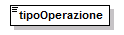
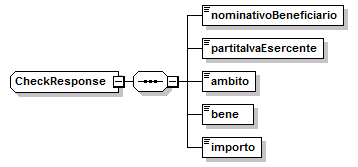

header added by pandoc
======================

.. _header-added-by-pandoc-1:

header added by pandoc
----------------------

.. _header-added-by-pandoc-2:

header added by pandoc
~~~~~~~~~~~~~~~~~~~~~~

.. _header-added-by-pandoc-3:

header added by pandoc
^^^^^^^^^^^^^^^^^^^^^^

WEB APP “18APP” LINEE GUIDA PER ESERCENTI
'''''''''''''''''''''''''''''''''''''''''

WEB APP 18APP PAG. 2 DI 26

LINEE GUIDA PER ESERCENTI

La `Legge n. 232 dell’11 dicembre 2016 <http://www.normattiva.it/uri-res/N2Ls?urn:nir:stato:legge:2016-12-11;232>`__ assegna un bonus di 500 euro ai cittadini residenti in Italia (in possesso, ove previsto, di permesso di soggiorno in corso di validità) che compiono diciotto anni nel 2017.
^^^^^^^^^^^^^^^^^^^^^^^^^^^^^^^^^^^^^^^^^^^^^^^^^^^^^^^^^^^^^^^^^^^^^^^^^^^^^^^^^^^^^^^^^^^^^^^^^^^^^^^^^^^^^^^^^^^^^^^^^^^^^^^^^^^^^^^^^^^^^^^^^^^^^^^^^^^^^^^^^^^^^^^^^^^^^^^^^^^^^^^^^^^^^^^^^^^^^^^^^^^^^^^^^^^^^^^^^^^^^^^^^^^^^^^^^^^^^^^^^^^^^^^^^^^^^^^^^^^^^^^^^^^^^^^^^^^^^^^^^^^^^^^^^^

La gestione del bonus può avvenire tramite qualunque tipo device (smartphone, tablet, computer) connesso ad Internet, sia da parte dei diciottenni che da parte degli esercenti (soggetti pubblici o privati) presso i quali acquistare i prodotti previsti riconducibili alle seguenti categorie: cinema, musica e concerti, eventi culturali, libri, musei, monumenti, parchi naturali ed aree archeologiche, teatro e danza, corsi di musica, di teatro o di lingua straniera.

In particolare, nella web app gli esercenti avranno a disposizione le seguenti funzionalità:

1. registrazione al servizio;

2. vendita attraverso esercizio fisico oppure on line

3. controllo e riscossione dei buoni di acquisto

4. fatturazione

WEB APP 18APP PAG. 3 DI 26

LINEE GUIDA PER ESERCENTI

REGISTRAZIONE AL SERVIZIO
-------------------------

.. _header-added-by-pandoc-4:

header added by pandoc
~~~~~~~~~~~~~~~~~~~~~~

“18app” può essere utilizzato solo dagli esercenti con credenziali di accesso ai Servizi Telematici dell’Agenzia delle Entrate e che hanno incaricato dei soggetti ad operare per proprio conto. Gli esercenti si devono, quindi, obbligatoriamente registrare alla web app per poter vendere i propri prodotti.
^^^^^^^^^^^^^^^^^^^^^^^^^^^^^^^^^^^^^^^^^^^^^^^^^^^^^^^^^^^^^^^^^^^^^^^^^^^^^^^^^^^^^^^^^^^^^^^^^^^^^^^^^^^^^^^^^^^^^^^^^^^^^^^^^^^^^^^^^^^^^^^^^^^^^^^^^^^^^^^^^^^^^^^^^^^^^^^^^^^^^^^^^^^^^^^^^^^^^^^^^^^^^^^^^^^^^^^^^^^^^^^^^^^^^^^^^^^^^^^^^^^^^^^^^^^^^^^^^^^^^^^^^^^^^^^^^^^^^^^^^^^^^^^^^^^^^^^^^^^^^^^^

Le fasi della registrazione:

-  **entro il 30 giugno 2018** registrazione alla web app con indicazione dei dati generali dell’esercente (dati anagrafici, di residenza, codice ATECO, recapiti telefonici, mail ed eventuale sito internet, accettazione della normativa vigente).

-  **entro il 30 giugno 2018** indicazione di categorie di prodotto e prodotti vendibili sia nel proprio esercizio fisico che in quello online.

Al termine della registrazione, il sistema assegnerà automaticamente a ciascun esercente un “codice esercente” di 5 caratteri alfanumerici da utilizzare in fase di riscossione dei buoni. Gli esercenti possono modificare le informazioni registrate ogni qual volta vorranno (ad esempio: variazione dati, inserimento/cancellazione dei punti vendita fisici).

WEB APP 18APP PAG. 4 DI 26

LINEE GUIDA PER ESERCENTI

VENDITA
-------

.. _header-added-by-pandoc-5:

header added by pandoc
~~~~~~~~~~~~~~~~~~~~~~

La web app mette a disposizione degli esercenti 2 tipologie di vendita: nell’esercizio fisico oppure on-line (in fase di registrazione è possibile indicare l’utilizzo anche di entrambe le tipologie). In caso di vendita nell’esercizio fisico, l’esercente può indicare tutti i punti vendita dove i diciottenni potranno esibire i “buoni” di spesa con l’indicazione delle categorie di prodotto e dei prodotti disponibili. I punti vendita potranno essere geolocalizzati nell’applicazione dei 18enni.
^^^^^^^^^^^^^^^^^^^^^^^^^^^^^^^^^^^^^^^^^^^^^^^^^^^^^^^^^^^^^^^^^^^^^^^^^^^^^^^^^^^^^^^^^^^^^^^^^^^^^^^^^^^^^^^^^^^^^^^^^^^^^^^^^^^^^^^^^^^^^^^^^^^^^^^^^^^^^^^^^^^^^^^^^^^^^^^^^^^^^^^^^^^^^^^^^^^^^^^^^^^^^^^^^^^^^^^^^^^^^^^^^^^^^^^^^^^^^^^^^^^^^^^^^^^^^^^^^^^^^^^^^^^^^^^^^^^^^^^^^^^^^^^^^^^^^^^^^^^^^^^^^^^^^^^^^^^^^^^^^^^^^^^^^^^^^^^^^^^^^^^^^^^^^^^^^^^^^^^^^^^^^^^^^^^^^^^^^^^^^^^^^^^^^^^^^^^^^^^^^^^^^^^^^^^^^^^^^^^^^^^^^^^^^^^^^^^^^^^^^^^^^^^^^^^^^^^^^^^^^^^^^^^^^^^^^^^^^^^^^^^^^^^^^^^^^^

In caso di vendita online, l’esercente dovrà prima dotarsi di un certificato da applicare al web-service (**vd. allegato 1**) richiamabile dai propri sistemi per la verifica e validazione dei buoni di spesa.

In particolare dovrà:

-  richiedere il certificato in fase di registazione;

-  scaricare il certificato nei propri sistemi;

-  verificare l’istallazione del certificato tramite specifica chiamata del web-service, come da indicazioni in allegato1.

Si precisa che sarà possibile anche per gli esercenti che scelgono la vendita presso l’esercizio fisico scegliere l’utilizzo delle API services che prevedono il download ed istallazione di un certificato nei propri sistemi, secondo il procedimento descritto per la vendità online.

Si precisa, inoltre, che per gli esercenti che utilizzeranno il web-services per la validazione dei buoni sono previsti i seguenti stati di lavorazione legati alle attività di configurazione dei propri sistemi in cui dovrà essere istallato il certificato:

+---------------+---+---------------------------------------------------+
| - da attivare |  | certificato da scaricare dall’ applicazione 18app |
+===============+===+===================================================+
| -  attivabile |  | certificato scaricato, ma non istallato           |
+---------------+---+---------------------------------------------------+
| -  attivo     |  | certificato istallato (vd. allegato 1).           |
+---------------+---+---------------------------------------------------+

WEB APP 18APP PAG. 5 DI 26

LINEE GUIDA PER ESERCENTI

CONTROLLO E RISCOSSIONE DEI BUONI D’ACQUISTO
--------------------------------------------

.. _header-added-by-pandoc-6:

header added by pandoc
~~~~~~~~~~~~~~~~~~~~~~

A partire da settembre 2017 e fino al 31 dicembre 2018 gli esercenti possono verificare e riscuotere i buoni generati dai 18enni nati nel 1999 nelle funzionalità dell’applicazione loro dedicate ed identificati da uno specifico codice.
^^^^^^^^^^^^^^^^^^^^^^^^^^^^^^^^^^^^^^^^^^^^^^^^^^^^^^^^^^^^^^^^^^^^^^^^^^^^^^^^^^^^^^^^^^^^^^^^^^^^^^^^^^^^^^^^^^^^^^^^^^^^^^^^^^^^^^^^^^^^^^^^^^^^^^^^^^^^^^^^^^^^^^^^^^^^^^^^^^^^^^^^^^^^^^^^^^^^^^^^^^^^^^^^^^^^^^^^^^^^^^^^^^^^^^^^^^

La verifica e validazione è differente in caso di vendita nell’esercizio fisico oppure online.

**Verifica in caso di vendita nell’esercizio fisico**

Nell’area non autenticata della web app gli esercenti possono;

-  indicare il codice del buono esibito dal beneficiario insieme al “codice esercente”;

-  leggere il QR code o il codice a barre del buono.

In caso di riconoscimento del codice del buono, la web app restituisce le informazioni generali dell’acquisto (categoria di prodotto, bene, importo e cognome/nome del beneficiario); eventualmente l’esercente può verificare il beneficiario anche tramite l’esibizione di un documento d’identità. A questo punto, l’esercente può validare il buono esibito consentendo di “scalare” l’importo dal bonus totale di 500 euro del diciottenne.

**Verifica in caso di vendita online**

Nel proprio sito internet, l’esercente consente al diciottenne di indicare il codice del buono da verificare e riscuotere tramite chiamata al web-service le cui specifiche sono reperibili nell’allegato 1.

Gli esercenti possono visualizzare la lista dei buoni riscossi utilizzando eventuali filtri di ricerca per data di generazione del buono e/o per tipologia di vendita (esercizio fisico oppure online), per categoria di prodotto e per buoni fatturati o data fatturare.

Nelle liste verrano visualizzate le seguenti informazioni:

-  categoria di prodotto

-  dettagli del prodotto acquistato (tipologia ed esercente/punto vendita)

-  identificativo del buono

-  identificativo della fattura elettronica in cui è stato indicato il bene acquistato

-  informazione sull’eventuale download della lista esportabile in formato .csv.

WEB APP 18APP PAG. 6 DI 26

LINEE GUIDA PER ESERCENTI

Le liste visualizzate potranno essere scaricate in formato .csv per facilitare la preparazione della fattura elettronica.
^^^^^^^^^^^^^^^^^^^^^^^^^^^^^^^^^^^^^^^^^^^^^^^^^^^^^^^^^^^^^^^^^^^^^^^^^^^^^^^^^^^^^^^^^^^^^^^^^^^^^^^^^^^^^^^^^^^^^^^^^

Nella “lista dei buoni”, resa disponibile nella web app 18app, gli esercenti possono, inoltre, verificare se il numero di buoni convalidati coincide con quello delle fatture.

WEB APP 18APP PAG. 7 DI 26

LINEE GUIDA PER ESERCENTI

FATTURAZIONE
------------

.. _header-added-by-pandoc-7:

header added by pandoc
~~~~~~~~~~~~~~~~~~~~~~

Agli esercenti viene riconosciuto un credito per ogni buono riscosso da dichiarare in sede di fatturazione elettronica.
^^^^^^^^^^^^^^^^^^^^^^^^^^^^^^^^^^^^^^^^^^^^^^^^^^^^^^^^^^^^^^^^^^^^^^^^^^^^^^^^^^^^^^^^^^^^^^^^^^^^^^^^^^^^^^^^^^^^^^^

L’esercente dovrà preparare la fattura in formato elettronico secondo il tracciato stabilito per la fatturazione elettronica verso la pubblica amministrazione (“Schema del file xml FatturaPA - versione 1.1” reperibile nel sito `www.fatturapa.gov.it, <http://www.fatturapa.gov.it/>`__ sezione Norme e regole, Documentazione FatturaPA).

La valorizzazione degli elementi del tracciato xml dovrà rispettare i requisiti formali e di obbligatorietà previsti e, con particolare riferimento al blocco 2.2.1 <DettaglioLinee>, dovrà tener conto delle indicazioni riportate nel documento “\ **Linee guida fatturazione esercente**\ ” disponibili nell’applicazione 18app.

APPLICAZIONE 18APP ALLEGATO

LINEE GUIDA PER ESERCENTI PAG. 8 DI 26

ALLEGATO 1
''''''''''

**Allegato 1 – Specifica WS online**

APPLICAZIONE 18APP ALLEGATO

LINEE GUIDA PER ESERCENTI PAG. 9 DI 26

18app
=====

**Servizio Web per verifica voucher degli esercenti**

Gli esercenti registrati al servizio “\ **18app**\ ” per la vendita online potranno validare nei propri sistemi i voucher di acquisto di beni da parte dei 18enni utilizzando uno specifico servizio web di cui si forniscono di seguito le specifiche di utilizzo.

**In merito agli endpoint, si precisa che al momento l’indirizzo referenziato nel wsdl (**\ `http://bonus.mibact.it/VerificaVoucher\\ <http://bonus.mibact.it/VerificaVoucher\>`__ **) è provvisorio.**

Il servizio web di **verifica del voucher** da parte degli esercenti rende disponibili 2 principali operazioni (“**Check**\ ” e “\ **Confirm**\ ”). La seguente descrizione delle operazioni è necessaria per valorizzare adeguatamente i campi di input. Pertanto le operazioni esposte dall’interfaccia wsdl possono essere descritte come segue:

.. _header-added-by-pandoc-8:

header added by pandoc
----------------------

.. _header-added-by-pandoc-9:

header added by pandoc
~~~~~~~~~~~~~~~~~~~~~~

.. _header-added-by-pandoc-10:

header added by pandoc
^^^^^^^^^^^^^^^^^^^^^^

Check
'''''

+---------+----------------------------------------+------------------------------+
| INPUT:  | tipo operazione                        | *“1”, “2”*                   |
+=========+========================================+==============================+
| OUTPUT: | codice voucher nominativo beneficiario | *CF o Nome e Cognome*        |
+---------+----------------------------------------+------------------------------+
|         | partita IVA esercente ambito           | *cinema, teatro, libreria…*  |
+---------+----------------------------------------+------------------------------+
|         | bene                                   | *libri, spettacoli…*         |
+---------+----------------------------------------+------------------------------+
|         | importo                                | *importo totale del voucher* |
+---------+----------------------------------------+------------------------------+

Se **tipo operazione** verrà valorizzato con **“1”**, il check del voucher restituerà all’esercente i campi previsti in output senza consumare il voucher e quindi senza scalare l’importo dal borsellino del beneficiario. Questa modalità di utilizzo dell’operazione non è obbligatoria, ma lascia all’esercente la possibilità di eseguire un controllo tra il nominativo del beneficiario e quello del suo cliente in sessione.

Se **tipo operazione** verrà valorizzato con **“2”**, il check del voucher consumerà direttamente l’importo, scalandolo dal borsellino del beneficiario, e restituerà comunque le informazioni previste in output. L’esercente potrà scegliere di usare direttamente questa modalità oppure effettuare due chiamate successive: la prima per il controllo del beneficiario e la seconda per l’effettivo utilizzo del voucher.

Il sequence diagram seguente descrive ad alto livello l’interazione tra i vari sistemi coinvolti, nei casi fin qui descritti:

|image0|

APPLICAZIONE 18APP ALLEGATO

LINEE GUIDA PER ESERCENTI PAG. 10 DI 26

Confirm
'''''''

+---------+------------------------+-------------------------------------+
| INPUT:  | tipo operazione        | *“1”*                               |
+=========+========================+=====================================+
|         | codice voucher importo | *importo confermato dall’esercente* |
+---------+------------------------+-------------------------------------+
| OUTPUT: | esito                  |                                     |
+---------+------------------------+-------------------------------------+

In questa versione del servizio il **tipo operazione** verrà valorizzato sempre con **“1”** e l’esercente potrà comunicare la quota utilizzata rispetto all’importo totale del voucher, momentaneamente impegnato. Il sistema scalerà l’importo dal borsellino del beneficiario, riaccreditando la parte non utilizzata, calcolata come differenza tra il valore totale del voucher e l’importo comunicato dall’esercente.

L’\ **esito** dell’operazione (**“OK”** / **“KO”**) sarà restituito all’esercente che potrà eventualmente fornire un feedback al beneficiario.

APPLICAZIONE 18APP ALLEGATO

LINEE GUIDA PER ESERCENTI PAG. 11 DI 26

Modalità di autenticazione
==========================

Per consumare il web service di verifica del voucher, ogni esercente dovrà essere dotato di un **certificato di autenticazione** da installare nel proprio client del servizio e da utilizzare nella chiamata SOAP per effettuare l’autenticazione in modalità SSL con certificato client.

Tale certificato X509 sarà generabile e scaricabile in formato .cer direttamente tramite l’applicazione web dedicata agli esercenti, in area autenticata. In particolare il processo di generazione del certificato prevede due step:

1. Il primo step di richiesta del certificato; a seguito di questa operazione il sistema prende in carico la richiesta.

2. Il secondo step di verifica esito della richiesta; questa operazione controlla se è pronto il certificato emesso da CA dedicata ed eventualmente lo rende disponibile per il download.

Durante il primo step sarà necessario caricare un file .der rappresentante la richiesta di certificato alla CA dedicata al progetto. Tale csr deve presentare le seguenti caratteristiche:

-  Algoritmo generazione chiavi: RSA

-  Lunghezza chiavi: 2048 bit

Una volta scaricato il certificato X509 va installato, insieme alla corrispondente chiave privata, nel client utilizzato per il servizio di verifica voucher. Pertanto l’evento di download del certificato non può rappresentare la definitiva attivazione dell’esercente. E’ stato previsto uno step di attivazione, di tipo “Check” con i seguenti valori di input:

-  tipo operazione = 1

-  codice voucher = 11aa22bb

Questa operazione equivale ad una transazione di attivazione, il cui unico effetto è quello di portare l’esercente nello stato attivo. Da questo momento in poi i beneficiari potranno generare voucher reali per tale esercente.

Endpoint del servizio

Il servizio risponde ai seguenti endpoint https://wstest.18app.italia.it/VerificaVoucherWEB/VerificaVoucher (ambiente di prova) https://ws.18app.italia.it/VerificaVoucherWEB/VerificaVoucher (ambiente reale)

APPLICAZIONE 18APP ALLEGATO

LINEE GUIDA PER ESERCENTI PAG. 12 DI 26

Codici di errore
================

La seguente tabella rappresenta i possibili errori gestiti dal sistema:

+-----------------+-------------------------------------------------------------------------------------------------------------------+
| **Codice/Code** | **Descrizione/Description**                                                                                       |
+=================+===================================================================================================================+
| 01              | Errore nel formato dei parametri in input, verificarli e riprovare                                                |
+-----------------+-------------------------------------------------------------------------------------------------------------------+
|                 | Error in the input parameters, check and try again                                                                |
+-----------------+-------------------------------------------------------------------------------------------------------------------+
| 02              | Il buono richiesto non è disponibile sul sistema o è già stato riscosso o annullato                               |
+-----------------+-------------------------------------------------------------------------------------------------------------------+
|                 | The requested voucher is not available on the system. It could be already collected or canceled                   |
+-----------------+-------------------------------------------------------------------------------------------------------------------+
| 03              | Impossibile attivare l'esercente. Verificare che i dati siano corretti e che                                      |
|                 |                                                                                                                   |
|                 | l'esercente non sia già stato attivato                                                                            |
+-----------------+-------------------------------------------------------------------------------------------------------------------+
|                 | Impossible to activate the user. Please verify input parameters and that the user has not been already activated. |
+-----------------+-------------------------------------------------------------------------------------------------------------------+
| 04              | L'importo richiesto è superiore all'importo del buono selezionato                                                 |
+-----------------+-------------------------------------------------------------------------------------------------------------------+
|                 | The amount claimed is greater than the amount of the selected voucher                                             |
+-----------------+-------------------------------------------------------------------------------------------------------------------+
| 05              | Non si può verificare o consumare il buono poichè l'esercente risulta non attivo                                  |
+-----------------+-------------------------------------------------------------------------------------------------------------------+
|                 | User inactive, voucher impossible to verify.                                                                      |
+-----------------+-------------------------------------------------------------------------------------------------------------------+
| 06              | Ambito e bene del buono non coincidono con ambiti e beni trattati dall’esercente                                  |
+-----------------+-------------------------------------------------------------------------------------------------------------------+
|                 | Category and type of this voucher are not aligned with category and type managed by the user.                     |
+-----------------+-------------------------------------------------------------------------------------------------------------------+

|image1|

APPLICAZIONE 18APP ALLEGATO

LINEE GUIDA PER ESERCENTI PAG. 13 DI 26

Esempi di request/response
==========================

Di seguito si riportano due esempi di request e relativa response, sia per l’operation “Check” che per l’operation “Confirm”.

“Check”

Check request:

<soapenv:Envelope xmlns:soapenv="http://schemas.xmlsoap.org/soap/envelope/" xmlns:ver="http://bonus.mibact.it/VerificaVoucher/">

<soapenv:Header/>

<soapenv:Body>

<ver:CheckRequestObj>

<checkReq>

<tipoOperazione>1</tipoOperazione>

<codiceVoucher>2a75f266</codiceVoucher>

<!--Optional:

<partitaIvaEsercente>?</partitaIvaEsercente>

-->

</checkReq>

</ver:CheckRequestObj>

</soapenv:Body>

</soapenv:Envelope> Check response:

<soapenv:Envelope xmlns:soapenv="http://schemas.xmlsoap.org/soap/envelope/">

<soapenv:Body>

<a:CheckResponseObj xmlns:a="http://bonus.mibact.it/VerificaVoucher/">

<checkResp>

<nominativoBeneficiario>AAABBB10X10X111D</nominativoBeneficiario>

<partitaIvaEsercente>01043931003</partitaIvaEsercente>

|image2|

APPLICAZIONE 18APP ALLEGATO

LINEE GUIDA PER ESERCENTI PAG. 14 DI 26

<ambito>Teatro</ambito>

<bene>Biglietti</bene>

<importo>40.5</importo>

</checkResp>

</a:CheckResponseObj>

</soapenv:Body>

</soapenv:Envelope>

“Confirm”

Confirm request:

<soapenv:Envelope xmlns:soapenv="http://schemas.xmlsoap.org/soap/envelope/" xmlns:ver="http://bonus.mibact.it/VerificaVoucher/">

<soapenv:Header/>

<soapenv:Body>

<ver:ConfirmRequestObj>

<checkReq>

<tipoOperazione>1</tipoOperazione>

<codiceVoucher>2a75f266</codiceVoucher>

<importo>30.20</importo>

</checkReq>

</ver:ConfirmRequestObj>

</soapenv:Body>

</soapenv:Envelope> Confirm response:

<soapenv:Envelope xmlns:soapenv="http://schemas.xmlsoap.org/soap/envelope/">

<soapenv:Body>

<a:ConfirmResponseObj xmlns:a="http://bonus.mibact.it/VerificaVoucher/">

<checkResp>

<esito>OK</esito>

</checkResp>

</a:ConfirmResponseObj>

</soapenv:Body>

</soapenv:Envelope>

APPLICAZIONE 18APP ALLEGATO

LINEE GUIDA PER ESERCENTI PAG. 15 DI 26

WSDL VerificaVoucher.wsdl
=========================

targetnamespace: http://bonus.mibact.it/VerificaVoucher/

services bindings porttypes messages types

.. _header-added-by-pandoc-11:

header added by pandoc
----------------------

.. _header-added-by-pandoc-12:

header added by pandoc
~~~~~~~~~~~~~~~~~~~~~~

.. _header-added-by-pandoc-13:

header added by pandoc
^^^^^^^^^^^^^^^^^^^^^^

`VerificaVouc <#_bookmark0>`__ `her <#_bookmark0>`__
''''''''''''''''''''''''''''''''''''''''''''''''''''

`VerificaVoucherS <#_bookmark2>`__\ `OAP <#_bookmark2>`__

`VerificaVouc <#_bookmark3>`__\ `her <#_bookmark3>`__

`CheckRequest <#_bookmark6>`__\ `Check <#_bookmark18>`__

`CheckRespons <#_bookmark7>`__\ `e <#_bookmark7>`__\ `ConfirmReque <#_bookmark8>`__\ `st <#_bookmark8>`__\ `ConfirmRespo <#_bookmark9>`__\ `nse <#_bookmark9>`__

`CheckRequestObj <#_bookmark10>`__\ `CheckResponse <#_bookmark22>`__

`CheckResponseO <#_bookmark12>`__\ `bj <#_bookmark12>`__

`Confirm <#_bookmark28>`__\ `ConfirmRequestO <#_bookmark14>`__\ `bj <#_bookmark14>`__

`ConfirmResponse <#_bookmark32>`__

`ConfirmResponse <#_bookmark16>`__\ `Obj <#_bookmark16>`__

attributeFormDefault: elementFormDefault:

targetNamespace: http://bonus.mibact.it/VerificaVoucher/

Elements Complex types

`CheckRequestObj <#_bookmark10>`__\ `Check <#_bookmark18>`__\ `CheckResponseObj <#_bookmark12>`__\ `CheckResponse <#_bookmark22>`__\ `ConfirmRequestObj <#_bookmark14>`__\ `Confirm <#_bookmark28>`__\ `ConfirmResponseObj <#_bookmark16>`__\ `ConfirmResponse <#_bookmark32>`__

service **VerificaVoucher**

+---------+-----------------------------------------------------------------------------+
| diagram | |image3|                                                                    |
+=========+=============================================================================+
| ports   | **VerificaVoucherSOAP**                                                     |
|         |                                                                             |
|         | binding `tns:VerificaVoucherSOAP <#_bookmark2>`__                           |
|         |                                                                             |
|         | extensibility <soap:address                                                 |
|         |                                                                             |
|         | location="\ https://bonus.mibact.it/VerificaVoucherWEB/VerificaVoucher%22/> |
+---------+-----------------------------------------------------------------------------+
| source  | <wsdl:service name="VerificaVoucher">                                       |
|         |                                                                             |
|         | <wsdl:port name="VerificaVoucherSOAP" binding="tns:VerificaVoucherSOAP">    |
+---------+-----------------------------------------------------------------------------+

APPLICAZIONE 18APP ALLEGATO

LINEE GUIDA PER ESERCENTI PAG. 16 DI 26

+--+-------------------------------------------------------------------------------------------+
|  | <soap:address location="\ https://bonus.mibact.it/VerificaVoucherWEB/VerificaVoucher%22/> |
|  |                                                                                           |
|  | </wsdl:port>                                                                              |
|  |                                                                                           |
|  | </wsdl:service>                                                                           |
+--+-------------------------------------------------------------------------------------------+

binding **VerificaVoucherSOAP**

+---------------+----------------------------------------------------------------------------------------------------------------------------------+
| diagram       | |image4|                                                                                                                         |
+===============+==================================================================================================================================+
| type          | `tns:VerificaVoucher <#_bookmark3>`__                                                                                            |
+---------------+----------------------------------------------------------------------------------------------------------------------------------+
| extensibility | <soap:binding style="document" transport=\ `"http://schemas.xmlsoap.org/soap/http <http://schemas.xmlsoap.org/soap/http>`__"/>   |
+---------------+----------------------------------------------------------------------------------------------------------------------------------+
| operations    | **Check**                                                                                                                        |
|               |                                                                                                                                  |
|               | extensibility <soap:operation                                                                                                    |
|               |                                                                                                                                  |
|               | soapAction="\ http://bonus.mibact.it/VerificaVoucher/Check%22/>                                                                  |
|               |                                                                                                                                  |
|               | input <soap:body use="literal"/>                                                                                                 |
|               |                                                                                                                                  |
|               | output <soap:body use="literal"/>                                                                                                |
|               |                                                                                                                                  |
|               | **Confirm**                                                                                                                      |
|               |                                                                                                                                  |
|               | extensibility <soap:operation                                                                                                    |
|               |                                                                                                                                  |
|               | soapAction="\ http://bonus.mibact.it/VerificaVoucher/Confirm%22/>                                                                |
|               |                                                                                                                                  |
|               | input <soap:body use="literal"/>                                                                                                 |
|               |                                                                                                                                  |
|               | output <soap:body use="literal"/>                                                                                                |
+---------------+----------------------------------------------------------------------------------------------------------------------------------+
| used by       | Port `VerificaVoucherSOAP <#_bookmark1>`__ in Service `VerificaVoucher <#_bookmark0>`__                                          |
+---------------+----------------------------------------------------------------------------------------------------------------------------------+
| source        | <wsdl:binding name="VerificaVoucherSOAP" type="tns:VerificaVoucher">                                                             |
|               |                                                                                                                                  |
|               | <soap:binding style="document" transport=\ `"http://schemas.xmlsoap.org/soap/http <http://schemas.xmlsoap.org/soap/http>`__"/>   |
|               |                                                                                                                                  |
|               | <wsdl:operation name="Check">                                                                                                    |
|               |                                                                                                                                  |
|               | <soap:operation soapAction=\ `"http://bonus.mibact.it/VerificaVoucher/Check <http://bonus.mibact.it/VerificaVoucher/Check>`__"/> |
|               |                                                                                                                                  |
|               | <wsdl:input>                                                                                                                     |
|               |                                                                                                                                  |
|               | <soap:body use="literal"/>                                                                                                       |
+---------------+----------------------------------------------------------------------------------------------------------------------------------+

APPLICAZIONE 18APP ALLEGATO

LINEE GUIDA PER ESERCENTI PAG. 17 DI 26

+--+--------------------------------------------------------------------------------------------------------------------------------------+
|  | </wsdl:input>                                                                                                                        |
|  |                                                                                                                                      |
|  | <wsdl:output>                                                                                                                        |
|  |                                                                                                                                      |
|  | <soap:body use="literal"/>                                                                                                           |
|  |                                                                                                                                      |
|  | </wsdl:output>                                                                                                                       |
|  |                                                                                                                                      |
|  | </wsdl:operation>                                                                                                                    |
|  |                                                                                                                                      |
|  | <wsdl:operation name="Confirm">                                                                                                      |
|  |                                                                                                                                      |
|  | <soap:operation soapAction=\ `"http://bonus.mibact.it/VerificaVoucher/Confirm <http://bonus.mibact.it/VerificaVoucher/Confirm>`__"/> |
|  |                                                                                                                                      |
|  | <wsdl:input>                                                                                                                         |
|  |                                                                                                                                      |
|  | <soap:body use="literal"/>                                                                                                           |
|  |                                                                                                                                      |
|  | </wsdl:input>                                                                                                                        |
|  |                                                                                                                                      |
|  | <wsdl:output>                                                                                                                        |
|  |                                                                                                                                      |
|  | <soap:body use="literal"/>                                                                                                           |
|  |                                                                                                                                      |
|  | </wsdl:output>                                                                                                                       |
|  |                                                                                                                                      |
|  | </wsdl:operation>                                                                                                                    |
|  |                                                                                                                                      |
|  | </wsdl:binding>                                                                                                                      |
+--+--------------------------------------------------------------------------------------------------------------------------------------+

porttype **VerificaVoucher**

+------------+-----------------------------------------------+
| diagram    | |image5|                                      |
+============+===============================================+
| operations | **Check**                                     |
|            |                                               |
|            | input `tns:CheckRequest <#_bookmark6>`__      |
|            |                                               |
|            | output `tns:CheckResponse <#_bookmark7>`__    |
|            |                                               |
|            | **Confirm**                                   |
|            |                                               |
|            | input `tns:ConfirmRequest <#_bookmark8>`__    |
|            |                                               |
|            | output `tns:ConfirmResponse <#_bookmark9>`__  |
+------------+-----------------------------------------------+
| used by    | binding `VerificaVoucherSOAP <#_bookmark2>`__ |
+------------+-----------------------------------------------+
| source     | <wsdl:portType name="VerificaVoucher">        |
|            |                                               |
|            | <wsdl:operation name="Check">                 |
|            |                                               |
|            | <wsdl:input message="tns:CheckRequest"/>      |
|            |                                               |
|            | <wsdl:output message="tns:CheckResponse"/>    |
|            |                                               |
|            | </wsdl:operation>                             |
|            |                                               |
|            | <wsdl:operation name="Confirm">               |
+------------+-----------------------------------------------+

APPLICAZIONE 18APP ALLEGATO

LINEE GUIDA PER ESERCENTI PAG. 18 DI 26

+--+----------------------------------------------+
|  | <wsdl:input message="tns:ConfirmRequest"/>   |
|  |                                              |
|  | <wsdl:output message="tns:ConfirmResponse"/> |
|  |                                              |
|  | </wsdl:operation>                            |
|  |                                              |
|  | </wsdl:portType>                             |
+--+----------------------------------------------+

message **CheckRequest**

+---------+---------------------------------------------------------------------------------------+
| parts   | **parameters**                                                                        |
|         |                                                                                       |
|         | element `tns:CheckRequestObj <#_bookmark10>`__                                        |
+=========+=======================================================================================+
| used by | Operation `Check <#_bookmark4>`__ in PortType `VerificaVouche <#_bookmark3>`__\ **r** |
+---------+---------------------------------------------------------------------------------------+
| source  | <wsdl:message name="CheckRequest">                                                    |
|         |                                                                                       |
|         | <wsdl:part name="parameters" element="tns:CheckRequestObj"/>                          |
|         |                                                                                       |
|         | </wsdl:message>                                                                       |
+---------+---------------------------------------------------------------------------------------+

message **CheckResponse**

+---------+---------------------------------------------------------------------------------------+
| parts   | **parameters**                                                                        |
|         |                                                                                       |
|         | element `tns:CheckResponseObj <#_bookmark12>`__                                       |
+=========+=======================================================================================+
| used by | Operation `Check <#_bookmark4>`__ in PortType `VerificaVouche <#_bookmark3>`__\ **r** |
+---------+---------------------------------------------------------------------------------------+
| source  | <wsdl:message name="CheckResponse">                                                   |
|         |                                                                                       |
|         | <wsdl:part name="parameters" element="tns:CheckResponseObj"/>                         |
|         |                                                                                       |
|         | </wsdl:message>                                                                       |
+---------+---------------------------------------------------------------------------------------+

message **ConfirmRequest**

+---------+-----------------------------------------------------------------------------------------+
| parts   | **parameters**                                                                          |
|         |                                                                                         |
|         | element `tns:ConfirmRequestObj <#_bookmark14>`__                                        |
+=========+=========================================================================================+
| used by | Operation `Confirm <#_bookmark5>`__ in PortType `VerificaVouche <#_bookmark3>`__\ **r** |
+---------+-----------------------------------------------------------------------------------------+
| source  | <wsdl:message name="ConfirmRequest">                                                    |
|         |                                                                                         |
|         | <wsdl:part name="parameters" element="tns:ConfirmRequestObj"/>                          |
|         |                                                                                         |
|         | </wsdl:message>                                                                         |
+---------+-----------------------------------------------------------------------------------------+

message **ConfirmResponse**

**Codice campo modificato Codice campo modificato**

**Codice campo modificato Codice campo modificato**

**Codice campo modificato Codice campo modificato**

**Codice campo modificato Codice campo modificato**

APPLICAZIONE 18APP ALLEGATO

LINEE GUIDA PER ESERCENTI PAG. 19 DI 26

element **CheckRequestObj**

+------------+-------------------------------------------------+
| diagram    | |image6|                                        |
+============+=================================================+
| namespace  | http://bonus.mibact.it/VerificaVoucher/         |
+------------+-------------------------------------------------+
| properties | content complex                                 |
+------------+-------------------------------------------------+
| children   | `checkReq <#_bookmark11>`__                     |
+------------+-------------------------------------------------+
| source     | <xsd:element name="CheckRequestObj">            |
|            |                                                 |
|            | <xsd:complexType>                               |
|            |                                                 |
|            | <xsd:sequence>                                  |
|            |                                                 |
|            | <xsd:element name="checkReq" type="tns:Check"/> |
|            |                                                 |
|            | </xsd:sequence>                                 |
|            |                                                 |
|            | </xsd:complexType>                              |
|            |                                                 |
|            | </xsd:element>                                  |
+------------+-------------------------------------------------+

element **CheckRequestObj/checkReq**

+------------+-------------------------------------------------------------------------------------------------------------+
| diagram    | |image7|                                                                                                    |
+============+=============================================================================================================+
| type       | `tns:Check <#_bookmark18>`__                                                                                |
+------------+-------------------------------------------------------------------------------------------------------------+
| properties | content complex                                                                                             |
+------------+-------------------------------------------------------------------------------------------------------------+
| children   | `tipoOperazione <#_bookmark19>`__\ `codiceVoucher <#_bookmark20>`__\ `partitaIvaEsercente <#_bookmark21>`__ |
+------------+-------------------------------------------------------------------------------------------------------------+
| source     | <xsd:element name="checkReq" type="tns:Check"/>                                                             |
+------------+-------------------------------------------------------------------------------------------------------------+

element **CheckResponseObj**

+------------+-----------------------------------------+
| diagram    | |image8|                                |
+============+=========================================+
| namespace  | http://bonus.mibact.it/VerificaVoucher/ |
+------------+-----------------------------------------+
| properties | content complex                         |
+------------+-----------------------------------------+
| children   | `checkResp <#_bookmark13>`__            |
+------------+-----------------------------------------+
| source     | <xsd:element name="CheckResponseObj">   |
+------------+-----------------------------------------+

APPLICAZIONE 18APP ALLEGATO

LINEE GUIDA PER ESERCENTI PAG. 20 DI 26

+--+----------------------------------------------------------+
|  | <xsd:complexType>                                        |
|  |                                                          |
|  | <xsd:sequence>                                           |
|  |                                                          |
|  | <xsd:element name="checkResp" type="tns:CheckResponse"/> |
|  |                                                          |
|  | </xsd:sequence>                                          |
|  |                                                          |
|  | </xsd:complexType>                                       |
|  |                                                          |
|  | </xsd:element>                                           |
+--+----------------------------------------------------------+

element **CheckResponseObj/checkResp**

+------------+---------------------------------------------------------------------------------------------------------------------------------------------------------------------------------------------------+
| diagram    | |image9|                                                                                                                                                                                          |
+============+===================================================================================================================================================================================================+
| type       | `tns:CheckResponse <#_bookmark22>`__                                                                                                                                                              |
+------------+---------------------------------------------------------------------------------------------------------------------------------------------------------------------------------------------------+
| properties | content complex                                                                                                                                                                                   |
+------------+---------------------------------------------------------------------------------------------------------------------------------------------------------------------------------------------------+
| children   | `nominativoBeneficiario <#element-checkresponsenominativobeneficiario>`__\ `partitaIvaEsercente <#_bookmark24>`__\ `ambito <#_bookmark25>`__\ `bene <#_bookmark26>`__\ `importo <#_bookmark27>`__ |
+------------+---------------------------------------------------------------------------------------------------------------------------------------------------------------------------------------------------+
| source     | <xsd:element name="checkResp" type="tns:CheckResponse"/>                                                                                                                                          |
+------------+---------------------------------------------------------------------------------------------------------------------------------------------------------------------------------------------------+

element **ConfirmRequestObj**

+------------+---------------------------------------------------+
| diagram    | |image10|                                         |
+============+===================================================+
| namespace  | http://bonus.mibact.it/VerificaVoucher/           |
+------------+---------------------------------------------------+
| properties | content complex                                   |
+------------+---------------------------------------------------+
| children   | `checkReq <#_bookmark15>`__                       |
+------------+---------------------------------------------------+
| source     | <xsd:element name="ConfirmRequestObj">            |
|            |                                                   |
|            | <xsd:complexType>                                 |
|            |                                                   |
|            | <xsd:sequence>                                    |
|            |                                                   |
|            | <xsd:element name="checkReq" type="tns:Confirm"/> |
|            |                                                   |
|            | </xsd:sequence>                                   |
|            |                                                   |
|            | </xsd:complexType>                                |
|            |                                                   |
|            | </xsd:element>                                    |
+------------+---------------------------------------------------+

APPLICAZIONE 18APP ALLEGATO

LINEE GUIDA PER ESERCENTI PAG. 21 DI 26

element **ConfirmRequestObj/checkReq**

+------------+-------------------------------------------------------------------------------------------------+
| diagram    | |image11|                                                                                       |
+============+=================================================================================================+
| type       | `tns:Confirm <#_bookmark28>`__                                                                  |
+------------+-------------------------------------------------------------------------------------------------+
| properties | content complex                                                                                 |
+------------+-------------------------------------------------------------------------------------------------+
| children   | `tipoOperazione <#_bookmark29>`__\ `codiceVoucher <#_bookmark30>`__\ `importo <#_bookmark31>`__ |
+------------+-------------------------------------------------------------------------------------------------+
| source     | <xsd:element name="checkReq" type="tns:Confirm"/>                                               |
+------------+-------------------------------------------------------------------------------------------------+

element **ConfirmResponseObj**

+------------+------------------------------------------------------------+
| diagram    | |image12|                                                  |
+============+============================================================+
| namespace  | http://bonus.mibact.it/VerificaVoucher/                    |
+------------+------------------------------------------------------------+
| properties | content complex                                            |
+------------+------------------------------------------------------------+
| children   | `checkResp <#_bookmark17>`__                               |
+------------+------------------------------------------------------------+
| source     | <xsd:element name="ConfirmResponseObj">                    |
|            |                                                            |
|            | <xsd:complexType>                                          |
|            |                                                            |
|            | <xsd:sequence>                                             |
|            |                                                            |
|            | <xsd:element name="checkResp" type="tns:ConfirmResponse"/> |
|            |                                                            |
|            | </xsd:sequence>                                            |
|            |                                                            |
|            | </xsd:complexType>                                         |
|            |                                                            |
|            | </xsd:element>                                             |
+------------+------------------------------------------------------------+

element **ConfirmResponseObj/checkResp**

+---------+----------------------------------------+
| diagram | |image13|                              |
+=========+========================================+
| type    | `tns:ConfirmResponse <#_bookmark32>`__ |
+---------+----------------------------------------+

APPLICAZIONE 18APP ALLEGATO

LINEE GUIDA PER ESERCENTI PAG. 22 DI 26

+------------+------------------------------------------------------------+
| properties | content complex                                            |
+============+============================================================+
| children   | `esito <#_bookmark33>`__                                   |
+------------+------------------------------------------------------------+
| source     | <xsd:element name="checkResp" type="tns:ConfirmResponse"/> |
+------------+------------------------------------------------------------+

complexType **Check**

+-----------+-------------------------------------------------------------------------------------------------------------+
| diagram   | |image14|                                                                                                   |
+===========+=============================================================================================================+
| namespace | http://bonus.mibact.it/VerificaVoucher/                                                                     |
+-----------+-------------------------------------------------------------------------------------------------------------+
| children  | `tipoOperazione <#_bookmark19>`__\ `codiceVoucher <#_bookmark20>`__\ `partitaIvaEsercente <#_bookmark21>`__ |
+-----------+-------------------------------------------------------------------------------------------------------------+
| used by   | element `CheckRequestObj/checkReq <#_bookmark11>`__                                                         |
+-----------+-------------------------------------------------------------------------------------------------------------+
| source    | <xsd:complexType name="Check">                                                                              |
|           |                                                                                                             |
|           | <xsd:sequence>                                                                                              |
|           |                                                                                                             |
|           | <xsd:element name="tipoOperazione" type="xsd:string" minOccurs="1" maxOccurs="1"/>                          |
|           |                                                                                                             |
|           | <xsd:element name="codiceVoucher" type="xsd:string" minOccurs="1" maxOccurs="1"/>                           |
|           |                                                                                                             |
|           | <xsd:element name="partitaIvaEsercente" type="xsd:string" minOccurs="0" maxOccurs="1"/>                     |
|           |                                                                                                             |
|           | </xsd:sequence>                                                                                             |
|           |                                                                                                             |
|           | </xsd:complexType>                                                                                          |
+-----------+-------------------------------------------------------------------------------------------------------------+

element **Check/tipoOperazione**

+------------+------------------------------------------------------------------------------------+
| diagram    | |image15|                                                                          |
+============+====================================================================================+
| type       | **xsd:string**                                                                     |
+------------+------------------------------------------------------------------------------------+
| properties | content simple                                                                     |
+------------+------------------------------------------------------------------------------------+
| source     | <xsd:element name="tipoOperazione" type="xsd:string" minOccurs="1" maxOccurs="1"/> |
+------------+------------------------------------------------------------------------------------+

element **Check/codiceVoucher**

+---------+-----------+
| diagram | |image16| |
+---------+-----------+

APPLICAZIONE 18APP ALLEGATO

LINEE GUIDA PER ESERCENTI PAG. 23 DI 26

+------------+-----------------------------------------------------------------------------------+
| type       | **xsd:string**                                                                    |
+============+===================================================================================+
| properties | content simple                                                                    |
+------------+-----------------------------------------------------------------------------------+
| source     | <xsd:element name="codiceVoucher" type="xsd:string" minOccurs="1" maxOccurs="1"/> |
+------------+-----------------------------------------------------------------------------------+

element **Check/partitaIvaEsercente**

+------------+-----------------------------------------------------------------------------------------+
| diagram    | |image17|                                                                               |
+============+=========================================================================================+
| type       | **xsd:string**                                                                          |
+------------+-----------------------------------------------------------------------------------------+
| properties | minOcc 0                                                                                |
|            |                                                                                         |
|            | maxOcc 1 content simple                                                                 |
+------------+-----------------------------------------------------------------------------------------+
| source     | <xsd:element name="partitaIvaEsercente" type="xsd:string" minOccurs="0" maxOccurs="1"/> |
+------------+-----------------------------------------------------------------------------------------+

complexType **CheckResponse**

+-----------+---------------------------------------------------------------------------------------------------------------------------------------------------------------------------------------------------+
| diagram   | |image18|                                                                                                                                                                                         |
+===========+===================================================================================================================================================================================================+
| namespace | http://bonus.mibact.it/VerificaVoucher/                                                                                                                                                           |
+-----------+---------------------------------------------------------------------------------------------------------------------------------------------------------------------------------------------------+
| children  | `nominativoBeneficiario <#element-checkresponsenominativobeneficiario>`__\ `partitaIvaEsercente <#_bookmark24>`__\ `ambito <#_bookmark25>`__\ `bene <#_bookmark26>`__\ `importo <#_bookmark27>`__ |
+-----------+---------------------------------------------------------------------------------------------------------------------------------------------------------------------------------------------------+
| used by   | element `CheckResponseObj/checkResp <#_bookmark13>`__                                                                                                                                             |
+-----------+---------------------------------------------------------------------------------------------------------------------------------------------------------------------------------------------------+
| source    | <xsd:complexType name="CheckResponse">                                                                                                                                                            |
|           |                                                                                                                                                                                                   |
|           | <xsd:sequence>                                                                                                                                                                                    |
|           |                                                                                                                                                                                                   |
|           | <xsd:element name="nominativoBeneficiario" type="xsd:string" minOccurs="1" maxOccurs="1"/>                                                                                                        |
|           |                                                                                                                                                                                                   |
|           | <xsd:element name="partitaIvaEsercente" type="xsd:string" minOccurs="1" maxOccurs="1"/>                                                                                                           |
|           |                                                                                                                                                                                                   |
|           | <xsd:element name="ambito" type="xsd:string" minOccurs="1" maxOccurs="1"/>                                                                                                                        |
|           |                                                                                                                                                                                                   |
|           | <xsd:element name="bene" type="xsd:string" minOccurs="1" maxOccurs="1"/>                                                                                                                          |
|           |                                                                                                                                                                                                   |
|           | <xsd:element name="importo" type="xsd:double" minOccurs="1" maxOccurs="1"/>                                                                                                                       |
|           |                                                                                                                                                                                                   |
|           | </xsd:sequence>                                                                                                                                                                                   |
|           |                                                                                                                                                                                                   |
|           | </xsd:complexType>                                                                                                                                                                                |
+-----------+---------------------------------------------------------------------------------------------------------------------------------------------------------------------------------------------------+

APPLICAZIONE 18APP ALLEGATO

LINEE GUIDA PER ESERCENTI PAG. 24 DI 26

element CheckResponse/nominativoBeneficiario
''''''''''''''''''''''''''''''''''''''''''''

+------------+--------------------------------------------------------------------------------------------+
| diagram    | |image19|                                                                                  |
+============+============================================================================================+
| type       | **xsd:string**                                                                             |
+------------+--------------------------------------------------------------------------------------------+
| properties | content simple                                                                             |
+------------+--------------------------------------------------------------------------------------------+
| source     | <xsd:element name="nominativoBeneficiario" type="xsd:string" minOccurs="1" maxOccurs="1"/> |
+------------+--------------------------------------------------------------------------------------------+

element **CheckResponse/partitaIvaEsercente**

+------------+-----------------------------------------------------------------------------------------+
| diagram    | |image20|                                                                               |
+============+=========================================================================================+
| type       | **xsd:string**                                                                          |
+------------+-----------------------------------------------------------------------------------------+
| properties | content simple                                                                          |
+------------+-----------------------------------------------------------------------------------------+
| source     | <xsd:element name="partitaIvaEsercente" type="xsd:string" minOccurs="1" maxOccurs="1"/> |
+------------+-----------------------------------------------------------------------------------------+

element **CheckResponse/ambito**

+------------+----------------------------------------------------------------------------+
| diagram    | |image21|                                                                  |
+============+============================================================================+
| type       | **xsd:string**                                                             |
+------------+----------------------------------------------------------------------------+
| properties | content simple                                                             |
+------------+----------------------------------------------------------------------------+
| source     | <xsd:element name="ambito" type="xsd:string" minOccurs="1" maxOccurs="1"/> |
+------------+----------------------------------------------------------------------------+

element **CheckResponse/bene**

+------------+--------------------------------------------------------------------------+
| diagram    | |image22|                                                                |
+============+==========================================================================+
| type       | **xsd:string**                                                           |
+------------+--------------------------------------------------------------------------+
| properties | content simple                                                           |
+------------+--------------------------------------------------------------------------+
| source     | <xsd:element name="bene" type="xsd:string" minOccurs="1" maxOccurs="1"/> |
+------------+--------------------------------------------------------------------------+

APPLICAZIONE 18APP ALLEGATO

LINEE GUIDA PER ESERCENTI PAG. 25 DI 26

element **CheckResponse/importo**

+------------+-----------------------------------------------------------------------------+
| diagram    | |image23|                                                                   |
+============+=============================================================================+
| type       | **xsd:double**                                                              |
+------------+-----------------------------------------------------------------------------+
| properties | content simple                                                              |
+------------+-----------------------------------------------------------------------------+
| source     | <xsd:element name="importo" type="xsd:double" minOccurs="1" maxOccurs="1"/> |
+------------+-----------------------------------------------------------------------------+

complexType **Confirm**

+-----------+-------------------------------------------------------------------------------------------------+
| diagram   | |image24|                                                                                       |
+===========+=================================================================================================+
| namespace | http://bonus.mibact.it/VerificaVoucher/                                                         |
+-----------+-------------------------------------------------------------------------------------------------+
| children  | `tipoOperazione <#_bookmark29>`__\ `codiceVoucher <#_bookmark30>`__\ `importo <#_bookmark31>`__ |
+-----------+-------------------------------------------------------------------------------------------------+
| used by   | element `ConfirmRequestObj/checkReq <#_bookmark15>`__                                           |
+-----------+-------------------------------------------------------------------------------------------------+
| source    | <xsd:complexType name="Confirm">                                                                |
|           |                                                                                                 |
|           | <xsd:sequence>                                                                                  |
|           |                                                                                                 |
|           | <xsd:element name="tipoOperazione" type="xsd:string" minOccurs="1" maxOccurs="1"/>              |
|           |                                                                                                 |
|           | <xsd:element name="codiceVoucher" type="xsd:string" minOccurs="1" maxOccurs="1"/>               |
|           |                                                                                                 |
|           | <xsd:element name="importo" type="xsd:double" minOccurs="1" maxOccurs="1"/>                     |
|           |                                                                                                 |
|           | </xsd:sequence>                                                                                 |
|           |                                                                                                 |
|           | </xsd:complexType>                                                                              |
+-----------+-------------------------------------------------------------------------------------------------+

element **Confirm/tipoOperazione**

+------------+------------------------------------------------------------------------------------+
| diagram    | |image25|                                                                          |
+============+====================================================================================+
| type       | **xsd:string**                                                                     |
+------------+------------------------------------------------------------------------------------+
| properties | content simple                                                                     |
+------------+------------------------------------------------------------------------------------+
| source     | <xsd:element name="tipoOperazione" type="xsd:string" minOccurs="1" maxOccurs="1"/> |
+------------+------------------------------------------------------------------------------------+

APPLICAZIONE 18APP ALLEGATO

LINEE GUIDA PER ESERCENTI PAG. 26 DI 26

element **Confirm/codiceVoucher**

+------------+-----------------------------------------------------------------------------------+
| diagram    | |image26|                                                                         |
+============+===================================================================================+
| type       | **xsd:string**                                                                    |
+------------+-----------------------------------------------------------------------------------+
| properties | content simple                                                                    |
+------------+-----------------------------------------------------------------------------------+
| source     | <xsd:element name="codiceVoucher" type="xsd:string" minOccurs="1" maxOccurs="1"/> |
+------------+-----------------------------------------------------------------------------------+

element **Confirm/importo**

+------------+-----------------------------------------------------------------------------+
| diagram    | |image27|                                                                   |
+============+=============================================================================+
| type       | **xsd:double**                                                              |
+------------+-----------------------------------------------------------------------------+
| properties | content simple                                                              |
+------------+-----------------------------------------------------------------------------+
| source     | <xsd:element name="importo" type="xsd:double" minOccurs="1" maxOccurs="1"/> |
+------------+-----------------------------------------------------------------------------+

complexType **ConfirmResponse**

+-----------+---------------------------------------------------------------------------+
| diagram   | |image28|                                                                 |
+===========+===========================================================================+
| namespace | http://bonus.mibact.it/VerificaVoucher/                                   |
+-----------+---------------------------------------------------------------------------+
| children  | `esito <#_bookmark33>`__                                                  |
+-----------+---------------------------------------------------------------------------+
| used by   | element `ConfirmResponseObj/checkResp <#_bookmark17>`__                   |
+-----------+---------------------------------------------------------------------------+
| source    | <xsd:complexType name="ConfirmResponse">                                  |
|           |                                                                           |
|           | <xsd:sequence>                                                            |
|           |                                                                           |
|           | <xsd:element name="esito" type="xsd:string" minOccurs="1" maxOccurs="1"/> |
|           |                                                                           |
|           | </xsd:sequence>                                                           |
|           |                                                                           |
|           | </xsd:complexType>                                                        |
+-----------+---------------------------------------------------------------------------+

element **ConfirmResponse/esito**

+------------+---------------------------------------------------------------------------+
| diagram    | |image29|                                                                 |
+============+===========================================================================+
| type       | **xsd:string**                                                            |
+------------+---------------------------------------------------------------------------+
| properties | content simple                                                            |
+------------+---------------------------------------------------------------------------+
| source     | <xsd:element name="esito" type="xsd:string" minOccurs="1" maxOccurs="1"/> |
+------------+---------------------------------------------------------------------------+

.. |image0| image:: ./media/image1.png
.. |image1| image:: ./media/image2.jpeg
.. |image2| image:: ./media/image3.jpeg
.. |image3| image:: ./media/image4.png
.. |image4| image:: ./media/image5.png
.. |image5| image:: ./media/image6.png
.. |image6| image:: ./media/image7.png
.. |image7| image:: ./media/image8.png
.. |image8| image:: ./media/image9.png
.. |image9| image:: ./media/image10.png
.. |image10| image:: ./media/image11.png
.. |image11| image:: ./media/image12.png
.. |image12| image:: ./media/image13.png
.. |image13| image:: ./media/image14.png
.. |image14| image:: ./media/image15.png

.. |image16| image:: ./media/image17.png
.. |image17| image:: ./media/image18.png

.. |image19| image:: ./media/image20.png
.. |image20| image:: ./media/image21.png
.. |image21| image:: ./media/image22.png
.. |image22| image:: ./media/image23.png
.. |image23| image:: ./media/image24.png
.. |image24| image:: ./media/image25.png

.. |image26| image:: ./media/image17.png
.. |image27| image:: ./media/image24.png
.. |image28| image:: ./media/image26.png
.. |image29| image:: ./media/image27.png
