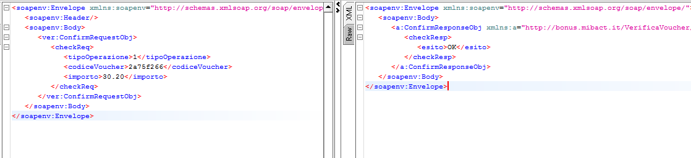
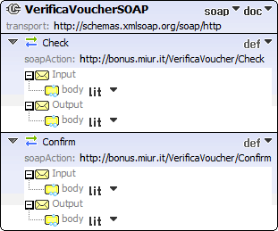
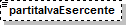
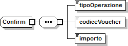
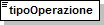
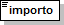
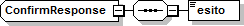

cartadeldocente.istruzione.it
-----------------------------

**Servizio Web per verifica buono di spesa degli esercenti/ enti di formazione**

Gli esercenti o gli enti di formazione registrati al servizio cartadeldocente.istruzione.it per la vendita online potranno validare nei propri sistemi i buoni di spesa di beni o servizi da parte dei docenti utilizzando un servizio web di cui si forniscono di seguito le specifiche di utilizzo.

Il servizio web di **verifica del buono** da parte degli esercenti o degli enti di formazione rende disponibili 2 principali operazioni (“**Check**\ ” e “\ **Confirm**\ ”). La seguente descrizione delle operazioni è necessaria per valorizzare adeguatamente i campi di input. Pertanto le operazioni esposte dall’interfaccia wsdl possono essere descritte come segue:

1. **Check**

+---------+------------------------------+-----------------------------+
| INPUT:  | tipo operazione              | *“1”, “2”*                  |
+=========+==============================+=============================+
|         | codice buono                 |                             |
+---------+------------------------------+-----------------------------+
| OUTPUT: | nominativo beneficiario      | *CF o Nome e Cognome*       |
+---------+------------------------------+-----------------------------+
|         | partita IVA esercente ambito | *cinema, teatro, libreria…* |
+---------+------------------------------+-----------------------------+
|         | bene                         | *libri, spettacoli…*        |
+---------+------------------------------+-----------------------------+
|         | importo                      | *importo totale del buono*  |
+---------+------------------------------+-----------------------------+

Se **tipo operazione** verrà valorizzato con **“1”**, il check del buono restituerà all’esercente i campi previsti in output senza consumare il buono e quindi senza scalare l’importo dal Portafoglio del beneficiario. Questa modalità di utilizzo dell’operazione non è obbligatoria, ma lascia all’esercente la possibilità di eseguire un controllo tra il nominativo del beneficiario e quello del suo cliente in sessione.

Se **tipo operazione** verrà valorizzato con **“2”**, il check del buono consumerà direttamente l’importo, scalandolo dal Portafoglio del beneficiario, e restituerà comunque le informazioni previste in output. L’esercente potrà scegliere di usare direttamente questa modalità oppure effettuare due chiamate successive: la prima per il controllo del beneficiario e la seconda per l’effettivo utilizzo del buono.

Il sequence diagram seguente descrive ad alto livello l’interazione tra i vari sistemi coinvolti, nei casi fin qui descritti:

|image0|

Per poter sbloccare il buono ed utilizzarne tutto l’importo o solo parte di esso, l’esercente dovrà invocare l’operazione di **Confirm** di seguito descritta.

2. **Confirm**

INPUT: tipo operazione *“1”*

codice buono

importo *importo confermato dall’esercente*

OUTPUT: esito

In questa versione del servizio il **tipo operazione** verrà valorizzato sempre con **“1”** e l’esercente o l’ ente di formazione potrà comunicare la quota utilizzata rispetto all’importo totale del buono, momentaneamente impegnato. Il sistema scalerà l’importo dal Portafoglio del beneficiario, riaccreditando la parte non utilizzata, calcolata come differenza tra il valore totale del buono e l’importo comunicato dall’esercente.

L’\ **esito** dell’operazione (**“OK”** / **“KO”**) sarà restituito all’esercente o all’ ente di formazione che potrà eventualmente fornire un feedback al beneficiario.

Modalità di autenticazione
==========================

Per consumare il web service di verifica del buono di spesa, ogni esercente o ente di formazione dovrà essere dotato di un **certificato di autenticazione** da installare nel proprio client del servizio e da utilizzare nella chiamata SOAP per effettuare l’autenticazione in modalità SSL con certificato client.

Tale certificato X509 sarà generabile e scaricabile in formato .cer direttamente tramite l’applicazione web dedicata agli esercenti, in area autenticata. In particolare il processo di generazione del certificato prevede due step:

1. Il primo step di richiesta del certificato; a seguito di questa operazione il sistema prende in carico la richiesta.
2. Il secondo step di verifica esito della richiesta; questa operazione controlla se è pronto il certificato emesso da CA dedicata ed eventualmente lo rende disponibile per il download.

Durante il primo step sarà necessario caricare un file .der rappresentante la richiesta di certificato alla CA dedicata al progetto. Tale csr deve presentare le seguenti caratteristiche:

-  Algoritmo generazione chiavi: RSA
-  Lunghezza chiavi: 2048 bit

Una volta scaricato il certificato X509 va installato, insieme alla corrispondente chiave privata, nel client utilizzato per il servizio di verifica buono. Pertanto l’evento di download del certificato non può rappresentare la definitiva attivazione dell’esercente. E’ stato previsto uno step di attivazione, di tipo “Check” con i seguenti valori di input:

-  tipo operazione = 1
-  codice buono = 11aa22bb

Questa operazione equivale ad una transazione di attivazione, il cui unico effetto è quello di portare l’esercente nello stato attivo. Da questo momento in poi i beneficiari potranno generare buoni reali per tale esercente.

Endpoint del servizio

Il servizio risponde ai seguenti endpoint `https://wstest.”cartadeldocente”.italia.it/VerificaVoucherWEB/Verifica <https://wstest./>`__\ Voucher (ambiente di prova) `https://ws.”cartadeldocente”.italia.it/VerificaVoucherWEB/VerificaVoucher <https://ws./>`__ (ambiente reale)

Codici di errore
================

La seguente tabella rappresenta i possibili errori gestiti dal sistema:

+-----------------+---------------------------------------------------------------------------------------------------------------------+
| **Codice/Code** | **Descrizione/Description**                                                                                         |
+=================+=====================================================================================================================+
| 01              | Errore nel formato dei parametri in input, verificarli e riprovare                                                  |
+-----------------+---------------------------------------------------------------------------------------------------------------------+
|                 | Error in the input parameters, check and try again                                                                  |
+-----------------+---------------------------------------------------------------------------------------------------------------------+
| 02              | Il buono richiesto non è disponibile sul sistema o è già stato riscosso o annullato                                 |
+-----------------+---------------------------------------------------------------------------------------------------------------------+
|                 | The requested buono is not available on the system. It could be already collected or canceled                       |
+-----------------+---------------------------------------------------------------------------------------------------------------------+
| 03              | Impossibile attivare l'esercente. Verificare che i dati siano corretti e che l'esercente non sia già stato attivato |
+-----------------+---------------------------------------------------------------------------------------------------------------------+
|                 | Impossible to activate the user. Please verify input parameters and that the user has not been already activated.   |
+-----------------+---------------------------------------------------------------------------------------------------------------------+
| 04              | L'importo richiesto è superiore all'importo del buono selezionato                                                   |
+-----------------+---------------------------------------------------------------------------------------------------------------------+
|                 | The amount claimed is greater than the amount of the selected buono                                                 |
+-----------------+---------------------------------------------------------------------------------------------------------------------+
| 05              | Non si può verificare o consumare il buono poichè l'esercente risulta non attivo                                    |
+-----------------+---------------------------------------------------------------------------------------------------------------------+
|                 | User inactive, buono impossible to verify.                                                                          |
+-----------------+---------------------------------------------------------------------------------------------------------------------+
| 06              | Ambito e bene del buono non coincidono con ambiti e beni trattati dall’esercente                                    |
+-----------------+---------------------------------------------------------------------------------------------------------------------+
|                 | Category and type of this buono are not aligned with category and type managed by the user.                         |
+-----------------+---------------------------------------------------------------------------------------------------------------------+

Esempi di request/response
==========================

Di seguito si riportano due esempi di request e relativa response, sia per l’operation “Check” che per l’operation “Confirm”.

|image1|\ “Check”

Check request:

<soapenv:Envelope xmlns:soapenv="http://schemas.xmlsoap.org/soap/envelope/" xmlns:ver="http://bonus.miur.it/VerificaVoucher/">

<soapenv:Header/>

<soapenv:Body>

<ver:CheckRequestObj>

<checkReq>

<tipoOperazione>1</tipoOperazione>

<codiceVoucher>FRyVVKwx</codiceVoucher>

</checkReq>

</ver:CheckRequestObj>

</soapenv:Body>

</soapenv:Envelope> Check response:

<soapenv:Envelope xmlns:soapenv="http://schemas.xmlsoap.org/soap/envelope/">

<soapenv:Body>

<a:CheckResponseObj xmlns:a="http://bonus.miur.it/VerificaVoucher/">

<checkResp>

<nominativoBeneficiario>AAABBB10X10X111D</nominativoBeneficiario>

<partitaIvaEsercente>01043931003</partitaIvaEsercente>

<ambito>Teatro</ambito>

<bene>Biglietti</bene>

<importo>40.5</importo>

</checkResp>

</a:CheckResponseObj>

</soapenv:Body>

|image2|\ </soapenv:Envelope> “Confirm”

Confirm request:

<soapenv:Envelope xmlns:soapenv="http://schemas.xmlsoap.org/soap/envelope/" xmlns:ver="http://bonus.miur.it/VerificaVoucher/">

<soapenv:Header/>

<soapenv:Body>

<ver:ConfirmRequestObj>

<checkReq>

<tipoOperazione>1</tipoOperazione>

<codiceVoucher>2a75f266</codiceVoucher>

<importo>30.20</importo>

</checkReq>

</ver:ConfirmRequestObj>

</soapenv:Body>

</soapenv:Envelope> Confirm response:

<soapenv:Envelope xmlns:soapenv="http://schemas.xmlsoap.org/soap/envelope/">

<soapenv:Body>

<a:ConfirmResponseObj xmlns:a="http://bonus.miur.it/VerificaVoucher/">

<checkResp>

<esito>OK</esito>

</checkResp>

</a:ConfirmResponseObj>

</soapenv:Body>

</soapenv:Envelope>

WSDL VerificaVoucher.wsdl
=========================

targetnamespace: http://bonus.miur.it/VerificaVoucher/

services bindings porttypes messages types

`VerificaVouc <#_bookmark0>`__\ `her <#_bookmark0>`__

`VerificaVoucherS <#_bookmark1>`__\ `OAP <#_bookmark1>`__

`VerificaVouc <#_bookmark2>`__\ `her <#_bookmark2>`__

`CheckRequest <#_bookmark3>`__\ `Check <#_bookmark11>`__

`CheckRespons <#_bookmark4>`__\ `e <#_bookmark4>`__\ `ConfirmReque <#_bookmark5>`__\ `st <#_bookmark5>`__\ `ConfirmRespo <#_bookmark6>`__\ `nse <#_bookmark6>`__

`CheckRequestObj <#_bookmark7>`__

`CheckResponse <#_bookmark12>`__

`CheckResponseO <#_bookmark8>`__\ `bj <#_bookmark8>`__

`Confirm <#_bookmark13>`__\ `ConfirmRequestO <#_bookmark9>`__\ `bj <#_bookmark9>`__\ `ConfirmResponse <#_bookmark14>`__\ `ConfirmResponse <#_bookmark10>`__\ `Obj <#_bookmark10>`__

attributeFormDefault: elementFormDefault:

targetNamespace: http://bonus.miur.it/VerificaVoucher/

Elements Complex types

**CheckRequestObj Check CheckResponseObj CheckResponse ConfirmRequestObj Confirm ConfirmResponseObj ConfirmResponse**

service **VerificaVoucher**

+--------+----------------------------------------------------------------------------------------------------+
| diagra | |image3|                                                                                           |
|        |                                                                                                    |
| m      |                                                                                                    |
+========+====================================================================================================+
| ports  | **VerificaVoucherSOAP**                                                                            |
|        |                                                                                                    |
|        | binding **tns:VerificaVoucherSOAP**                                                                |
|        |                                                                                                    |
|        | extensibil <soap:address                                                                           |
|        |                                                                                                    |
|        | ity location="\ https://ws.cartadeldocente.istruzione.it/VerificaVoucherDocWEB/V erificaVoucher"/> |
+--------+----------------------------------------------------------------------------------------------------+

binding **VerificaVoucherSOAP**

+---------------+---------------------------------------------------------------------------------------+
| diagram       | |image4|                                                                              |
+===============+=======================================================================================+
| type          | **tns:VerificaVoucher**                                                               |
+---------------+---------------------------------------------------------------------------------------+
| extensibility | <soap:binding style="document" transport="\ http://schemas.xmlsoap.org/soap/http%22/> |
+---------------+---------------------------------------------------------------------------------------+
| operations    | **Check**                                                                             |
|               |                                                                                       |
|               | extensibility <soap:operation                                                         |
|               |                                                                                       |
|               | soapAction="\ http://bonus.miur.it/VerificaVoucher/Check%22/>                         |
|               |                                                                                       |
|               | input <soap:body use="literal"/>                                                      |
|               |                                                                                       |
|               | output <soap:body use="literal"/>                                                     |
|               |                                                                                       |
|               | **Confirm**                                                                           |
|               |                                                                                       |
|               | extensibility <soap:operation                                                         |
|               |                                                                                       |
|               | soapAction="\ http://bonus.miur.it/VerificaVoucher/Confirm%22/>                       |
|               |                                                                                       |
|               | input <soap:body use="literal"/>                                                      |
|               |                                                                                       |
|               | output <soap:body use="literal"/>                                                     |
+---------------+---------------------------------------------------------------------------------------+
| used by       | Port **VerificaVoucherSOAP** in Service **VerificaVoucher**                           |
+---------------+---------------------------------------------------------------------------------------+
| source        | <wsdl:binding name="VerificaVoucherSOAP" type="tns:VerificaVoucher">                  |
|               |                                                                                       |
|               | <soap:binding style="document" transport="\ http://schemas.xmlsoap.org/soap/http%22/> |
|               |                                                                                       |
|               | <wsdl:operation name="Check">                                                         |
+---------------+---------------------------------------------------------------------------------------+

+--+---------------------------------------------------------------------------------+
|  | <soap:operation soapAction="\ http://bonus.miur.it/VerificaVoucher/Check%22/>   |
|  |                                                                                 |
|  | <wsdl:input>                                                                    |
|  |                                                                                 |
|  | <soap:body use="literal"/>                                                      |
|  |                                                                                 |
|  | </wsdl:input>                                                                   |
|  |                                                                                 |
|  | <wsdl:output>                                                                   |
|  |                                                                                 |
|  | <soap:body use="literal"/>                                                      |
|  |                                                                                 |
|  | </wsdl:output>                                                                  |
|  |                                                                                 |
|  | </wsdl:operation>                                                               |
|  |                                                                                 |
|  | <wsdl:operation name="Confirm">                                                 |
|  |                                                                                 |
|  | <soap:operation soapAction="\ http://bonus.miur.it/VerificaVoucher/Confirm%22/> |
|  |                                                                                 |
|  | <wsdl:input>                                                                    |
|  |                                                                                 |
|  | <soap:body use="literal"/>                                                      |
|  |                                                                                 |
|  | </wsdl:input>                                                                   |
|  |                                                                                 |
|  | <wsdl:output>                                                                   |
|  |                                                                                 |
|  | <soap:body use="literal"/>                                                      |
|  |                                                                                 |
|  | </wsdl:output>                                                                  |
|  |                                                                                 |
|  | </wsdl:operation>                                                               |
|  |                                                                                 |
|  | </wsdl:binding>                                                                 |
+--+---------------------------------------------------------------------------------+

porttype **VerificaVoucher**

+------------+------------------------------------------+
| diagram    | |image5|                                 |
+============+==========================================+
| operations | **Check**                                |
|            |                                          |
|            | input **tns:CheckRequest**               |
|            |                                          |
|            | output **tns:CheckResponse**             |
|            |                                          |
|            | **Confirm**                              |
|            |                                          |
|            | input **tns:ConfirmRequest**             |
|            |                                          |
|            | output **tns:ConfirmResponse**           |
+------------+------------------------------------------+
| used by    | binding **VerificaVoucherSOAP**          |
+------------+------------------------------------------+
| source     | <wsdl:portType name="VerificaVoucher">   |
|            |                                          |
|            | <wsdl:operation name="Check">            |
|            |                                          |
|            | <wsdl:input message="tns:CheckRequest"/> |
+------------+------------------------------------------+

+--+----------------------------------------------+
|  | <wsdl:output message="tns:CheckResponse"/>   |
|  |                                              |
|  | </wsdl:operation>                            |
|  |                                              |
|  | <wsdl:operation name="Confirm">              |
|  |                                              |
|  | <wsdl:input message="tns:ConfirmRequest"/>   |
|  |                                              |
|  | <wsdl:output message="tns:ConfirmResponse"/> |
|  |                                              |
|  | </wsdl:operation>                            |
|  |                                              |
|  | </wsdl:portType>                             |
+--+----------------------------------------------+

message **CheckRequest**

+---------+--------------------------------------------------------------+
| parts   | **parameters**                                               |
|         |                                                              |
|         | element **tns:CheckRequestObj**                              |
+=========+==============================================================+
| used by | Operation **Check** in PortType **VerificaVoucher**          |
+---------+--------------------------------------------------------------+
| source  | <wsdl:message name="CheckRequest">                           |
|         |                                                              |
|         | <wsdl:part name="parameters" element="tns:CheckRequestObj"/> |
|         |                                                              |
|         | </wsdl:message>                                              |
+---------+--------------------------------------------------------------+

message **CheckResponse**

+---------+---------------------------------------------------------------+
| parts   | **parameters**                                                |
|         |                                                               |
|         | element **tns:CheckResponseObj**                              |
+=========+===============================================================+
| used by | Operation **Check** in PortType **VerificaVoucher**           |
+---------+---------------------------------------------------------------+
| source  | <wsdl:message name="CheckResponse">                           |
|         |                                                               |
|         | <wsdl:part name="parameters" element="tns:CheckResponseObj"/> |
|         |                                                               |
|         | </wsdl:message>                                               |
+---------+---------------------------------------------------------------+

message **ConfirmRequest**

+---------+----------------------------------------------------------------+
| parts   | **parameters**                                                 |
|         |                                                                |
|         | element **tns:ConfirmRequestObj**                              |
+=========+================================================================+
| used by | Operation **Confirm** in PortType **VerificaVoucher**          |
+---------+----------------------------------------------------------------+
| source  | <wsdl:message name="ConfirmRequest">                           |
|         |                                                                |
|         | <wsdl:part name="parameters" element="tns:ConfirmRequestObj"/> |
|         |                                                                |
|         | </wsdl:message>                                                |
+---------+----------------------------------------------------------------+

message **ConfirmResponse**

+---------+-------------------------------------------------------+
| parts   | **parameters**                                        |
|         |                                                       |
|         | element **tns:ConfirmResponseObj**                    |
+=========+=======================================================+
| used by | Operation **Confirm** in PortType **VerificaVoucher** |
+---------+-------------------------------------------------------+
| source  | <wsdl:message name="ConfirmResponse">                 |
+---------+-------------------------------------------------------+

+--+-----------------------------------------------------------------+
|  | <wsdl:part name="parameters" element="tns:ConfirmResponseObj"/> |
|  |                                                                 |
|  | </wsdl:message>                                                 |
+--+-----------------------------------------------------------------+

element **CheckRequestObj**

+------------+-------------------------------------------------+
| diagram    | |image6|                                        |
+============+=================================================+
| namespace  | http://bonus.miur.it/VerificaVoucher/           |
+------------+-------------------------------------------------+
| properties | content complex                                 |
+------------+-------------------------------------------------+
| children   | **checkReq**                                    |
+------------+-------------------------------------------------+
| source     | <xsd:element name="CheckRequestObj">            |
|            |                                                 |
|            | <xsd:complexType>                               |
|            |                                                 |
|            | <xsd:sequence>                                  |
|            |                                                 |
|            | <xsd:element name="checkReq" type="tns:Check"/> |
|            |                                                 |
|            | </xsd:sequence>                                 |
|            |                                                 |
|            | </xsd:complexType>                              |
|            |                                                 |
|            | </xsd:element>                                  |
+------------+-------------------------------------------------+

element **CheckRequestObj/checkReq**

+------------+------------------------------------------------------+
| diagram    | |image7|                                             |
+============+======================================================+
| type       | **tns:Check**                                        |
+------------+------------------------------------------------------+
| properties | content complex                                      |
+------------+------------------------------------------------------+
| children   | **tipoOperazione codiceVoucher partitaIvaEsercente** |
+------------+------------------------------------------------------+
| source     | <xsd:element name="checkReq" type="tns:Check"/>      |
+------------+------------------------------------------------------+

element **CheckResponseObj**

+-----------+---------------------------------------+
| diagram   | |image8|                              |
+===========+=======================================+
| namespace | http://bonus.miur.it/VerificaVoucher/ |
+-----------+---------------------------------------+

+------------+----------------------------------------------------------+
| properties | content complex                                          |
+============+==========================================================+
| children   | **checkResp**                                            |
+------------+----------------------------------------------------------+
| source     | <xsd:element name="CheckResponseObj">                    |
|            |                                                          |
|            | <xsd:complexType>                                        |
|            |                                                          |
|            | <xsd:sequence>                                           |
|            |                                                          |
|            | <xsd:element name="checkResp" type="tns:CheckResponse"/> |
|            |                                                          |
|            | </xsd:sequence>                                          |
|            |                                                          |
|            | </xsd:complexType>                                       |
|            |                                                          |
|            | </xsd:element>                                           |
+------------+----------------------------------------------------------+

element **CheckResponseObj/checkResp**

+------------+--------------------------------------------------------------------+
| diagram    | |image9|                                                           |
+============+====================================================================+
| type       | **tns:CheckResponse**                                              |
+------------+--------------------------------------------------------------------+
| properties | content complex                                                    |
+------------+--------------------------------------------------------------------+
| children   | **nominativoBeneficiario partitaIvaEsercente ambito bene importo** |
+------------+--------------------------------------------------------------------+
| source     | <xsd:element name="checkResp" type="tns:CheckResponse"/>           |
+------------+--------------------------------------------------------------------+

element **ConfirmRequestObj**

+------------+---------------------------------------------------+
| diagram    | |image10|                                         |
+============+===================================================+
| namespace  | http://bonus.miur.it/VerificaVoucher/             |
+------------+---------------------------------------------------+
| properties | content complex                                   |
+------------+---------------------------------------------------+
| children   | **checkReq**                                      |
+------------+---------------------------------------------------+
| source     | <xsd:element name="ConfirmRequestObj">            |
|            |                                                   |
|            | <xsd:complexType>                                 |
|            |                                                   |
|            | <xsd:sequence>                                    |
|            |                                                   |
|            | <xsd:element name="checkReq" type="tns:Confirm"/> |
+------------+---------------------------------------------------+

+--+--------------------+
|  | </xsd:sequence>    |
|  |                    |
|  | </xsd:complexType> |
|  |                    |
|  | </xsd:element>     |
+--+--------------------+

element **ConfirmRequestObj/checkReq**

+------------+---------------------------------------------------+
| diagram    | |image11|                                         |
+============+===================================================+
| type       | **tns:Confirm**                                   |
+------------+---------------------------------------------------+
| properties | content complex                                   |
+------------+---------------------------------------------------+
| children   | **tipoOperazione codiceVoucher importo**          |
+------------+---------------------------------------------------+
| source     | <xsd:element name="checkReq" type="tns:Confirm"/> |
+------------+---------------------------------------------------+

element **ConfirmResponseObj**

+------------+------------------------------------------------------------+
| diagram    | |image12|                                                  |
+============+============================================================+
| namespace  | http://bonus.miur.it/VerificaVoucher/                      |
+------------+------------------------------------------------------------+
| properties | content complex                                            |
+------------+------------------------------------------------------------+
| children   | **checkResp**                                              |
+------------+------------------------------------------------------------+
| source     | <xsd:element name="ConfirmResponseObj">                    |
|            |                                                            |
|            | <xsd:complexType>                                          |
|            |                                                            |
|            | <xsd:sequence>                                             |
|            |                                                            |
|            | <xsd:element name="checkResp" type="tns:ConfirmResponse"/> |
|            |                                                            |
|            | </xsd:sequence>                                            |
|            |                                                            |
|            | </xsd:complexType>                                         |
|            |                                                            |
|            | </xsd:element>                                             |
+------------+------------------------------------------------------------+

element **ConfirmResponseObj/checkResp**

+------------+------------------------------------------------------------+
| diagram    | |image13|                                                  |
+============+============================================================+
| type       | **tns:ConfirmResponse**                                    |
+------------+------------------------------------------------------------+
| properties | content complex                                            |
+------------+------------------------------------------------------------+
| children   | **esito**                                                  |
+------------+------------------------------------------------------------+
| source     | <xsd:element name="checkResp" type="tns:ConfirmResponse"/> |
+------------+------------------------------------------------------------+

complexType **Check**

+-----------+-----------------------------------------------------------------------------------------+
| diagram   | |image14|                                                                               |
+===========+=========================================================================================+
| namespace | http://bonus.miur.it/VerificaVoucher/                                                   |
+-----------+-----------------------------------------------------------------------------------------+
| children  | **tipoOperazione codiceVoucher partitaIvaEsercente**                                    |
+-----------+-----------------------------------------------------------------------------------------+
| used by   | element **CheckRequestObj/checkReq**                                                    |
+-----------+-----------------------------------------------------------------------------------------+
| source    | <xsd:complexType name="Check">                                                          |
|           |                                                                                         |
|           | <xsd:sequence>                                                                          |
|           |                                                                                         |
|           | <xsd:element name="tipoOperazione" type="xsd:string" minOccurs="1" maxOccurs="1"/>      |
|           |                                                                                         |
|           | <xsd:element name="codiceVoucher" type="xsd:string" minOccurs="1" maxOccurs="1"/>       |
|           |                                                                                         |
|           | <xsd:element name="partitaIvaEsercente" type="xsd:string" minOccurs="0" maxOccurs="1"/> |
|           |                                                                                         |
|           | </xsd:sequence>                                                                         |
|           |                                                                                         |
|           | </xsd:complexType>                                                                      |
+-----------+-----------------------------------------------------------------------------------------+

element **Check/tipoOperazione**

+------------+--------------------------------------------------------------------+
| diagram    | |image15|                                                          |
+============+====================================================================+
| type       | **xsd:string**                                                     |
+------------+--------------------------------------------------------------------+
| properties | content simple                                                     |
+------------+--------------------------------------------------------------------+
| source     | <xsd:element name="tipoOperazione" type="xsd:string" minOccurs="1" |
+------------+--------------------------------------------------------------------+

+--+-----------------+
|  | maxOccurs="1"/> |
+--+-----------------+

element **Check/codiceVoucher**

+------------+-----------------------------------------------------------------------------------+
| diagram    | |image16|                                                                         |
+============+===================================================================================+
| type       | **xsd:string**                                                                    |
+------------+-----------------------------------------------------------------------------------+
| properties | content simple                                                                    |
+------------+-----------------------------------------------------------------------------------+
| source     | <xsd:element name="codiceVoucher" type="xsd:string" minOccurs="1" maxOccurs="1"/> |
+------------+-----------------------------------------------------------------------------------+

element **Check/partitaIvaEsercente**

+------------+-----------------------------------------------------------------------------------------+
| diagram    | |image17|                                                                               |
+============+=========================================================================================+
| type       | **xsd:string**                                                                          |
+------------+-----------------------------------------------------------------------------------------+
| properties | minOcc 0                                                                                |
|            |                                                                                         |
|            | maxOcc 1 content simple                                                                 |
+------------+-----------------------------------------------------------------------------------------+
| source     | <xsd:element name="partitaIvaEsercente" type="xsd:string" minOccurs="0" maxOccurs="1"/> |
+------------+-----------------------------------------------------------------------------------------+

complexType **CheckResponse**

+-----------+----------------------------------------------------------------------------+
| diagram   | |image18|                                                                  |
+===========+============================================================================+
| namespace | http://bonus.miur.it/VerificaVoucher/                                      |
+-----------+----------------------------------------------------------------------------+
| children  | **nominativoBeneficiario partitaIvaEsercente ambito bene importo**         |
+-----------+----------------------------------------------------------------------------+
| used by   | element **CheckResponseObj/checkResp**                                     |
+-----------+----------------------------------------------------------------------------+
| source    | <xsd:complexType name="CheckResponse">                                     |
|           |                                                                            |
|           | <xsd:sequence>                                                             |
|           |                                                                            |
|           | <xsd:element name="nominativoBeneficiario" type="xsd:string" minOccurs="1" |
+-----------+----------------------------------------------------------------------------+

+--+-----------------------------------------------------------------------------------------+
|  | maxOccurs="1"/>                                                                         |
|  |                                                                                         |
|  | <xsd:element name="partitaIvaEsercente" type="xsd:string" minOccurs="1" maxOccurs="1"/> |
|  |                                                                                         |
|  | <xsd:element name="ambito" type="xsd:string" minOccurs="1" maxOccurs="1"/>              |
|  |                                                                                         |
|  | <xsd:element name="bene" type="xsd:string" minOccurs="1" maxOccurs="1"/>                |
|  |                                                                                         |
|  | <xsd:element name="importo" type="xsd:double" minOccurs="1" maxOccurs="1"/>             |
|  |                                                                                         |
|  | </xsd:sequence>                                                                         |
|  |                                                                                         |
|  | </xsd:complexType>                                                                      |
+--+-----------------------------------------------------------------------------------------+

element **CheckResponse/nominativoBeneficiario**

+------------+--------------------------------------------------------------------------------------------+
| diagram    | |image19|                                                                                  |
+============+============================================================================================+
| type       | **xsd:string**                                                                             |
+------------+--------------------------------------------------------------------------------------------+
| properties | content simple                                                                             |
+------------+--------------------------------------------------------------------------------------------+
| source     | <xsd:element name="nominativoBeneficiario" type="xsd:string" minOccurs="1" maxOccurs="1"/> |
+------------+--------------------------------------------------------------------------------------------+

element **CheckResponse/partitaIvaEsercente**

+------------+-----------------------------------------------------------------------------------------+
| diagram    | |image20|                                                                               |
+============+=========================================================================================+
| type       | **xsd:string**                                                                          |
+------------+-----------------------------------------------------------------------------------------+
| properties | content simple                                                                          |
+------------+-----------------------------------------------------------------------------------------+
| source     | <xsd:element name="partitaIvaEsercente" type="xsd:string" minOccurs="1" maxOccurs="1"/> |
+------------+-----------------------------------------------------------------------------------------+

element **CheckResponse/ambito**

+------------+----------------------------------------------------------------------------+
| diagram    | |image21|                                                                  |
+============+============================================================================+
| type       | **xsd:string**                                                             |
+------------+----------------------------------------------------------------------------+
| properties | content simple                                                             |
+------------+----------------------------------------------------------------------------+
| source     | <xsd:element name="ambito" type="xsd:string" minOccurs="1" maxOccurs="1"/> |
+------------+----------------------------------------------------------------------------+

element **CheckResponse/bene**

+------------+--------------------------------------------------------------------------+
| diagram    | |image22|                                                                |
+============+==========================================================================+
| type       | **xsd:string**                                                           |
+------------+--------------------------------------------------------------------------+
| properties | content simple                                                           |
+------------+--------------------------------------------------------------------------+
| source     | <xsd:element name="bene" type="xsd:string" minOccurs="1" maxOccurs="1"/> |
+------------+--------------------------------------------------------------------------+

element **CheckResponse/importo**

+------------+-----------------------------------------------------------------------------+
| diagram    | |image23|                                                                   |
+============+=============================================================================+
| type       | **xsd:double**                                                              |
+------------+-----------------------------------------------------------------------------+
| properties | content simple                                                              |
+------------+-----------------------------------------------------------------------------+
| source     | <xsd:element name="importo" type="xsd:double" minOccurs="1" maxOccurs="1"/> |
+------------+-----------------------------------------------------------------------------+

complexType **Confirm**

+-----------+------------------------------------------------------------------------------------+
| diagram   | |image24|                                                                          |
+===========+====================================================================================+
| namespace | http://bonus.miur.it/VerificaVoucher/                                              |
+-----------+------------------------------------------------------------------------------------+
| children  | **tipoOperazione codiceVoucher importo**                                           |
+-----------+------------------------------------------------------------------------------------+
| used by   | element **ConfirmRequestObj/checkReq**                                             |
+-----------+------------------------------------------------------------------------------------+
| source    | <xsd:complexType name="Confirm">                                                   |
|           |                                                                                    |
|           | <xsd:sequence>                                                                     |
|           |                                                                                    |
|           | <xsd:element name="tipoOperazione" type="xsd:string" minOccurs="1" maxOccurs="1"/> |
|           |                                                                                    |
|           | <xsd:element name="codiceVoucher" type="xsd:string" minOccurs="1" maxOccurs="1"/>  |
|           |                                                                                    |
|           | <xsd:element name="importo" type="xsd:double" minOccurs="1" maxOccurs="1"/>        |
|           |                                                                                    |
|           | </xsd:sequence>                                                                    |
|           |                                                                                    |
|           | </xsd:complexType>                                                                 |
+-----------+------------------------------------------------------------------------------------+

element **Confirm/tipoOperazione**

+------------+------------------------------------------------------------------------------------+
| diagram    | |image25|                                                                          |
+============+====================================================================================+
| type       | **xsd:string**                                                                     |
+------------+------------------------------------------------------------------------------------+
| properties | content simple                                                                     |
+------------+------------------------------------------------------------------------------------+
| source     | <xsd:element name="tipoOperazione" type="xsd:string" minOccurs="1" maxOccurs="1"/> |
+------------+------------------------------------------------------------------------------------+

element **Confirm/codiceVoucher**

+------------+-----------------------------------------------------------------------------------+
| diagram    | |image26|                                                                         |
+============+===================================================================================+
| type       | **xsd:string**                                                                    |
+------------+-----------------------------------------------------------------------------------+
| properties | content simple                                                                    |
+------------+-----------------------------------------------------------------------------------+
| source     | <xsd:element name="codiceVoucher" type="xsd:string" minOccurs="1" maxOccurs="1"/> |
+------------+-----------------------------------------------------------------------------------+

element **Confirm/importo**

+------------+-----------------------------------------------------------------------------+
| diagram    | |image27|                                                                   |
+============+=============================================================================+
| type       | **xsd:double**                                                              |
+------------+-----------------------------------------------------------------------------+
| properties | content simple                                                              |
+------------+-----------------------------------------------------------------------------+
| source     | <xsd:element name="importo" type="xsd:double" minOccurs="1" maxOccurs="1"/> |
+------------+-----------------------------------------------------------------------------+

complexType **ConfirmResponse**

+-----------+---------------------------------------------------------------------------+
| diagram   | |image28|                                                                 |
+===========+===========================================================================+
| namespace | http://bonus.miur.it/VerificaVoucher/                                     |
+-----------+---------------------------------------------------------------------------+
| children  | **esito**                                                                 |
+-----------+---------------------------------------------------------------------------+
| used by   | element **ConfirmResponseObj/checkResp**                                  |
+-----------+---------------------------------------------------------------------------+
| source    | <xsd:complexType name="ConfirmResponse">                                  |
|           |                                                                           |
|           | <xsd:sequence>                                                            |
|           |                                                                           |
|           | <xsd:element name="esito" type="xsd:string" minOccurs="1" maxOccurs="1"/> |
|           |                                                                           |
|           | </xsd:sequence>                                                           |
|           |                                                                           |
|           | </xsd:complexType>                                                        |
+-----------+---------------------------------------------------------------------------+

element **ConfirmResponse/esito**

+------------+---------------------------------------------------------------------------+
| diagram    | |image29|                                                                 |
+============+===========================================================================+
| type       | **xsd:string**                                                            |
+------------+---------------------------------------------------------------------------+
| properties | content simple                                                            |
+------------+---------------------------------------------------------------------------+
| source     | <xsd:element name="esito" type="xsd:string" minOccurs="1" maxOccurs="1"/> |
+------------+---------------------------------------------------------------------------+

.. |image0| image:: ./media/image1.png
.. |image1| image:: ./media/image2.png

.. |image3| image:: ./media/image4.png

.. |image5| image:: ./media/image6.png
.. |image6| image:: ./media/image7.png
.. |image7| image:: ./media/image8.png
.. |image8| image:: ./media/image9.png
.. |image9| image:: ./media/image10.png
.. |image10| image:: ./media/image11.png
.. |image11| image:: ./media/image12.png
.. |image12| image:: ./media/image13.png
.. |image13| image:: ./media/image14.png
.. |image14| image:: ./media/image15.png
.. |image15| image:: ./media/image16.png
.. |image16| image:: ./media/image17.png

.. |image18| image:: ./media/image19.png
.. |image19| image:: ./media/image20.png
.. |image20| image:: ./media/image21.png
.. |image21| image:: ./media/image22.png
.. |image22| image:: ./media/image23.png
.. |image23| image:: ./media/image24.png

.. |image26| image:: ./media/image27.png

.. |image29| image:: ./media/image30.png
