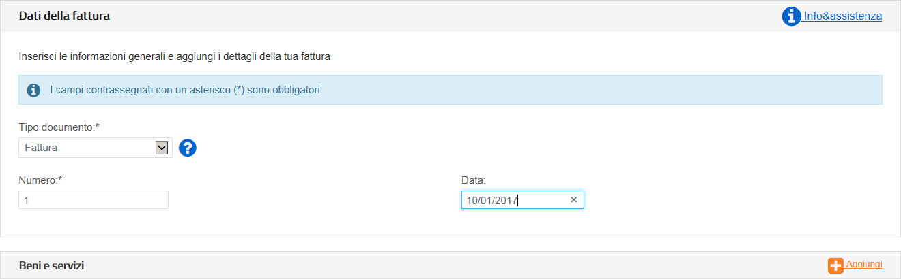

**CARTA DEL DOCENTE**

**Linee guida per la fatturazione**

7 novembre 2017

Introduzione
============

Per ottenere il pagamento dei buoni validati, l’esercente deve provvedere a emettere corrispondenti fatture elettroniche nei confronti della pubblica amministrazione usando **la piattaforma di fatturazione elettronica della PA**, seguendo le istruzioni di seguito indicate.
---------------------------------------------------------------------------------------------------------------------------------------------------------------------------------------------------------------------------------------------------------------------------------

**Nota Bene**

-  **Le fatture così emesse non hanno rilevanza ai fini fiscali – essendo l’evento fiscale già regolato mediante il biglietto o la ricevuta fiscale emessa dall’esercente all’atto dell’accettazione del buono – ma servono unicamente a consentire il riscontro dei buoni validati prima di procedere al loro pagamento.**

-  A tal proposito si comunica che **non è necessario l’assolvimento dell’imposta di bollo.**

-  **Al fine di limitare la possibilità di errore in fase di caricamento ed invio della fattura si consiglia di utilizzare il portale web per la fatturazione elettronica disponibile gratuitamente all’indirizzo:**

http://ivaservizi.agenziaentrate.gov.it/

Per accedere a questa funzionalità è necessario autenticarsi utilizzando **credenziali Entratel/Fisconline** oppure una **Carta Nazionale Servizi (CNS)** precedentemente abilitata ai servizi telematici dell’Agenzia delle Entrate o **SPID**.

-  **Le presenti linee guida sono state redatte utilizzando la citata piattaforma web. Altri software disponibili per la compilazione delle fatture elettroniche potrebbero riportare campi e funzioni diverse; in ogni caso i campi essenziali per la compilazione della fattura intestata all’iniziativa sono quelli descritti in questo documento.**

**Formato e contenuto della fattura**

L’esercente deve predisporre la fattura in formato elettronico seguendo le regole tecniche stabilite per la fatturazione elettronica verso la pubblica amministrazione reperibili all’indirizzo `www.fatturapa.gov.it <http://www.fatturapa.gov.it/>`__

Dopo aver compilato la fattura è necessario firmare il file digitalmente prima di inviarlo al Sistema d’Interscambio secondo una delle modalità previste illustrate al citato indirizzo internet.

**Istruzioni per la compilazione di una fattura**

Si illustrano di seguito i passi necessari per compilare la fattura utilizzando il portale web http://ivaservizi.agenziaentrate.gov.it/

**Passo 1**

I MIEI DATI
~~~~~~~~~~~

I. **Valorizzare i campi relativi all’esercente come descritto di seguito**

   -  Partita Iva: es. 10000000

   -  Codice Fiscale: es. 100000000

   -  Denominazione: es. Libreria Mario Rossi

   -  Regime Fiscale: selezionare dal menù a tendina (Vedi tabella dei regimi fiscali riportata in appendice)

   -  Indirizzo: es. Via Esempio

   -  N civico: es. 1

   -  CAP: es. 00100

   -  Comune: es. Roma

   -  Provincia: es. RM

   -  Nazione: es. IT

|image0|

Nel campo “Altri dati” cliccare su Aggiungi
~~~~~~~~~~~~~~~~~~~~~~~~~~~~~~~~~~~~~~~~~~~

|image1|

III. **Spuntare “Contatti” quindi cliccare su Seleziona**

|image2|

I. **Inserire i recapiti ai quali si potrà essere eventualmente ricontattati in caso di problemi di fatturazione**

   -  Numero di telefono: es. 12345678

   -  E-mail: es. esempio@esempio.it

|image3|

Passo 2
=======

**CLIENTE** (Inserire i dati della pubblica amministrazione nei confronti della quale si emette la fattura)

I. **Valorizzare i campi come descritto di seguito (dati reali)**

   -  Codice Fiscale: 80185250588

   -  Denominazione: Ministero dell’Istruzione dell’Università e della Ricerca

   -  Indirizzo: Viale Trastevere

   -  Numero Civico: 76a

o Cap: 00153

-  Comune: Roma

-  Provincia: RM

-  Nazione: IT

-  Codice Destinatario: QGGT71

|image4|

header added by pandoc
----------------------

Quindi cliccare su >Vai a Dati Fattura
~~~~~~~~~~~~~~~~~~~~~~~~~~~~~~~~~~~~~~

**Passo 3**

**DATI DELLA FATTURA** (Inserisci i dati della fattura)

I. **Valorizzare i campi come descritto di seguito**

   -  Tipo documento: Dal menù a tendina selezionare <Fattura>

   -  Numero: Numero che identifica univocamente la fattura

   -  Data: Inserire data

|image5|

II.  **Nel campo Beni e Servizi cliccare su Aggiungi**

III. **Valorizzare i campi come descritto di seguito**

     -  Descrizione: Pagamento Buono

     -  Quantità: 1

     -  Prezzo unitario: Inserire importo del singolo voucher es. 10,00

     -  Aliquota IVA: 0%

     -  |image6|\ Natura: Non soggette Quindi cliccare su >\ **Altri Dati**

IV.  **Valorizzare i campi come descritto di seguito**

     -  Codice Tipo: CARTADELDOCENTE

     -  Codice Valore: **Inserire esclusivamente il codice del buono (sensibile alla differenza tra caratteri maiuscoli e minuscoli) senza ulteriori valori (come riportato nella successiva immagine).**\ :sup:`1` **NB:**. Per prevenire il rischio di errore suggeriamo di inserire i codici dei buoni attraverso le funzionalità di copia/incolla direttamente dal portale.

Quindi cliccare su Salva
~~~~~~~~~~~~~~~~~~~~~~~~

|image7|

**È possibile inserire in fattura più di un buono cliccando di nuovo su <Aggiungi> nel Campo Beni e Servizi**

1 Campo obbligatorio al fine di ottenere il rimborso per la fattura. Attenzione: alcuni software potrebbero riportare campi nominati diversamente.

.. _nel-campo-altri-dati-cliccare-su-aggiungi-1:

Nel campo Altri dati cliccare su Aggiungi
~~~~~~~~~~~~~~~~~~~~~~~~~~~~~~~~~~~~~~~~~

|image8|

VI. **Spuntare “Dati di Pagamento” quindi cliccare su Seleziona**

|image9|

VII. **Inserire i dati relativi al pagamento come descritto di seguito:**

     -  Condizioni pagamento: Pagamento completo

     -  Beneficiario: Inserire il beneficiario es. Mario Rossi

     -  Modalità di pagamento: Bonifico

     -  Importo Pagamento: Inserire importo totale della fattura

     -  IBAN: Inserire IBAN es. IT0000000000000000\ :sup:`2`

|image10|

Quindi cliccare su >Verifica Dati
~~~~~~~~~~~~~~~~~~~~~~~~~~~~~~~~~

2 **Attenzione**: L’omissione di IBAN o la sua errata compilazione non è segnalata come errore dal sistema. Accertarsi di averlo compilato correttamente prima di inviare la fattura.

Passo 4
=======

.. _header-added-by-pandoc-1:

header added by pandoc
----------------------

VERIFICA DATI
~~~~~~~~~~~~~

**I. Nel campo Riepilogo Importi Aliquota inserire:**

o Rif. Normativo: `Art. 2 DPR 633/72 <http://www.normattiva.it/uri-res/N2Ls?urn:nir:presidente.repubblica:decreto:1972;633~art2>`__

|image11|

Quindi cliccare su >\ **Vai a Riepilogo**

Passo 5
=======

.. _header-added-by-pandoc-2:

header added by pandoc
----------------------

DATI DI RIEPILOGO
~~~~~~~~~~~~~~~~~

In questa sezione è possibile verificare le informazioni inserite e scaricare il file *XML* da firmare digitalmente e da trasmettere attraverso una delle modalità previste dal Sistema d’Interscambio.

Si raccomanda di verificare la correttezza formale della fattura prodotta prima di firmarla digitalmente e di inviarla al sistema d’interscambio.

A tal fine, cliccando su “\ **Controlla”** è possibile accertare che la fattura non contenga errori.

|image12|

Trattamento delle fatture elettroniche inviate
~~~~~~~~~~~~~~~~~~~~~~~~~~~~~~~~~~~~~~~~~~~~~~

Consap provvede al riscontro delle fatture ricevute, alla loro verifica rispetto ai buoni validati e alla loro liquidazione.

A seguito della verifica effettuata da Consap, l’esercente riceve dalla Piattaforma di Interscambio appositi messaggi di notifica dell’esito della verifica delle fatture inviate: se l’esito è negativo, la relativa notifica contiene anche le motivazioni del rigetto; in caso positivo, le fatture sono mandate al pagamento con bonifico sull’IBAN indicato dal beneficiario. La liquidazione avviene entro 30 giorni dalla presa in carico della fattura. A pagamento effettuato verrà inviata una mail automatica di notifica di avvenuto accredito. Per consentire tale utilità si ricorda di inserire l’indirizzo e-mail nella sezione “Contatti” all’interno della fattura elettronica.

L’esercente ha inoltre la possibilità di verificare, sull’applicazione Carta del Docente, i buoni liquidati.

Attraverso l’applicazione web raggiungibile dal sito `https://cartadocente.consap.it <https://cartadocente.consap.it/>`__ sarà possibile consultare lo stato di avanzamento delle fatture inviate così distinto:

-  Accettate: fatture correttamente importate nel sistema, già liquidate o prossime alla liquidazione.

-  In elaborazione: fatture in fase di controllo.

-  Rifiutate: fatture scartate a causa di uno o più errori bloccanti. In questo caso sarà possibile consultare l’elenco degli errori riscontrati. Tali fatture dovranno essere corrette e riemesse.

Assistenza
~~~~~~~~~~

Per le problematiche amministrative connesse alla fatturazione, è disponibile un servizio di assistenza via mail all’indirizzo cartadeldocente.assistenza@consap.it

Per problematiche connesse all’utilizzo dei voucher, alla validazione, o ad aspetti di natura tecnica, contattare il numero verde 080-926 7603 raggiungibile da lunedì a venerdì dalle 14 alle 18

Appendice 1 - Codici dei Regimi fiscali
~~~~~~~~~~~~~~~~~~~~~~~~~~~~~~~~~~~~~~~

+------------+----------------------------------------------------------------------------------------------------------------------------------------------------------------------------------------------------------------------------------------------------------------------------------------------------------------+
| **Codice** | **Descrizione**                                                                                                                                                                                                                                                                                                |
+============+================================================================================================================================================================================================================================================================================================================+
| **RF01**   | Ordinario                                                                                                                                                                                                                                                                                                      |
+------------+----------------------------------------------------------------------------------------------------------------------------------------------------------------------------------------------------------------------------------------------------------------------------------------------------------------+
| **RF02**   | Contribuenti minimi (art.1, c.96-117, `L. 244/07 <http://www.normattiva.it/uri-res/N2Ls?urn:nir:stato:legge:2007;244>`__)                                                                                                                                                                                      |
+------------+----------------------------------------------------------------------------------------------------------------------------------------------------------------------------------------------------------------------------------------------------------------------------------------------------------------+
| **RF03**   | Nuove iniziative produttive (`art.13, L. 388/00 <http://www.normattiva.it/uri-res/N2Ls?urn:nir:stato:legge:2000;388~art13>`__)                                                                                                                                                                                 |
+------------+----------------------------------------------------------------------------------------------------------------------------------------------------------------------------------------------------------------------------------------------------------------------------------------------------------------+
| **RF04**   | Agricoltura e attività connesse e pesca (artt.34 e 34-bis, `DPR 633/72 <http://www.normattiva.it/uri-res/N2Ls?urn:nir:presidente.repubblica:decreto:1972;633>`__)                                                                                                                                              |
+------------+----------------------------------------------------------------------------------------------------------------------------------------------------------------------------------------------------------------------------------------------------------------------------------------------------------------+
| **RF05**   | Vendita sali e tabacchi (`art.74, c.1, DPR. 633/72 <http://www.normattiva.it/uri-res/N2Ls?urn:nir:presidente.repubblica:decreto:1972;633~art74-com1>`__)                                                                                                                                                       |
+------------+----------------------------------------------------------------------------------------------------------------------------------------------------------------------------------------------------------------------------------------------------------------------------------------------------------------+
| **RF06**   | Commercio fiammiferi (`art.74, c.1, DPR 633/72 <http://www.normattiva.it/uri-res/N2Ls?urn:nir:presidente.repubblica:decreto:1972;633~art74-com1>`__)                                                                                                                                                           |
+------------+----------------------------------------------------------------------------------------------------------------------------------------------------------------------------------------------------------------------------------------------------------------------------------------------------------------+
| **RF07**   | Editoria (`art.74, c.1, DPR 633/72 <http://www.normattiva.it/uri-res/N2Ls?urn:nir:presidente.repubblica:decreto:1972;633~art74-com1>`__)                                                                                                                                                                       |
+------------+----------------------------------------------------------------------------------------------------------------------------------------------------------------------------------------------------------------------------------------------------------------------------------------------------------------+
| **RF08**   | Gestione servizi telefonia pubblica (`art.74, c.1, DPR 633/72 <http://www.normattiva.it/uri-res/N2Ls?urn:nir:presidente.repubblica:decreto:1972;633~art74-com1>`__)                                                                                                                                            |
+------------+----------------------------------------------------------------------------------------------------------------------------------------------------------------------------------------------------------------------------------------------------------------------------------------------------------------+
| **RF09**   | Rivendita documenti di trasporto pubblico e di sosta (`art.74, c.1, DPR 633/72 <http://www.normattiva.it/uri-res/N2Ls?urn:nir:presidente.repubblica:decreto:1972;633~art74-com1>`__)                                                                                                                           |
+------------+----------------------------------------------------------------------------------------------------------------------------------------------------------------------------------------------------------------------------------------------------------------------------------------------------------------+
| **RF10**   | Intrattenimenti, giochi e altre attività di cui alla tariffa allegata al `DPR 640/72 <http://www.normattiva.it/uri-res/N2Ls?urn:nir:presidente.repubblica:decreto:1972;640>`__ (`art.74, c.6, DPR 633/72 <http://www.normattiva.it/uri-res/N2Ls?urn:nir:presidente.repubblica:decreto:1972;633~art74-com6>`__) |
+------------+----------------------------------------------------------------------------------------------------------------------------------------------------------------------------------------------------------------------------------------------------------------------------------------------------------------+
| **RF11**   | Agenzie viaggi e turismo (`art.74-ter, DPR 633/72 <http://www.normattiva.it/uri-res/N2Ls?urn:nir:presidente.repubblica:decreto:1972;633~art74ter>`__)                                                                                                                                                          |
+------------+----------------------------------------------------------------------------------------------------------------------------------------------------------------------------------------------------------------------------------------------------------------------------------------------------------------+
| **RF12**   | Agriturismo (`art.5, c.2, L. 413/91 <http://www.normattiva.it/uri-res/N2Ls?urn:nir:stato:legge:1991;413~art5-com2>`__)                                                                                                                                                                                         |
+------------+----------------------------------------------------------------------------------------------------------------------------------------------------------------------------------------------------------------------------------------------------------------------------------------------------------------+
| **RF13**   | Vendite a domicilio (`art.25-bis, c.6, DPR 600/73 <http://www.normattiva.it/uri-res/N2Ls?urn:nir:presidente.repubblica:decreto:1973;600~art25bis-com6>`__)                                                                                                                                                     |
+------------+----------------------------------------------------------------------------------------------------------------------------------------------------------------------------------------------------------------------------------------------------------------------------------------------------------------+
| **RF14**   | Rivendita beni usati, oggetti d’arte, d’antiquariato o da collezione (art.36, DL 41/95)                                                                                                                                                                                                                        |
+------------+----------------------------------------------------------------------------------------------------------------------------------------------------------------------------------------------------------------------------------------------------------------------------------------------------------------+
| **RF15**   | Agenzie di vendite all’asta di oggetti d’arte, antiquariato o da collezione (art.40-bis, DL 41/95)                                                                                                                                                                                                             |
+------------+----------------------------------------------------------------------------------------------------------------------------------------------------------------------------------------------------------------------------------------------------------------------------------------------------------------+
| **RF16**   | IVA per cassa P.A. (`art.6, c.5, DPR 633/72 <http://www.normattiva.it/uri-res/N2Ls?urn:nir:presidente.repubblica:decreto:1972;633~art6-com5>`__)                                                                                                                                                               |
+------------+----------------------------------------------------------------------------------------------------------------------------------------------------------------------------------------------------------------------------------------------------------------------------------------------------------------+
| **RF17**   | IVA per cassa (art. 32-bis, DL 83/2012)                                                                                                                                                                                                                                                                        |
+------------+----------------------------------------------------------------------------------------------------------------------------------------------------------------------------------------------------------------------------------------------------------------------------------------------------------------+
| **RF18**   | Altro                                                                                                                                                                                                                                                                                                          |
+------------+----------------------------------------------------------------------------------------------------------------------------------------------------------------------------------------------------------------------------------------------------------------------------------------------------------------+
| **RF19**   | Regime forfettario (art.1, c.54-89, `L. 190/2014 <http://www.normattiva.it/uri-res/N2Ls?urn:nir:stato:legge:2014;190>`__)                                                                                                                                                                                      |
+------------+----------------------------------------------------------------------------------------------------------------------------------------------------------------------------------------------------------------------------------------------------------------------------------------------------------------+

**Appendice 2 - Esempio di fattura elettronica (formato .xml) compilata per l’iniziativa CARTADELDOCENTE**

Si riporta nel seguito un esempio di fattura elettronica in formato XML conforme allo standard di fatturazione elettronica e alle linee guida specifiche fornite per l’iniziativa CartaDelDocente.

<ns2:FatturaElettronica versione='FPA12' `xmlns:ns2='http://ivaservizi.agenziaentrate.gov.it/docs/xsd/fatture/v1.2'> <http://ivaservizi.agenziaentrate.gov.it/docs/xsd/fatture/v1.2%27>`__

<FatturaElettronicaHeader>

<DatiTrasmissione>

<IdTrasmittente>

<IdPaese>IT</IdPaese>

<IdCodice>ABCDEF00A11B123C</IdCodice>

</IdTrasmittente>

<ProgressivoInvio>0</ProgressivoInvio>

<FormatoTrasmissione>FPA12</FormatoTrasmissione>

<CodiceDestinatario>CY0MHE</CodiceDestinatario>

</DatiTrasmissione>

<CedentePrestatore>

<DatiAnagrafici>

<IdFiscaleIVA>

<IdPaese>IT</IdPaese>

<IdCodice>100000000</IdCodice>

</IdFiscaleIVA>

<CodiceFiscale>1000000000</CodiceFiscale>

<Anagrafica>

<Denominazione>Libreria Mario RossiDenominazione>

</Anagrafica>

<RegimeFiscale>RF01</RegimeFiscale>

</DatiAnagrafici>

<Sede>

<Indirizzo>Via Esempio</Indirizzo>

<NumeroCivico>1</NumeroCivico>

<CAP>00100</CAP>

<Comune>Roma</Comune>

<Provincia>RM</Provincia>

<Nazione>IT</Nazione>

</Sede>

<Contatti>

<Telefono>123456789</Telefono>

<Email>esempio@esempio.it</Email> <mailto:esempio@esempio.it>_\_

</Contatti>

</CedentePrestatore>

<CessionarioCommittente>

<Sede>

<Nazione>IT</Nazione>

<Indirizzo>Via del Collegio Romano</Indirizzo>

<NumeroCivico>27</NumeroCivico>

<CAP>00186</CAP>

<Comune>Roma</Comune>

<Provincia>RM</Provincia>

</Sede>

<DatiAnagrafici>

<CodiceFiscale>97904380587</CodiceFiscale>

<Anagrafica>

<Denominazione>Ministero dei Beni e delle Attività Culturali e del Turismo</Denominazione>

</Anagrafica>

</DatiAnagrafici>

</CessionarioCommittente>

</FatturaElettronicaHeader>

<FatturaElettronicaBody>

<DatiBeniServizi>

<DettaglioLinee>

<CodiceArticolo>

<CodiceValore>hul09Tk</CodiceValore>

<CodiceTipo>CARTADELDOCENTE</CodiceTipo>

</CodiceArticolo>

<PrezzoTotale>10.00</PrezzoTotale>

<Descrizione>Pagamento Buono</Descrizione>

<Quantita>1.00</Quantita>

<PrezzoUnitario>10.00</PrezzoUnitario>

<AliquotaIVA>0.00</AliquotaIVA>

<Natura>N2</Natura>

<NumeroLinea>1</NumeroLinea>

</DettaglioLinee>

<DatiRiepilogo>

<AliquotaIVA>0.00</AliquotaIVA>

<ImponibileImporto>10.00</ImponibileImporto>

<Natura>N2</Natura>

<Imposta>0.00</Imposta>

<RiferimentoNormativo>`Art. 2 DPR 633/72 <http://www.normattiva.it/uri-res/N2Ls?urn:nir:presidente.repubblica:decreto:1972;633~art2>`__\ </RiferimentoNormativo>

</DatiRiepilogo>

</DatiBeniServizi>

<DatiGenerali>

<DatiGeneraliDocumento>

<TipoDocumento>TD01</TipoDocumento>

<Numero>1</Numero>

<Data>2017-01-10</Data>

<ImportoTotaleDocumento>10.00</ImportoTotaleDocumento>

<Divisa>EUR</Divisa>

</DatiGeneraliDocumento>

</DatiGenerali>

<DatiPagamento>

<DettaglioPagamento>

<Beneficiario>Mario Rossi</Beneficiario>

<ModalitaPagamento>MP05</ModalitaPagamento>

<ImportoPagamento>10.00</ImportoPagamento>

<IBAN>IT0000000000000000</IBAN>

</DettaglioPagamento>

<CondizioniPagamento>TP02</CondizioniPagamento>

</DatiPagamento>

</FatturaElettronicaBody>

</ns2:FatturaElettronica>

Appendice 3: regole tecniche di dettaglio per la compilazione della fattura
~~~~~~~~~~~~~~~~~~~~~~~~~~~~~~~~~~~~~~~~~~~~~~~~~~~~~~~~~~~~~~~~~~~~~~~~~~~

La valorizzazione degli elementi del tracciato xml deve rispettare i requisiti formali e di obbligatorietà previsti dalle regole di fatturazione elettronica e deve tener conto delle ulteriori indicazioni riportate nella tabella seguente:

+----------------------------------+--------------------------------+---------------------------------------------------------------------------------------------------------------------------------------------------------------------------------------------------------------------------------------------------------------------------------------------------------------------------------------------------------------------------------------+--------------------------------------+----------+
|                                  |                                | **ID e Nome Tag XML**                                                                                                                                                                                                                                                                                                                                                                 | **Descrizione funzionale**           | **NOTE** |
+==================================+================================+=======================================================================================================================================================================================================================================================================================================================================================================================+======================================+==========+
| **1 <FatturaElettronicaHeader>** |                                |                                                                                                                                                                                                                                                                                                                                                                                       |                                      |          |
+----------------------------------+--------------------------------+---------------------------------------------------------------------------------------------------------------------------------------------------------------------------------------------------------------------------------------------------------------------------------------------------------------------------------------------------------------------------------------+--------------------------------------+----------+
|                                  | **1.1 <DatiTrasmissione>**     | blocco sempre obbligatorio contenente informazioni che identificano univocamente il soggetto che trasmette, il documento trasmesso, il                                                                                                                                                                                                                                                |                                      |          |
|                                  |                                |                                                                                                                                                                                                                                                                                                                                                                                       |                                      |          |
|                                  |                                | formato in cui è stato trasmesso il documento, il soggetto destinatario                                                                                                                                                                                                                                                                                                               |                                      |          |
+----------------------------------+--------------------------------+---------------------------------------------------------------------------------------------------------------------------------------------------------------------------------------------------------------------------------------------------------------------------------------------------------------------------------------------------------------------------------------+--------------------------------------+----------+
|                                  | **1.1.1 <IdTrasmittente>**     | è l’identificativo univoco del soggetto trasmittente; per i soggetti residenti in Italia, siano essi persone fisiche o giuridiche, corrisponde al codice fiscale preceduto da **IT**; per i soggetti non residenti corrisponde al numero identificativo IVA (dove i primi due caratteri rappresentano il paese secondo lo standard ISO 3166-1 alpha-2 code, ed i restanti, fino ad un |                                      |          |
|                                  |                                |                                                                                                                                                                                                                                                                                                                                                                                       |                                      |          |
|                                  |                                | massimo di 28, il codice vero e proprio)                                                                                                                                                                                                                                                                                                                                              |                                      |          |
+----------------------------------+--------------------------------+---------------------------------------------------------------------------------------------------------------------------------------------------------------------------------------------------------------------------------------------------------------------------------------------------------------------------------------------------------------------------------------+--------------------------------------+----------+
|                                  | **1.1.1.1 <IdPaese>**          | codice della nazione espresso secondo lo standard ISO 3166-1 alpha-2 code                                                                                                                                                                                                                                                                                                             | [**IT**], [**ES**], [**DK**],[**…**] |          |
+----------------------------------+--------------------------------+---------------------------------------------------------------------------------------------------------------------------------------------------------------------------------------------------------------------------------------------------------------------------------------------------------------------------------------------------------------------------------------+--------------------------------------+----------+
|                                  | **1.1.1.2 <IdCodice>**         | codice identificativo fiscale                                                                                                                                                                                                                                                                                                                                                         | formato alfanumerico                 |          |
+----------------------------------+--------------------------------+---------------------------------------------------------------------------------------------------------------------------------------------------------------------------------------------------------------------------------------------------------------------------------------------------------------------------------------------------------------------------------------+--------------------------------------+----------+
|                                  | **1.1.2 <ProgressivoInvio>**   | progressivo univoco, attribuito dal soggetto che trasmette, relativo ad ogni singolo documento fattura                                                                                                                                                                                                                                                                                | formato alfanumerico                 |          |
+----------------------------------+--------------------------------+---------------------------------------------------------------------------------------------------------------------------------------------------------------------------------------------------------------------------------------------------------------------------------------------------------------------------------------------------------------------------------------+--------------------------------------+----------+
|                                  | **1.1.3**                      | contiene il codice identificativo del formato/versione con cui è stato trasmesso il documento fattura                                                                                                                                                                                                                                                                                 | valori ammessi: [**FPA12**]          |          |
|                                  |                                |                                                                                                                                                                                                                                                                                                                                                                                       |                                      |          |
|                                  | **<FormatoTrasmissione>**      |                                                                                                                                                                                                                                                                                                                                                                                       |                                      |          |
+----------------------------------+--------------------------------+---------------------------------------------------------------------------------------------------------------------------------------------------------------------------------------------------------------------------------------------------------------------------------------------------------------------------------------------------------------------------------------+--------------------------------------+----------+
|                                  | **1.1.4 <CodiceDestinatario>** | codice dell'ufficio dell’amministrazione dello stato destinatario della                                                                                                                                                                                                                                                                                                               | codice IPA da indicare: **QGGT71**   |          |
|                                  |                                |                                                                                                                                                                                                                                                                                                                                                                                       |                                      |          |
|                                  |                                | fattura, definito dall'amministrazione di appartenenza come riportato nella rubrica “Indice PA”.                                                                                                                                                                                                                                                                                      |                                      |          |
+----------------------------------+--------------------------------+---------------------------------------------------------------------------------------------------------------------------------------------------------------------------------------------------------------------------------------------------------------------------------------------------------------------------------------------------------------------------------------+--------------------------------------+----------+
|                                  | **1.2 <CedentePrestatore>**    | blocco sempre obbligatorio contenente dati relativi al cedente / prestatore                                                                                                                                                                                                                                                                                                           |                                      |          |
+----------------------------------+--------------------------------+---------------------------------------------------------------------------------------------------------------------------------------------------------------------------------------------------------------------------------------------------------------------------------------------------------------------------------------------------------------------------------------+--------------------------------------+----------+
|                                  | **1.2.1<DatiAnagrafici>**      | blocco sempre obbligatorio contenente i dati anagrafici, professionali e fiscali del cedente / prestatore                                                                                                                                                                                                                                                                             |                                      |          |
+----------------------------------+--------------------------------+---------------------------------------------------------------------------------------------------------------------------------------------------------------------------------------------------------------------------------------------------------------------------------------------------------------------------------------------------------------------------------------+--------------------------------------+----------+
|                                  | **1.2.1.1 <IdFiscaleIVA>**     | numero di identificazione fiscale ai fini IVA; i primi due caratteri rappresentano il paese ( **IT**, **DE**, **ES** …..) ed i restanti (fino ad un massimo di 28) il codice vero e proprio che, per i residenti in Italia, corrisponde al                                                                                                                                            |                                      |          |
|                                  |                                |                                                                                                                                                                                                                                                                                                                                                                                       |                                      |          |
|                                  |                                | numero di partita IVA.                                                                                                                                                                                                                                                                                                                                                                |                                      |          |
+----------------------------------+--------------------------------+---------------------------------------------------------------------------------------------------------------------------------------------------------------------------------------------------------------------------------------------------------------------------------------------------------------------------------------------------------------------------------------+--------------------------------------+----------+
|                                  | **1.2.1.1.1 <IdPaese>**        | codice della nazione espresso secondo lo standard ISO 3166-1 alpha-2 code                                                                                                                                                                                                                                                                                                             | [**IT**], [**ES**], [**DK**],[**…**] |          |
+----------------------------------+--------------------------------+---------------------------------------------------------------------------------------------------------------------------------------------------------------------------------------------------------------------------------------------------------------------------------------------------------------------------------------------------------------------------------------+--------------------------------------+----------+
|                                  | **1.2.1.1.2 <IdCodice>**       | codice identificativo fiscale                                                                                                                                                                                                                                                                                                                                                         | formato alfanumerico                 |          |
+----------------------------------+--------------------------------+---------------------------------------------------------------------------------------------------------------------------------------------------------------------------------------------------------------------------------------------------------------------------------------------------------------------------------------------------------------------------------------+--------------------------------------+----------+
|                                  | **1.2.1.2 <CodiceFiscale>**    | numero di Codice Fiscale                                                                                                                                                                                                                                                                                                                                                              | formato alfanumerico                 |          |
+----------------------------------+--------------------------------+---------------------------------------------------------------------------------------------------------------------------------------------------------------------------------------------------------------------------------------------------------------------------------------------------------------------------------------------------------------------------------------+--------------------------------------+----------+
|                                  | **1.2.1.3 <Anagrafica>**       | dati anagrafici identificativi del cedente / prestatore                                                                                                                                                                                                                                                                                                                               |                                      |          |
+----------------------------------+--------------------------------+---------------------------------------------------------------------------------------------------------------------------------------------------------------------------------------------------------------------------------------------------------------------------------------------------------------------------------------------------------------------------------------+--------------------------------------+----------+
|                                  | **1.2.1.3.1**                  | ditta, denominazione o ragione sociale (ditta, impresa, società, ente), da valorizzare in alternativa ai campi **1.2.1.3.2** e **1.2.1.3.3**                                                                                                                                                                                                                                          | formato alfanumerico                 |          |
|                                  |                                |                                                                                                                                                                                                                                                                                                                                                                                       |                                      |          |
|                                  | **<Denominazione>**            |                                                                                                                                                                                                                                                                                                                                                                                       |                                      |          |
+----------------------------------+--------------------------------+---------------------------------------------------------------------------------------------------------------------------------------------------------------------------------------------------------------------------------------------------------------------------------------------------------------------------------------------------------------------------------------+--------------------------------------+----------+
|                                  | **1.2.1.3.2 <Nome>**           | nome della persona fisica. Da valorizzare insieme al campo **1.2.1.3.3** ed in alternativa al campo **1.2.1.3.1**                                                                                                                                                                                                                                                                     | formato alfanumerico                 |          |
+----------------------------------+--------------------------------+---------------------------------------------------------------------------------------------------------------------------------------------------------------------------------------------------------------------------------------------------------------------------------------------------------------------------------------------------------------------------------------+--------------------------------------+----------+
|                                  | **1.2.1.3.3**                  | cognome della persona fisica. Da valorizzare insieme al campo **1.2.1.3.2**                                                                                                                                                                                                                                                                                                           | formato alfanumerico                 |          |
|                                  |                                |                                                                                                                                                                                                                                                                                                                                                                                       |                                      |          |
|                                  | **<Cognome>**                  | ed in alternativa al campo **1.2.1.3.1**                                                                                                                                                                                                                                                                                                                                              |                                      |          |
+----------------------------------+--------------------------------+---------------------------------------------------------------------------------------------------------------------------------------------------------------------------------------------------------------------------------------------------------------------------------------------------------------------------------------------------------------------------------------+--------------------------------------+----------+
|                                  | **1.2.1.3.5 <CodEORI>**        | numero del Codice EORI (Economic Operator Registration and                                                                                                                                                                                                                                                                                                                            | formato alfanumerico                 |          |
|                                  |                                |                                                                                                                                                                                                                                                                                                                                                                                       |                                      |          |
|                                  |                                | Identification) in base al `Regolamento (CE) n. 312 del 16 aprile 2009 <http://www.normattiva.it/uri-res/N2Ls?urn:nir:comunita.europee:regolamento:2009-04-16;312>`__. In vigore dal 1 luglio 2009                                                                                                                                                                                    |                                      |          |
+----------------------------------+--------------------------------+---------------------------------------------------------------------------------------------------------------------------------------------------------------------------------------------------------------------------------------------------------------------------------------------------------------------------------------------------------------------------------------+--------------------------------------+----------+

+--+-----------------------------------+---------------------------------------------------------------------------------------------------------------------------------------------------------------------------------------------------------------------------------------------+--------------------------------------------------------------------------------------------------------------------+----------+
|  |                                   | **ID e Nome Tag XML**                                                                                                                                                                                                                       | **Descrizione funzionale**                                                                                         | **NOTE** |
+==+===================================+=============================================================================================================================================================================================================================================+====================================================================================================================+==========+
|  | **1.2.1.8 <RegimeFiscale>**       | regime fiscale                                                                                                                                                                                                                              | valori ammessi:                                                                                                    |          |
|  |                                   |                                                                                                                                                                                                                                             |                                                                                                                    |          |
|  |                                   |                                                                                                                                                                                                                                             | **vedi tabella dei Codici dei regimi fiscali riportata in Appendice 1**                                            |          |
+--+-----------------------------------+---------------------------------------------------------------------------------------------------------------------------------------------------------------------------------------------------------------------------------------------+--------------------------------------------------------------------------------------------------------------------+----------+
|  | **1.2.2 <Sede>**                  | blocco sempre obbligatorio contenente i dati della sede del cedente / prestatore                                                                                                                                                            |                                                                                                                    |          |
+--+-----------------------------------+---------------------------------------------------------------------------------------------------------------------------------------------------------------------------------------------------------------------------------------------+--------------------------------------------------------------------------------------------------------------------+----------+
|  | **1.2.2.1 <Indirizzo>**           | indirizzo della sede del cedente o prestatore (nome della via, piazza etc.)                                                                                                                                                                 | formato alfanumerico                                                                                               |          |
+--+-----------------------------------+---------------------------------------------------------------------------------------------------------------------------------------------------------------------------------------------------------------------------------------------+--------------------------------------------------------------------------------------------------------------------+----------+
|  | **1.2.2.2 <NumeroCivico>**        | numero civico riferito all'indirizzo (non indicare se già presente nel campo indirizzo)                                                                                                                                                     | formato alfanumerico                                                                                               |          |
+--+-----------------------------------+---------------------------------------------------------------------------------------------------------------------------------------------------------------------------------------------------------------------------------------------+--------------------------------------------------------------------------------------------------------------------+----------+
|  | **1.2.2.3 <CAP>**                 | Codice Avviamento Postale                                                                                                                                                                                                                   | formato numerico                                                                                                   |          |
+--+-----------------------------------+---------------------------------------------------------------------------------------------------------------------------------------------------------------------------------------------------------------------------------------------+--------------------------------------------------------------------------------------------------------------------+----------+
|  | **1.2.2.4 <Comune>**              | comune relativo alla sede del cedente / prestatore                                                                                                                                                                                          | formato alfanumerico                                                                                               |          |
+--+-----------------------------------+---------------------------------------------------------------------------------------------------------------------------------------------------------------------------------------------------------------------------------------------+--------------------------------------------------------------------------------------------------------------------+----------+
|  | **1.2.2.5 <Provincia>**           | sigla della provincia di appartenenza del comune indicato nel campo                                                                                                                                                                         | [**RM**], [**MI**], [**…**]                                                                                        |          |
|  |                                   |                                                                                                                                                                                                                                             |                                                                                                                    |          |
|  |                                   | **1.2.2.4**                                                                                                                                                                                                                                 |                                                                                                                    |          |
+--+-----------------------------------+---------------------------------------------------------------------------------------------------------------------------------------------------------------------------------------------------------------------------------------------+--------------------------------------------------------------------------------------------------------------------+----------+
|  | **1.2.2.6 <Nazione>**             | codice della nazione espresso secondo lo standard ISO 3166-1 alpha-2 code                                                                                                                                                                   | [**IT**], [**ES**], [**DK**],[**…**]                                                                               |          |
+--+-----------------------------------+---------------------------------------------------------------------------------------------------------------------------------------------------------------------------------------------------------------------------------------------+--------------------------------------------------------------------------------------------------------------------+----------+
|  | **1.2.5 <Contatti>**              | dati relativi ai contatti del cedente / prestatore                                                                                                                                                                                          |                                                                                                                    |          |
+--+-----------------------------------+---------------------------------------------------------------------------------------------------------------------------------------------------------------------------------------------------------------------------------------------+--------------------------------------------------------------------------------------------------------------------+----------+
|  | **1.2.5.1 <Telefono>**            | contatto telefonico fisso o mobile                                                                                                                                                                                                          | Necessariamente da valorizzare per                                                                                 |          |
|  |                                   |                                                                                                                                                                                                                                             |                                                                                                                    |          |
|  |                                   |                                                                                                                                                                                                                                             | essere eventualmente contattati per chiarimenti                                                                    |          |
+--+-----------------------------------+---------------------------------------------------------------------------------------------------------------------------------------------------------------------------------------------------------------------------------------------+--------------------------------------------------------------------------------------------------------------------+----------+
|  | **1.2.5.3 <Email>**               | indirizzo di posta elettronica                                                                                                                                                                                                              | Necessariamente da valorizzare per essere eventualmente contattati per                                             |          |
|  |                                   |                                                                                                                                                                                                                                             |                                                                                                                    |          |
|  |                                   |                                                                                                                                                                                                                                             | chiarimenti                                                                                                        |          |
+--+-----------------------------------+---------------------------------------------------------------------------------------------------------------------------------------------------------------------------------------------------------------------------------------------+--------------------------------------------------------------------------------------------------------------------+----------+
|  | **1.2.6**                         | codice identificativo del cedente / prestatore ai fini amministrativo-contabili                                                                                                                                                             | Necessariamente da valorizzare riportando fedelmente il Codice esercente assegnato all’esercente dall’applicazione |          |
|  |                                   |                                                                                                                                                                                                                                             |                                                                                                                    |          |
|  | **<RiferimentoAmministrazion e>** |                                                                                                                                                                                                                                             | CARTADELDOCENTE3                                                                                                   |          |
+--+-----------------------------------+---------------------------------------------------------------------------------------------------------------------------------------------------------------------------------------------------------------------------------------------+--------------------------------------------------------------------------------------------------------------------+----------+
|  | **1.4**                           | blocco sempre obbligatorio contenente dati relativi al cessionario / committente                                                                                                                                                            | **Dati relativi al Ministero**                                                                                     |          |
|  |                                   |                                                                                                                                                                                                                                             |                                                                                                                    |          |
|  | **<CessionarioCommittente>**      |                                                                                                                                                                                                                                             | **dell’Istruzione, dell’Università e della Ricerca**                                                               |          |
+--+-----------------------------------+---------------------------------------------------------------------------------------------------------------------------------------------------------------------------------------------------------------------------------------------+--------------------------------------------------------------------------------------------------------------------+----------+
|  | **1.4.1 <DatiAnagrafici>**        | blocco contenente i dati fiscali e anagrafici del cessionario/committente                                                                                                                                                                   |                                                                                                                    |          |
+--+-----------------------------------+---------------------------------------------------------------------------------------------------------------------------------------------------------------------------------------------------------------------------------------------+--------------------------------------------------------------------------------------------------------------------+----------+
|  | **1.4.1.2 <CodiceFiscale>**       | numero di Codice Fiscale                                                                                                                                                                                                                    | valore da indicare: **80185250588**                                                                                |          |
+--+-----------------------------------+---------------------------------------------------------------------------------------------------------------------------------------------------------------------------------------------------------------------------------------------+--------------------------------------------------------------------------------------------------------------------+----------+
|  | **1.4.1.3 <Anagrafica>**          | dati anagrafici identificativi del cessionario/committente                                                                                                                                                                                  |                                                                                                                    |          |
+--+-----------------------------------+---------------------------------------------------------------------------------------------------------------------------------------------------------------------------------------------------------------------------------------------+--------------------------------------------------------------------------------------------------------------------+----------+
|  | **1.4.1.3.1**                     | ditta, denominazione o ragione sociale (ditta, impresa, società, ente), da valorizzare in alternativa ai campi **1.4.1.3.2** e **1.4.1.3.3**                                                                                                | Ministero dell’Istruzione, dell’Università e della Ricerca                                                         |          |
|  |                                   |                                                                                                                                                                                                                                             |                                                                                                                    |          |
|  | **<Denominazione>**               |                                                                                                                                                                                                                                             |                                                                                                                    |          |
+--+-----------------------------------+---------------------------------------------------------------------------------------------------------------------------------------------------------------------------------------------------------------------------------------------+--------------------------------------------------------------------------------------------------------------------+----------+
|  | **1.4.2 <Sede>**                  | blocco sempre obbligatorio contenente i dati della sede del cessionario / committente (nel caso di somministrazione di servizi quali energia elettrica, gas … , i dati possono fare riferimento all'ubicazione dell'utenza, ex DM 370/2000) |                                                                                                                    |          |
+--+-----------------------------------+---------------------------------------------------------------------------------------------------------------------------------------------------------------------------------------------------------------------------------------------+--------------------------------------------------------------------------------------------------------------------+----------+
|  | **1.4.2.1 <Indirizzo>**           | indirizzo della sede del cessionario / committente (nome della via, piazza etc.)                                                                                                                                                            | Viale Trastevere                                                                                                   |          |
+--+-----------------------------------+---------------------------------------------------------------------------------------------------------------------------------------------------------------------------------------------------------------------------------------------+--------------------------------------------------------------------------------------------------------------------+----------+
|  | **1.4.2.2 <NumeroCivico>**        | numero civico riferito all'indirizzo (non indicare se già presente nel campo indirizzo)                                                                                                                                                     | 17/a                                                                                                               |          |
+--+-----------------------------------+---------------------------------------------------------------------------------------------------------------------------------------------------------------------------------------------------------------------------------------------+--------------------------------------------------------------------------------------------------------------------+----------+
|  | **1.4.2.3 <CAP>**                 | Codice Avviamento Postale                                                                                                                                                                                                                   | 00153                                                                                                              |          |
+--+-----------------------------------+---------------------------------------------------------------------------------------------------------------------------------------------------------------------------------------------------------------------------------------------+--------------------------------------------------------------------------------------------------------------------+----------+

3 Riportare fedelmente tale codice, per il quale sono significativi e distinti i caratteri maiuscoli da quelli minuscoli (codice *case sensitive*)

+--------------------------------+-----------------------------------------------------------------------------------------------------------------------------------------------------+------------------------------------------------------------------------------------------------------------------------------------------------------------------------------------------------------------------------------------+--------------------------------------------------------------------------------------+----------+
|                                |                                                                                                                                                     | **ID e Nome Tag XML**                                                                                                                                                                                                              | **Descrizione funzionale**                                                           | **NOTE** |
+================================+=====================================================================================================================================================+====================================================================================================================================================================================================================================+======================================================================================+==========+
|                                | **1.4.2.4 <Comune>**                                                                                                                                | comune relativo alla stabile organizzazione in Italia                                                                                                                                                                              | ROMA                                                                                 |          |
+--------------------------------+-----------------------------------------------------------------------------------------------------------------------------------------------------+------------------------------------------------------------------------------------------------------------------------------------------------------------------------------------------------------------------------------------+--------------------------------------------------------------------------------------+----------+
|                                | **1.4.2.5 <Provincia>**                                                                                                                             | sigla della provincia di appartenenza del comune indicato nel campo                                                                                                                                                                | RM                                                                                   |          |
|                                |                                                                                                                                                     |                                                                                                                                                                                                                                    |                                                                                      |          |
|                                |                                                                                                                                                     | **1.4.2.4**                                                                                                                                                                                                                        |                                                                                      |          |
+--------------------------------+-----------------------------------------------------------------------------------------------------------------------------------------------------+------------------------------------------------------------------------------------------------------------------------------------------------------------------------------------------------------------------------------------+--------------------------------------------------------------------------------------+----------+
|                                | **1.4.2.6 <Nazione>**                                                                                                                               | codice della nazione espresso secondo lo standard ISO 3166-1 alpha-2 code                                                                                                                                                          | IT                                                                                   |          |
+--------------------------------+-----------------------------------------------------------------------------------------------------------------------------------------------------+------------------------------------------------------------------------------------------------------------------------------------------------------------------------------------------------------------------------------------+--------------------------------------------------------------------------------------+----------+
| **2 <FatturaElettronicaBody>** | il blocco ha molteplicità pari a 1 nel caso di fattura singola; nel caso di lotto di fatture, si ripete per ogni fattura componente il lotto stesso |                                                                                                                                                                                                                                    |                                                                                      |          |
+--------------------------------+-----------------------------------------------------------------------------------------------------------------------------------------------------+------------------------------------------------------------------------------------------------------------------------------------------------------------------------------------------------------------------------------------+--------------------------------------------------------------------------------------+----------+
|                                | **2.1 <DatiGenerali>**                                                                                                                              | blocco sempre obbligatorio contenente i dati generali del documento principale ed i dati dei documenti correlati                                                                                                                   |                                                                                      |          |
+--------------------------------+-----------------------------------------------------------------------------------------------------------------------------------------------------+------------------------------------------------------------------------------------------------------------------------------------------------------------------------------------------------------------------------------------+--------------------------------------------------------------------------------------+----------+
|                                | **2.1.1**                                                                                                                                           | blocco sempre obbligatorio contenente i dati generali del documento principale                                                                                                                                                     |                                                                                      |          |
|                                |                                                                                                                                                     |                                                                                                                                                                                                                                    |                                                                                      |          |
|                                | **<DatiGeneraliDocumento>**                                                                                                                         |                                                                                                                                                                                                                                    |                                                                                      |          |
+--------------------------------+-----------------------------------------------------------------------------------------------------------------------------------------------------+------------------------------------------------------------------------------------------------------------------------------------------------------------------------------------------------------------------------------------+--------------------------------------------------------------------------------------+----------+
|                                | **2.1.1.1**                                                                                                                                         | tipologia di documento                                                                                                                                                                                                             | valore ammesso: TD01                                                                 |          |
|                                |                                                                                                                                                     |                                                                                                                                                                                                                                    |                                                                                      |          |
|                                | **<TipoDocumento>**                                                                                                                                 |                                                                                                                                                                                                                                    |                                                                                      |          |
+--------------------------------+-----------------------------------------------------------------------------------------------------------------------------------------------------+------------------------------------------------------------------------------------------------------------------------------------------------------------------------------------------------------------------------------------+--------------------------------------------------------------------------------------+----------+
|                                | **2.1.1.2 <Divisa>**                                                                                                                                | codice (espresso secondo lo standard ISO 4217 alpha-3:2001) della valuta utilizzata per l'indicazione degli importi                                                                                                                | valore ammesso: EUR                                                                  |          |
+--------------------------------+-----------------------------------------------------------------------------------------------------------------------------------------------------+------------------------------------------------------------------------------------------------------------------------------------------------------------------------------------------------------------------------------------+--------------------------------------------------------------------------------------+----------+
|                                | **2.1.1.3 <Data>**                                                                                                                                  | data del documento (secondo il formato ISO 8601:2004)                                                                                                                                                                              | formato ISO 8601:2004, con la precisione seguente: **YYYY-MM-DD**                    |          |
+--------------------------------+-----------------------------------------------------------------------------------------------------------------------------------------------------+------------------------------------------------------------------------------------------------------------------------------------------------------------------------------------------------------------------------------------+--------------------------------------------------------------------------------------+----------+
|                                | **2.1.1.4 <Numero>**                                                                                                                                | numero progressivo del documento                                                                                                                                                                                                   | formato alfanumerico                                                                 |          |
+--------------------------------+-----------------------------------------------------------------------------------------------------------------------------------------------------+------------------------------------------------------------------------------------------------------------------------------------------------------------------------------------------------------------------------------------+--------------------------------------------------------------------------------------+----------+
|                                | **2.1.1.6 <DatiBollo>**                                                                                                                             | blocco dati relativi al bollo                                                                                                                                                                                                      |                                                                                      |          |
+--------------------------------+-----------------------------------------------------------------------------------------------------------------------------------------------------+------------------------------------------------------------------------------------------------------------------------------------------------------------------------------------------------------------------------------------+--------------------------------------------------------------------------------------+----------+
|                                | **2.1.1.6.1**                                                                                                                                       | bollo assolto ai sensi del decreto MEF 17 giugno 2014 (art. 6)                                                                                                                                                                     | valore ammesso                                                                       |          |
|                                |                                                                                                                                                     |                                                                                                                                                                                                                                    |                                                                                      |          |
|                                | **<BolloVirtuale>**                                                                                                                                 |                                                                                                                                                                                                                                    | **[NO]**                                                                             |          |
+--------------------------------+-----------------------------------------------------------------------------------------------------------------------------------------------------+------------------------------------------------------------------------------------------------------------------------------------------------------------------------------------------------------------------------------------+--------------------------------------------------------------------------------------+----------+
|                                | **2.1.1.9**                                                                                                                                         | importo totale del documento al netto dell'eventuale sconto e comprensivo di imposta a debito del cessionario / committente                                                                                                        | formato numerico; i decimali vanno separati dall'intero con il carattere '.' (punto) |          |
|                                |                                                                                                                                                     |                                                                                                                                                                                                                                    |                                                                                      |          |
|                                | **<ImportoTotaleDocument o>**                                                                                                                       |                                                                                                                                                                                                                                    | valore ammesso: valore del campo                                                     |          |
|                                |                                                                                                                                                     |                                                                                                                                                                                                                                    |                                                                                      |          |
|                                |                                                                                                                                                     |                                                                                                                                                                                                                                    | 2.2.2.5 ImponibileImporto                                                            |          |
+--------------------------------+-----------------------------------------------------------------------------------------------------------------------------------------------------+------------------------------------------------------------------------------------------------------------------------------------------------------------------------------------------------------------------------------------+--------------------------------------------------------------------------------------+----------+
|                                | **2.2 <DatiBeniServizi>**                                                                                                                           | blocco sempre obbligatorio contenente natura, qualità e quantità dei beni / servizi formanti oggetto dell'operazione                                                                                                               |                                                                                      |          |
+--------------------------------+-----------------------------------------------------------------------------------------------------------------------------------------------------+------------------------------------------------------------------------------------------------------------------------------------------------------------------------------------------------------------------------------------+--------------------------------------------------------------------------------------+----------+
|                                | **2.2.1 <DettaglioLinee>**                                                                                                                          | blocco sempre obbligatorio contenente le linee di dettaglio del documento (i campi del blocco si ripetono per ogni riga di dettaglio)                                                                                              |                                                                                      |          |
+--------------------------------+-----------------------------------------------------------------------------------------------------------------------------------------------------+------------------------------------------------------------------------------------------------------------------------------------------------------------------------------------------------------------------------------------+--------------------------------------------------------------------------------------+----------+
|                                | **2.2.1.1 <NumeroLinea>**                                                                                                                           | numero della riga di dettaglio del documento                                                                                                                                                                                       | formato numerico                                                                     |          |
+--------------------------------+-----------------------------------------------------------------------------------------------------------------------------------------------------+------------------------------------------------------------------------------------------------------------------------------------------------------------------------------------------------------------------------------------+--------------------------------------------------------------------------------------+----------+
|                                | **2.2.1.3 <CodiceArticolo>**                                                                                                                        | eventuale codifica dell'articolo (la molteplicità N del blocco consente di gestire la presenza di più codifiche)                                                                                                                   |                                                                                      |          |
+--------------------------------+-----------------------------------------------------------------------------------------------------------------------------------------------------+------------------------------------------------------------------------------------------------------------------------------------------------------------------------------------------------------------------------------------+--------------------------------------------------------------------------------------+----------+
|                                | **2.2.1.3.1**                                                                                                                                       | indica la tipologia di codice articolo (TARIC, CPV, EAN, SSC, ...)                                                                                                                                                                 | valore ammesso: CARTADELDOCENTE                                                      |          |
|                                |                                                                                                                                                     |                                                                                                                                                                                                                                    |                                                                                      |          |
|                                | **<CodiceTipo>**                                                                                                                                    |                                                                                                                                                                                                                                    |                                                                                      |          |
+--------------------------------+-----------------------------------------------------------------------------------------------------------------------------------------------------+------------------------------------------------------------------------------------------------------------------------------------------------------------------------------------------------------------------------------------+--------------------------------------------------------------------------------------+----------+
|                                | **2.2.1.3.2**                                                                                                                                       | indica il valore del codice articolo corrispondente alla tipologia riportata nel campo 2.2.1.3.1.                                                                                                                                  | Valore obbligatorio da indicare: codice identificativo buono4                        |          |
|                                |                                                                                                                                                     |                                                                                                                                                                                                                                    |                                                                                      |          |
|                                | **<CodiceValore>**                                                                                                                                  |                                                                                                                                                                                                                                    |                                                                                      |          |
+--------------------------------+-----------------------------------------------------------------------------------------------------------------------------------------------------+------------------------------------------------------------------------------------------------------------------------------------------------------------------------------------------------------------------------------------+--------------------------------------------------------------------------------------+----------+
|                                | **2.2.1.4 <Descrizione>**                                                                                                                           | natura e qualità dell'oggetto della cessione/prestazione; può fare anche riferimento ad un precedente documento emesso a titolo di 'anticipo/acconto' , nel qual caso il valore del campo **2.2.1.9** e **2.2.1.11** sarà negativo | valore ammesso: PAGAMENTO BUONO                                                      |          |
+--------------------------------+-----------------------------------------------------------------------------------------------------------------------------------------------------+------------------------------------------------------------------------------------------------------------------------------------------------------------------------------------------------------------------------------------+--------------------------------------------------------------------------------------+----------+

4 Riportare fedelmente tale codice, per il quale sono significativi e distinti i caratteri maiuscoli da quelli minuscoli (codice *case sensitive*)

+--+------------------------------+-----------------------------------------------------------------------------------------------------------------------------------------------------+------------------------------------------------------------------------------------------------------------------------------------------+----------+
|  |                              | **ID e Nome Tag XML**                                                                                                                               | **Descrizione funzionale**                                                                                                               | **NOTE** |
+==+==============================+=====================================================================================================================================================+==========================================================================================================================================+==========+
|  | **2.2.1.9 <PrezzoUnitario>** | prezzo unitario del bene/servizio; nel caso di beni ceduti a titolo di sconto, premio o abbuono, l'importo indicato rappresenta il "valore normale" | formato numerico; i decimali vanno separati dall'intero con il carattere '.' (punto) – valore da indicare: importo                       |          |
|  |                              |                                                                                                                                                     |                                                                                                                                          |          |
|  |                              |                                                                                                                                                     | del buono                                                                                                                                |          |
+--+------------------------------+-----------------------------------------------------------------------------------------------------------------------------------------------------+------------------------------------------------------------------------------------------------------------------------------------------+----------+
|  | **2.2.1.11 <PrezzoTotale>**  | importo totale del bene/servizio (che tiene conto di eventuali sconti / maggiorazioni) IVA esclusa                                                  | formato numerico; i decimali vanno separati dall'intero con il carattere '.' (punto) – valore da indicare: importo                       |          |
|  |                              |                                                                                                                                                     |                                                                                                                                          |          |
|  |                              |                                                                                                                                                     | del buono                                                                                                                                |          |
+--+------------------------------+-----------------------------------------------------------------------------------------------------------------------------------------------------+------------------------------------------------------------------------------------------------------------------------------------------+----------+
|  | **2.2.1.12 <AliquotaIVA>**   | aliquota (%) IVA applicata al bene/servizio                                                                                                         | formato numerico; i decimali vanno separati dall'intero con il carattere '.' (punto) – valore da indicare 0.00                           |          |
+--+------------------------------+-----------------------------------------------------------------------------------------------------------------------------------------------------+------------------------------------------------------------------------------------------------------------------------------------------+----------+
|  | **2.2.1.14 <Natura>**        | natura dell'operazione se non rientra tra quelle imponibili (il campo                                                                               | valore ammesso: N2                                                                                                                       |          |
|  |                              |                                                                                                                                                     |                                                                                                                                          |          |
|  |                              | **2.2.1.12** deve essere valorizzato a zero)                                                                                                        |                                                                                                                                          |          |
+--+------------------------------+-----------------------------------------------------------------------------------------------------------------------------------------------------+------------------------------------------------------------------------------------------------------------------------------------------+----------+
|  | **2.2.2 <DatiRiepilogo>**    | blocco sempre obbligatorio contenente i dati di riepilogo per ogni aliquota IVA o natura                                                            |                                                                                                                                          |          |
+--+------------------------------+-----------------------------------------------------------------------------------------------------------------------------------------------------+------------------------------------------------------------------------------------------------------------------------------------------+----------+
|  | **2.2.2.1 <AliquotaIVA>**    | aliquota (%) IVA                                                                                                                                    | formato numerico; i decimali vanno separati dall'intero con il carattere '.' (punto) – valore da indicare 0.00                           |          |
+--+------------------------------+-----------------------------------------------------------------------------------------------------------------------------------------------------+------------------------------------------------------------------------------------------------------------------------------------------+----------+
|  | **2.2.2.2 <Natura>**         | natura delle operazioni qualora non rientrino tra quelle 'imponibili' o nei casi di inversione contabile                                            | valore ammesso: N2                                                                                                                       |          |
+--+------------------------------+-----------------------------------------------------------------------------------------------------------------------------------------------------+------------------------------------------------------------------------------------------------------------------------------------------+----------+
|  | **2.2.2.5**                  | questo valore rappresenta:                                                                                                                          | formato numerico; i decimali vanno separati dall'intero con il carattere '.' (punto) – valore da indicare: somma degli importi dei buoni |          |
|  |                              |                                                                                                                                                     |                                                                                                                                          |          |
|  | **<ImponibileImporto>**      | **base imponibile**, per le operazioni soggette ad IVA;                                                                                             |                                                                                                                                          |          |
|  |                              |                                                                                                                                                     |                                                                                                                                          |          |
|  |                              | **importo**, per le operazioni che non rientrano tra quelle 'imponibili' (campo                                                                     |                                                                                                                                          |          |
|  |                              |                                                                                                                                                     |                                                                                                                                          |          |
|  |                              | **2.2.2.2** valorizzato)                                                                                                                            |                                                                                                                                          |          |
+--+------------------------------+-----------------------------------------------------------------------------------------------------------------------------------------------------+------------------------------------------------------------------------------------------------------------------------------------------+----------+
|  | **2.2.2.6 <Imposta>**        | imposta risultante dall'applicazione dell'aliquota IVA all'imponibile                                                                               | formato numerico; i decimali vanno separati dall'intero con il carattere '.' (punto) – valore da indicare 0.00                           |          |
+--+------------------------------+-----------------------------------------------------------------------------------------------------------------------------------------------------+------------------------------------------------------------------------------------------------------------------------------------------+----------+
|  | **2.2.2.8**                  | norma di riferimento (obbligatoria nei casi in cui il campo **2.2.2.2** è valorizzato)                                                              | valore ammesso: `ART. 2 DPR 633/72 <http://www.normattiva.it/uri-res/N2Ls?urn:nir:presidente.repubblica:decreto:1972;633~art2>`__        |          |
|  |                              |                                                                                                                                                     |                                                                                                                                          |          |
|  | **<RiferimentoNormativo>**   |                                                                                                                                                     |                                                                                                                                          |          |
+--+------------------------------+-----------------------------------------------------------------------------------------------------------------------------------------------------+------------------------------------------------------------------------------------------------------------------------------------------+----------+
|  | **2.4 <DatiPagamento>**      | dati relativi al pagamento                                                                                                                          |                                                                                                                                          |          |
+--+------------------------------+-----------------------------------------------------------------------------------------------------------------------------------------------------+------------------------------------------------------------------------------------------------------------------------------------------+----------+
|  | **2.4.1**                    | condizioni di pagamento                                                                                                                             | Valore ammesso:                                                                                                                          |          |
|  |                              |                                                                                                                                                     |                                                                                                                                          |          |
|  | **<CondizioniPagamento>**    |                                                                                                                                                     | [**TP02**]: pagamento completo                                                                                                           |          |
+--+------------------------------+-----------------------------------------------------------------------------------------------------------------------------------------------------+------------------------------------------------------------------------------------------------------------------------------------------+----------+
|  | **2.4.2**                    | dati di dettaglio del pagamento                                                                                                                     |                                                                                                                                          |          |
|  |                              |                                                                                                                                                     |                                                                                                                                          |          |
|  | **<DettaglioPagamento>**     |                                                                                                                                                     |                                                                                                                                          |          |
+--+------------------------------+-----------------------------------------------------------------------------------------------------------------------------------------------------+------------------------------------------------------------------------------------------------------------------------------------------+----------+
|  | **2.4.2.2**                  | modalità di pagamento                                                                                                                               | Valore ammesso: [**MP05**]: bonifico                                                                                                     |          |
|  |                              |                                                                                                                                                     |                                                                                                                                          |          |
|  | **<ModalitaPagamento>**      |                                                                                                                                                     |                                                                                                                                          |          |
+--+------------------------------+-----------------------------------------------------------------------------------------------------------------------------------------------------+------------------------------------------------------------------------------------------------------------------------------------------+----------+
|  | **2.4.2.6**                  | importo relativo al pagamento                                                                                                                       | formato numerico; i decimali vanno separati dall'intero con il carattere '.' (punto)                                                     |          |
|  |                              |                                                                                                                                                     |                                                                                                                                          |          |
|  | **<ImportoPagamento>**       |                                                                                                                                                     | valore da indicare: lo stesso valore del                                                                                                 |          |
|  |                              |                                                                                                                                                     |                                                                                                                                          |          |
|  |                              |                                                                                                                                                     | campo 2.1.1.9 ImportoTotaleDocumento                                                                                                     |          |
+--+------------------------------+-----------------------------------------------------------------------------------------------------------------------------------------------------+------------------------------------------------------------------------------------------------------------------------------------------+----------+
|  | **2.4.2.13 <IBAN>**          | International Bank Account Number (coordinata bancaria internazionale                                                                               | Valore da indicare: IBAN del conto sul quale sarà effettuato il bonifico                                                                 |          |
|  |                              |                                                                                                                                                     |                                                                                                                                          |          |
|  |                              | che consente di identificare, in maniera standard, il conto corrente del beneficiario )                                                             |                                                                                                                                          |          |
+--+------------------------------+-----------------------------------------------------------------------------------------------------------------------------------------------------+------------------------------------------------------------------------------------------------------------------------------------------+----------+

.. |image0| image:: ./media/image1.png
.. |image1| image:: ./media/image2.png
.. |image2| image:: ./media/image3.png
.. |image3| image:: ./media/image4.png
.. |image4| image:: ./media/image5.png

.. |image6| image:: ./media/image7.png
.. |image7| image:: ./media/image8.png
.. |image8| image:: ./media/image9.png
.. |image9| image:: ./media/image10.png
.. |image10| image:: ./media/image11.jpeg
.. |image11| image:: ./media/image12.png
.. |image12| image:: ./media/image13.png
