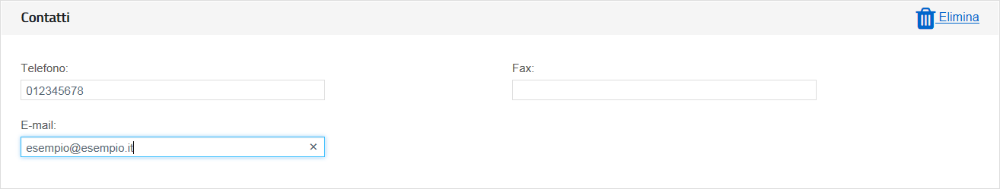

Per ottenere il pagamento dei buoni validati, l’esercente deve provvedere a emettere corrispondenti fatture elettroniche nei confronti della pubblica amministrazione usando **la piattaforma di fatturazione elettronica della PA**, seguendo le istruzioni di seguito indicate.
---------------------------------------------------------------------------------------------------------------------------------------------------------------------------------------------------------------------------------------------------------------------------------

**Nota Bene**

-  **Le fatture così emesse non hanno rilevanza ai fini fiscali – essendo l’evento fiscale già regolato mediante il biglietto o la ricevuta fiscale emessa dall’esercente all’atto dell’accettazione del buono – ma servono unicamente a consentire il riscontro dei buoni validati prima di procedere al loro pagamento.**
-  A tal proposito si comunica che **non è necessario l’assolvimento dell’imposta di bollo.**
-  **Al fine di limitare la possibilità di errore in fase di caricamento ed invio della fattura si consiglia di utilizzare il portale web per la fatturazione elettronica disponibile gratuitamente all’indirizzo:**

http://ivaservizi.agenziaentrate.gov.it/

Per accedere a questa funzionalità è necessario autenticarsi utilizzando **credenziali Entratel/Fisconline** oppure una **Carta Nazionale Servizi (CNS)** precedentemente abilitata ai servizi telematici dell’Agenzia delle Entrate o **SPID**.

-  **Le presenti linee guida sono state redatte utilizzando la citata piattaforma web. Altri software disponibili per la compilazione delle fatture elettroniche potrebbero riportare campi e funzioni diverse; in ogni caso i campi essenziali per la compilazione della fattura intestata all’iniziativa sono quelli descritti in questo documento.**

**Formato e contenuto della fattura**

L’esercente deve predisporre la fattura in formato elettronico seguendo le regole tecniche stabilite per la fatturazione elettronica verso la pubblica amministrazione reperibili all’indirizzo `www.fatturapa.gov.it <http://www.fatturapa.gov.it/>`__

Dopo aver compilato la fattura è necessario firmare il file digitalmente prima di inviarlo al Sistema d’Interscambio secondo una delle modalità previste illustrate al citato indirizzo internet.

**Istruzioni per la compilazione di una fattura**

Si illustrano di seguito i passi necessari per compilare la fattura utilizzando il portale web http://ivaservizi.agenziaentrate.gov.it/

**Passo 1**

I MIEI DATI
~~~~~~~~~~~

I. **Valorizzare i campi relativi all’esercente come descritto di seguito**

   -  Partita Iva: es. 10000000
   -  Codice Fiscale: es. 100000000
   -  Denominazione: es. Libreria Mario Rossi
   -  Regime Fiscale: selezionare dal menù a tendina (Vedi tabella dei regimi fiscali riportata in appendice)
   -  Indirizzo: es. Via Esempio
   -  N civico: es. 1
   -  CAP: es. 00100
   -  Comune: es. Roma
   -  Provincia: es. RM
   -  Nazione: es. IT

|image0|

Nel campo “Altri dati” cliccare su Aggiungi
~~~~~~~~~~~~~~~~~~~~~~~~~~~~~~~~~~~~~~~~~~~

|image1|

III. **Spuntare “Contatti” quindi cliccare su Seleziona**

|image2|

I. **Inserire i recapiti ai quali si potrà essere eventualmente ricontattati in caso di problemi di fatturazione**

   -  Numero di telefono: es. 12345678
   -  E-mail: es. esempio@esempio.it

|image3|

Passo 2
=======

**CLIENTE** (Inserire i dati della pubblica amministrazione nei confronti della quale si emette la fattura)

I. **Valorizzare i campi come descritto di seguito (dati reali)**

   -  Codice Fiscale: 80185250588
   -  Denominazione: Ministero dell’Istruzione dell’Università e della Ricerca
   -  Indirizzo: Viale Trastevere
   -  Numero Civico: 76a

o Cap: 00153

-  Comune: Roma
-  Provincia: RM
-  Nazione: IT
-  Codice Destinatario: QGGT71

|image4|

.. |image0| image:: ./media/image1.png
.. |image1| image:: ./media/image2.png
.. |image2| image:: ./media/image3.png

.. |image4| image:: ./media/image5.png
