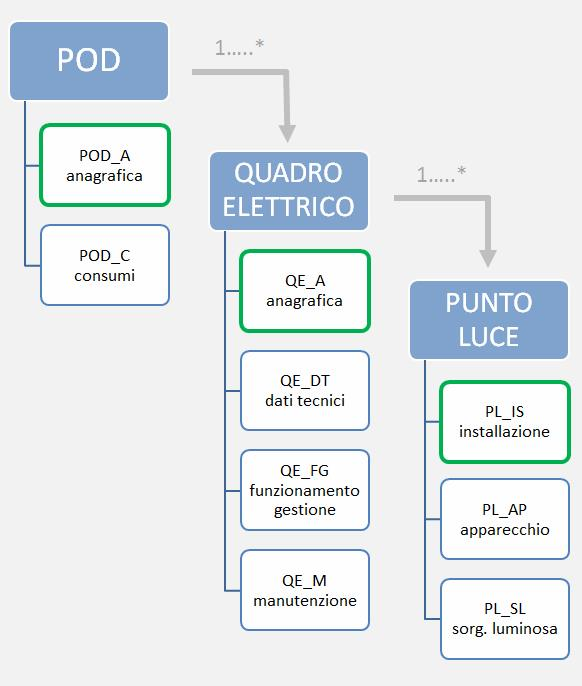

|image0|

+----------------------------------------------------------------------------------------------------------------------------------------------------------------------------------------------------------------------------------------+
| |image1|                                                                                                                                                                                                                               |
+----------------------------------------------------------------------------------------------------------------------------------------------------------------------------------------------------------------------------------------+
|                                                                                                                                                                                                                                        |
+----------------------------------------------------------------------------------------------------------------------------------------------------------------------------------------------------------------------------------------+
|                                                                                                                                                                                                                                        |
+----------------------------------------------------------------------------------------------------------------------------------------------------------------------------------------------------------------------------------------+
|                                                                                                                                                                                                                                        |
+----------------------------------------------------------------------------------------------------------------------------------------------------------------------------------------------------------------------------------------+
|                                                                                                                                                                                                                                        |
+----------------------------------------------------------------------------------------------------------------------------------------------------------------------------------------------------------------------------------------+
|                                                                                                                                                                                                                                        |
+----------------------------------------------------------------------------------------------------------------------------------------------------------------------------------------------------------------------------------------+
| **Specifiche di contenuto di riferimento PELL - illuminazione pubblica**                                                                                                                                                               |
+----------------------------------------------------------------------------------------------------------------------------------------------------------------------------------------------------------------------------------------+
|                                                                                                                                                                                                                                        |
+----------------------------------------------------------------------------------------------------------------------------------------------------------------------------------------------------------------------------------------+
|                                                                                                                                                                                                                                        |
+----------------------------------------------------------------------------------------------------------------------------------------------------------------------------------------------------------------------------------------+
|                                                                                                                                                                                                                                        |
+----------------------------------------------------------------------------------------------------------------------------------------------------------------------------------------------------------------------------------------+
|                                                                                                                                                                                                                                        |
+----------------------------------------------------------------------------------------------------------------------------------------------------------------------------------------------------------------------------------------+
| **versione 1.0 (in consulazione)**                                                                                                                                                                                                     |
+----------------------------------------------------------------------------------------------------------------------------------------------------------------------------------------------------------------------------------------+
|                                                                                                                                                                                                                                        |
+----------------------------------------------------------------------------------------------------------------------------------------------------------------------------------------------------------------------------------------+
| **18 aprile 2018**                                                                                                                                                                                                                     |
+----------------------------------------------------------------------------------------------------------------------------------------------------------------------------------------------------------------------------------------+
|                                                                                                                                                                                                                                        |
+----------------------------------------------------------------------------------------------------------------------------------------------------------------------------------------------------------------------------------------+
|                                                                                                                                                                                                                                        |
+----------------------------------------------------------------------------------------------------------------------------------------------------------------------------------------------------------------------------------------+
|                                                                                                                                                                                                                                        |
+----------------------------------------------------------------------------------------------------------------------------------------------------------------------------------------------------------------------------------------+
| **Emesso da: Agenzia per l'Italia Digitale (AgID)**                                                                                                                                                                                    |
+----------------------------------------------------------------------------------------------------------------------------------------------------------------------------------------------------------------------------------------+
|                                                                                                                                                                                                                                        |
+----------------------------------------------------------------------------------------------------------------------------------------------------------------------------------------------------------------------------------------+
| **Riferimenti: Le "Specifiche di contenuto di riferimento PELL - illuminazione pubblica" rappresentano il catalogo dei dati territoriali di riferimento per il censimento e l'efficientamento dell'illuminazione pubblica nazionale.** |
+----------------------------------------------------------------------------------------------------------------------------------------------------------------------------------------------------------------------------------------+
|                                                                                                                                                                                                                                        |
+----------------------------------------------------------------------------------------------------------------------------------------------------------------------------------------------------------------------------------------+
|                                                                                                                                                                                                                                        |
+----------------------------------------------------------------------------------------------------------------------------------------------------------------------------------------------------------------------------------------+
|                                                                                                                                                                                                                                        |
+----------------------------------------------------------------------------------------------------------------------------------------------------------------------------------------------------------------------------------------+
|                                                                                                                                                                                                                                        |
+----------------------------------------------------------------------------------------------------------------------------------------------------------------------------------------------------------------------------------------+
| **Specifica completa**                                                                                                                                                                                                                 |
+----------------------------------------------------------------------------------------------------------------------------------------------------------------------------------------------------------------------------------------+
|                                                                                                                                                                                                                                        |
+----------------------------------------------------------------------------------------------------------------------------------------------------------------------------------------------------------------------------------------+
|                                                                                                                                                                                                                                        |
+----------------------------------------------------------------------------------------------------------------------------------------------------------------------------------------------------------------------------------------+

+---------------------------------+-------------------------------------------------------------------------------------------------------------------------------------------------------------------------------------------------------------------------------------------------------------------------------------------------------------------------------------------------------------------------------------+
| **Autore della specifica :**    | Gruppo di lavoro "progetto PELL - IP" composto da ENEA (Agenzia nazionale per le nuove tecnologie, l'energia e lo sviluppo economico sostenibile) e AgID (Agenzia per l'Italia Digitale).                                                                                                                                                                                           |
|                                 |                                                                                                                                                                                                                                                                                                                                                                                     |
|                                 | | Alla specifica hanno inoltre contribuito: Infratel Italia (in qualità di responsabile del SINFI).                                                                                                                                                                                                                                                                                 |
|                                 | | Si evidenzia l'apporto fornito da Regione Lombardia alla definizione degli elementi informativi e strutturali del tema dedicato agli impianti di pubblica illuminazione.                                                                                                                                                                                                          |
+---------------------------------+-------------------------------------------------------------------------------------------------------------------------------------------------------------------------------------------------------------------------------------------------------------------------------------------------------------------------------------------------------------------------------------+
|                                 |                                                                                                                                                                                                                                                                                                                                                                                     |
+---------------------------------+-------------------------------------------------------------------------------------------------------------------------------------------------------------------------------------------------------------------------------------------------------------------------------------------------------------------------------------------------------------------------------------+
| **Riferimenti del documento :** | -  `D.Lgs. 07/03/2005 n.82 <http://www.normattiva.it/uri-res/N2Ls?urn:nir:stato:decreto.legislativo:2005-03-07;82>`__ “Codice dell'Amministrazione Digitale”                                                                                                                                                                                                                        |
|                                 |                                                                                                                                                                                                                                                                                                                                                                                     |
|                                 | -  `Direttiva 2007/2/CE del 14 marzo 2007 <http://www.normattiva.it/uri-res/N2Ls?urn:nir:comunita.europee:direttiva:2007-03-14;2007-2-ce>`__ (Direttiva INSPIRE)                                                                                                                                                                                                                    |
|                                 |                                                                                                                                                                                                                                                                                                                                                                                     |
|                                 | -  Direttiva 2014/61/UE del 15 maggio 2014                                                                                                                                                                                                                                                                                                                                          |
|                                 |                                                                                                                                                                                                                                                                                                                                                                                     |
|                                 | -  `D.Lgs. del 15 febbraio 2016, n. 33 <http://www.normattiva.it/uri-res/N2Ls?urn:nir:stato:decreto.legislativo:2016-02-15;33>`__ “Attuazione della direttiva 2014/61/UE del Parlamento europeo e del Consiglio, del 15 maggio 2014, recante misure volte a ridurre i costi dell’installazione di reti di comunicazione elettronica ad alta velocità” (G.U. n. 57 del 9 marzo 2016) |
|                                 |                                                                                                                                                                                                                                                                                                                                                                                     |
|                                 | -  Decreto del Ministro dello Sviluppo Economico del 11 maggio 2016 - Istituzione del SINFI - Sistema informativo nazionale federato delle infrastrutture (GU Serie Generale n.139 del 16-6-2016)                                                                                                                                                                                   |
|                                 |                                                                                                                                                                                                                                                                                                                                                                                     |
|                                 | -                                                                                                                                                                                                                                                                                                                                                                                   |
|                                 |                                                                                                                                                                                                                                                                                                                                                                                     |
|                                 |    L. 27 dicembre 2017, n. 205 (Legge di Bilancio 2018) - Art. 1 commi 697-700 per interventi di efficientamento energetico e di adeguamento normativo sugli impianti di illuminazione pubblica.                                                                                                                                                                                    |
|                                 |                                                                                                                                                                                                                                                                                                                                                                                     |
|                                 | -  Norma nazionale UNI 11630:2016 “Luce e illuminazione – Criteri per la stesura del progetto illuminotecnico”                                                                                                                                                                                                                                                                      |
|                                 |                                                                                                                                                                                                                                                                                                                                                                                     |
|                                 | -  Regole tecniche per la definizione delle specifiche di contenuto dei database geotopografici (DM 10 novembre 2011 - Gazzetta Ufficiale n. 48 del 27 febbraio 2012, supplemento ordinario n. 37) cui si rimanda per ogni ulteriore approfondimento, in particolare:                                                                                                               |
|                                 |                                                                                                                                                                                                                                                                                                                                                                                     |
|                                 | -  Allegato 1 - Catalogo dei dati territoriali - Specifiche di contenuto per i DataBase geotopografici                                                                                                                                                                                                                                                                              |
|                                 |                                                                                                                                                                                                                                                                                                                                                                                     |
|                                 | -  Allegato 2 - il modello GeoUML - Regole di interpretazione delle specifiche di contenuto per i DataBase Geotopografici.                                                                                                                                                                                                                                                          |
+---------------------------------+-------------------------------------------------------------------------------------------------------------------------------------------------------------------------------------------------------------------------------------------------------------------------------------------------------------------------------------------------------------------------------------+
|                                 |                                                                                                                                                                                                                                                                                                                                                                                     |
+---------------------------------+-------------------------------------------------------------------------------------------------------------------------------------------------------------------------------------------------------------------------------------------------------------------------------------------------------------------------------------------------------------------------------------+
| **Stato :**                     | versione 1.0 in consultazione                                                                                                                                                                                                                                                                                                                                                       |
+---------------------------------+-------------------------------------------------------------------------------------------------------------------------------------------------------------------------------------------------------------------------------------------------------------------------------------------------------------------------------------------------------------------------------------+
|                                 |                                                                                                                                                                                                                                                                                                                                                                                     |
+---------------------------------+-------------------------------------------------------------------------------------------------------------------------------------------------------------------------------------------------------------------------------------------------------------------------------------------------------------------------------------------------------------------------------------+
| **Scopo :**                     | Il documento definisce le specifiche tecniche di contenuto per la formazione, la documentazione e la fruibilità dei Database georeferenziati relativi all'illuminazione pubblica nazionale.                                                                                                                                                                                         |
+---------------------------------+-------------------------------------------------------------------------------------------------------------------------------------------------------------------------------------------------------------------------------------------------------------------------------------------------------------------------------------------------------------------------------------+
|                                 |                                                                                                                                                                                                                                                                                                                                                                                     |
+---------------------------------+-------------------------------------------------------------------------------------------------------------------------------------------------------------------------------------------------------------------------------------------------------------------------------------------------------------------------------------------------------------------------------------+
| **Campo di applicazione :**     | Produzione, acquisizione e validazione dei dati relativi al progetto PELL                                                                                                                                                                                                                                                                                                           |
+---------------------------------+-------------------------------------------------------------------------------------------------------------------------------------------------------------------------------------------------------------------------------------------------------------------------------------------------------------------------------------------------------------------------------------+
|                                 |                                                                                                                                                                                                                                                                                                                                                                                     |
+---------------------------------+-------------------------------------------------------------------------------------------------------------------------------------------------------------------------------------------------------------------------------------------------------------------------------------------------------------------------------------------------------------------------------------+

**Indice**

`Premessa 5 <#premessa>`__

`1. Introduzione 6 <#_Toc512547207>`__

`2. STRATO: 00 Informazioni geodetiche e fotogrammetriche 8 <#_Toc512547208>`__

`TEMA: Informazioni cartografiche e metainformazione 0002 8 <#tema-informazioni-cartografiche-e-metainformazione-0002>`__

`CLASSE: Ambito omogeneo per la metainformazione (META - 000202) 8 <#classe-ambito-omogeneo-per-la-metainformazione-meta---000202>`__

`3. TEMA: Illuminazione pubblica 0708 10 <#tema-illuminazione-pubblica-0708>`__

`3.1 CLASSE: Pod – anagrafica del punto di prelievo dell'elettricità (POD_A - 070802) 11 <#classe-pod-anagrafica-del-punto-di-prelievo-dellelettricità-pod_a---070802>`__

`3.2 CLASSE: Pod - consumi (POD_C - 070803) 13 <#classe-pod---consumi-pod_c---070803>`__

`3.3 CLASSE: Quadro elettrico anagrafica (QE_A - 070805) 15 <#classe-quadro-elettrico-anagrafica-qe_a---070805>`__

`3.4 CLASSE: Dati tecnici quadro elettrico (QE_DT - 070806) 18 <#classe-dati-tecnici-quadro-elettrico-qe_dt---070806>`__

`3.5 CLASSE: Dati funzionamento e gestione del quadro elettrico (QE_FG - 070807) 20 <#classe-dati-funzionamento-e-gestione-del-quadro-elettrico-qe_fg---070807>`__

`3.6 CLASSE: Quadro elettrico manutenzione (QE_M - 070808) 23 <#classe-quadro-elettrico-manutenzione-qe_m---070808>`__

`3.7 CLASSE: Punto luce – installazione (PL_IS - 070809) 25 <#classe-punto-luce-installazione-pl_is---070809>`__

`3.8 CLASSE: Punto luce – apparecchio (PL_AP - 070810) 28 <#classe-punto-luce-apparecchio-pl_ap---070810>`__

`3.9 CLASSE: Punto luce – sorgente luminosa (PL_SL - 070811) 33 <#classe-punto-luce-sorgente-luminosa-pl_sl---070811>`__

`3.10 CLASSE: Zone omogenee (ZO - 070812) 35 <#classe-zone-omogenee-zo---070812>`__

`4. DATATYPE 43 <#datatype>`__

`DATATYPE: Metadati di istanza (MET_IST - 81) 43 <#datatype-metadati-di-istanza-met_ist---81>`__

`DOMINIO: Fonte del dato (FONTE - 0100) 43 <#dominio-fonte-del-dato-fonte---0100>`__

`DOMINIO: Scala (SCALA - 0400) 43 <#dominio-scala-scala---0400>`__

`DOMINIO DEL VALORE NULLO 44 <#dominio-del-valore-nullo>`__

Premessa
========

Le “Specifiche di contenuto di riferimento PELL - IP”, che costituiscono la base per l’avvio di un censimento omogeneo dell’Illuminazione Pubblica a livello nazionale e la costituzione di un database strategico, sono il risultato dell’attività svolta da ENEA in collaborazione con l’Agenzia per l’Italia Digitale, nell’ambito del Progetto PELL (Public Energy Living Lab), focalizzato sull’infrastruttura dell’Illuminazione Pubblica (IP). L’obiettivo è quello di garantire la raccolta standardizzata delle informazioni strategiche dell’infrastruttura IP in un’ottica di interoperabilità dei sistemi operativi, di condivisione dei dati tra soggetti interessati e in particolare di fornitura di servizi alle pubbliche amministrazioni. In tal senso è stata assicurata la coerenza con le specifiche già in uso (regole tecniche sui DBGT) e, in particolare, con le il modello dati SINFI, anche attraverso il contributo di Infratel Italia, incaricato della gestione del SINFI per conto del MISE. L’adesione al PELL consente alle amministrazioni di poter fruire di un insieme di servizi volti a monitorare e valutare lo stato degli impianti e il loro livello tecnologico/prestazionale.

Il Progetto PELL, avviato nel 2014 da ENEA su finanziamento del MISE, ha l’obiettivo di avviare e supportare una riorganizzazione dei processi gestionali delle infrastrutture pubbliche energivore, partendo da una mappatura e raccolta standardizzata ed omogenea dei loro dati d’identità e di consumo e dallo sviluppo di protocolli di trasmissione dei dati che ne consentano l’operabilità per approdare, in ultimo, alla creazione di un vero e proprio catasto nazionale, strutturato in un DB interoperabile e alla realizzazione di un tool di monitoraggio e valutazione delle prestazioni dei servizi.

Il modello di raccolta dei dati definito nel progetto PELL IP, a seguito della collaborazione con AgID, è stato quindi elaborato come un modello di riferimento per il censimento degli impianti di Illuminazione pubblica e definito come “Specifiche di contenuto di riferimento PELL - IP”, divenendo il punto di confluenza delle attività ENEA per il monitoraggio dei dati d’identità e consumo delle infrastrutture pubbliche energivore, e quelle di AgID rivolte alla interoperabilità dei sistemi informativi e al coordinamento informatico dell'amministrazione centrale, regionale e locale, nonché alla valorizzazione del patrimonio informativo pubblico e al supporto di progetti innovativi connessi all’attuazione dell’Agenda digitale.

Le “Specifiche di contenuto di riferimento PELL - IP” sono state definite mediante una struttura che consente di riferire e contenere sia i dati tematici propri dell’illuminazione pubblica (PELL), sia un sottoinsieme di dati territoriali di base rappresentativi dell’attività antropica (principalmente derivati dai DataBase Geotopografici regionali). In questo modo viene altresì promosso il censimento georeferenziato delle componenti energivore nonché l’evoluzione e l’estensione della rappresentazione dei dati, inserendo anche quelli georeferenziati, relazionando così l’illuminazione pubblica al contesto territoriale in cui insiste.

Tenuto conto della logica dell’interoperabilità, anche per le finalità contemplate dalla direttiva INSPIRE, la maggior parte dei dati previsti dalle Specifiche e utilizzati dal PELL IP, sono condivisi con il sistema informativo SINFI, comportando, tra l’altro, una semplificazione delle attività di l’implementazione della piattaforma PELL, anche attraverso il riuso di componenti di sistemi informatici già sviluppati per il SINFI, e il conseguente uso condiviso (senza duplicazioni) dei dati territoriali comuni ai due sistemi.

1. \*\* Introduzione*\*

Le “Specifiche di contenuto di riferimento PELL - Illuminazione Pubblica”, unitamente alle “Regole tecniche per la definizione delle specifiche di contenuto dei database geotopografici” (allegati 1 e 2 del DM 10 novembre 2011 - Gazzetta Ufficiale n. 48 del 27 febbraio 2012, supplemento ordinario n. 37), rappresentano i riferimenti tecnici per la realizzazione di un censimento omogeneo e georeferenziato dell’Illuminazione Pubblica a livello nazionale.

Al fine di sviluppare le opportune attività finalizzate alla prevista realizzazione dell’Infrastruttura Nazionale dei Dati Territoriali, le specifiche tecniche in oggetto recepiscono il campo di applicazione ed i principi di carattere generale enunciati dalla Direttiva INSPIRE (`Direttiva 2007/2/CE del 14 marzo 2007 <http://www.normattiva.it/uri-res/N2Ls?urn:nir:comunita.europee:direttiva:2007-03-14;2007-2-ce>`__ pubblicata sulla Gazzetta Ufficiale dell’Unione Europea del 25/04/07) che istituisce un'Infrastruttura per l'informazione territoriale nella Comunità Europea. In tale contesto, le “Specifiche di contenuto di riferimento PELL - Illuminazione Pubblica” rappresentano (unitamente alle “Specifiche di contenuto di riferimento per i DataBase delle Reti di sottoservizi e per il SINFI”) una estensione delle più generali “Specifiche di contenuto per i DataBase Geotopografici”.

Le “Specifiche di contenuto di riferimento PELL - Illuminazione Pubblica” descrivono le caratteristiche tecnico-costruttive dell’illuminazione pubblica nazionale, definendo un livello di popolamento (inteso come contenuto minimo obbligatorio) nell’ambito di un catalogo più esteso di contenuti; nel dettaglio:

i costrutti discriminati dalla lettera “P”, rappresentano contenuti informativi minimi, quindi obbligatori per l’implementazione del database PELL – illuminazione pubblica;

i costrutti per i quali non è indicata la lettera “P”, rappresentano contenuti informativi non obbligatori (facoltativi).

La definizione degli oggetti è organizzata in Strati, Temi e Classi, secondo l’impostazione delle “Specifiche di contenuto per i Database Geotopografici”. La struttura di riferimento è costituita dalla Classe, che definisce la rappresentazione di una specifica tipologia di oggetti territoriali, descrivendo: proprietà, caratteristiche, struttura del dato, regole di acquisizione, strutturazione e relazione con gli altri oggetti. Gli Strati e i Temi non rappresentano una classificazione, ma hanno lo scopo di raccogliere, attraverso una organizzazione ad albero, i contenuti omogenei, semplificando la consultazione della stessa specifica.

Rappresentano parte integrante della presente specifica, gli approfondimenti tecnici contenuti nella parte introduttiva delle “Specifiche di contenuto per i DataBase Geotopografici” ai quali si rimanda per l’approfondimento dei seguenti argomenti:

-  Il modello GeoUML;

-  National Core;

-  La modellazione tridimensionale;

-  Attributi a tratti esempi di implementazione;

-  La metainformazione;

-  Le codifiche delle Classi e degli attributi;

-  La codifica alfanumerica;

-  La codifica numerica;

-  La struttura del Catalogo;

-  La tipologia degli attributi;

-  La tipologia degli attributi riferiti alle componenti spaziali;

-  Il popolamento del NC;

-  Casi particolari;

-  Incompletezza dell’informazione: la specificazione del valore nullo;

-  Indeterminatezza nelle Specifiche.

Nella specifica in oggetto non sono previste le indicazioni relative alla accuratezza plano-altimetrica degli oggetti in quanto ritenute di competenza degli specifici modelli implementativi di fornitura o di realizzazione.

Per ogni ulteriore dettaglio implementativo, in attesa della pubblicazione delle linee guida PELL – Illuminazione Pubblica, si rimanda alle “Linee Guida per la produzione dei database geotopografici conformi alle norme del DM 10.11.2011” (prodotte dal CISIS) ed alle “Linee guida per la produzione dati del SINFI” (prodotte da Infratel Italia e AgID).

2. **STRATO:** **00** **Informazioni geodetiche e fotogrammetriche**

**Descrizione**

Riunisce le informazioni di carattere geodetico (reti planimetriche, reti altimetriche, …) e le informazioni sulle coperture cartografiche e fotogrammetriche dei territori.

Sono inoltre compresi i riferimenti alle metainformazioni.

TEMA: Informazioni cartografiche e metainformazione 0002
--------------------------------------------------------

**Descrizione**

Definizione di ambiti territoriali con riferimento alla restituzione cartografica ed alla metainformazione

*CLASSE:* Ambito omogeneo per la metainformazione (META - 000202)
~~~~~~~~~~~~~~~~~~~~~~~~~~~~~~~~~~~~~~~~~~~~~~~~~~~~~~~~~~~~~~~~~

**Classe con istanze monoscala**

+------------------------------+----------+
|                              | **PELL** |
+------------------------------+----------+
| **Popolamento della classe** | P        |
+------------------------------+----------+

**Definizione**

Ambito territoriale caratterizzato da informazioni omogenee rispetto ad un sottoinsieme sintetico di metadati. Ogni istanza di questa classe corrisponde alla sezione definita nel RNDT.

Visto che più classi possono interessare uno stesso ambito territoriale, una sezione può essere considerata appartenente a diversi dataset. Ne deriva che deve essere stabilita una relazione [1..n] tra ogni dataset descritto e le sezioni ad esso appartenenti. Per conseguire tale risultato è necessario aggiungere una tabella relazionale che raccoglie le sezioni appartenenti ad un certo dataset. Tale tabella prevede i seguenti attributi:

-  COD_CL – codice della classe (stringa)

-  SEZ_ID – FILE_ID dell’ambito omogeneo per la metainformazione /sezione

+---------------+----------------------------------------------------------------------------------------------------------+---------------------------+--------------------------------------------------------------+-----------------+---+
| **Attributi** |                                                                                                          |                           |                                                              |                 |   |
+---------------+----------------------------------------------------------------------------------------------------------+---------------------------+--------------------------------------------------------------+-----------------+---+
|               | **Attributi della classe**                                                                               | **PELL**                  |                                                              |                 |   |
+---------------+----------------------------------------------------------------------------------------------------------+---------------------------+--------------------------------------------------------------+-----------------+---+
|               | **00020201**                                                                                             | **META_ES**               | **tipo di estensione**                                       | **Enum**        | P |
+---------------+----------------------------------------------------------------------------------------------------------+---------------------------+--------------------------------------------------------------+-----------------+---+
|               | definisce la tipologia di estensione della porzione di territorio considerata                            |                           |                                                              |                 |   |
+---------------+----------------------------------------------------------------------------------------------------------+---------------------------+--------------------------------------------------------------+-----------------+---+
|               | **Dominio (Tipo di estensione)**                                                                         | **PELL**                  |                                                              |                 |   |
+---------------+----------------------------------------------------------------------------------------------------------+---------------------------+--------------------------------------------------------------+-----------------+---+
|               | **01**                                                                                                   | **limite amministrativo** |                                                              | P               |   |
+---------------+----------------------------------------------------------------------------------------------------------+---------------------------+--------------------------------------------------------------+-----------------+---+
|               | **02**                                                                                                   | **taglio cartografico**   |                                                              | P               |   |
+---------------+----------------------------------------------------------------------------------------------------------+---------------------------+--------------------------------------------------------------+-----------------+---+
|               | **95**                                                                                                   | **altro**                 | Valore assunto dall’istanza ma non previsto dalla specifica. | P               |   |
+---------------+----------------------------------------------------------------------------------------------------------+---------------------------+--------------------------------------------------------------+-----------------+---+
|               |                                                                                                          |                           |                                                              |                 |   |
+---------------+----------------------------------------------------------------------------------------------------------+---------------------------+--------------------------------------------------------------+-----------------+---+
|               | **00020202**                                                                                             | **META_NC**               | **nome/codice**                                              | **String(100)** | P |
+---------------+----------------------------------------------------------------------------------------------------------+---------------------------+--------------------------------------------------------------+-----------------+---+
|               | specifica il nome o il codice della porzione di territorio considerata (indicata nell’attributo META_ES) |                           |                                                              |                 |   |
+---------------+----------------------------------------------------------------------------------------------------------+---------------------------+--------------------------------------------------------------+-----------------+---+
|               | **00020203**                                                                                             | **META_SC**               | **scala**                                                    | **Enum**        | P |
+---------------+----------------------------------------------------------------------------------------------------------+---------------------------+--------------------------------------------------------------+-----------------+---+
|               | definisce la scala di riferimento del DBT per la porzione di territorio considerata                      |                           |                                                              |                 |   |
+---------------+----------------------------------------------------------------------------------------------------------+---------------------------+--------------------------------------------------------------+-----------------+---+
|               | **Dominio (Scala)**                                                                                      | **PELL**                  |                                                              |                 |   |
+---------------+----------------------------------------------------------------------------------------------------------+---------------------------+--------------------------------------------------------------+-----------------+---+
|               | **01**                                                                                                   | **scala 1:1000**          |                                                              | P               |   |
+---------------+----------------------------------------------------------------------------------------------------------+---------------------------+--------------------------------------------------------------+-----------------+---+
|               | **02**                                                                                                   | **scala 1:2000**          |                                                              | P               |   |
+---------------+----------------------------------------------------------------------------------------------------------+---------------------------+--------------------------------------------------------------+-----------------+---+
|               | **03**                                                                                                   | **scala 1:5000**          |                                                              | P               |   |
+---------------+----------------------------------------------------------------------------------------------------------+---------------------------+--------------------------------------------------------------+-----------------+---+
|               | **04**                                                                                                   | **scala 1:10000**         |                                                              | P               |   |
+---------------+----------------------------------------------------------------------------------------------------------+---------------------------+--------------------------------------------------------------+-----------------+---+
|               | **05**                                                                                                   | **scala 1:25000**         |                                                              | P               |   |
+---------------+----------------------------------------------------------------------------------------------------------+---------------------------+--------------------------------------------------------------+-----------------+---+
|               | **95**                                                                                                   | **altro**                 | Valore assunto dall’istanza ma non previsto dalla specifica. | P               |   |
+---------------+----------------------------------------------------------------------------------------------------------+---------------------------+--------------------------------------------------------------+-----------------+---+

+--+--------------------------------------+--------------+----------------+-------------------------------------------+---+
|  | **Componenti spaziali della classe** | **PELL**     |                |                                           |   |
+--+--------------------------------------+--------------+----------------+-------------------------------------------+---+
|  | **000202101**                        | **META_SUP** | **Estensione** | **GU_CPSurface2D - Composite Surface 2D** | P |
+--+--------------------------------------+--------------+----------------+-------------------------------------------+---+

TEMA: Illuminazione pubblica 0708
=================================

**Descrizione**

Questo tema definisce l'organizzazione del sistema di rilevamento degli impianti di illuminazione al servizio di vie e piazze pubbliche, di luoghi pubblici in genere, comprese le aree di pertinenza, i cui costi energetici e manutentivi sono sostenuti direttamente o, tramite concessione, da enti locali, compresi gli impianti corredati da sistemi di rilevazione del fabbisogno d'illuminazione e conseguenti meccanismi di regolazione dell'intensità del flusso luminoso. I concetti su cui si fonda la strutturazione del tema, riguardano le modalità con cui devono essere descritti gli elementi utili alla conoscenza ed al monitoraggio del processo gestionale delle infrastrutture e dei servizi di pubblica illuminazione.

La strutturazione in Classi considera sia l’esigenza di censire puntualmente i dati degli impianti (POD, quadri elettrici e punti luce), sia le conoscenza del contesto territoriale in cui gli stessi sono collocati (zone omogenee e altre Classi del soprasuolo) al fine di rendere più efficaci gli impianti rispondendo in maniera più efficiente alle esigenze dei cittadini e del Paese.

**Figure**

-  Schema organizzativo del tema

|image2|

3.1 CLASSE: Pod – anagrafica del punto di prelievo dell'elettricità (POD_A - 070802)
------------------------------------------------------------------------------------

+------------------------------+----------+
|                              | **PELL** |
+------------------------------+----------+
| **Popolamento della classe** | P        |
+------------------------------+----------+

**Definizione**

Il POD (Point Of Delivery - punto di prelievo dell'elettricità) identifica in modo certo il punto fisico sulla rete di distribuzione nel territorio nazionale in cui l'energia viene consegnata dal fornitore e prelevata dal cliente finale. È identificato con un codice alfanumerico (14 caratteri) che serve ad individuare con precisione l'utenza. Il POD è il punto di riferimento per la contabilizzazione del consumo di energia elettrico. In un comune possono esserci più POD, in relazione alle dimensioni del Comune. Ad ogni POD possono essere associati 1 o più quadri elettrici.

+---------------+---------------------------------------------------------------------------------------------------------------------------------------------------------------------------------------------------------------------------------------------------------------------------------------------------------------+----------------+------------------------------------------------------+------------------------------------+---+
| **Attributi** |                                                                                                                                                                                                                                                                                                               |                |                                                      |                                    |   |
+---------------+---------------------------------------------------------------------------------------------------------------------------------------------------------------------------------------------------------------------------------------------------------------------------------------------------------------+----------------+------------------------------------------------------+------------------------------------+---+
|               | **Attributi della classe**                                                                                                                                                                                                                                                                                    | **PELL**       |                                                      |                                    |   |
+---------------+---------------------------------------------------------------------------------------------------------------------------------------------------------------------------------------------------------------------------------------------------------------------------------------------------------------+----------------+------------------------------------------------------+------------------------------------+---+
|               | **07080201**                                                                                                                                                                                                                                                                                                  | **POD_COD**    | **codice pod**                                       | **String(14)**                     | P |
+---------------+---------------------------------------------------------------------------------------------------------------------------------------------------------------------------------------------------------------------------------------------------------------------------------------------------------------+----------------+------------------------------------------------------+------------------------------------+---+
|               | indica il codice identificativo del POD (Point Of Delivery) considerato; il codice POD è un codice composto da 14 caratteri che identifica in modo certo il punto fisico sulla rete di distribuzione nel territorio nazionale in cui l'energia viene consegnata dal fornitore e prelevata dal cliente finale. |                |                                                      |                                    |   |
+---------------+---------------------------------------------------------------------------------------------------------------------------------------------------------------------------------------------------------------------------------------------------------------------------------------------------------------+----------------+------------------------------------------------------+------------------------------------+---+
|               | **07080202**                                                                                                                                                                                                                                                                                                  | **POD_A_TOP**  | **toponimo stradale pod**                            | **String(100)**                    | P |
+---------------+---------------------------------------------------------------------------------------------------------------------------------------------------------------------------------------------------------------------------------------------------------------------------------------------------------------+----------------+------------------------------------------------------+------------------------------------+---+
|               | Nome della strada, via o piazza o largo, etc., comprensivo di apposizione. Unitamente all’attributo "07080203 - POD_CIV" compone l’indirizzo.                                                                                                                                                                 |                |                                                      |                                    |   |
+---------------+---------------------------------------------------------------------------------------------------------------------------------------------------------------------------------------------------------------------------------------------------------------------------------------------------------------+----------------+------------------------------------------------------+------------------------------------+---+
|               | **07080203**                                                                                                                                                                                                                                                                                                  | **POD_A_CIV**  | **numero civico**                                    | **String(50)**                     | P |
+---------------+---------------------------------------------------------------------------------------------------------------------------------------------------------------------------------------------------------------------------------------------------------------------------------------------------------------+----------------+------------------------------------------------------+------------------------------------+---+
|               | identifica l’eventuale numero civico associato al POD. Unitamente all’attributo "07080202 - POD_A_TOP" compone l’indirizzo.                                                                                                                                                                                   |                |                                                      |                                    |   |
+---------------+---------------------------------------------------------------------------------------------------------------------------------------------------------------------------------------------------------------------------------------------------------------------------------------------------------------+----------------+------------------------------------------------------+------------------------------------+---+
|               | **07080204**                                                                                                                                                                                                                                                                                                  | **POD_A_RIL**  | **data del rilievo**                                 | **Date**                           | P |
+---------------+---------------------------------------------------------------------------------------------------------------------------------------------------------------------------------------------------------------------------------------------------------------------------------------------------------------+----------------+------------------------------------------------------+------------------------------------+---+
|               | indica la data in cui è stato effettuato il rilievo della situazione del POD in situ.                                                                                                                                                                                                                         |                |                                                      |                                    |   |
+---------------+---------------------------------------------------------------------------------------------------------------------------------------------------------------------------------------------------------------------------------------------------------------------------------------------------------------+----------------+------------------------------------------------------+------------------------------------+---+
|               | **07080205**                                                                                                                                                                                                                                                                                                  | **POD_A_PR**   | **promiscuità**                                      | **Boolean**                        | P |
+---------------+---------------------------------------------------------------------------------------------------------------------------------------------------------------------------------------------------------------------------------------------------------------------------------------------------------------+----------------+------------------------------------------------------+------------------------------------+---+
|               | Indica la presenza di situazioni di promiscuità elettrica e/o meccanica.                                                                                                                                                                                                                                      |                |                                                      |                                    |   |
+---------------+---------------------------------------------------------------------------------------------------------------------------------------------------------------------------------------------------------------------------------------------------------------------------------------------------------------+----------------+------------------------------------------------------+------------------------------------+---+
|               | **07080206**                                                                                                                                                                                                                                                                                                  | **POD_A_N-Q**  | **numero quadri elettrici**                          | **Integer**                        | P |
+---------------+---------------------------------------------------------------------------------------------------------------------------------------------------------------------------------------------------------------------------------------------------------------------------------------------------------------+----------------+------------------------------------------------------+------------------------------------+---+
|               | numero quadri elettrici afferenti il POD                                                                                                                                                                                                                                                                      |                |                                                      |                                    |   |
+---------------+---------------------------------------------------------------------------------------------------------------------------------------------------------------------------------------------------------------------------------------------------------------------------------------------------------------+----------------+------------------------------------------------------+------------------------------------+---+
|               | **07080207**                                                                                                                                                                                                                                                                                                  | **POD_A_N-QS** | **numero quadri elettrici da sostituire [0..1]**     | **Integer**                        | P |
+---------------+---------------------------------------------------------------------------------------------------------------------------------------------------------------------------------------------------------------------------------------------------------------------------------------------------------------+----------------+------------------------------------------------------+------------------------------------+---+
|               | numero quadri elettrici afferenti il POD da sostituire                                                                                                                                                                                                                                                        |                |                                                      |                                    |   |
+---------------+---------------------------------------------------------------------------------------------------------------------------------------------------------------------------------------------------------------------------------------------------------------------------------------------------------------+----------------+------------------------------------------------------+------------------------------------+---+
|               | **07080208**                                                                                                                                                                                                                                                                                                  | **POD_A_N-QR** | **numero quadri elettrici da ricondizionare [0..1]** | **Integer**                        | P |
+---------------+---------------------------------------------------------------------------------------------------------------------------------------------------------------------------------------------------------------------------------------------------------------------------------------------------------------+----------------+------------------------------------------------------+------------------------------------+---+
|               | numero quadri elettrici afferenti il POD da ricondizionare                                                                                                                                                                                                                                                    |                |                                                      |                                    |   |
+---------------+---------------------------------------------------------------------------------------------------------------------------------------------------------------------------------------------------------------------------------------------------------------------------------------------------------------+----------------+------------------------------------------------------+------------------------------------+---+
|               | **07080281**                                                                                                                                                                                                                                                                                                  | **POD_A_MET**  | **metadati di istanza**                              | **Metadati di istanza (DataType)** | P |
+---------------+---------------------------------------------------------------------------------------------------------------------------------------------------------------------------------------------------------------------------------------------------------------------------------------------------------------+----------------+------------------------------------------------------+------------------------------------+---+

+--+----------------------------------------------------+---------------+---------------+---------------------------+---+
|  | **Componenti spaziali della classe**               | **PELL**      |               |                           |   |
+--+----------------------------------------------------+---------------+---------------+---------------------------+---+
|  | **070802101**                                      | **POD_A_POS** | **Posizione** | **GU_Point3D - Point 3D** | P |
+--+----------------------------------------------------+---------------+---------------+---------------------------+---+
|  | corrisponde alla localizzazione geografica del POD |               |               |                           |   |
+--+----------------------------------------------------+---------------+---------------+---------------------------+---+

**Ruoli**

+--+--------------------------------------------------+
|  | **Pcdipa**                                       |
+--+--------------------------------------------------+
|  | **Pcdipa** [1]: **POD_C** inverso **Padipc** [1] |
+--+--------------------------------------------------+

3.2 CLASSE: Pod - consumi (POD_C - 070803)
------------------------------------------

.. raw:: html

   

+------------------------------+----------+
|                              | **PELL** |
+------------------------------+----------+
| **Popolamento della classe** | P        |
+------------------------------+----------+

.. raw:: html

   

**Definizione**

Definisce i consumi del POD. Classe priva di componente spaziale, essendo relazionata agli oggetti contenuti nella Classe POD_A - 070802.

+---------------+----------------------------------------------------------------------------------------------------------------------------------------------+-----------------------------------------------------------------------------------------------------------+--------------------------------------------------------------------------------------------------------------+------------------------------------+---+
| **Attributi** |                                                                                                                                              |                                                                                                           |                                                                                                              |                                    |   |
+---------------+----------------------------------------------------------------------------------------------------------------------------------------------+-----------------------------------------------------------------------------------------------------------+--------------------------------------------------------------------------------------------------------------+------------------------------------+---+
|               | **Attributi della classe**                                                                                                                   | **PELL**                                                                                                  |                                                                                                              |                                    |   |
+---------------+----------------------------------------------------------------------------------------------------------------------------------------------+-----------------------------------------------------------------------------------------------------------+--------------------------------------------------------------------------------------------------------------+------------------------------------+---+
|               | **07080301**                                                                                                                                 | **POD_COD**                                                                                               | **codice pod**                                                                                               | **String(14)**                     | P |
+---------------+----------------------------------------------------------------------------------------------------------------------------------------------+-----------------------------------------------------------------------------------------------------------+--------------------------------------------------------------------------------------------------------------+------------------------------------+---+
|               | indica il codice identificativo del POD_A a cui sono associate le informazioni relative ai consumi.                                          |                                                                                                           |                                                                                                              |                                    |   |
+---------------+----------------------------------------------------------------------------------------------------------------------------------------------+-----------------------------------------------------------------------------------------------------------+--------------------------------------------------------------------------------------------------------------+------------------------------------+---+
|               | **07080302**                                                                                                                                 | **POD_C_DAT**                                                                                             | **anno di riferimento consumi [0..1]**                                                                       | **Date**                           |   |
+---------------+----------------------------------------------------------------------------------------------------------------------------------------------+-----------------------------------------------------------------------------------------------------------+--------------------------------------------------------------------------------------------------------------+------------------------------------+---+
|               | indica l’anno di riferimento sulla base del quale sono compilati i campi relativi ai consumi.                                                |                                                                                                           |                                                                                                              |                                    |   |
+---------------+----------------------------------------------------------------------------------------------------------------------------------------------+-----------------------------------------------------------------------------------------------------------+--------------------------------------------------------------------------------------------------------------+------------------------------------+---+
|               | **07080303**                                                                                                                                 | **POD_C_TY**                                                                                              | **tipologia contratto**                                                                                      | **Enum**                           | P |
+---------------+----------------------------------------------------------------------------------------------------------------------------------------------+-----------------------------------------------------------------------------------------------------------+--------------------------------------------------------------------------------------------------------------+------------------------------------+---+
|               | indica la tipologia di contratto stipulata                                                                                                   |                                                                                                           |                                                                                                              |                                    |   |
+---------------+----------------------------------------------------------------------------------------------------------------------------------------------+-----------------------------------------------------------------------------------------------------------+--------------------------------------------------------------------------------------------------------------+------------------------------------+---+
|               | **Dominio (Tipologia contratto)**                                                                                                            | **PELL**                                                                                                  |                                                                                                              |                                    |   |
+---------------+----------------------------------------------------------------------------------------------------------------------------------------------+-----------------------------------------------------------------------------------------------------------+--------------------------------------------------------------------------------------------------------------+------------------------------------+---+
|               | **01**                                                                                                                                       | **Servizio Luce Consip**                                                                                  |                                                                                                              | P                                  |   |
+---------------+----------------------------------------------------------------------------------------------------------------------------------------------+-----------------------------------------------------------------------------------------------------------+--------------------------------------------------------------------------------------------------------------+------------------------------------+---+
|               | **02**                                                                                                                                       | **Mercato libero compresa la sola fornitura di energia elettrica Consip o altra centrale di committenza** |                                                                                                              | P                                  |   |
+---------------+----------------------------------------------------------------------------------------------------------------------------------------------+-----------------------------------------------------------------------------------------------------------+--------------------------------------------------------------------------------------------------------------+------------------------------------+---+
|               | **03**                                                                                                                                       | **Maggior tutela**                                                                                        |                                                                                                              | P                                  |   |
+---------------+----------------------------------------------------------------------------------------------------------------------------------------------+-----------------------------------------------------------------------------------------------------------+--------------------------------------------------------------------------------------------------------------+------------------------------------+---+
|               | **04**                                                                                                                                       | **Salvaguardia**                                                                                          |                                                                                                              | P                                  |   |
+---------------+----------------------------------------------------------------------------------------------------------------------------------------------+-----------------------------------------------------------------------------------------------------------+--------------------------------------------------------------------------------------------------------------+------------------------------------+---+
|               | **95**                                                                                                                                       | **altro**                                                                                                 |                                                                                                              | P                                  |   |
+---------------+----------------------------------------------------------------------------------------------------------------------------------------------+-----------------------------------------------------------------------------------------------------------+--------------------------------------------------------------------------------------------------------------+------------------------------------+---+
|               |                                                                                                                                              |                                                                                                           |                                                                                                              |                                    |   |
+---------------+----------------------------------------------------------------------------------------------------------------------------------------------+-----------------------------------------------------------------------------------------------------------+--------------------------------------------------------------------------------------------------------------+------------------------------------+---+
|               | **07080304**                                                                                                                                 | **POD_C_DIS**                                                                                             | **denominazione del distributore**                                                                           | **String(50)**                     | P |
+---------------+----------------------------------------------------------------------------------------------------------------------------------------------+-----------------------------------------------------------------------------------------------------------+--------------------------------------------------------------------------------------------------------------+------------------------------------+---+
|               | **07080305**                                                                                                                                 | **POD_C_FOR**                                                                                             | **denominazione del fornitore**                                                                              | **String(50)**                     | P |
+---------------+----------------------------------------------------------------------------------------------------------------------------------------------+-----------------------------------------------------------------------------------------------------------+--------------------------------------------------------------------------------------------------------------+------------------------------------+---+
|               | **07080306**                                                                                                                                 | **POD_C_KWI**                                                                                             | **potenza installata**                                                                                       | **Integer**                        | P |
+---------------+----------------------------------------------------------------------------------------------------------------------------------------------+-----------------------------------------------------------------------------------------------------------+--------------------------------------------------------------------------------------------------------------+------------------------------------+---+
|               | indica la potenza installata a livello di POD                                                                                                |                                                                                                           |                                                                                                              |                                    |   |
+---------------+----------------------------------------------------------------------------------------------------------------------------------------------+-----------------------------------------------------------------------------------------------------------+--------------------------------------------------------------------------------------------------------------+------------------------------------+---+
|               | **07080307**                                                                                                                                 | **POD_C_CON**                                                                                             | **consumo annuale anno precedente**                                                                          | **Real**                           | P |
+---------------+----------------------------------------------------------------------------------------------------------------------------------------------+-----------------------------------------------------------------------------------------------------------+--------------------------------------------------------------------------------------------------------------+------------------------------------+---+
|               | [kWh/anno]                                                                                                                                   |                                                                                                           |                                                                                                              |                                    |   |
+---------------+----------------------------------------------------------------------------------------------------------------------------------------------+-----------------------------------------------------------------------------------------------------------+--------------------------------------------------------------------------------------------------------------+------------------------------------+---+
|               | **07080308**                                                                                                                                 | **POD_C_COS**                                                                                             | **costo annuale (€/anno iva esclusa) per la sola fornitura di energia elettrica per pubblica illuminazione** | **String(50)**                     | P |
+---------------+----------------------------------------------------------------------------------------------------------------------------------------------+-----------------------------------------------------------------------------------------------------------+--------------------------------------------------------------------------------------------------------------+------------------------------------+---+
|               | **07080309**                                                                                                                                 | **POD_C_KWC**                                                                                             | **potenza contrattuale impegnata**                                                                           | **Real**                           | P |
+---------------+----------------------------------------------------------------------------------------------------------------------------------------------+-----------------------------------------------------------------------------------------------------------+--------------------------------------------------------------------------------------------------------------+------------------------------------+---+
|               | Rappresenta la potenza contrattualmente impegnata [kW], ossia il livello di potenza indicato nei contratti e reso disponibile dal fornitore. |                                                                                                           |                                                                                                              |                                    |   |
+---------------+----------------------------------------------------------------------------------------------------------------------------------------------+-----------------------------------------------------------------------------------------------------------+--------------------------------------------------------------------------------------------------------------+------------------------------------+---+
|               | **07080310**                                                                                                                                 | **POD_C_COST**                                                                                            | **cosφ tipico**                                                                                              | **Real**                           | P |
+---------------+----------------------------------------------------------------------------------------------------------------------------------------------+-----------------------------------------------------------------------------------------------------------+--------------------------------------------------------------------------------------------------------------+------------------------------------+---+
|               | Fattore di potenza del sistema elettrico a corrente alternata                                                                                |                                                                                                           |                                                                                                              |                                    |   |
+---------------+----------------------------------------------------------------------------------------------------------------------------------------------+-----------------------------------------------------------------------------------------------------------+--------------------------------------------------------------------------------------------------------------+------------------------------------+---+
|               | **07080381**                                                                                                                                 | **POD_C_MET**                                                                                             | **metadati di istanza**                                                                                      | **Metadati di istanza (DataType)** | P |
+---------------+----------------------------------------------------------------------------------------------------------------------------------------------+-----------------------------------------------------------------------------------------------------------+--------------------------------------------------------------------------------------------------------------+------------------------------------+---+

**Ruoli**

+--+--------------------------------------------------+
|  | **Padipc**                                       |
+--+--------------------------------------------------+
|  | **Padipc** [1]: **POD_A** inverso **Pcdipa** [1] |
+--+--------------------------------------------------+

3.3 CLASSE: Quadro elettrico anagrafica (QE_A - 070805)
-------------------------------------------------------

.. raw:: html

   

+------------------------------+----------+
|                              | **PELL** |
+------------------------------+----------+
| **Popolamento della classe** | P        |
+------------------------------+----------+

.. raw:: html

   

**Definizione**

Il quadro elettrico rappresenta il punto dal quale partono le linee di diramazione dell’alimentazione dell’impianto di illuminazione pubblica. Ad ogni quadro elettrico possono essere associate una o più linee di diramazione, a ciascuna delle quali può corrispondere uno o più punti luce.

+---------------+-------------------------------------------------------------------------------------------------+----------------------+----------------------------------------------------+------------------------------------+---+
| **Attributi** |                                                                                                 |                      |                                                    |                                    |   |
+---------------+-------------------------------------------------------------------------------------------------+----------------------+----------------------------------------------------+------------------------------------+---+
|               | **Attributi della classe**                                                                      | **PELL**             |                                                    |                                    |   |
+---------------+-------------------------------------------------------------------------------------------------+----------------------+----------------------------------------------------+------------------------------------+---+
|               | **07080501**                                                                                    | **QE_ID**            | **id quadro elettrico**                            | **String(50)**                     | P |
+---------------+-------------------------------------------------------------------------------------------------+----------------------+----------------------------------------------------+------------------------------------+---+
|               | indica l’identificativo del quadro elettrico.                                                   |                      |                                                    |                                    |   |
+---------------+-------------------------------------------------------------------------------------------------+----------------------+----------------------------------------------------+------------------------------------+---+
|               | **07080502**                                                                                    | **QE_A_POD**         | **codice pod a cui afferisce il quadro elettrico** | **String(14)**                     | P |
+---------------+-------------------------------------------------------------------------------------------------+----------------------+----------------------------------------------------+------------------------------------+---+
|               | indica il codice identificativo del POD_A a cui è collegato il quadro elettrico.                |                      |                                                    |                                    |   |
+---------------+-------------------------------------------------------------------------------------------------+----------------------+----------------------------------------------------+------------------------------------+---+
|               | **07080503**                                                                                    | **QE_A_RIL**         | **data del rilievo quadro elettrico**              | **Date**                           | P |
+---------------+-------------------------------------------------------------------------------------------------+----------------------+----------------------------------------------------+------------------------------------+---+
|               | indica la data in cui è stato effettuato il rilievo della situazione del quadro elettrico.      |                      |                                                    |                                    |   |
+---------------+-------------------------------------------------------------------------------------------------+----------------------+----------------------------------------------------+------------------------------------+---+
|               | **07080504**                                                                                    | **QE_A_PR**          | **quadro misto**                                   | **Boolean**                        | P |
+---------------+-------------------------------------------------------------------------------------------------+----------------------+----------------------------------------------------+------------------------------------+---+
|               | indica se al quadro elettrico afferiscono solo dispositivi relativi all’illuminazione pubblica. |                      |                                                    |                                    |   |
+---------------+-------------------------------------------------------------------------------------------------+----------------------+----------------------------------------------------+------------------------------------+---+
|               | **07080505**                                                                                    | **QE_A_COS**         | **anno di costruzione [0..1]**                     | **Date**                           |   |
+---------------+-------------------------------------------------------------------------------------------------+----------------------+----------------------------------------------------+------------------------------------+---+
|               | indica l’anno (aaaa) di costruzione del quadro elettrico.                                       |                      |                                                    |                                    |   |
+---------------+-------------------------------------------------------------------------------------------------+----------------------+----------------------------------------------------+------------------------------------+---+
|               | **07080506**                                                                                    | **QE_A_TIP**         | **tipologia accessibilità**                        | **Enum**                           | P |
+---------------+-------------------------------------------------------------------------------------------------+----------------------+----------------------------------------------------+------------------------------------+---+
|               | indica la tipologia e l’accessibilità del quadro elettrico.                                     |                      |                                                    |                                    |   |
+---------------+-------------------------------------------------------------------------------------------------+----------------------+----------------------------------------------------+------------------------------------+---+
|               | **Dominio (Tipologia accessibilità)**                                                           | **PELL**             |                                                    |                                    |   |
+---------------+-------------------------------------------------------------------------------------------------+----------------------+----------------------------------------------------+------------------------------------+---+
|               | **01**                                                                                          | **esterna**          |                                                    | P                                  |   |
+---------------+-------------------------------------------------------------------------------------------------+----------------------+----------------------------------------------------+------------------------------------+---+
|               | **02**                                                                                          | **interna**          |                                                    | P                                  |   |
+---------------+-------------------------------------------------------------------------------------------------+----------------------+----------------------------------------------------+------------------------------------+---+
|               | **95**                                                                                          | **altro**            |                                                    | P                                  |   |
+---------------+-------------------------------------------------------------------------------------------------+----------------------+----------------------------------------------------+------------------------------------+---+
|               |                                                                                                 |                      |                                                    |                                    |   |
+---------------+-------------------------------------------------------------------------------------------------+----------------------+----------------------------------------------------+------------------------------------+---+
|               | **07080507**                                                                                    | **QE_A_CHIU**        | **chiusura a chiave dell'involucro [0..1]**        | **Boolean**                        |   |
+---------------+-------------------------------------------------------------------------------------------------+----------------------+----------------------------------------------------+------------------------------------+---+
|               | **07080508**                                                                                    | **QE_A_CONS**        | **stato di conservazione [0..1]**                  | **Enum**                           |   |
+---------------+-------------------------------------------------------------------------------------------------+----------------------+----------------------------------------------------+------------------------------------+---+
|               | indica lo stato di conservazione del quadro elettrico                                           |                      |                                                    |                                    |   |
+---------------+-------------------------------------------------------------------------------------------------+----------------------+----------------------------------------------------+------------------------------------+---+
|               | **Dominio (Stato di conservazione)**                                                            | **PELL**             |                                                    |                                    |   |
+---------------+-------------------------------------------------------------------------------------------------+----------------------+----------------------------------------------------+------------------------------------+---+
|               | **01**                                                                                          | **nuovo**            |                                                    |                                    |   |
+---------------+-------------------------------------------------------------------------------------------------+----------------------+----------------------------------------------------+------------------------------------+---+
|               | **02**                                                                                          | **accettabile**      |                                                    |                                    |   |
+---------------+-------------------------------------------------------------------------------------------------+----------------------+----------------------------------------------------+------------------------------------+---+
|               | **03**                                                                                          | **da ricablare**     |                                                    |                                    |   |
+---------------+-------------------------------------------------------------------------------------------------+----------------------+----------------------------------------------------+------------------------------------+---+
|               | **04**                                                                                          | **da manutenere**    |                                                    |                                    |   |
+---------------+-------------------------------------------------------------------------------------------------+----------------------+----------------------------------------------------+------------------------------------+---+
|               | **05**                                                                                          | **da sostituire**    |                                                    |                                    |   |
+---------------+-------------------------------------------------------------------------------------------------+----------------------+----------------------------------------------------+------------------------------------+---+
|               | **95**                                                                                          | **altro**            |                                                    |                                    |   |
+---------------+-------------------------------------------------------------------------------------------------+----------------------+----------------------------------------------------+------------------------------------+---+
|               |                                                                                                 |                      |                                                    |                                    |   |
+---------------+-------------------------------------------------------------------------------------------------+----------------------+----------------------------------------------------+------------------------------------+---+
|               | **07080509**                                                                                    | **QE_A_ARM**         | **stato di conservazione armadio [0..1]**          | **Enum**                           |   |
+---------------+-------------------------------------------------------------------------------------------------+----------------------+----------------------------------------------------+------------------------------------+---+
|               | indica lo stato di conservazione dell’armadio.                                                  |                      |                                                    |                                    |   |
+---------------+-------------------------------------------------------------------------------------------------+----------------------+----------------------------------------------------+------------------------------------+---+
|               | **Dominio (Stato di conservazione armadio)**                                                    | **PELL**             |                                                    |                                    |   |
+---------------+-------------------------------------------------------------------------------------------------+----------------------+----------------------------------------------------+------------------------------------+---+
|               | **01**                                                                                          | **nuovo**            |                                                    |                                    |   |
+---------------+-------------------------------------------------------------------------------------------------+----------------------+----------------------------------------------------+------------------------------------+---+
|               | **02**                                                                                          | **accettabile**      |                                                    |                                    |   |
+---------------+-------------------------------------------------------------------------------------------------+----------------------+----------------------------------------------------+------------------------------------+---+
|               | **03**                                                                                          | **da sostituire**    |                                                    |                                    |   |
+---------------+-------------------------------------------------------------------------------------------------+----------------------+----------------------------------------------------+------------------------------------+---+
|               | **95**                                                                                          | **altro**            |                                                    |                                    |   |
+---------------+-------------------------------------------------------------------------------------------------+----------------------+----------------------------------------------------+------------------------------------+---+
|               |                                                                                                 |                      |                                                    |                                    |   |
+---------------+-------------------------------------------------------------------------------------------------+----------------------+----------------------------------------------------+------------------------------------+---+
|               | **07080510**                                                                                    | **QE_A_KW**          | **potenza installata**                             | **Real**                           | P |
+---------------+-------------------------------------------------------------------------------------------------+----------------------+----------------------------------------------------+------------------------------------+---+
|               | indica la potenza [kW] installata a livello di quadro.                                          |                      |                                                    |                                    |   |
+---------------+-------------------------------------------------------------------------------------------------+----------------------+----------------------------------------------------+------------------------------------+---+
|               | **07080511**                                                                                    | **QE_A_STAT**        | **stato funzionamento**                            | **Enum**                           | P |
+---------------+-------------------------------------------------------------------------------------------------+----------------------+----------------------------------------------------+------------------------------------+---+
|               | indica lo stato di funzionamento del quadro elettrico.                                          |                      |                                                    |                                    |   |
+---------------+-------------------------------------------------------------------------------------------------+----------------------+----------------------------------------------------+------------------------------------+---+
|               | **Dominio (Stato funzionamento)**                                                               | **PELL**             |                                                    |                                    |   |
+---------------+-------------------------------------------------------------------------------------------------+----------------------+----------------------------------------------------+------------------------------------+---+
|               | **01**                                                                                          | **in esercizio**     |                                                    | P                                  |   |
+---------------+-------------------------------------------------------------------------------------------------+----------------------+----------------------------------------------------+------------------------------------+---+
|               | **02**                                                                                          | **in costruzione**   |                                                    | P                                  |   |
+---------------+-------------------------------------------------------------------------------------------------+----------------------+----------------------------------------------------+------------------------------------+---+
|               | **03**                                                                                          | **in disuso**        |                                                    | P                                  |   |
+---------------+-------------------------------------------------------------------------------------------------+----------------------+----------------------------------------------------+------------------------------------+---+
|               | **04**                                                                                          | **in progetto**      |                                                    | P                                  |   |
+---------------+-------------------------------------------------------------------------------------------------+----------------------+----------------------------------------------------+------------------------------------+---+
|               | **06**                                                                                          | **non in esercizio** |                                                    | P                                  |   |
+---------------+-------------------------------------------------------------------------------------------------+----------------------+----------------------------------------------------+------------------------------------+---+
|               |                                                                                                 |                      |                                                    |                                    |   |
+---------------+-------------------------------------------------------------------------------------------------+----------------------+----------------------------------------------------+------------------------------------+---+
|               | **07080513**                                                                                    | **QE_A_NAPT**        | **numero totale di punti luce**                    | **Integer**                        | P |
+---------------+-------------------------------------------------------------------------------------------------+----------------------+----------------------------------------------------+------------------------------------+---+
|               | Numero di punti luce (apparecchi) associati al quadro elettrico                                 |                      |                                                    |                                    |   |
+---------------+-------------------------------------------------------------------------------------------------+----------------------+----------------------------------------------------+------------------------------------+---+
|               | **07080514**                                                                                    | **QE_A_NAPP**        | **numero di punti luce di proprietà [0..1]**       | **Integer**                        | P |
+---------------+-------------------------------------------------------------------------------------------------+----------------------+----------------------------------------------------+------------------------------------+---+
|               | Numero di punti luce (apparecchi) di proprietà associati al quadro elettrico                    |                      |                                                    |                                    |   |
+---------------+-------------------------------------------------------------------------------------------------+----------------------+----------------------------------------------------+------------------------------------+---+
|               | **07080515**                                                                                    | **QE_A_NAPNP**       | **numero di punti luce non di proprietà [0..1]**   | **Integer**                        | P |
+---------------+-------------------------------------------------------------------------------------------------+----------------------+----------------------------------------------------+------------------------------------+---+
|               | Numero di punti luce (apparecchi) non di proprietà associati al quadro elettrico                |                      |                                                    |                                    |   |
+---------------+-------------------------------------------------------------------------------------------------+----------------------+----------------------------------------------------+------------------------------------+---+
|               | **07080581**                                                                                    | **QE_A_MET**         | **metadati di istanza**                            | **Metadati di istanza (DataType)** | P |
+---------------+-------------------------------------------------------------------------------------------------+----------------------+----------------------------------------------------+------------------------------------+---+

+--+-----------------------------------------------------------------+--------------+---------------+---------------------------+---+
|  | **Componenti spaziali della classe**                            | **PELL**     |               |                           |   |
+--+-----------------------------------------------------------------+--------------+---------------+---------------------------+---+
|  | **070805101**                                                   | **QE_A_POS** | **Posizione** | **GU_Point3D - Point 3D** | P |
+--+-----------------------------------------------------------------+--------------+---------------+---------------------------+---+
|  | corrisponde alla localizzazione geografica del quadro elettrico |              |               |                           |   |
+--+-----------------------------------------------------------------+--------------+---------------+---------------------------+---+

**Ruoli**

+--+--------------------------------------------------+
|  | **Qddiqa**                                       |
+--+--------------------------------------------------+
|  | **Qddiqa** [1]: **QE_DT** inverso **Qadiqd** [1] |
+--+--------------------------------------------------+
|  | **Qfdiqa**                                       |
+--+--------------------------------------------------+
|  | **Qfdiqa** [1]: **QE_FG** inverso **Qadiqf** [1] |
+--+--------------------------------------------------+
|  | **Qmdiqa**                                       |
+--+--------------------------------------------------+
|  | **Qmdiqa** [1]: **QE_M** inverso **Qadiqm** [1]  |
+--+--------------------------------------------------+

3.4 CLASSE: Dati tecnici quadro elettrico (QE_DT - 070806)
----------------------------------------------------------

.. raw:: html

   

+------------------------------+----------+
|                              | **PELL** |
+------------------------------+----------+
| **Popolamento della classe** | P        |
+------------------------------+----------+

.. raw:: html

   

**Definizione**

Specifica i dati tecnici relativi al quadro elettrico. Classe priva di componente spaziale, essendo relazionata agli oggetti contenuti nella Classe QE_A - 070805.

+---------------+----------------------------------------------------------------------------------------------------------------+--------------------------------------+-----------------------------------------------------------+------------------------------------+---+
| **Attributi** |                                                                                                                |                                      |                                                           |                                    |   |
+---------------+----------------------------------------------------------------------------------------------------------------+--------------------------------------+-----------------------------------------------------------+------------------------------------+---+
|               | **Attributi della classe**                                                                                     | **PELL**                             |                                                           |                                    |   |
+---------------+----------------------------------------------------------------------------------------------------------------+--------------------------------------+-----------------------------------------------------------+------------------------------------+---+
|               | **07080601**                                                                                                   | **QE_ID**                            | **id quadro elettrico**                                   | **String(50)**                     | P |
+---------------+----------------------------------------------------------------------------------------------------------------+--------------------------------------+-----------------------------------------------------------+------------------------------------+---+
|               | indica l’identificativo del quadro elettrico QE a cui sono associate le informazioni relative ai dati tecnici. |                                      |                                                           |                                    |   |
+---------------+----------------------------------------------------------------------------------------------------------------+--------------------------------------+-----------------------------------------------------------+------------------------------------+---+
|               | **07080602**                                                                                                   | **QE_DT_FASI**                       | **numero fasi**                                           | **Enum**                           | P |
+---------------+----------------------------------------------------------------------------------------------------------------+--------------------------------------+-----------------------------------------------------------+------------------------------------+---+
|               | indica il numero di fasi del quadro elettrico.                                                                 |                                      |                                                           |                                    |   |
+---------------+----------------------------------------------------------------------------------------------------------------+--------------------------------------+-----------------------------------------------------------+------------------------------------+---+
|               | **Dominio (Numero fasi)**                                                                                      | **PELL**                             |                                                           |                                    |   |
+---------------+----------------------------------------------------------------------------------------------------------------+--------------------------------------+-----------------------------------------------------------+------------------------------------+---+
|               | **01**                                                                                                         | **monofase**                         |                                                           | P                                  |   |
+---------------+----------------------------------------------------------------------------------------------------------------+--------------------------------------+-----------------------------------------------------------+------------------------------------+---+
|               | **02**                                                                                                         | **trifase**                          |                                                           | P                                  |   |
+---------------+----------------------------------------------------------------------------------------------------------------+--------------------------------------+-----------------------------------------------------------+------------------------------------+---+
|               | **03**                                                                                                         | **corrente continua**                |                                                           | P                                  |   |
+---------------+----------------------------------------------------------------------------------------------------------------+--------------------------------------+-----------------------------------------------------------+------------------------------------+---+
|               | **95**                                                                                                         | **altro**                            |                                                           | P                                  |   |
+---------------+----------------------------------------------------------------------------------------------------------------+--------------------------------------+-----------------------------------------------------------+------------------------------------+---+
|               |                                                                                                                |                                      |                                                           |                                    |   |
+---------------+----------------------------------------------------------------------------------------------------------------+--------------------------------------+-----------------------------------------------------------+------------------------------------+---+
|               | **07080603**                                                                                                   | **QE_DT_CIR**                        | **numero circuiti in uscita dal quadro elettrico [0..1]** | **Integer**                        |   |
+---------------+----------------------------------------------------------------------------------------------------------------+--------------------------------------+-----------------------------------------------------------+------------------------------------+---+
|               | **07080604**                                                                                                   | **QE_DT_PROT**                       | **tipo di protezione generale**                           | **Enum**                           | P |
+---------------+----------------------------------------------------------------------------------------------------------------+--------------------------------------+-----------------------------------------------------------+------------------------------------+---+
|               | indica il sistema di protezione del quadro elettrico.                                                          |                                      |                                                           |                                    |   |
+---------------+----------------------------------------------------------------------------------------------------------------+--------------------------------------+-----------------------------------------------------------+------------------------------------+---+
|               | **Dominio (Tipo di protezione generale)**                                                                      | **PELL**                             |                                                           |                                    |   |
+---------------+----------------------------------------------------------------------------------------------------------------+--------------------------------------+-----------------------------------------------------------+------------------------------------+---+
|               | **01**                                                                                                         | **Nessuna**                          |                                                           | P                                  |   |
+---------------+----------------------------------------------------------------------------------------------------------------+--------------------------------------+-----------------------------------------------------------+------------------------------------+---+
|               | **02**                                                                                                         | **Solo interruttore differenziale**  |                                                           | P                                  |   |
+---------------+----------------------------------------------------------------------------------------------------------------+--------------------------------------+-----------------------------------------------------------+------------------------------------+---+
|               | **03**                                                                                                         | **Solo interruttore magnetotermico** |                                                           | P                                  |   |
+---------------+----------------------------------------------------------------------------------------------------------------+--------------------------------------+-----------------------------------------------------------+------------------------------------+---+
|               | **04**                                                                                                         | **Entrambi gli interruttori**        |                                                           | P                                  |   |
+---------------+----------------------------------------------------------------------------------------------------------------+--------------------------------------+-----------------------------------------------------------+------------------------------------+---+
|               | **95**                                                                                                         | **altro**                            |                                                           | P                                  |   |
+---------------+----------------------------------------------------------------------------------------------------------------+--------------------------------------+-----------------------------------------------------------+------------------------------------+---+
|               |                                                                                                                |                                      |                                                           |                                    |   |
+---------------+----------------------------------------------------------------------------------------------------------------+--------------------------------------+-----------------------------------------------------------+------------------------------------+---+
|               | **07080605**                                                                                                   | **QE_DT_TEN**                        | **tensione nominale del quadro elettrico**                | **Real**                           | P |
+---------------+----------------------------------------------------------------------------------------------------------------+--------------------------------------+-----------------------------------------------------------+------------------------------------+---+
|               | [V] campo autocompilato sulla base della selezione effettuata nel campo Numero fasi.                           |                                      |                                                           |                                    |   |
+---------------+----------------------------------------------------------------------------------------------------------------+--------------------------------------+-----------------------------------------------------------+------------------------------------+---+
|               | **07080606**                                                                                                   | **QE_DT_NSQ**                        | **numero sottoquadri [0..1]**                             | **Integer**                        |   |
+---------------+----------------------------------------------------------------------------------------------------------------+--------------------------------------+-----------------------------------------------------------+------------------------------------+---+
|               | **07080681**                                                                                                   | **QE_DT_MET**                        | **metadati di istanza**                                   | **Metadati di istanza (DataType)** | P |
+---------------+----------------------------------------------------------------------------------------------------------------+--------------------------------------+-----------------------------------------------------------+------------------------------------+---+

**Ruoli**

+--+-------------------------------------------------+
|  | **Qadiqd**                                      |
+--+-------------------------------------------------+
|  | **Qadiqd** [1]: **QE_A** inverso **Qddiqa** [1] |
+--+-------------------------------------------------+

3.5 CLASSE: Dati funzionamento e gestione del quadro elettrico (QE_FG - 070807)
-------------------------------------------------------------------------------

.. raw:: html

   

+------------------------------+----------+
|                              | **PELL** |
+------------------------------+----------+
| **Popolamento della classe** | P        |
+------------------------------+----------+

.. raw:: html

   

**Definizione**

Specifica i dati di funzionamento e gestione del quadro elettrico. Classe priva di componente spaziale, essendo relazionata agli oggetti contenuti nella Classe QE_A - 070805.

+---------------+---------------------------------------------------------------------------------------------------------------------------------------------------------------------------------------------------------------+--------------------------+---------------------------------------------------------------+------------------------------------+---+
| **Attributi** |                                                                                                                                                                                                               |                          |                                                               |                                    |   |
+---------------+---------------------------------------------------------------------------------------------------------------------------------------------------------------------------------------------------------------+--------------------------+---------------------------------------------------------------+------------------------------------+---+
|               | **Attributi della classe**                                                                                                                                                                                    | **PELL**                 |                                                               |                                    |   |
+---------------+---------------------------------------------------------------------------------------------------------------------------------------------------------------------------------------------------------------+--------------------------+---------------------------------------------------------------+------------------------------------+---+
|               | **07080701**                                                                                                                                                                                                  | **QE_ID**                | **id quadro elettrico**                                       | **String(50)**                     | P |
+---------------+---------------------------------------------------------------------------------------------------------------------------------------------------------------------------------------------------------------+--------------------------+---------------------------------------------------------------+------------------------------------+---+
|               | indica l’identificativo del quadro elettrico QE a cui sono associate le informazioni relative al funzionamento ed alla gestione.                                                                              |                          |                                                               |                                    |   |
+---------------+---------------------------------------------------------------------------------------------------------------------------------------------------------------------------------------------------------------+--------------------------+---------------------------------------------------------------+------------------------------------+---+
|               | **07080702**                                                                                                                                                                                                  | **QE_FG_ACC**            | **tipo di accensione**                                        | **Enum**                           | P |
+---------------+---------------------------------------------------------------------------------------------------------------------------------------------------------------------------------------------------------------+--------------------------+---------------------------------------------------------------+------------------------------------+---+
|               | indica la modalità di accensione/spegnimento dell’impianto.                                                                                                                                                   |                          |                                                               |                                    |   |
+---------------+---------------------------------------------------------------------------------------------------------------------------------------------------------------------------------------------------------------+--------------------------+---------------------------------------------------------------+------------------------------------+---+
|               | **Dominio (Numero fasi)**                                                                                                                                                                                     | **PELL**                 |                                                               |                                    |   |
+---------------+---------------------------------------------------------------------------------------------------------------------------------------------------------------------------------------------------------------+--------------------------+---------------------------------------------------------------+------------------------------------+---+
|               | **01**                                                                                                                                                                                                        | **Crepuscolare**         |                                                               | P                                  |   |
+---------------+---------------------------------------------------------------------------------------------------------------------------------------------------------------------------------------------------------------+--------------------------+---------------------------------------------------------------+------------------------------------+---+
|               | **02**                                                                                                                                                                                                        | **Orologio**             |                                                               | P                                  |   |
+---------------+---------------------------------------------------------------------------------------------------------------------------------------------------------------------------------------------------------------+--------------------------+---------------------------------------------------------------+------------------------------------+---+
|               | **03**                                                                                                                                                                                                        | **Orologio astronomico** |                                                               | P                                  |   |
+---------------+---------------------------------------------------------------------------------------------------------------------------------------------------------------------------------------------------------------+--------------------------+---------------------------------------------------------------+------------------------------------+---+
|               | **04**                                                                                                                                                                                                        | **Manuale**              |                                                               | P                                  |   |
+---------------+---------------------------------------------------------------------------------------------------------------------------------------------------------------------------------------------------------------+--------------------------+---------------------------------------------------------------+------------------------------------+---+
|               | **95**                                                                                                                                                                                                        | **altro**                |                                                               | P                                  |   |
+---------------+---------------------------------------------------------------------------------------------------------------------------------------------------------------------------------------------------------------+--------------------------+---------------------------------------------------------------+------------------------------------+---+
|               |                                                                                                                                                                                                               |                          |                                                               |                                    |   |
+---------------+---------------------------------------------------------------------------------------------------------------------------------------------------------------------------------------------------------------+--------------------------+---------------------------------------------------------------+------------------------------------+---+
|               | **07080703**                                                                                                                                                                                                  | **QE_FG_ORE**            | **ore di accensione dell'impianto (ore/anno)**                | **Real**                           | P |
+---------------+---------------------------------------------------------------------------------------------------------------------------------------------------------------------------------------------------------------+--------------------------+---------------------------------------------------------------+------------------------------------+---+
|               | indica il numero di ore annue di funzionamento dell’impianto.                                                                                                                                                 |                          |                                                               |                                    |   |
+---------------+---------------------------------------------------------------------------------------------------------------------------------------------------------------------------------------------------------------+--------------------------+---------------------------------------------------------------+------------------------------------+---+
|               | **07080704**                                                                                                                                                                                                  | **QE_FG_PAR**            | **parzializzazione accensione tutta notte – mezza notte)**    | **Boolean**                        | P |
+---------------+---------------------------------------------------------------------------------------------------------------------------------------------------------------------------------------------------------------+--------------------------+---------------------------------------------------------------+------------------------------------+---+
|               | **07080705**                                                                                                                                                                                                  | **QE_FG_PARD**           | **durata accensione parzializzata (ore/anno) [0..1]**         | **Real**                           | P |
+---------------+---------------------------------------------------------------------------------------------------------------------------------------------------------------------------------------------------------------+--------------------------+---------------------------------------------------------------+------------------------------------+---+
|               | indica il numero di ore annue di funzionamento dell’impianto in modalità parzializzata.. Nel caso di accensione non parzializzata deve essere utilizzato il valore di indeterminatezza.                       |                          |                                                               |                                    |   |
+---------------+---------------------------------------------------------------------------------------------------------------------------------------------------------------------------------------------------------------+--------------------------+---------------------------------------------------------------+------------------------------------+---+
|               | **07080706**                                                                                                                                                                                                  | **QE_FG_RID**            | **riduzione del flusso luminoso [0..1]**                      | **Boolean**                        | P |
+---------------+---------------------------------------------------------------------------------------------------------------------------------------------------------------------------------------------------------------+--------------------------+---------------------------------------------------------------+------------------------------------+---+
|               | indica l’eventuale utilizzo di strategie di riduzione del flusso luminoso.. Nel caso di accensione parzializzata deve essere utilizzato il valore di indeterminatezza.                                        |                          |                                                               |                                    |   |
+---------------+---------------------------------------------------------------------------------------------------------------------------------------------------------------------------------------------------------------+--------------------------+---------------------------------------------------------------+------------------------------------+---+
|               | **07080707**                                                                                                                                                                                                  | **QE_FG_RIDD**           | **durata di riduzione del flusso luminoso (ore/anno) [0..1]** | **Real**                           | P |
+---------------+---------------------------------------------------------------------------------------------------------------------------------------------------------------------------------------------------------------+--------------------------+---------------------------------------------------------------+------------------------------------+---+
|               | indica il numero di ore annue di funzionamento dell’impianto con riduzione del flusso luminoso. Nel caso di non riduzione del flusso luminoso deve essere utilizzato il valore di indeterminatezza.           |                          |                                                               |                                    |   |
+---------------+---------------------------------------------------------------------------------------------------------------------------------------------------------------------------------------------------------------+--------------------------+---------------------------------------------------------------+------------------------------------+---+
|               | **07080708**                                                                                                                                                                                                  | **QE_FG_RIDP**           | **valore medio di riduzione del flusso luminoso (%) [0..1]**  | **Real**                           | P |
+---------------+---------------------------------------------------------------------------------------------------------------------------------------------------------------------------------------------------------------+--------------------------+---------------------------------------------------------------+------------------------------------+---+
|               | indica la percentuale media di riduzione del flusso luminoso; il valore deve essere compreso tra 0 e 100. Nel caso di non riduzione del flusso luminoso deve essere utilizzato il valore di indeterminatezza. |                          |                                                               |                                    |   |
+---------------+---------------------------------------------------------------------------------------------------------------------------------------------------------------------------------------------------------------+--------------------------+---------------------------------------------------------------+------------------------------------+---+
|               | **07080709**                                                                                                                                                                                                  | **QE_FG_REGF**           | **tipo di regolazione del flusso luminoso [0..1]**            | **Enum**                           | P |
+---------------+---------------------------------------------------------------------------------------------------------------------------------------------------------------------------------------------------------------+--------------------------+---------------------------------------------------------------+------------------------------------+---+
|               | indica la modalità in cui è effettuata la regolazione del flusso luminoso. Nel caso di non riduzione del flusso luminoso deve essere utilizzato il valore di indeterminatezza.                                |                          |                                                               |                                    |   |
+---------------+---------------------------------------------------------------------------------------------------------------------------------------------------------------------------------------------------------------+--------------------------+---------------------------------------------------------------+------------------------------------+---+
|               | **Dominio (Tipo di regolazione del flusso luminoso)**                                                                                                                                                         | **PELL**                 |                                                               |                                    |   |
+---------------+---------------------------------------------------------------------------------------------------------------------------------------------------------------------------------------------------------------+--------------------------+---------------------------------------------------------------+------------------------------------+---+
|               | **01**                                                                                                                                                                                                        | **Centralizzato**        |                                                               | P                                  |   |
+---------------+---------------------------------------------------------------------------------------------------------------------------------------------------------------------------------------------------------------+--------------------------+---------------------------------------------------------------+------------------------------------+---+
|               | **02**                                                                                                                                                                                                        | **Punto a punto**        |                                                               | P                                  |   |
+---------------+---------------------------------------------------------------------------------------------------------------------------------------------------------------------------------------------------------------+--------------------------+---------------------------------------------------------------+------------------------------------+---+
|               | **95**                                                                                                                                                                                                        | **altro**                |                                                               | P                                  |   |
+---------------+---------------------------------------------------------------------------------------------------------------------------------------------------------------------------------------------------------------+--------------------------+---------------------------------------------------------------+------------------------------------+---+
|               |                                                                                                                                                                                                               |                          |                                                               |                                    |   |
+---------------+---------------------------------------------------------------------------------------------------------------------------------------------------------------------------------------------------------------+--------------------------+---------------------------------------------------------------+------------------------------------+---+
|               | **07080710**                                                                                                                                                                                                  | **QE_FG_TELG**           | **sistema di telegestione (gestione real-time)**              | **Boolean**                        | P |
+---------------+---------------------------------------------------------------------------------------------------------------------------------------------------------------------------------------------------------------+--------------------------+---------------------------------------------------------------+------------------------------------+---+
|               | indica se l’impianto è gestito da remoto.                                                                                                                                                                     |                          |                                                               |                                    |   |
+---------------+---------------------------------------------------------------------------------------------------------------------------------------------------------------------------------------------------------------+--------------------------+---------------------------------------------------------------+------------------------------------+---+
|               | **07080711**                                                                                                                                                                                                  | **QE_FG_TELQ**           | **telecontrollo su quadro elettrico**                         | **Enum**                           | P |
+---------------+---------------------------------------------------------------------------------------------------------------------------------------------------------------------------------------------------------------+--------------------------+---------------------------------------------------------------+------------------------------------+---+
|               | indica se è possibile modificare parametri di funzionamento dell’impianto e gestirne l’operatività funzionale da un centro di gestione remoto.                                                                |                          |                                                               |                                    |   |
+---------------+---------------------------------------------------------------------------------------------------------------------------------------------------------------------------------------------------------------+--------------------------+---------------------------------------------------------------+------------------------------------+---+
|               | **Dominio (Telecontrollo su quadro elettrico)**                                                                                                                                                               | **PELL**                 |                                                               |                                    |   |
+---------------+---------------------------------------------------------------------------------------------------------------------------------------------------------------------------------------------------------------+--------------------------+---------------------------------------------------------------+------------------------------------+---+
|               | **01**                                                                                                                                                                                                        | **SI**                   |                                                               | P                                  |   |
+---------------+---------------------------------------------------------------------------------------------------------------------------------------------------------------------------------------------------------------+--------------------------+---------------------------------------------------------------+------------------------------------+---+
|               | **0101**                                                                                                                                                                                                      | **statico**              |                                                               | P                                  |   |
+---------------+---------------------------------------------------------------------------------------------------------------------------------------------------------------------------------------------------------------+--------------------------+---------------------------------------------------------------+------------------------------------+---+
|               | **0102**                                                                                                                                                                                                      | **adattivo**             |                                                               | P                                  |   |
+---------------+---------------------------------------------------------------------------------------------------------------------------------------------------------------------------------------------------------------+--------------------------+---------------------------------------------------------------+------------------------------------+---+
|               | **02**                                                                                                                                                                                                        | **NO**                   |                                                               | P                                  |   |
+---------------+---------------------------------------------------------------------------------------------------------------------------------------------------------------------------------------------------------------+--------------------------+---------------------------------------------------------------+------------------------------------+---+
|               |                                                                                                                                                                                                               |                          |                                                               |                                    |   |
+---------------+---------------------------------------------------------------------------------------------------------------------------------------------------------------------------------------------------------------+--------------------------+---------------------------------------------------------------+------------------------------------+---+
|               | **07080712**                                                                                                                                                                                                  | **QE_FG_TELR**           | **sistema di telediagnosi remota**                            | **Boolean**                        | P |
+---------------+---------------------------------------------------------------------------------------------------------------------------------------------------------------------------------------------------------------+--------------------------+---------------------------------------------------------------+------------------------------------+---+
|               | indica se è possibile gestire allarmi ed effettuare analisi e diagnosi energetiche da un centro di gestione remoto.                                                                                           |                          |                                                               |                                    |   |
+---------------+---------------------------------------------------------------------------------------------------------------------------------------------------------------------------------------------------------------+--------------------------+---------------------------------------------------------------+------------------------------------+---+
|               | **07080713**                                                                                                                                                                                                  | **QE_FG_IDME**           | **id meter [0..1]**                                           | **String(50)**                     |   |
+---------------+---------------------------------------------------------------------------------------------------------------------------------------------------------------------------------------------------------------+--------------------------+---------------------------------------------------------------+------------------------------------+---+
|               | identificativo del misuratore installato per la raccolta dei dati elettrici ed energetici. Se presente richiede il popolamento dell’attributo classe del meter.                                               |                          |                                                               |                                    |   |
+---------------+---------------------------------------------------------------------------------------------------------------------------------------------------------------------------------------------------------------+--------------------------+---------------------------------------------------------------+------------------------------------+---+
|               | **07080714**                                                                                                                                                                                                  | **QE_FG_CLME**           | **classe del meter [0..1]**                                   | **Enum**                           |   |
+---------------+---------------------------------------------------------------------------------------------------------------------------------------------------------------------------------------------------------------+--------------------------+---------------------------------------------------------------+------------------------------------+---+
|               | **Dominio (Classe del meter)**                                                                                                                                                                                | **PELL**                 |                                                               |                                    |   |
+---------------+---------------------------------------------------------------------------------------------------------------------------------------------------------------------------------------------------------------+--------------------------+---------------------------------------------------------------+------------------------------------+---+
|               | **01**                                                                                                                                                                                                        | **I**                    |                                                               |                                    |   |
+---------------+---------------------------------------------------------------------------------------------------------------------------------------------------------------------------------------------------------------+--------------------------+---------------------------------------------------------------+------------------------------------+---+
|               | **02**                                                                                                                                                                                                        | **II**                   |                                                               |                                    |   |
+---------------+---------------------------------------------------------------------------------------------------------------------------------------------------------------------------------------------------------------+--------------------------+---------------------------------------------------------------+------------------------------------+---+
|               | **03**                                                                                                                                                                                                        | **III**                  |                                                               |                                    |   |
+---------------+---------------------------------------------------------------------------------------------------------------------------------------------------------------------------------------------------------------+--------------------------+---------------------------------------------------------------+------------------------------------+---+
|               |                                                                                                                                                                                                               |                          |                                                               |                                    |   |
+---------------+---------------------------------------------------------------------------------------------------------------------------------------------------------------------------------------------------------------+--------------------------+---------------------------------------------------------------+------------------------------------+---+
|               | **07080781**                                                                                                                                                                                                  | **QE_FG_MET**            | **metadati di istanza**                                       | **Metadati di istanza (DataType)** | P |
+---------------+---------------------------------------------------------------------------------------------------------------------------------------------------------------------------------------------------------------+--------------------------+---------------------------------------------------------------+------------------------------------+---+

**Ruoli**

+--+-------------------------------------------------+
|  | **Qadiqf**                                      |
+--+-------------------------------------------------+
|  | **Qadiqf** [1]: **QE_A** inverso **Qfdiqa** [1] |
+--+-------------------------------------------------+

3.6 CLASSE: Quadro elettrico manutenzione (QE_M - 070808)
---------------------------------------------------------

.. raw:: html

   

+------------------------------+----------+
|                              | **PELL** |
+------------------------------+----------+
| **Popolamento della classe** | P        |
+------------------------------+----------+

.. raw:: html

   

**Definizione**

Specifica i dati relativi alla manutenzione del quadro elettrico. Classe priva di componente spaziale, essendo relazionata agli oggetti contenuti nella Classe QE_A - 070805.

+---------------+-----------------------------------------------------------------------------------------------------------------------------------------------------------------------------------------------------------------------------------------------------+------------------------------------+-----------------------------------------------------------------+------------------------------------+---+
| **Attributi** |                                                                                                                                                                                                                                                     |                                    |                                                                 |                                    |   |
+---------------+-----------------------------------------------------------------------------------------------------------------------------------------------------------------------------------------------------------------------------------------------------+------------------------------------+-----------------------------------------------------------------+------------------------------------+---+
|               | **Attributi della classe**                                                                                                                                                                                                                          | **PELL**                           |                                                                 |                                    |   |
+---------------+-----------------------------------------------------------------------------------------------------------------------------------------------------------------------------------------------------------------------------------------------------+------------------------------------+-----------------------------------------------------------------+------------------------------------+---+
|               | **07080801**                                                                                                                                                                                                                                        | **QE_M_COD**                       | **codice quadro elettrico**                                     | **String(40)**                     | P |
+---------------+-----------------------------------------------------------------------------------------------------------------------------------------------------------------------------------------------------------------------------------------------------+------------------------------------+-----------------------------------------------------------------+------------------------------------+---+
|               | indica il codice identificativo del QE_A a cui sono associate le informazioni relative alla manutenzione.                                                                                                                                           |                                    |                                                                 |                                    |   |
+---------------+-----------------------------------------------------------------------------------------------------------------------------------------------------------------------------------------------------------------------------------------------------+------------------------------------+-----------------------------------------------------------------+------------------------------------+---+
|               | **07080802**                                                                                                                                                                                                                                        | **QE_M_DAT**                       | **anno di riferimento manutenzione [0..1]**                     | **Date**                           |   |
+---------------+-----------------------------------------------------------------------------------------------------------------------------------------------------------------------------------------------------------------------------------------------------+------------------------------------+-----------------------------------------------------------------+------------------------------------+---+
|               | indica l’anno di riferimento sulla base del quale sono compilati i campi relativi alla manutenzione.                                                                                                                                                |                                    |                                                                 |                                    |   |
+---------------+-----------------------------------------------------------------------------------------------------------------------------------------------------------------------------------------------------------------------------------------------------+------------------------------------+-----------------------------------------------------------------+------------------------------------+---+
|               | **07080803**                                                                                                                                                                                                                                        | **QE_M_SP**                        | **voce di spesa [0..1]**                                        | **String(40)**                     |   |
+---------------+-----------------------------------------------------------------------------------------------------------------------------------------------------------------------------------------------------------------------------------------------------+------------------------------------+-----------------------------------------------------------------+------------------------------------+---+
|               | indica la voce di spesa all’interno della quale ricade l’attività che si sta procedendo a rendicontare                                                                                                                                              |                                    |                                                                 |                                    |   |
+---------------+-----------------------------------------------------------------------------------------------------------------------------------------------------------------------------------------------------------------------------------------------------+------------------------------------+-----------------------------------------------------------------+------------------------------------+---+
|               | **07080804**                                                                                                                                                                                                                                        | **QE_M_AF**                        | **tipologia di contratto**                                      | **Enum**                           | P |
+---------------+-----------------------------------------------------------------------------------------------------------------------------------------------------------------------------------------------------------------------------------------------------+------------------------------------+-----------------------------------------------------------------+------------------------------------+---+
|               | indica la modalità di affidamento con la quale si è aggiudicata all’affidatario l’attività che si sta procedendo a rendicontare.                                                                                                                    |                                    |                                                                 |                                    |   |
+---------------+-----------------------------------------------------------------------------------------------------------------------------------------------------------------------------------------------------------------------------------------------------+------------------------------------+-----------------------------------------------------------------+------------------------------------+---+
|               | **Dominio (Tipologia di contratto)**                                                                                                                                                                                                                | **PELL**                           |                                                                 |                                    |   |
+---------------+-----------------------------------------------------------------------------------------------------------------------------------------------------------------------------------------------------------------------------------------------------+------------------------------------+-----------------------------------------------------------------+------------------------------------+---+
|               | **01**                                                                                                                                                                                                                                              | **servizio energia**               |                                                                 | P                                  |   |
+---------------+-----------------------------------------------------------------------------------------------------------------------------------------------------------------------------------------------------------------------------------------------------+------------------------------------+-----------------------------------------------------------------+------------------------------------+---+
|               | **02**                                                                                                                                                                                                                                              | **servizio manutenzione semplice** |                                                                 | P                                  |   |
+---------------+-----------------------------------------------------------------------------------------------------------------------------------------------------------------------------------------------------------------------------------------------------+------------------------------------+-----------------------------------------------------------------+------------------------------------+---+
|               | **95**                                                                                                                                                                                                                                              | **altro**                          |                                                                 | P                                  |   |
+---------------+-----------------------------------------------------------------------------------------------------------------------------------------------------------------------------------------------------------------------------------------------------+------------------------------------+-----------------------------------------------------------------+------------------------------------+---+
|               |                                                                                                                                                                                                                                                     |                                    |                                                                 |                                    |   |
+---------------+-----------------------------------------------------------------------------------------------------------------------------------------------------------------------------------------------------------------------------------------------------+------------------------------------+-----------------------------------------------------------------+------------------------------------+---+
|               | **07080805**                                                                                                                                                                                                                                        | **QE_M_DAF**                       | **denominazione affidatario**                                   | **String(40)**                     | P |
+---------------+-----------------------------------------------------------------------------------------------------------------------------------------------------------------------------------------------------------------------------------------------------+------------------------------------+-----------------------------------------------------------------+------------------------------------+---+
|               | indica il nome della società alla quale il Comune ha affidato l’esecuzione dell’attività che si sta procedendo a rendicontare                                                                                                                       |                                    |                                                                 |                                    |   |
+---------------+-----------------------------------------------------------------------------------------------------------------------------------------------------------------------------------------------------------------------------------------------------+------------------------------------+-----------------------------------------------------------------+------------------------------------+---+
|               | **07080806**                                                                                                                                                                                                                                        | **QE_M_AT**                        | **attività [0..1]**                                             | **String(40)**                     |   |
+---------------+-----------------------------------------------------------------------------------------------------------------------------------------------------------------------------------------------------------------------------------------------------+------------------------------------+-----------------------------------------------------------------+------------------------------------+---+
|               | indica la descrizione dei lavori che sono eseguiti dall’affidatario in virtù dell’attività che si sta procedendo a rendicontare                                                                                                                     |                                    |                                                                 |                                    |   |
+---------------+-----------------------------------------------------------------------------------------------------------------------------------------------------------------------------------------------------------------------------------------------------+------------------------------------+-----------------------------------------------------------------+------------------------------------+---+
|               | **07080807**                                                                                                                                                                                                                                        | **QE_M_REM**                       | **remunerazione [0..1]**                                        | **Enum**                           |   |
+---------------+-----------------------------------------------------------------------------------------------------------------------------------------------------------------------------------------------------------------------------------------------------+------------------------------------+-----------------------------------------------------------------+------------------------------------+---+
|               | indica la modalità di pagamento con la quale il Comune provvede a saldare l’aggiudicatario per l’attività realizzata                                                                                                                                |                                    |                                                                 |                                    |   |
+---------------+-----------------------------------------------------------------------------------------------------------------------------------------------------------------------------------------------------------------------------------------------------+------------------------------------+-----------------------------------------------------------------+------------------------------------+---+
|               | **Dominio (Renumerazione)**                                                                                                                                                                                                                         | **PELL**                           |                                                                 |                                    |   |
+---------------+-----------------------------------------------------------------------------------------------------------------------------------------------------------------------------------------------------------------------------------------------------+------------------------------------+-----------------------------------------------------------------+------------------------------------+---+
|               | **01**                                                                                                                                                                                                                                              | **Canone annuo**                   |                                                                 |                                    |   |
+---------------+-----------------------------------------------------------------------------------------------------------------------------------------------------------------------------------------------------------------------------------------------------+------------------------------------+-----------------------------------------------------------------+------------------------------------+---+
|               | **02**                                                                                                                                                                                                                                              | **A SAL**                          |                                                                 |                                    |   |
+---------------+-----------------------------------------------------------------------------------------------------------------------------------------------------------------------------------------------------------------------------------------------------+------------------------------------+-----------------------------------------------------------------+------------------------------------+---+
|               | **95**                                                                                                                                                                                                                                              | **Altro**                          |                                                                 |                                    |   |
+---------------+-----------------------------------------------------------------------------------------------------------------------------------------------------------------------------------------------------------------------------------------------------+------------------------------------+-----------------------------------------------------------------+------------------------------------+---+
|               |                                                                                                                                                                                                                                                     |                                    |                                                                 |                                    |   |
+---------------+-----------------------------------------------------------------------------------------------------------------------------------------------------------------------------------------------------------------------------------------------------+------------------------------------+-----------------------------------------------------------------+------------------------------------+---+
|               | **07080808**                                                                                                                                                                                                                                        | **QE_M_APM**                       | **approvvigionamento materiali [0..1]**                         | **Boolean**                        |   |
+---------------+-----------------------------------------------------------------------------------------------------------------------------------------------------------------------------------------------------------------------------------------------------+------------------------------------+-----------------------------------------------------------------+------------------------------------+---+
|               | indica se, in sede contrattuale il Comune e l’affidatario hanno stabilito che i materiali utilizzati per lo svolgimento del lavoro che si sta procedendo a rendicontare sono compresi nel corrispettivo riconosciuto dall’amministrazione oppure no |                                    |                                                                 |                                    |   |
+---------------+-----------------------------------------------------------------------------------------------------------------------------------------------------------------------------------------------------------------------------------------------------+------------------------------------+-----------------------------------------------------------------+------------------------------------+---+
|               | **07080809**                                                                                                                                                                                                                                        | **QE_M_IMO**                       | **importo manutenzione ordinaria (anno precedente) [0..1]**     | **Real**                           |   |
+---------------+-----------------------------------------------------------------------------------------------------------------------------------------------------------------------------------------------------------------------------------------------------+------------------------------------+-----------------------------------------------------------------+------------------------------------+---+
|               | €/anno - iva esclusa                                                                                                                                                                                                                                |                                    |                                                                 |                                    |   |
+---------------+-----------------------------------------------------------------------------------------------------------------------------------------------------------------------------------------------------------------------------------------------------+------------------------------------+-----------------------------------------------------------------+------------------------------------+---+
|               | **07080811**                                                                                                                                                                                                                                        | **QE_M_IMS**                       | **importo manutenzione straordinaria (anno precedente) [0..1]** | **Real**                           |   |
+---------------+-----------------------------------------------------------------------------------------------------------------------------------------------------------------------------------------------------------------------------------------------------+------------------------------------+-----------------------------------------------------------------+------------------------------------+---+
|               | €/anno - iva esclusa                                                                                                                                                                                                                                |                                    |                                                                 |                                    |   |
+---------------+-----------------------------------------------------------------------------------------------------------------------------------------------------------------------------------------------------------------------------------------------------+------------------------------------+-----------------------------------------------------------------+------------------------------------+---+
|               | **07080881**                                                                                                                                                                                                                                        | **QE_M_MET**                       | **metadati di istanza**                                         | **Metadati di istanza (DataType)** | P |
+---------------+-----------------------------------------------------------------------------------------------------------------------------------------------------------------------------------------------------------------------------------------------------+------------------------------------+-----------------------------------------------------------------+------------------------------------+---+

**Ruoli**

+--+-------------------------------------------------+
|  | **Qadiqm**                                      |
+--+-------------------------------------------------+
|  | **Qadiqm** [1]: **QE_A** inverso **Qmdiqa** [1] |
+--+-------------------------------------------------+

3.7 CLASSE: Punto luce – installazione (PL_IS - 070809)
-------------------------------------------------------

.. raw:: html

   

+------------------------------+----------+
|                              | **PELL** |
+------------------------------+----------+
| **Popolamento della classe** | P        |
+------------------------------+----------+

.. raw:: html

   

**Definizione**

Specifica i dati relativi all’installazione del punto luce. Classe priva di componente spaziale, essendo relazionata agli oggetti contenuti nella Classe PL_AP - 070808.

+---------------+----------------------------------------------------------------------------------------------------------------------------------------------------------------------------------------+------------------------------------+------------------------------------------------------------+------------------------------------+---+
| **Attributi** |                                                                                                                                                                                        |                                    |                                                            |                                    |   |
+---------------+----------------------------------------------------------------------------------------------------------------------------------------------------------------------------------------+------------------------------------+------------------------------------------------------------+------------------------------------+---+
|               | **Attributi della classe**                                                                                                                                                             | **PELL**                           |                                                            |                                    |   |
+---------------+----------------------------------------------------------------------------------------------------------------------------------------------------------------------------------------+------------------------------------+------------------------------------------------------------+------------------------------------+---+
|               | **07080901**                                                                                                                                                                           | **PL_ID**                          | **id punto luce**                                          | **String(50)**                     | P |
+---------------+----------------------------------------------------------------------------------------------------------------------------------------------------------------------------------------+------------------------------------+------------------------------------------------------------+------------------------------------+---+
|               | indica l’identificativo del punto luce a cui sono associate le informazioni relative all’installazione.                                                                                |                                    |                                                            |                                    |   |
+---------------+----------------------------------------------------------------------------------------------------------------------------------------------------------------------------------------+------------------------------------+------------------------------------------------------------+------------------------------------+---+
|               | **07080902**                                                                                                                                                                           | **PL_IS_QE**                       | **id quadro**                                              | **String(40)**                     | P |
+---------------+----------------------------------------------------------------------------------------------------------------------------------------------------------------------------------------+------------------------------------+------------------------------------------------------------+------------------------------------+---+
|               | indica l’identificativo del quadro elettrico a cui è collegato il "punto luce – installazione".                                                                                        |                                    |                                                            |                                    |   |
+---------------+----------------------------------------------------------------------------------------------------------------------------------------------------------------------------------------+------------------------------------+------------------------------------------------------------+------------------------------------+---+
|               | **07080903**                                                                                                                                                                           | **ZO_ID**                          | **id zona omogenea**                                       | **String(40)**                     | P |
+---------------+----------------------------------------------------------------------------------------------------------------------------------------------------------------------------------------+------------------------------------+------------------------------------------------------------+------------------------------------+---+
|               | Indica l’identificativo della zona omogenea a cui è associato il "punto luce – installazione"                                                                                          |                                    |                                                            |                                    |   |
+---------------+----------------------------------------------------------------------------------------------------------------------------------------------------------------------------------------+------------------------------------+------------------------------------------------------------+------------------------------------+---+
|               | **07080904**                                                                                                                                                                           | **PL_IS_SOS**                      | **tipologia installazione**                                | **Enum**                           | P |
+---------------+----------------------------------------------------------------------------------------------------------------------------------------------------------------------------------------+------------------------------------+------------------------------------------------------------+------------------------------------+---+
|               | indica la tipologia di installazione                                                                                                                                                   |                                    |                                                            |                                    |   |
+---------------+----------------------------------------------------------------------------------------------------------------------------------------------------------------------------------------+------------------------------------+------------------------------------------------------------+------------------------------------+---+
|               | **Dominio (Tipologia installazione)**                                                                                                                                                  | **PELL**                           |                                                            |                                    |   |
+---------------+----------------------------------------------------------------------------------------------------------------------------------------------------------------------------------------+------------------------------------+------------------------------------------------------------+------------------------------------+---+
|               | **01**                                                                                                                                                                                 | **su palo**                        |                                                            | P                                  |   |
+---------------+----------------------------------------------------------------------------------------------------------------------------------------------------------------------------------------+------------------------------------+------------------------------------------------------------+------------------------------------+---+
|               | **02**                                                                                                                                                                                 | **su braccio**                     |                                                            | P                                  |   |
+---------------+----------------------------------------------------------------------------------------------------------------------------------------------------------------------------------------+------------------------------------+------------------------------------------------------------+------------------------------------+---+
|               | **03**                                                                                                                                                                                 | **a sospensione**                  |                                                            | P                                  |   |
+---------------+----------------------------------------------------------------------------------------------------------------------------------------------------------------------------------------+------------------------------------+------------------------------------------------------------+------------------------------------+---+
|               | **04**                                                                                                                                                                                 | **a parete**                       |                                                            | P                                  |   |
+---------------+----------------------------------------------------------------------------------------------------------------------------------------------------------------------------------------+------------------------------------+------------------------------------------------------------+------------------------------------+---+
|               | **05**                                                                                                                                                                                 | **torre faro**                     |                                                            | P                                  |   |
+---------------+----------------------------------------------------------------------------------------------------------------------------------------------------------------------------------------+------------------------------------+------------------------------------------------------------+------------------------------------+---+
|               | **06**                                                                                                                                                                                 | **a incasso**                      |                                                            | P                                  |   |
+---------------+----------------------------------------------------------------------------------------------------------------------------------------------------------------------------------------+------------------------------------+------------------------------------------------------------+------------------------------------+---+
|               | **95**                                                                                                                                                                                 | **altro**                          |                                                            | P                                  |   |
+---------------+----------------------------------------------------------------------------------------------------------------------------------------------------------------------------------------+------------------------------------+------------------------------------------------------------+------------------------------------+---+
|               |                                                                                                                                                                                        |                                    |                                                            |                                    |   |
+---------------+----------------------------------------------------------------------------------------------------------------------------------------------------------------------------------------+------------------------------------+------------------------------------------------------------+------------------------------------+---+
|               | **07080905**                                                                                                                                                                           | **PL_IS_ALT**                      | **altezza apparecchio (m)**                                | **Real**                           | P |
+---------------+----------------------------------------------------------------------------------------------------------------------------------------------------------------------------------------+------------------------------------+------------------------------------------------------------+------------------------------------+---+
|               | altezza dalla sede stradale.                                                                                                                                                           |                                    |                                                            |                                    |   |
+---------------+----------------------------------------------------------------------------------------------------------------------------------------------------------------------------------------+------------------------------------+------------------------------------------------------------+------------------------------------+---+
|               | **07080906**                                                                                                                                                                           | **PL_IS_TILT**                     | **inclinazione (gradi)**                                   | **Real**                           | P |
+---------------+----------------------------------------------------------------------------------------------------------------------------------------------------------------------------------------+------------------------------------+------------------------------------------------------------+------------------------------------+---+
|               | inclinazione rispetto all’asse orizzontale della sede stradale.                                                                                                                        |                                    |                                                            |                                    |   |
+---------------+----------------------------------------------------------------------------------------------------------------------------------------------------------------------------------------+------------------------------------+------------------------------------------------------------+------------------------------------+---+
|               | **07080907**                                                                                                                                                                           | **PL_IS_CAR**                      | **distanza sostegno dall’inizio della carreggiata [0..1]** | **Real**                           | P |
+---------------+----------------------------------------------------------------------------------------------------------------------------------------------------------------------------------------+------------------------------------+------------------------------------------------------------+------------------------------------+---+
|               | Indica la distanza tra la base sostegno inizio carreggiata (m). Per tipologie di sostegno diverse da su palo o su braccio devono essere utilizzati i valori di indeterminatezza.       |                                    |                                                            |                                    |   |
+---------------+----------------------------------------------------------------------------------------------------------------------------------------------------------------------------------------+------------------------------------+------------------------------------------------------------+------------------------------------+---+
|               | **07080908**                                                                                                                                                                           | **PL_IS_BRA**                      | **lunghezza braccio (m) [0..1]**                           | **Real**                           | P |
+---------------+----------------------------------------------------------------------------------------------------------------------------------------------------------------------------------------+------------------------------------+------------------------------------------------------------+------------------------------------+---+
|               | Nel caso di sostegno su braccio, indica la lunghezza di quest’ultimo. Per tipologie di sostegno diverse da su palo o su braccio devono essere utilizzati i valori di indeterminatezza. |                                    |                                                            |                                    |   |
+---------------+----------------------------------------------------------------------------------------------------------------------------------------------------------------------------------------+------------------------------------+------------------------------------------------------------+------------------------------------+---+
|               | **07080909**                                                                                                                                                                           | **PL_IS_AGE**                      | **età sostegno**                                           | **Enum**                           | P |
+---------------+----------------------------------------------------------------------------------------------------------------------------------------------------------------------------------------+------------------------------------+------------------------------------------------------------+------------------------------------+---+
|               | **Dominio (Età sostegno)**                                                                                                                                                             | **PELL**                           |                                                            |                                    |   |
+---------------+----------------------------------------------------------------------------------------------------------------------------------------------------------------------------------------+------------------------------------+------------------------------------------------------------+------------------------------------+---+
|               | **01**                                                                                                                                                                                 | **< 3 anni**                       |                                                            | P                                  |   |
+---------------+----------------------------------------------------------------------------------------------------------------------------------------------------------------------------------------+------------------------------------+------------------------------------------------------------+------------------------------------+---+
|               | **02**                                                                                                                                                                                 | **≥ 3 e < 10 anni**                |                                                            | P                                  |   |
+---------------+----------------------------------------------------------------------------------------------------------------------------------------------------------------------------------------+------------------------------------+------------------------------------------------------------+------------------------------------+---+
|               | **03**                                                                                                                                                                                 | **> 10 anni**                      |                                                            | P                                  |   |
+---------------+----------------------------------------------------------------------------------------------------------------------------------------------------------------------------------------+------------------------------------+------------------------------------------------------------+------------------------------------+---+
|               | **95**                                                                                                                                                                                 | **altro**                          |                                                            | P                                  |   |
+---------------+----------------------------------------------------------------------------------------------------------------------------------------------------------------------------------------+------------------------------------+------------------------------------------------------------+------------------------------------+---+
|               |                                                                                                                                                                                        |                                    |                                                            |                                    |   |
+---------------+----------------------------------------------------------------------------------------------------------------------------------------------------------------------------------------+------------------------------------+------------------------------------------------------------+------------------------------------+---+
|               | **07080910**                                                                                                                                                                           | **PL_IS_MAT**                      | **materiale sostegno**                                     | **Enum**                           | P |
+---------------+----------------------------------------------------------------------------------------------------------------------------------------------------------------------------------------+------------------------------------+------------------------------------------------------------+------------------------------------+---+
|               | **Dominio (Materiale sostegno)**                                                                                                                                                       | **PELL**                           |                                                            |                                    |   |
+---------------+----------------------------------------------------------------------------------------------------------------------------------------------------------------------------------------+------------------------------------+------------------------------------------------------------+------------------------------------+---+
|               | **01**                                                                                                                                                                                 | **acciaio**                        |                                                            | P                                  |   |
+---------------+----------------------------------------------------------------------------------------------------------------------------------------------------------------------------------------+------------------------------------+------------------------------------------------------------+------------------------------------+---+
|               | **02**                                                                                                                                                                                 | **acciaio zincato**                |                                                            | P                                  |   |
+---------------+----------------------------------------------------------------------------------------------------------------------------------------------------------------------------------------+------------------------------------+------------------------------------------------------------+------------------------------------+---+
|               | **03**                                                                                                                                                                                 | **alluminio**                      |                                                            | P                                  |   |
+---------------+----------------------------------------------------------------------------------------------------------------------------------------------------------------------------------------+------------------------------------+------------------------------------------------------------+------------------------------------+---+
|               | **04**                                                                                                                                                                                 | **cemento**                        |                                                            | P                                  |   |
+---------------+----------------------------------------------------------------------------------------------------------------------------------------------------------------------------------------+------------------------------------+------------------------------------------------------------+------------------------------------+---+
|               | **05**                                                                                                                                                                                 | **ferro zincato**                  |                                                            | P                                  |   |
+---------------+----------------------------------------------------------------------------------------------------------------------------------------------------------------------------------------+------------------------------------+------------------------------------------------------------+------------------------------------+---+
|               | **06**                                                                                                                                                                                 | **ferro verniciato**               |                                                            | P                                  |   |
+---------------+----------------------------------------------------------------------------------------------------------------------------------------------------------------------------------------+------------------------------------+------------------------------------------------------------+------------------------------------+---+
|               | **07**                                                                                                                                                                                 | **ghisa**                          |                                                            | P                                  |   |
+---------------+----------------------------------------------------------------------------------------------------------------------------------------------------------------------------------------+------------------------------------+------------------------------------------------------------+------------------------------------+---+
|               | **08**                                                                                                                                                                                 | **legno**                          |                                                            | P                                  |   |
+---------------+----------------------------------------------------------------------------------------------------------------------------------------------------------------------------------------+------------------------------------+------------------------------------------------------------+------------------------------------+---+
|               | **09**                                                                                                                                                                                 | **vetroresina**                    |                                                            | P                                  |   |
+---------------+----------------------------------------------------------------------------------------------------------------------------------------------------------------------------------------+------------------------------------+------------------------------------------------------------+------------------------------------+---+
|               | **95**                                                                                                                                                                                 | **altro**                          |                                                            | P                                  |   |
+---------------+----------------------------------------------------------------------------------------------------------------------------------------------------------------------------------------+------------------------------------+------------------------------------------------------------+------------------------------------+---+
|               |                                                                                                                                                                                        |                                    |                                                            |                                    |   |
+---------------+----------------------------------------------------------------------------------------------------------------------------------------------------------------------------------------+------------------------------------+------------------------------------------------------------+------------------------------------+---+
|               | **07080911**                                                                                                                                                                           | **PL_IS_ELE**                      | **altri elementi sul sostegno [0..1]**                     | **Enum**                           | P |
+---------------+----------------------------------------------------------------------------------------------------------------------------------------------------------------------------------------+------------------------------------+------------------------------------------------------------+------------------------------------+---+
|               | indica l’eventuale presenza e la tipologia di ulteriori elementi sul sostegno.                                                                                                         |                                    |                                                            |                                    |   |
+---------------+----------------------------------------------------------------------------------------------------------------------------------------------------------------------------------------+------------------------------------+------------------------------------------------------------+------------------------------------+---+
|               | **Dominio (Altri elementi sul sostegno)**                                                                                                                                              | **PELL**                           |                                                            |                                    |   |
+---------------+----------------------------------------------------------------------------------------------------------------------------------------------------------------------------------------+------------------------------------+------------------------------------------------------------+------------------------------------+---+
|               | **01**                                                                                                                                                                                 | **nessuno**                        |                                                            | P                                  |   |
+---------------+----------------------------------------------------------------------------------------------------------------------------------------------------------------------------------------+------------------------------------+------------------------------------------------------------+------------------------------------+---+
|               | **02**                                                                                                                                                                                 | **telecamera**                     |                                                            | P                                  |   |
+---------------+----------------------------------------------------------------------------------------------------------------------------------------------------------------------------------------+------------------------------------+------------------------------------------------------------+------------------------------------+---+
|               | **03**                                                                                                                                                                                 | **pannello solare**                |                                                            | P                                  |   |
+---------------+----------------------------------------------------------------------------------------------------------------------------------------------------------------------------------------+------------------------------------+------------------------------------------------------------+------------------------------------+---+
|               | **04**                                                                                                                                                                                 | **hotspot WI-FI**                  |                                                            | P                                  |   |
+---------------+----------------------------------------------------------------------------------------------------------------------------------------------------------------------------------------+------------------------------------+------------------------------------------------------------+------------------------------------+---+
|               | **05**                                                                                                                                                                                 | **sensore rilevazione traffico**   |                                                            | P                                  |   |
+---------------+----------------------------------------------------------------------------------------------------------------------------------------------------------------------------------------+------------------------------------+------------------------------------------------------------+------------------------------------+---+
|               | **06**                                                                                                                                                                                 | **sensore ambientale**             |                                                            | P                                  |   |
+---------------+----------------------------------------------------------------------------------------------------------------------------------------------------------------------------------------+------------------------------------+------------------------------------------------------------+------------------------------------+---+
|               | **07**                                                                                                                                                                                 | **pannello a messaggio variabile** |                                                            | P                                  |   |
+---------------+----------------------------------------------------------------------------------------------------------------------------------------------------------------------------------------+------------------------------------+------------------------------------------------------------+------------------------------------+---+
|               | **95**                                                                                                                                                                                 | **altro**                          |                                                            | P                                  |   |
+---------------+----------------------------------------------------------------------------------------------------------------------------------------------------------------------------------------+------------------------------------+------------------------------------------------------------+------------------------------------+---+
|               |                                                                                                                                                                                        |                                    |                                                            |                                    |   |
+---------------+----------------------------------------------------------------------------------------------------------------------------------------------------------------------------------------+------------------------------------+------------------------------------------------------------+------------------------------------+---+
|               | **07080912**                                                                                                                                                                           | **PL_IS_AEP**                      | **istallazione altri elementi sul palo [0..1]**            | **Enum**                           | P |
+---------------+----------------------------------------------------------------------------------------------------------------------------------------------------------------------------------------+------------------------------------+------------------------------------------------------------+------------------------------------+---+
|               | **Dominio (Istallazione altri elementi sul palo)**                                                                                                                                     | **PELL**                           |                                                            |                                    |   |
+---------------+----------------------------------------------------------------------------------------------------------------------------------------------------------------------------------------+------------------------------------+------------------------------------------------------------+------------------------------------+---+
|               | **01**                                                                                                                                                                                 | **Integrati**                      |                                                            | P                                  |   |
+---------------+----------------------------------------------------------------------------------------------------------------------------------------------------------------------------------------+------------------------------------+------------------------------------------------------------+------------------------------------+---+
|               | **02**                                                                                                                                                                                 | **Non integrati**                  |                                                            | P                                  |   |
+---------------+----------------------------------------------------------------------------------------------------------------------------------------------------------------------------------------+------------------------------------+------------------------------------------------------------+------------------------------------+---+
|               |                                                                                                                                                                                        |                                    |                                                            |                                    |   |
+---------------+----------------------------------------------------------------------------------------------------------------------------------------------------------------------------------------+------------------------------------+------------------------------------------------------------+------------------------------------+---+
|               | **07080913**                                                                                                                                                                           | **PL_IS_STS**                      | **stato del sostegno [0..1]**                              | **Enum**                           | P |
+---------------+----------------------------------------------------------------------------------------------------------------------------------------------------------------------------------------+------------------------------------+------------------------------------------------------------+------------------------------------+---+
|               | **Dominio (Stato del sostegno)**                                                                                                                                                       | **PELL**                           |                                                            |                                    |   |
+---------------+----------------------------------------------------------------------------------------------------------------------------------------------------------------------------------------+------------------------------------+------------------------------------------------------------+------------------------------------+---+
|               | **01**                                                                                                                                                                                 | **buono**                          |                                                            | P                                  |   |
+---------------+----------------------------------------------------------------------------------------------------------------------------------------------------------------------------------------+------------------------------------+------------------------------------------------------------+------------------------------------+---+
|               | **02**                                                                                                                                                                                 | **da manutenere**                  |                                                            | P                                  |   |
+---------------+----------------------------------------------------------------------------------------------------------------------------------------------------------------------------------------+------------------------------------+------------------------------------------------------------+------------------------------------+---+
|               | **03**                                                                                                                                                                                 | **da sostituire**                  |                                                            | P                                  |   |
+---------------+----------------------------------------------------------------------------------------------------------------------------------------------------------------------------------------+------------------------------------+------------------------------------------------------------+------------------------------------+---+
|               | **04**                                                                                                                                                                                 | **danneggiato**                    |                                                            | P                                  |   |
+---------------+----------------------------------------------------------------------------------------------------------------------------------------------------------------------------------------+------------------------------------+------------------------------------------------------------+------------------------------------+---+
|               | **95**                                                                                                                                                                                 | **altro**                          |                                                            | P                                  |   |
+---------------+----------------------------------------------------------------------------------------------------------------------------------------------------------------------------------------+------------------------------------+------------------------------------------------------------+------------------------------------+---+
|               |                                                                                                                                                                                        |                                    |                                                            |                                    |   |
+---------------+----------------------------------------------------------------------------------------------------------------------------------------------------------------------------------------+------------------------------------+------------------------------------------------------------+------------------------------------+---+
|               | **07080981**                                                                                                                                                                           | **PL_IS_MET**                      | **metadati di istanza**                                    | **Metadati di istanza (DataType)** | P |
+---------------+----------------------------------------------------------------------------------------------------------------------------------------------------------------------------------------+------------------------------------+------------------------------------------------------------+------------------------------------+---+

+--+---------------------------------------------------------------+---------------+---------------+---------------------------+---+
|  | **Componenti spaziali della classe**                          | **PELL**      |               |                           |   |
+--+---------------------------------------------------------------+---------------+---------------+---------------------------+---+
|  | **070809101**                                                 | **PL_IS_POS** | **Posizione** | **GU_Point3D - Point 3D** | P |
+--+---------------------------------------------------------------+---------------+---------------+---------------------------+---+
|  | corrisponde alla localizzazione geografica dell'installazione |               |               |                           |   |
+--+---------------------------------------------------------------+---------------+---------------+---------------------------+---+

**Ruoli**

+--+-----------------------------------------------------+
|  | **Padipi**                                          |
+--+-----------------------------------------------------+
|  | **Padipi** [1..*]:PL_AP*\ \* inverso **Pidipa** [1] |
+--+-----------------------------------------------------+
|  | **Psdipi**                                          |
+--+-----------------------------------------------------+
|  | **Psdipi** [1]: **PL_SL** inverso **Padips** [1]    |
+--+-----------------------------------------------------+

3.8 CLASSE: Punto luce – apparecchio (PL_AP - 070810)
-----------------------------------------------------

.. raw:: html

   

+------------------------------+----------+
|                              | **PELL** |
+------------------------------+----------+
| **Popolamento della classe** | P        |
+------------------------------+----------+

.. raw:: html

   

**Definizione**

L’apparecchio di illuminazione è un dispositivo che distribuisce, filtra o trasforma la luce emessa da una o più sorgenti luminose e che include tutte le parti necessarie per sostenere, fissare e proteggere le sorgenti luminose e, ove necessario, i circuiti ausiliari e gli strumenti per collegarle all'alimentazione elettrica. Nel concetto di punto luce è escluso il sostegno (che rientra nella Classe “020208 - PALO”, del DataBase Geotopografico, limitatamente ai valori e sottovalori “08 – illuminazione pubblica” dell’attributo “02020802 – PALO_IMP”) al quale possono essere associati più punti luce (es. torre faro in una rotonda/piazza).

+---------------+-------------------------------------------------------------------+---------------------------------------------------+--------------------------------------------------------+------------------------------------+---+
| **Attributi** |                                                                   |                                                   |                                                        |                                    |   |
+---------------+-------------------------------------------------------------------+---------------------------------------------------+--------------------------------------------------------+------------------------------------+---+
|               | **Attributi della classe**                                        | **PELL**                                          |                                                        |                                    |   |
+---------------+-------------------------------------------------------------------+---------------------------------------------------+--------------------------------------------------------+------------------------------------+---+
|               | **07081001**                                                      | **PL_ID**                                         | **id punto luce**                                      | **String(40)**                     | P |
+---------------+-------------------------------------------------------------------+---------------------------------------------------+--------------------------------------------------------+------------------------------------+---+
|               | indica l’identificativo dell’apparecchio.                         |                                                   |                                                        |                                    |   |
+---------------+-------------------------------------------------------------------+---------------------------------------------------+--------------------------------------------------------+------------------------------------+---+
|               | **07081002**                                                      | **PL_AP_TY**                                      | **tipologia di apparecchio**                           | **Enum**                           | P |
+---------------+-------------------------------------------------------------------+---------------------------------------------------+--------------------------------------------------------+------------------------------------+---+
|               | indica la tipologia di apparecchio installato.                    |                                                   |                                                        |                                    |   |
+---------------+-------------------------------------------------------------------+---------------------------------------------------+--------------------------------------------------------+------------------------------------+---+
|               | **Dominio (Tipologia di apparecchio)**                            | **PELL**                                          |                                                        |                                    |   |
+---------------+-------------------------------------------------------------------+---------------------------------------------------+--------------------------------------------------------+------------------------------------+---+
|               | **01**                                                            | **armatura stradale**                             |                                                        | P                                  |   |
+---------------+-------------------------------------------------------------------+---------------------------------------------------+--------------------------------------------------------+------------------------------------+---+
|               | **02**                                                            | **sfera**                                         |                                                        | P                                  |   |
+---------------+-------------------------------------------------------------------+---------------------------------------------------+--------------------------------------------------------+------------------------------------+---+
|               | **03**                                                            | **proiettore**                                    |                                                        | P                                  |   |
+---------------+-------------------------------------------------------------------+---------------------------------------------------+--------------------------------------------------------+------------------------------------+---+
|               | **04**                                                            | **arredo urbano**                                 |                                                        | P                                  |   |
+---------------+-------------------------------------------------------------------+---------------------------------------------------+--------------------------------------------------------+------------------------------------+---+
|               | **05**                                                            | **a incasso**                                     |                                                        | P                                  |   |
+---------------+-------------------------------------------------------------------+---------------------------------------------------+--------------------------------------------------------+------------------------------------+---+
|               | **06**                                                            | **lanterna**                                      |                                                        | P                                  |   |
+---------------+-------------------------------------------------------------------+---------------------------------------------------+--------------------------------------------------------+------------------------------------+---+
|               | **95**                                                            | **altro**                                         |                                                        | P                                  |   |
+---------------+-------------------------------------------------------------------+---------------------------------------------------+--------------------------------------------------------+------------------------------------+---+
|               |                                                                   |                                                   |                                                        |                                    |   |
+---------------+-------------------------------------------------------------------+---------------------------------------------------+--------------------------------------------------------+------------------------------------+---+
|               | **07081003**                                                      | **PL_AP_AGE**                                     | **età apparecchio alla data del rilievo**              | **Enum**                           | P |
+---------------+-------------------------------------------------------------------+---------------------------------------------------+--------------------------------------------------------+------------------------------------+---+
|               | indica l’anno (aaaa) di costruzione del quadro elettrico.         |                                                   |                                                        |                                    |   |
+---------------+-------------------------------------------------------------------+---------------------------------------------------+--------------------------------------------------------+------------------------------------+---+
|               | **Dominio (Età apparecchio alla data del rilievo)**               | **PELL**                                          |                                                        |                                    |   |
+---------------+-------------------------------------------------------------------+---------------------------------------------------+--------------------------------------------------------+------------------------------------+---+
|               | **01**                                                            | **< 3 anni**                                      |                                                        | P                                  |   |
+---------------+-------------------------------------------------------------------+---------------------------------------------------+--------------------------------------------------------+------------------------------------+---+
|               | **02**                                                            | **≥ 3 e < 5 anni**                                |                                                        | P                                  |   |
+---------------+-------------------------------------------------------------------+---------------------------------------------------+--------------------------------------------------------+------------------------------------+---+
|               | **03**                                                            | **≥ 5 e < 10 anni**                               |                                                        | P                                  |   |
+---------------+-------------------------------------------------------------------+---------------------------------------------------+--------------------------------------------------------+------------------------------------+---+
|               | **04**                                                            | **> 10 anni**                                     |                                                        | P                                  |   |
+---------------+-------------------------------------------------------------------+---------------------------------------------------+--------------------------------------------------------+------------------------------------+---+
|               |                                                                   |                                                   |                                                        |                                    |   |
+---------------+-------------------------------------------------------------------+---------------------------------------------------+--------------------------------------------------------+------------------------------------+---+
|               | **07081004**                                                      | **PL_AP_MAR**                                     | **marca dell’apparecchio [0..1]**                      | **Enum**                           | P |
+---------------+-------------------------------------------------------------------+---------------------------------------------------+--------------------------------------------------------+------------------------------------+---+
|               | **Dominio (Marca dell’apparecchio)**                              | **PELL**                                          |                                                        |                                    |   |
+---------------+-------------------------------------------------------------------+---------------------------------------------------+--------------------------------------------------------+------------------------------------+---+
|               | **01**                                                            | **3F FILIPPI SpA (I)**                            |                                                        | P                                  |   |
+---------------+-------------------------------------------------------------------+---------------------------------------------------+--------------------------------------------------------+------------------------------------+---+
|               | **02**                                                            | **AEC ILLUMINAZIONE SRL (I)**                     |                                                        | P                                  |   |
+---------------+-------------------------------------------------------------------+---------------------------------------------------+--------------------------------------------------------+------------------------------------+---+
|               | **03**                                                            | **AGABEKOV SA (CH)**                              |                                                        | P                                  |   |
+---------------+-------------------------------------------------------------------+---------------------------------------------------+--------------------------------------------------------+------------------------------------+---+
|               | **04**                                                            | **ALDABRA SRL (I)**                               |                                                        | P                                  |   |
+---------------+-------------------------------------------------------------------+---------------------------------------------------+--------------------------------------------------------+------------------------------------+---+
|               | **05**                                                            | **ALMECO SpA (I)**                                |                                                        | P                                  |   |
+---------------+-------------------------------------------------------------------+---------------------------------------------------+--------------------------------------------------------+------------------------------------+---+
|               | **06**                                                            | **ARCLUCE SPA (I)**                               |                                                        | P                                  |   |
+---------------+-------------------------------------------------------------------+---------------------------------------------------+--------------------------------------------------------+------------------------------------+---+
|               | **07**                                                            | **AREALITE SRL (I)**                              |                                                        | P                                  |   |
+---------------+-------------------------------------------------------------------+---------------------------------------------------+--------------------------------------------------------+------------------------------------+---+
|               | **08**                                                            | **ARES SRL (I)**                                  |                                                        | P                                  |   |
+---------------+-------------------------------------------------------------------+---------------------------------------------------+--------------------------------------------------------+------------------------------------+---+
|               | **09**                                                            | **ARIANNA SPA (I)**                               |                                                        | P                                  |   |
+---------------+-------------------------------------------------------------------+---------------------------------------------------+--------------------------------------------------------+------------------------------------+---+
|               | **10**                                                            | **ARTEMIDE SPA (I)**                              |                                                        | P                                  |   |
+---------------+-------------------------------------------------------------------+---------------------------------------------------+--------------------------------------------------------+------------------------------------+---+
|               | **11**                                                            | **AUGENTI ILLUMINAZIONE SPA (I)**                 |                                                        | P                                  |   |
+---------------+-------------------------------------------------------------------+---------------------------------------------------+--------------------------------------------------------+------------------------------------+---+
|               | **12**                                                            | **BEGHELLI SPA (I)**                              |                                                        | P                                  |   |
+---------------+-------------------------------------------------------------------+---------------------------------------------------+--------------------------------------------------------+------------------------------------+---+
|               | **13**                                                            | **C. & G. CARANDINI SA (E)**                      |                                                        | P                                  |   |
+---------------+-------------------------------------------------------------------+---------------------------------------------------+--------------------------------------------------------+------------------------------------+---+
|               | **14**                                                            | **CARIBONI LITE SRL (I)**                         |                                                        | P                                  |   |
+---------------+-------------------------------------------------------------------+---------------------------------------------------+--------------------------------------------------------+------------------------------------+---+
|               | **15**                                                            | **CASTALDI LIGHTING SPA (I)**                     |                                                        | P                                  |   |
+---------------+-------------------------------------------------------------------+---------------------------------------------------+--------------------------------------------------------+------------------------------------+---+
|               | **16**                                                            | **C LUCE SRL (I)**                                |                                                        | P                                  |   |
+---------------+-------------------------------------------------------------------+---------------------------------------------------+--------------------------------------------------------+------------------------------------+---+
|               | **17**                                                            | **CITY DESIGN**                                   |                                                        | P                                  |   |
+---------------+-------------------------------------------------------------------+---------------------------------------------------+--------------------------------------------------------+------------------------------------+---+
|               | **18**                                                            | **CREE EUROPE SRL A SU (I-USA)**                  |                                                        | P                                  |   |
+---------------+-------------------------------------------------------------------+---------------------------------------------------+--------------------------------------------------------+------------------------------------+---+
|               | **19**                                                            | **DETAS SPA (I)**                                 |                                                        | P                                  |   |
+---------------+-------------------------------------------------------------------+---------------------------------------------------+--------------------------------------------------------+------------------------------------+---+
|               | **20**                                                            | **DISANO ILLUMINAZIONE SPA (I)**                  |                                                        | P                                  |   |
+---------------+-------------------------------------------------------------------+---------------------------------------------------+--------------------------------------------------------+------------------------------------+---+
|               | **21**                                                            | **EWO SRL (I)**                                   |                                                        | P                                  |   |
+---------------+-------------------------------------------------------------------+---------------------------------------------------+--------------------------------------------------------+------------------------------------+---+
|               | **22**                                                            | **FAEBER LIGHTING SYSTEM SPA (I)**                |                                                        | P                                  |   |
+---------------+-------------------------------------------------------------------+---------------------------------------------------+--------------------------------------------------------+------------------------------------+---+
|               | **23**                                                            | **FAEL SPA (I)**                                  |                                                        | P                                  |   |
+---------------+-------------------------------------------------------------------+---------------------------------------------------+--------------------------------------------------------+------------------------------------+---+
|               | **24**                                                            | **FASTLED SRL (I)**                               |                                                        | P                                  |   |
+---------------+-------------------------------------------------------------------+---------------------------------------------------+--------------------------------------------------------+------------------------------------+---+
|               | **25**                                                            | **FEAM SRL (I)**                                  |                                                        | P                                  |   |
+---------------+-------------------------------------------------------------------+---------------------------------------------------+--------------------------------------------------------+------------------------------------+---+
|               | **26**                                                            | **FIVEP LITE SPA (I)**                            |                                                        | P                                  |   |
+---------------+-------------------------------------------------------------------+---------------------------------------------------+--------------------------------------------------------+------------------------------------+---+
|               | **27**                                                            | **FLOS SPA (I)**                                  |                                                        | P                                  |   |
+---------------+-------------------------------------------------------------------+---------------------------------------------------+--------------------------------------------------------+------------------------------------+---+
|               | **28**                                                            | **FONDERIE VITERBESI SRL (I)**                    |                                                        | P                                  |   |
+---------------+-------------------------------------------------------------------+---------------------------------------------------+--------------------------------------------------------+------------------------------------+---+
|               | **29**                                                            | **FONTANA ARTE SPA (I)**                          |                                                        | P                                  |   |
+---------------+-------------------------------------------------------------------+---------------------------------------------------+--------------------------------------------------------+------------------------------------+---+
|               | **30**                                                            | **FRAEN CORPORATION SRL (I)**                     |                                                        | P                                  |   |
+---------------+-------------------------------------------------------------------+---------------------------------------------------+--------------------------------------------------------+------------------------------------+---+
|               | **31**                                                            | **F.lli RANCESCONI & C Srl (I)**                  |                                                        | P                                  |   |
+---------------+-------------------------------------------------------------------+---------------------------------------------------+--------------------------------------------------------+------------------------------------+---+
|               | **32**                                                            | **FUMAGALLI SRL (I)**                             |                                                        | P                                  |   |
+---------------+-------------------------------------------------------------------+---------------------------------------------------+--------------------------------------------------------+------------------------------------+---+
|               | **33**                                                            | **GEWISS SPA (I)**                                |                                                        | P                                  |   |
+---------------+-------------------------------------------------------------------+---------------------------------------------------+--------------------------------------------------------+------------------------------------+---+
|               | **34**                                                            | **GHIDINI ILLUMINAZIONE SRL (I)**                 |                                                        | P                                  |   |
+---------------+-------------------------------------------------------------------+---------------------------------------------------+--------------------------------------------------------+------------------------------------+---+
|               | **35**                                                            | **GHISAMESTIERI SRL (I)**                         |                                                        | P                                  |   |
+---------------+-------------------------------------------------------------------+---------------------------------------------------+--------------------------------------------------------+------------------------------------+---+
|               | **36**                                                            | **GOCCIA ILLUMINAZIONE SRL (I)**                  |                                                        | P                                  |   |
+---------------+-------------------------------------------------------------------+---------------------------------------------------+--------------------------------------------------------+------------------------------------+---+
|               | **37**                                                            | **GORE**                                          |                                                        | P                                  |   |
+---------------+-------------------------------------------------------------------+---------------------------------------------------+--------------------------------------------------------+------------------------------------+---+
|               | **38**                                                            | **GRECHI LIGHTING INTERNATIONAL SRL (I)**         |                                                        | P                                  |   |
+---------------+-------------------------------------------------------------------+---------------------------------------------------+--------------------------------------------------------+------------------------------------+---+
|               | **39**                                                            | **GRECHI LIGHT AND ENERGY SRL (I)**               |                                                        | P                                  |   |
+---------------+-------------------------------------------------------------------+---------------------------------------------------+--------------------------------------------------------+------------------------------------+---+
|               | **40**                                                            | **GRIVEN SRL (I)**                                |                                                        | P                                  |   |
+---------------+-------------------------------------------------------------------+---------------------------------------------------+--------------------------------------------------------+------------------------------------+---+
|               | **41**                                                            | **IDEALLUX SRL (I)**                              |                                                        | P                                  |   |
+---------------+-------------------------------------------------------------------+---------------------------------------------------+--------------------------------------------------------+------------------------------------+---+
|               | **42**                                                            | **IGUZZINI ILLUMINAZIONE SPA (I)**                |                                                        | P                                  |   |
+---------------+-------------------------------------------------------------------+---------------------------------------------------+--------------------------------------------------------+------------------------------------+---+
|               | **43**                                                            | **INVERLIGHT SRL**                                |                                                        | P                                  |   |
+---------------+-------------------------------------------------------------------+---------------------------------------------------+--------------------------------------------------------+------------------------------------+---+
|               | **44**                                                            | **ITALPRESS SRL (I)**                             |                                                        | P                                  |   |
+---------------+-------------------------------------------------------------------+---------------------------------------------------+--------------------------------------------------------+------------------------------------+---+
|               | **45**                                                            | **IVELA SPA (I)**                                 |                                                        | P                                  |   |
+---------------+-------------------------------------------------------------------+---------------------------------------------------+--------------------------------------------------------+------------------------------------+---+
|               | **46**                                                            | **LEG ILLUMINATION SRL (I)**                      |                                                        | P                                  |   |
+---------------+-------------------------------------------------------------------+---------------------------------------------------+--------------------------------------------------------+------------------------------------+---+
|               | **47**                                                            | **LOMBARDO SRL (I)**                              |                                                        | P                                  |   |
+---------------+-------------------------------------------------------------------+---------------------------------------------------+--------------------------------------------------------+------------------------------------+---+
|               | **48**                                                            | **MARECO LUCE SRL (I)**                           |                                                        | P                                  |   |
+---------------+-------------------------------------------------------------------+---------------------------------------------------+--------------------------------------------------------+------------------------------------+---+
|               | **49**                                                            | **MARINO CRISTAL**                                |                                                        | P                                  |   |
+---------------+-------------------------------------------------------------------+---------------------------------------------------+--------------------------------------------------------+------------------------------------+---+
|               | **50**                                                            | **MARLANVIL SPA (I)**                             |                                                        | P                                  |   |
+---------------+-------------------------------------------------------------------+---------------------------------------------------+--------------------------------------------------------+------------------------------------+---+
|               | **51**                                                            | **MARTINELLI LUCE SPA (I)**                       |                                                        | P                                  |   |
+---------------+-------------------------------------------------------------------+---------------------------------------------------+--------------------------------------------------------+------------------------------------+---+
|               | **52**                                                            | **MARTINI SPA (I)**                               |                                                        | P                                  |   |
+---------------+-------------------------------------------------------------------+---------------------------------------------------+--------------------------------------------------------+------------------------------------+---+
|               | **53**                                                            | **MEGAMAN (HK) ELECTRICAL & LIGHTING LTD. (HK)**  |                                                        | P                                  |   |
+---------------+-------------------------------------------------------------------+---------------------------------------------------+--------------------------------------------------------+------------------------------------+---+
|               | **54**                                                            | **NERI SPA (I)**                                  |                                                        | P                                  |   |
+---------------+-------------------------------------------------------------------+---------------------------------------------------+--------------------------------------------------------+------------------------------------+---+
|               | **55**                                                            | **NOBILE ITALIA SPA**                             |                                                        | P                                  |   |
+---------------+-------------------------------------------------------------------+---------------------------------------------------+--------------------------------------------------------+------------------------------------+---+
|               | **56**                                                            | **NOVALUX SRL (I)**                               |                                                        | P                                  |   |
+---------------+-------------------------------------------------------------------+---------------------------------------------------+--------------------------------------------------------+------------------------------------+---+
|               | **57**                                                            | **PALAZZOLI SPA (I)**                             |                                                        | P                                  |   |
+---------------+-------------------------------------------------------------------+---------------------------------------------------+--------------------------------------------------------+------------------------------------+---+
|               | **58**                                                            | **PALI CAMPION SRL (I)**                          |                                                        | P                                  |   |
+---------------+-------------------------------------------------------------------+---------------------------------------------------+--------------------------------------------------------+------------------------------------+---+
|               | **59**                                                            | **PHILIPS**                                       |                                                        | P                                  |   |
+---------------+-------------------------------------------------------------------+---------------------------------------------------+--------------------------------------------------------+------------------------------------+---+
|               | **60**                                                            | **PLATEK LIGHT SRL (I)**                          |                                                        | P                                  |   |
+---------------+-------------------------------------------------------------------+---------------------------------------------------+--------------------------------------------------------+------------------------------------+---+
|               | **61**                                                            | **PRISMA SPA (Performance In Lighting SpA ) (I)** |                                                        | P                                  |   |
+---------------+-------------------------------------------------------------------+---------------------------------------------------+--------------------------------------------------------+------------------------------------+---+
|               | **62**                                                            | **RC LUCE SRL (I)**                               |                                                        | P                                  |   |
+---------------+-------------------------------------------------------------------+---------------------------------------------------+--------------------------------------------------------+------------------------------------+---+
|               | **63**                                                            | **REGGIANI SPA ILLUMINAZIONE (I)**                |                                                        | P                                  |   |
+---------------+-------------------------------------------------------------------+---------------------------------------------------+--------------------------------------------------------+------------------------------------+---+
|               | **64**                                                            | **REVERBERI ENETEC**                              |                                                        | P                                  |   |
+---------------+-------------------------------------------------------------------+---------------------------------------------------+--------------------------------------------------------+------------------------------------+---+
|               | **65**                                                            | **ROSSINI ILLUMINAZIONE Srl (I)**                 |                                                        | P                                  |   |
+---------------+-------------------------------------------------------------------+---------------------------------------------------+--------------------------------------------------------+------------------------------------+---+
|               | **66**                                                            | **SBP SPA (Performance In Lighting SpA ) (I)**    |                                                        | P                                  |   |
+---------------+-------------------------------------------------------------------+---------------------------------------------------+--------------------------------------------------------+------------------------------------+---+
|               | **67**                                                            | **SCHNEIDER ELECTRIC**                            |                                                        | P                                  |   |
+---------------+-------------------------------------------------------------------+---------------------------------------------------+--------------------------------------------------------+------------------------------------+---+
|               | **68**                                                            | **SCHREDER SPA (B+I)**                            |                                                        | P                                  |   |
+---------------+-------------------------------------------------------------------+---------------------------------------------------+--------------------------------------------------------+------------------------------------+---+
|               | **69**                                                            | **SIDE SPA (I)**                                  |                                                        | P                                  |   |
+---------------+-------------------------------------------------------------------+---------------------------------------------------+--------------------------------------------------------+------------------------------------+---+
|               | **70**                                                            | **SIMES SPA (I)**                                 |                                                        | P                                  |   |
+---------------+-------------------------------------------------------------------+---------------------------------------------------+--------------------------------------------------------+------------------------------------+---+
|               | **71**                                                            | **SIMLUX SPA (I)**                                |                                                        | P                                  |   |
+---------------+-------------------------------------------------------------------+---------------------------------------------------+--------------------------------------------------------+------------------------------------+---+
|               | **72**                                                            | **SITE SPA (I)**                                  |                                                        | P                                  |   |
+---------------+-------------------------------------------------------------------+---------------------------------------------------+--------------------------------------------------------+------------------------------------+---+
|               | **73**                                                            | **SITECO LIGHTING SYSTEMS SRL (I)**               |                                                        | P                                  |   |
+---------------+-------------------------------------------------------------------+---------------------------------------------------+--------------------------------------------------------+------------------------------------+---+
|               | **74**                                                            | **TAGLIAFICO LIGHTING SNC (I)**                   |                                                        | P                                  |   |
+---------------+-------------------------------------------------------------------+---------------------------------------------------+--------------------------------------------------------+------------------------------------+---+
|               | **75**                                                            | **THORN EUROPHANE SPA (I)**                       |                                                        | P                                  |   |
+---------------+-------------------------------------------------------------------+---------------------------------------------------+--------------------------------------------------------+------------------------------------+---+
|               | **76**                                                            | **TRILUX**                                        |                                                        | P                                  |   |
+---------------+-------------------------------------------------------------------+---------------------------------------------------+--------------------------------------------------------+------------------------------------+---+
|               | **95**                                                            | **altro**                                         |                                                        | P                                  |   |
+---------------+-------------------------------------------------------------------+---------------------------------------------------+--------------------------------------------------------+------------------------------------+---+
|               |                                                                   |                                                   |                                                        |                                    |   |
+---------------+-------------------------------------------------------------------+---------------------------------------------------+--------------------------------------------------------+------------------------------------+---+
|               | **07081005**                                                      | **PL_AP_MOD**                                     | **modello di apparecchio [0..1]**                      | **String(40)**                     | P |
+---------------+-------------------------------------------------------------------+---------------------------------------------------+--------------------------------------------------------+------------------------------------+---+
|               | indica lo specifico modello di apparecchio.                       |                                                   |                                                        |                                    |   |
+---------------+-------------------------------------------------------------------+---------------------------------------------------+--------------------------------------------------------+------------------------------------+---+
|               | **07081006**                                                      | **PL_AP_CHIU**                                    | **tipo di chiusura dell’apparecchio**                  | **Enum**                           | P |
+---------------+-------------------------------------------------------------------+---------------------------------------------------+--------------------------------------------------------+------------------------------------+---+
|               | **Dominio (Tipo di chiusura dell’apparecchio)**                   | **PELL**                                          |                                                        |                                    |   |
+---------------+-------------------------------------------------------------------+---------------------------------------------------+--------------------------------------------------------+------------------------------------+---+
|               | **01**                                                            | **Vetro curvo**                                   |                                                        | P                                  |   |
+---------------+-------------------------------------------------------------------+---------------------------------------------------+--------------------------------------------------------+------------------------------------+---+
|               | **02**                                                            | **Vetro piano**                                   |                                                        | P                                  |   |
+---------------+-------------------------------------------------------------------+---------------------------------------------------+--------------------------------------------------------+------------------------------------+---+
|               | **03**                                                            | **Ottica aperta**                                 |                                                        | P                                  |   |
+---------------+-------------------------------------------------------------------+---------------------------------------------------+--------------------------------------------------------+------------------------------------+---+
|               | **04**                                                            | **Vetri laterali**                                |                                                        | P                                  |   |
+---------------+-------------------------------------------------------------------+---------------------------------------------------+--------------------------------------------------------+------------------------------------+---+
|               | **95**                                                            | **altro**                                         |                                                        | P                                  |   |
+---------------+-------------------------------------------------------------------+---------------------------------------------------+--------------------------------------------------------+------------------------------------+---+
|               |                                                                   |                                                   |                                                        |                                    |   |
+---------------+-------------------------------------------------------------------+---------------------------------------------------+--------------------------------------------------------+------------------------------------+---+
|               | **07081007**                                                      | **PL_AP_LAMP**                                    | **numero di lampade o moduli per singolo apparecchio** | **Integer**                        | P |
+---------------+-------------------------------------------------------------------+---------------------------------------------------+--------------------------------------------------------+------------------------------------+---+
|               | **07081008**                                                      | **PL_AP_MOR**                                     | **potenza ai morsetti dell'apparecchio**               | **Real**                           | P |
+---------------+-------------------------------------------------------------------+---------------------------------------------------+--------------------------------------------------------+------------------------------------+---+
|               | [W] comprende anche le perdite dell’alimentatore dell’apparecchio |                                                   |                                                        |                                    |   |
+---------------+-------------------------------------------------------------------+---------------------------------------------------+--------------------------------------------------------+------------------------------------+---+
|               | **07081009**                                                      | **PL_AP_ST**                                      | **stato dell’apparecchio alla data del rilievo**       | **Enum**                           | P |
+---------------+-------------------------------------------------------------------+---------------------------------------------------+--------------------------------------------------------+------------------------------------+---+
|               | **Dominio (Stato dell’apparecchio alla data del rilievo)**        | **PELL**                                          |                                                        |                                    |   |
+---------------+-------------------------------------------------------------------+---------------------------------------------------+--------------------------------------------------------+------------------------------------+---+
|               | **01**                                                            | **buono**                                         |                                                        | P                                  |   |
+---------------+-------------------------------------------------------------------+---------------------------------------------------+--------------------------------------------------------+------------------------------------+---+
|               | **02**                                                            | **da manutenere**                                 |                                                        | P                                  |   |
+---------------+-------------------------------------------------------------------+---------------------------------------------------+--------------------------------------------------------+------------------------------------+---+
|               | **03**                                                            | **da sostituire**                                 |                                                        | P                                  |   |
+---------------+-------------------------------------------------------------------+---------------------------------------------------+--------------------------------------------------------+------------------------------------+---+
|               | **04**                                                            | **danneggiato**                                   |                                                        | P                                  |   |
+---------------+-------------------------------------------------------------------+---------------------------------------------------+--------------------------------------------------------+------------------------------------+---+
|               | **95**                                                            | **altro**                                         |                                                        | P                                  |   |
+---------------+-------------------------------------------------------------------+---------------------------------------------------+--------------------------------------------------------+------------------------------------+---+
|               |                                                                   |                                                   |                                                        |                                    |   |
+---------------+-------------------------------------------------------------------+---------------------------------------------------+--------------------------------------------------------+------------------------------------+---+
|               | **07081010**                                                      | **PL_AP_PRO**                                     | **proprietà dell’apparecchio [0..1]**                  | **Enum**                           | P |
+---------------+-------------------------------------------------------------------+---------------------------------------------------+--------------------------------------------------------+------------------------------------+---+
|               | **Dominio (Proprietà dell’apparecchio)**                          | **PELL**                                          |                                                        |                                    |   |
+---------------+-------------------------------------------------------------------+---------------------------------------------------+--------------------------------------------------------+------------------------------------+---+
|               | **01**                                                            | **Comune**                                        |                                                        | P                                  |   |
+---------------+-------------------------------------------------------------------+---------------------------------------------------+--------------------------------------------------------+------------------------------------+---+
|               | **02**                                                            | **Terzi**                                         |                                                        | P                                  |   |
+---------------+-------------------------------------------------------------------+---------------------------------------------------+--------------------------------------------------------+------------------------------------+---+
|               |                                                                   |                                                   |                                                        |                                    |   |
+---------------+-------------------------------------------------------------------+---------------------------------------------------+--------------------------------------------------------+------------------------------------+---+
|               | **07081081**                                                      | **PL_AP_MET**                                     | **metadati di istanza**                                | **Metadati di istanza (DataType)** | P |
+---------------+-------------------------------------------------------------------+---------------------------------------------------+--------------------------------------------------------+------------------------------------+---+

**Ruoli**

+--+-----------------------------------------------------+
|  | **Pidipa**                                          |
+--+-----------------------------------------------------+
|  | **Pidipa** [1]: **PL_IS** inverso **Padipi** [1..*] |
+--+-----------------------------------------------------+

3.9 CLASSE: Punto luce – sorgente luminosa (PL_SL - 070811)
-----------------------------------------------------------

.. raw:: html

   

+------------------------------+----------+
|                              | **PELL** |
+------------------------------+----------+
| **Popolamento della classe** | P        |
+------------------------------+----------+

.. raw:: html

   

**Definizione**

Specifica i dati relativi alla sorgente luminosa associata al punto luce. Classe priva di componente spaziale, essendo relazionata agli oggetti contenuti nella Classe PL_IS - 070809

+---------------+--------------------------------------------------------------------------------------------------------------+---------------------------+------------------------------------------------------------------------+------------------------------------+---+
| **Attributi** |                                                                                                              |                           |                                                                        |                                    |   |
+---------------+--------------------------------------------------------------------------------------------------------------+---------------------------+------------------------------------------------------------------------+------------------------------------+---+
|               | **Attributi della classe**                                                                                   | **PELL**                  |                                                                        |                                    |   |
+---------------+--------------------------------------------------------------------------------------------------------------+---------------------------+------------------------------------------------------------------------+------------------------------------+---+
|               | **07081001**                                                                                                 | **PL_ID**                 | **id sorgente luminosa**                                               | **String(50)**                     | P |
+---------------+--------------------------------------------------------------------------------------------------------------+---------------------------+------------------------------------------------------------------------+------------------------------------+---+
|               | indica l’identificativo del punto luce a cui sono associate le informazioni relative alla sorgente luminosa. |                           |                                                                        |                                    |   |
+---------------+--------------------------------------------------------------------------------------------------------------+---------------------------+------------------------------------------------------------------------+------------------------------------+---+
|               | **07081002**                                                                                                 | **PL_SL_TY**              | **tipologia sorgente luminosa**                                        | **Enum**                           | P |
+---------------+--------------------------------------------------------------------------------------------------------------+---------------------------+------------------------------------------------------------------------+------------------------------------+---+
|               | indica la tipologia di lampada o modulo LED.                                                                 |                           |                                                                        |                                    |   |
+---------------+--------------------------------------------------------------------------------------------------------------+---------------------------+------------------------------------------------------------------------+------------------------------------+---+
|               | **Dominio (Tipologia sorgente luminosa)**                                                                    | **PELL**                  |                                                                        |                                    |   |
+---------------+--------------------------------------------------------------------------------------------------------------+---------------------------+------------------------------------------------------------------------+------------------------------------+---+
|               | **01**                                                                                                       | **Vapori Mercurio**       |                                                                        | P                                  |   |
+---------------+--------------------------------------------------------------------------------------------------------------+---------------------------+------------------------------------------------------------------------+------------------------------------+---+
|               | **02**                                                                                                       | **Incandescenza**         |                                                                        | P                                  |   |
+---------------+--------------------------------------------------------------------------------------------------------------+---------------------------+------------------------------------------------------------------------+------------------------------------+---+
|               | **03**                                                                                                       | **Fluorescenza compatta** |                                                                        | P                                  |   |
+---------------+--------------------------------------------------------------------------------------------------------------+---------------------------+------------------------------------------------------------------------+------------------------------------+---+
|               | **04**                                                                                                       | **Fluorescenza tubolare** |                                                                        | P                                  |   |
+---------------+--------------------------------------------------------------------------------------------------------------+---------------------------+------------------------------------------------------------------------+------------------------------------+---+
|               | **05**                                                                                                       | **Sodio Alta Pressione**  |                                                                        | P                                  |   |
+---------------+--------------------------------------------------------------------------------------------------------------+---------------------------+------------------------------------------------------------------------+------------------------------------+---+
|               | **06**                                                                                                       | **Sodio Bassa Pressione** |                                                                        | P                                  |   |
+---------------+--------------------------------------------------------------------------------------------------------------+---------------------------+------------------------------------------------------------------------+------------------------------------+---+
|               | **07**                                                                                                       | **Ioduri metallici**      |                                                                        | P                                  |   |
+---------------+--------------------------------------------------------------------------------------------------------------+---------------------------+------------------------------------------------------------------------+------------------------------------+---+
|               | **08**                                                                                                       | **Alogena**               |                                                                        | P                                  |   |
+---------------+--------------------------------------------------------------------------------------------------------------+---------------------------+------------------------------------------------------------------------+------------------------------------+---+
|               | **09**                                                                                                       | **LED**                   |                                                                        | P                                  |   |
+---------------+--------------------------------------------------------------------------------------------------------------+---------------------------+------------------------------------------------------------------------+------------------------------------+---+
|               | **95**                                                                                                       | **altro**                 |                                                                        | P                                  |   |
+---------------+--------------------------------------------------------------------------------------------------------------+---------------------------+------------------------------------------------------------------------+------------------------------------+---+
|               |                                                                                                              |                           |                                                                        |                                    |   |
+---------------+--------------------------------------------------------------------------------------------------------------+---------------------------+------------------------------------------------------------------------+------------------------------------+---+
|               | **07081003**                                                                                                 | **PL_SL_POW**             | **potenza nominale della sorgente luminosa o del modulo**              | **Real**                           | P |
+---------------+--------------------------------------------------------------------------------------------------------------+---------------------------+------------------------------------------------------------------------+------------------------------------+---+
|               | [W]                                                                                                          |                           |                                                                        |                                    |   |
+---------------+--------------------------------------------------------------------------------------------------------------+---------------------------+------------------------------------------------------------------------+------------------------------------+---+
|               | **07081004**                                                                                                 | **PL_SL_FLU**             | **flusso luminoso nominale della sorgente luminosa o del modulo [lm]** | **Real**                           | P |
+---------------+--------------------------------------------------------------------------------------------------------------+---------------------------+------------------------------------------------------------------------+------------------------------------+---+
|               | **07081005**                                                                                                 | **PL_SL_MAR**             | **marca sorgente luminosa [0..1]**                                     | **String(50)**                     |   |
+---------------+--------------------------------------------------------------------------------------------------------------+---------------------------+------------------------------------------------------------------------+------------------------------------+---+
|               | **07081006**                                                                                                 | **PL_SL_MOD**             | **modello sorgente luminosa [0..1]**                                   | **String(50)**                     |   |
+---------------+--------------------------------------------------------------------------------------------------------------+---------------------------+------------------------------------------------------------------------+------------------------------------+---+
|               | **07081081**                                                                                                 | **PL_SL_MET**             | **metadati di istanza**                                                | **Metadati di istanza (DataType)** | P |
+---------------+--------------------------------------------------------------------------------------------------------------+---------------------------+------------------------------------------------------------------------+------------------------------------+---+

**Ruoli**

+--+--------------------------------------------------+
|  | **Padips**                                       |
+--+--------------------------------------------------+
|  | **Padips** [1]: **PL_IS** inverso **Psdipi** [1] |
+--+--------------------------------------------------+

3.10 CLASSE: Zone omogenee (ZO - 070812)
----------------------------------------

.. raw:: html

   

+------------------------------+----------+
|                              | **PELL** |
+------------------------------+----------+
| **Popolamento della classe** | P        |
+------------------------------+----------+

.. raw:: html

   

**Definizione**

Per Zona Omogenea si intende un’area che necessita di uguali prestazioni illuminotecniche per quanto riguarda l'illuminazione artificiale al fine di garantire la sicurezza della circolazione veicolare o pedonale in primis o per altre esigenze. È di pertinenza del committente l'individuazione delle zone omogenee sulla base degli strumenti urbanistici locali e della morfologia del territorio (pianura, collina, montagna), in relazione agli aspetti climatici prevalenti che influenzano la viabilità e la visibilità (pioggia, neve, nebbia), all’analisi dei rischi e alle situazioni di potenziale pregiudizio (instabilità dei versanti, correnti vaganti, agenti corrosivi, etc.), a vincoli di altra natura (osservatori, aree protette, di interesse ambientale, etc.).

La Categoria illuminotecnica di riferimento è identificata da una condizione di illuminazione in grado di soddisfare i requisiti prestazionali per l’illuminazione di una data zona di studio e determinata per un dato impianto considerando esclusivamente la classificazione delle strade.

+---------------+----------------------------+------------+-------------------------+------------------------------------+---+
| **Attributi** |                            |            |                         |                                    |   |
+---------------+----------------------------+------------+-------------------------+------------------------------------+---+
|               | **Attributi della classe** | **PELL**   |                         |                                    |   |
+---------------+----------------------------+------------+-------------------------+------------------------------------+---+
|               | **07081281**               | **ZO_MET** | **metadati di istanza** | **Metadati di istanza (DataType)** | P |
+---------------+----------------------------+------------+-------------------------+------------------------------------+---+

+--+-------------------------------------------------------------------------------------------------------------------------------------------------------------------------------------------------------------------------------------------------------------------------------------------------------------+---------------------------------------------------------------------------------------------------------------------------------------------------+-----------------------------------------------------------------------------+-------------------------------------------+---------------+--------------------------+---+
|  | **Componenti spaziali della classe**                                                                                                                                                                                                                                                                        | **PELL**                                                                                                                                          |                                                                             |                                           |               |                          |   |
+--+-------------------------------------------------------------------------------------------------------------------------------------------------------------------------------------------------------------------------------------------------------------------------------------------------------------+---------------------------------------------------------------------------------------------------------------------------------------------------+-----------------------------------------------------------------------------+-------------------------------------------+---------------+--------------------------+---+
|  | **070812101**                                                                                                                                                                                                                                                                                               | **ZO_POS**                                                                                                                                        | **Zona_omogenea_installazione**                                             | **GU_CXPoint3D - Complex Point 3D**       | P             |                          |   |
+--+-------------------------------------------------------------------------------------------------------------------------------------------------------------------------------------------------------------------------------------------------------------------------------------------------------------+---------------------------------------------------------------------------------------------------------------------------------------------------+-----------------------------------------------------------------------------+-------------------------------------------+---------------+--------------------------+---+
|  | Corrisponde all'attributo geometrico “posizione” (GU_Point3D) della Classe “Punto luce – installazione” (070809 – PL_IS). Attraverso tale associazione, nella lociga multipoint, ad ogni zona omogenea sono associati i punti luce di pertinenza.                                                           |                                                                                                                                                   |                                                                             |                                           |               |                          |   |
+--+-------------------------------------------------------------------------------------------------------------------------------------------------------------------------------------------------------------------------------------------------------------------------------------------------------------+---------------------------------------------------------------------------------------------------------------------------------------------------+-----------------------------------------------------------------------------+-------------------------------------------+---------------+--------------------------+---+
|  | **07081201**                                                                                                                                                                                                                                                                                                | **ZO_ID**                                                                                                                                         | **identificativo univoco zona omogenea**                                    | **String(50)**                            |               | P                        |   |
+--+-------------------------------------------------------------------------------------------------------------------------------------------------------------------------------------------------------------------------------------------------------------------------------------------------------------+---------------------------------------------------------------------------------------------------------------------------------------------------+-----------------------------------------------------------------------------+-------------------------------------------+---------------+--------------------------+---+
|  | Corrisponde all’analogo attributo presente nelle Classi “Punto luce”.                                                                                                                                                                                                                                       |                                                                                                                                                   |                                                                             |                                           |               |                          |   |
+--+-------------------------------------------------------------------------------------------------------------------------------------------------------------------------------------------------------------------------------------------------------------------------------------------------------------+---------------------------------------------------------------------------------------------------------------------------------------------------+-----------------------------------------------------------------------------+-------------------------------------------+---------------+--------------------------+---+
|  | **07081202**                                                                                                                                                                                                                                                                                                | **ZO_RIL**                                                                                                                                        | **data del rilievo zona omogenea**                                          | **Date**                                  |               | P                        |   |
+--+-------------------------------------------------------------------------------------------------------------------------------------------------------------------------------------------------------------------------------------------------------------------------------------------------------------+---------------------------------------------------------------------------------------------------------------------------------------------------+-----------------------------------------------------------------------------+-------------------------------------------+---------------+--------------------------+---+
|  | Indica la data in cui è stato effettuato il rilievo delle informazioni associate alla zona omogenea.                                                                                                                                                                                                        |                                                                                                                                                   |                                                                             |                                           |               |                          |   |
+--+-------------------------------------------------------------------------------------------------------------------------------------------------------------------------------------------------------------------------------------------------------------------------------------------------------------+---------------------------------------------------------------------------------------------------------------------------------------------------+-----------------------------------------------------------------------------+-------------------------------------------+---------------+--------------------------+---+
|  | **07081203**                                                                                                                                                                                                                                                                                                | **ZO_TY**                                                                                                                                         | **tipologia di area illuminata**                                            | **Enum**                                  |               | P                        |   |
+--+-------------------------------------------------------------------------------------------------------------------------------------------------------------------------------------------------------------------------------------------------------------------------------------------------------------+---------------------------------------------------------------------------------------------------------------------------------------------------+-----------------------------------------------------------------------------+-------------------------------------------+---------------+--------------------------+---+
|  | Indica la tipologia di aree servite dalla zona omogenea                                                                                                                                                                                                                                                     |                                                                                                                                                   |                                                                             |                                           |               |                          |   |
+--+-------------------------------------------------------------------------------------------------------------------------------------------------------------------------------------------------------------------------------------------------------------------------------------------------------------+---------------------------------------------------------------------------------------------------------------------------------------------------+-----------------------------------------------------------------------------+-------------------------------------------+---------------+--------------------------+---+
|  | **Dominio (Tipologia di area illuminata)**                                                                                                                                                                                                                                                                  | **PELL**                                                                                                                                          |                                                                             |                                           |               |                          |   |
+--+-------------------------------------------------------------------------------------------------------------------------------------------------------------------------------------------------------------------------------------------------------------------------------------------------------------+---------------------------------------------------------------------------------------------------------------------------------------------------+-----------------------------------------------------------------------------+-------------------------------------------+---------------+--------------------------+---+
|  | **01**                                                                                                                                                                                                                                                                                                      | **Area di Circolazione veicolare**                                                                                                                |                                                                             | P                                         |               |                          |   |
+--+-------------------------------------------------------------------------------------------------------------------------------------------------------------------------------------------------------------------------------------------------------------------------------------------------------------+---------------------------------------------------------------------------------------------------------------------------------------------------+-----------------------------------------------------------------------------+-------------------------------------------+---------------+--------------------------+---+
|  | **02**                                                                                                                                                                                                                                                                                                      | **Area di Circolazione pedonale**                                                                                                                 |                                                                             | P                                         |               |                          |   |
+--+-------------------------------------------------------------------------------------------------------------------------------------------------------------------------------------------------------------------------------------------------------------------------------------------------------------+---------------------------------------------------------------------------------------------------------------------------------------------------+-----------------------------------------------------------------------------+-------------------------------------------+---------------+--------------------------+---+
|  | **03**                                                                                                                                                                                                                                                                                                      | **Area di Circolazione ciclabile**                                                                                                                |                                                                             | P                                         |               |                          |   |
+--+-------------------------------------------------------------------------------------------------------------------------------------------------------------------------------------------------------------------------------------------------------------------------------------------------------------+---------------------------------------------------------------------------------------------------------------------------------------------------+-----------------------------------------------------------------------------+-------------------------------------------+---------------+--------------------------+---+
|  | **95**                                                                                                                                                                                                                                                                                                      | **altro**                                                                                                                                         |                                                                             | P                                         |               |                          |   |
+--+-------------------------------------------------------------------------------------------------------------------------------------------------------------------------------------------------------------------------------------------------------------------------------------------------------------+---------------------------------------------------------------------------------------------------------------------------------------------------+-----------------------------------------------------------------------------+-------------------------------------------+---------------+--------------------------+---+
|  |                                                                                                                                                                                                                                                                                                             |                                                                                                                                                   |                                                                             |                                           |               |                          |   |
+--+-------------------------------------------------------------------------------------------------------------------------------------------------------------------------------------------------------------------------------------------------------------------------------------------------------------+---------------------------------------------------------------------------------------------------------------------------------------------------+-----------------------------------------------------------------------------+-------------------------------------------+---------------+--------------------------+---+
|  | **07081204**                                                                                                                                                                                                                                                                                                | **ZO_TY_A**                                                                                                                                       | **altra tipologia di area illuminata [0..1]**                               | **String(50)**                            |               | P                        |   |
+--+-------------------------------------------------------------------------------------------------------------------------------------------------------------------------------------------------------------------------------------------------------------------------------------------------------------+---------------------------------------------------------------------------------------------------------------------------------------------------+-----------------------------------------------------------------------------+-------------------------------------------+---------------+--------------------------+---+
|  | specifica altra tipologia di area illuminata.                                                                                                                                                                                                                                                               |                                                                                                                                                   |                                                                             |                                           |               |                          |   |
+--+-------------------------------------------------------------------------------------------------------------------------------------------------------------------------------------------------------------------------------------------------------------------------------------------------------------+---------------------------------------------------------------------------------------------------------------------------------------------------+-----------------------------------------------------------------------------+-------------------------------------------+---------------+--------------------------+---+
|  | **07081205**                                                                                                                                                                                                                                                                                                | **ZO_CS_CI**                                                                                                                                      | **classificazione della strada e categoria illuminotecnica di riferimento** | **Enum**                                  |               | P                        |   |
+--+-------------------------------------------------------------------------------------------------------------------------------------------------------------------------------------------------------------------------------------------------------------------------------------------------------------+---------------------------------------------------------------------------------------------------------------------------------------------------+-----------------------------------------------------------------------------+-------------------------------------------+---------------+--------------------------+---+
|  | L’opzione è scelta sulla base della classificazione, secondo la normativa UNI EN 11248:2013 e/o UNI EN 11248:2016, stabilita dal responsabile in materia illuminotecnica.                                                                                                                                   |                                                                                                                                                   |                                                                             |                                           |               |                          |   |
+--+-------------------------------------------------------------------------------------------------------------------------------------------------------------------------------------------------------------------------------------------------------------------------------------------------------------+---------------------------------------------------------------------------------------------------------------------------------------------------+-----------------------------------------------------------------------------+-------------------------------------------+---------------+--------------------------+---+
|  | **Dominio (Classificazione della strada e categoria illuminotecnica di riferimento)**                                                                                                                                                                                                                       | **PELL**                                                                                                                                          |                                                                             |                                           |               |                          |   |
+--+-------------------------------------------------------------------------------------------------------------------------------------------------------------------------------------------------------------------------------------------------------------------------------------------------------------+---------------------------------------------------------------------------------------------------------------------------------------------------+-----------------------------------------------------------------------------+-------------------------------------------+---------------+--------------------------+---+
|  | **01**                                                                                                                                                                                                                                                                                                      | **A1 – Autostrade extraurbane – Limite di velocità 130-150 km/h – ME1**                                                                           | UNI EN 11248-2013                                                           | P                                         |               |                          |   |
+--+-------------------------------------------------------------------------------------------------------------------------------------------------------------------------------------------------------------------------------------------------------------------------------------------------------------+---------------------------------------------------------------------------------------------------------------------------------------------------+-----------------------------------------------------------------------------+-------------------------------------------+---------------+--------------------------+---+
|  | **02**                                                                                                                                                                                                                                                                                                      | **A1 – Autostrade urbane – Limite di velocità 130 km/h – ME1**                                                                                    | UNI EN 11248-2013                                                           | P                                         |               |                          |   |
+--+-------------------------------------------------------------------------------------------------------------------------------------------------------------------------------------------------------------------------------------------------------------------------------------------------------------+---------------------------------------------------------------------------------------------------------------------------------------------------+-----------------------------------------------------------------------------+-------------------------------------------+---------------+--------------------------+---+
|  | **03**                                                                                                                                                                                                                                                                                                      | **A2 – Strade di servizio alle autostrade extraurbane – Limite di velocità 70-90 km/h – ME2**                                                     | UNI EN 11248-2013                                                           | P                                         |               |                          |   |
+--+-------------------------------------------------------------------------------------------------------------------------------------------------------------------------------------------------------------------------------------------------------------------------------------------------------------+---------------------------------------------------------------------------------------------------------------------------------------------------+-----------------------------------------------------------------------------+-------------------------------------------+---------------+--------------------------+---+
|  | **04**                                                                                                                                                                                                                                                                                                      | **A2 – Strade di servizio alle autostrade urbane – Limite di velocità 50 km/h – ME2**                                                             | UNI EN 11248-2013                                                           | P                                         |               |                          |   |
+--+-------------------------------------------------------------------------------------------------------------------------------------------------------------------------------------------------------------------------------------------------------------------------------------------------------------+---------------------------------------------------------------------------------------------------------------------------------------------------+-----------------------------------------------------------------------------+-------------------------------------------+---------------+--------------------------+---+
|  | **05**                                                                                                                                                                                                                                                                                                      | **B – Strade extraurbane principali – Limite di velocità 110 km/h – ME2**                                                                         | UNI EN 11248-2013                                                           | P                                         |               |                          |   |
+--+-------------------------------------------------------------------------------------------------------------------------------------------------------------------------------------------------------------------------------------------------------------------------------------------------------------+---------------------------------------------------------------------------------------------------------------------------------------------------+-----------------------------------------------------------------------------+-------------------------------------------+---------------+--------------------------+---+
|  | **06**                                                                                                                                                                                                                                                                                                      | **B – Strade di servizio alle strade extraurbane principali – Limite di velocità 70-90 km/h – ME3bUNI EN 11248-2013**                             | UNI EN 11248-2013                                                           | P                                         |               |                          |   |
+--+-------------------------------------------------------------------------------------------------------------------------------------------------------------------------------------------------------------------------------------------------------------------------------------------------------------+---------------------------------------------------------------------------------------------------------------------------------------------------+-----------------------------------------------------------------------------+-------------------------------------------+---------------+--------------------------+---+
|  | **07**                                                                                                                                                                                                                                                                                                      | **C – Strade extraurbane secondarie (tipi C1 e C2) – Limite di velocità 70-90 km/h – ME2**                                                        | UNI EN 11248-2013                                                           | P                                         |               |                          |   |
+--+-------------------------------------------------------------------------------------------------------------------------------------------------------------------------------------------------------------------------------------------------------------------------------------------------------------+---------------------------------------------------------------------------------------------------------------------------------------------------+-----------------------------------------------------------------------------+-------------------------------------------+---------------+--------------------------+---+
|  | **08**                                                                                                                                                                                                                                                                                                      | **C – Strade extraurbane secondarie – Limite di velocità 50 km/h – ME3b**                                                                         | UNI EN 11248-2013                                                           | P                                         |               |                          |   |
+--+-------------------------------------------------------------------------------------------------------------------------------------------------------------------------------------------------------------------------------------------------------------------------------------------------------------+---------------------------------------------------------------------------------------------------------------------------------------------------+-----------------------------------------------------------------------------+-------------------------------------------+---------------+--------------------------+---+
|  | **09**                                                                                                                                                                                                                                                                                                      | **C – Strade extraurbane secondarie con limiti particolari – Limite di velocità 70-90 km/h – ME2**                                                | UNI EN 11248-2013                                                           | P                                         |               |                          |   |
+--+-------------------------------------------------------------------------------------------------------------------------------------------------------------------------------------------------------------------------------------------------------------------------------------------------------------+---------------------------------------------------------------------------------------------------------------------------------------------------+-----------------------------------------------------------------------------+-------------------------------------------+---------------+--------------------------+---+
|  | **10**                                                                                                                                                                                                                                                                                                      | **D – Strade urbane di scorrimento – Limite di velocità 70 km/h – ME2**                                                                           | UNI EN 11248-2013                                                           | P                                         |               |                          |   |
+--+-------------------------------------------------------------------------------------------------------------------------------------------------------------------------------------------------------------------------------------------------------------------------------------------------------------+---------------------------------------------------------------------------------------------------------------------------------------------------+-----------------------------------------------------------------------------+-------------------------------------------+---------------+--------------------------+---+
|  | **11**                                                                                                                                                                                                                                                                                                      | **D – Strade urbane di scorrimento – Limite di velocità 50 km/h – ME2**                                                                           | UNI EN 11248-2013                                                           | P                                         |               |                          |   |
+--+-------------------------------------------------------------------------------------------------------------------------------------------------------------------------------------------------------------------------------------------------------------------------------------------------------------+---------------------------------------------------------------------------------------------------------------------------------------------------+-----------------------------------------------------------------------------+-------------------------------------------+---------------+--------------------------+---+
|  | **12**                                                                                                                                                                                                                                                                                                      | **E – Strade urbane interquartiere – Limite di velocità 50 km/h – ME2**                                                                           | UNI EN 11248-2013                                                           | P                                         |               |                          |   |
+--+-------------------------------------------------------------------------------------------------------------------------------------------------------------------------------------------------------------------------------------------------------------------------------------------------------------+---------------------------------------------------------------------------------------------------------------------------------------------------+-----------------------------------------------------------------------------+-------------------------------------------+---------------+--------------------------+---+
|  | **13**                                                                                                                                                                                                                                                                                                      | **E – Strade urbane di quartiere – Limite di velocità 50 km/h – ME3b**                                                                            | UNI EN 11248-2013                                                           | P                                         |               |                          |   |
+--+-------------------------------------------------------------------------------------------------------------------------------------------------------------------------------------------------------------------------------------------------------------------------------------------------------------+---------------------------------------------------------------------------------------------------------------------------------------------------+-----------------------------------------------------------------------------+-------------------------------------------+---------------+--------------------------+---+
|  | **14**                                                                                                                                                                                                                                                                                                      | **F – Strade locali extraurbane (tipi F1 e F2) – Limite di velocità 70-90 km/h – ME2**                                                            | UNI EN 11248-2013                                                           | P                                         |               |                          |   |
+--+-------------------------------------------------------------------------------------------------------------------------------------------------------------------------------------------------------------------------------------------------------------------------------------------------------------+---------------------------------------------------------------------------------------------------------------------------------------------------+-----------------------------------------------------------------------------+-------------------------------------------+---------------+--------------------------+---+
|  | **15**                                                                                                                                                                                                                                                                                                      | **F – Strade locali extraurbane – Limite di velocità 50 km/h – ME3b**                                                                             | UNI EN 11248-2013                                                           | P                                         |               |                          |   |
+--+-------------------------------------------------------------------------------------------------------------------------------------------------------------------------------------------------------------------------------------------------------------------------------------------------------------+---------------------------------------------------------------------------------------------------------------------------------------------------+-----------------------------------------------------------------------------+-------------------------------------------+---------------+--------------------------+---+
|  | **16**                                                                                                                                                                                                                                                                                                      | **F – Strade locali extraurbane – Limite di velocità 30 km/h – S2**                                                                               | UNI EN 11248-2013                                                           | P                                         |               |                          |   |
+--+-------------------------------------------------------------------------------------------------------------------------------------------------------------------------------------------------------------------------------------------------------------------------------------------------------------+---------------------------------------------------------------------------------------------------------------------------------------------------+-----------------------------------------------------------------------------+-------------------------------------------+---------------+--------------------------+---+
|  | **17**                                                                                                                                                                                                                                                                                                      | **F – Strade locali urbane – Limite di velocità 50 km/h – ME3b**                                                                                  | UNI EN 11248-2013                                                           | P                                         |               |                          |   |
+--+-------------------------------------------------------------------------------------------------------------------------------------------------------------------------------------------------------------------------------------------------------------------------------------------------------------+---------------------------------------------------------------------------------------------------------------------------------------------------+-----------------------------------------------------------------------------+-------------------------------------------+---------------+--------------------------+---+
|  | **18**                                                                                                                                                                                                                                                                                                      | **F – Strade locali urbane: centri storici, isole ambientali, zone 30 – Limite di velocità 30 km/h – CE3**                                        | UNI EN 11248-2013                                                           | P                                         |               |                          |   |
+--+-------------------------------------------------------------------------------------------------------------------------------------------------------------------------------------------------------------------------------------------------------------------------------------------------------------+---------------------------------------------------------------------------------------------------------------------------------------------------+-----------------------------------------------------------------------------+-------------------------------------------+---------------+--------------------------+---+
|  | **19**                                                                                                                                                                                                                                                                                                      | **F – Strade locali urbane: altre situazioni – Limite di velocità 30 km/h – CE4/S2**                                                              | UNI EN 11248-2013                                                           | P                                         |               |                          |   |
+--+-------------------------------------------------------------------------------------------------------------------------------------------------------------------------------------------------------------------------------------------------------------------------------------------------------------+---------------------------------------------------------------------------------------------------------------------------------------------------+-----------------------------------------------------------------------------+-------------------------------------------+---------------+--------------------------+---+
|  | **20**                                                                                                                                                                                                                                                                                                      | **F – Strade locali urbane: aree pedonali – Limite di velocità 5 km/h – CE4/S2**                                                                  | UNI EN 11248-2013                                                           | P                                         |               |                          |   |
+--+-------------------------------------------------------------------------------------------------------------------------------------------------------------------------------------------------------------------------------------------------------------------------------------------------------------+---------------------------------------------------------------------------------------------------------------------------------------------------+-----------------------------------------------------------------------------+-------------------------------------------+---------------+--------------------------+---+
|  | **21**                                                                                                                                                                                                                                                                                                      | **F – Strade locali urbane: centri storici (utenti principali: pedoni, ammessi gli altri utenti) – Limite di velocità 5 km/h – CE4/S2**           | UNI EN 11248-2013                                                           | P                                         |               |                          |   |
+--+-------------------------------------------------------------------------------------------------------------------------------------------------------------------------------------------------------------------------------------------------------------------------------------------------------------+---------------------------------------------------------------------------------------------------------------------------------------------------+-----------------------------------------------------------------------------+-------------------------------------------+---------------+--------------------------+---+
|  | **22**                                                                                                                                                                                                                                                                                                      | **F – Strade locali interzonali – Limite di velocità 50 km/h – CE4/S2**                                                                           | UNI EN 11248-2013                                                           | P                                         |               |                          |   |
+--+-------------------------------------------------------------------------------------------------------------------------------------------------------------------------------------------------------------------------------------------------------------------------------------------------------------+---------------------------------------------------------------------------------------------------------------------------------------------------+-----------------------------------------------------------------------------+-------------------------------------------+---------------+--------------------------+---+
|  | **23**                                                                                                                                                                                                                                                                                                      | **F – Strade locali interzonali – Limite di velocità 30 km/h – CE4/S2**                                                                           | UNI EN 11248-2013                                                           | P                                         |               |                          |   |
+--+-------------------------------------------------------------------------------------------------------------------------------------------------------------------------------------------------------------------------------------------------------------------------------------------------------------+---------------------------------------------------------------------------------------------------------------------------------------------------+-----------------------------------------------------------------------------+-------------------------------------------+---------------+--------------------------+---+
|  | **24**                                                                                                                                                                                                                                                                                                      | **Fbis – Piste ciclabili – Limite di velocità non dichiarato – S2**                                                                               | UNI EN 11248-2013                                                           | P                                         |               |                          |   |
+--+-------------------------------------------------------------------------------------------------------------------------------------------------------------------------------------------------------------------------------------------------------------------------------------------------------------+---------------------------------------------------------------------------------------------------------------------------------------------------+-----------------------------------------------------------------------------+-------------------------------------------+---------------+--------------------------+---+
|  | **25**                                                                                                                                                                                                                                                                                                      | **Strade a destinazione particolare – Limite di velocità 30 km/h – S2**                                                                           | UNI EN 11248-2013                                                           | P                                         |               |                          |   |
+--+-------------------------------------------------------------------------------------------------------------------------------------------------------------------------------------------------------------------------------------------------------------------------------------------------------------+---------------------------------------------------------------------------------------------------------------------------------------------------+-----------------------------------------------------------------------------+-------------------------------------------+---------------+--------------------------+---+
|  | **26**                                                                                                                                                                                                                                                                                                      | **A1– Autostrade extraurbane – limite di velocità 130-150 Km/h – M1**                                                                             | UNI EN 11248-2016                                                           | P                                         |               |                          |   |
+--+-------------------------------------------------------------------------------------------------------------------------------------------------------------------------------------------------------------------------------------------------------------------------------------------------------------+---------------------------------------------------------------------------------------------------------------------------------------------------+-----------------------------------------------------------------------------+-------------------------------------------+---------------+--------------------------+---+
|  | **27**                                                                                                                                                                                                                                                                                                      | **A1– Autostrade urbane – limite di velocità 130 Km/h – M1**                                                                                      | UNI EN 11248-2016                                                           | P                                         |               |                          |   |
+--+-------------------------------------------------------------------------------------------------------------------------------------------------------------------------------------------------------------------------------------------------------------------------------------------------------------+---------------------------------------------------------------------------------------------------------------------------------------------------+-----------------------------------------------------------------------------+-------------------------------------------+---------------+--------------------------+---+
|  | **28**                                                                                                                                                                                                                                                                                                      | **A2–Strade di servizio alle autostrade extraurbane – limite di velocità 70-90 Km/h – M2**                                                        | UNI EN 11248-2016                                                           | P                                         |               |                          |   |
+--+-------------------------------------------------------------------------------------------------------------------------------------------------------------------------------------------------------------------------------------------------------------------------------------------------------------+---------------------------------------------------------------------------------------------------------------------------------------------------+-----------------------------------------------------------------------------+-------------------------------------------+---------------+--------------------------+---+
|  | **29**                                                                                                                                                                                                                                                                                                      | **A2–Strade di servizio alle autostrade urbane – limite di velocità 50 Km/h – M2**                                                                | UNI EN 11248-2016                                                           | P                                         |               |                          |   |
+--+-------------------------------------------------------------------------------------------------------------------------------------------------------------------------------------------------------------------------------------------------------------------------------------------------------------+---------------------------------------------------------------------------------------------------------------------------------------------------+-----------------------------------------------------------------------------+-------------------------------------------+---------------+--------------------------+---+
|  | **30**                                                                                                                                                                                                                                                                                                      | **B – Strade extraurbane principali – limite di velocità 110 Km/h – M2**                                                                          | UNI EN 11248-2016                                                           | P                                         |               |                          |   |
+--+-------------------------------------------------------------------------------------------------------------------------------------------------------------------------------------------------------------------------------------------------------------------------------------------------------------+---------------------------------------------------------------------------------------------------------------------------------------------------+-----------------------------------------------------------------------------+-------------------------------------------+---------------+--------------------------+---+
|  | **31**                                                                                                                                                                                                                                                                                                      | **B – Strade di servizio alle strade extraurbane principali – limite di velocità 70-90 Km/h – M3**                                                | UNI EN 11248-2016                                                           | P                                         |               |                          |   |
+--+-------------------------------------------------------------------------------------------------------------------------------------------------------------------------------------------------------------------------------------------------------------------------------------------------------------+---------------------------------------------------------------------------------------------------------------------------------------------------+-----------------------------------------------------------------------------+-------------------------------------------+---------------+--------------------------+---+
|  | **32**                                                                                                                                                                                                                                                                                                      | **C – Strade extraurbane secondarie (tipici C1 e C2)– limite di velocità 70-90 Km/h – M2**                                                        | UNI EN 11248-2016                                                           | P                                         |               |                          |   |
+--+-------------------------------------------------------------------------------------------------------------------------------------------------------------------------------------------------------------------------------------------------------------------------------------------------------------+---------------------------------------------------------------------------------------------------------------------------------------------------+-----------------------------------------------------------------------------+-------------------------------------------+---------------+--------------------------+---+
|  | **33**                                                                                                                                                                                                                                                                                                      | **C – Strade extraurbane secondarie – limite di velocità 50 Km/h – M3**                                                                           | UNI EN 11248-2016                                                           | P                                         |               |                          |   |
+--+-------------------------------------------------------------------------------------------------------------------------------------------------------------------------------------------------------------------------------------------------------------------------------------------------------------+---------------------------------------------------------------------------------------------------------------------------------------------------+-----------------------------------------------------------------------------+-------------------------------------------+---------------+--------------------------+---+
|  | **34**                                                                                                                                                                                                                                                                                                      | **C – Strade extraurbane secondarie con limiti particolari– limite di velocità 70-90 Km/h – M2**                                                  | UNI EN 11248-2016                                                           | P                                         |               |                          |   |
+--+-------------------------------------------------------------------------------------------------------------------------------------------------------------------------------------------------------------------------------------------------------------------------------------------------------------+---------------------------------------------------------------------------------------------------------------------------------------------------+-----------------------------------------------------------------------------+-------------------------------------------+---------------+--------------------------+---+
|  | **35**                                                                                                                                                                                                                                                                                                      | **D – Strade urbane di scorrimento– limite di velocità 70 Km/h – M2**                                                                             | UNI EN 11248-2016                                                           | P                                         |               |                          |   |
+--+-------------------------------------------------------------------------------------------------------------------------------------------------------------------------------------------------------------------------------------------------------------------------------------------------------------+---------------------------------------------------------------------------------------------------------------------------------------------------+-----------------------------------------------------------------------------+-------------------------------------------+---------------+--------------------------+---+
|  | **36**                                                                                                                                                                                                                                                                                                      | **D – Strade urbane di scorrimento– limite di velocità 50 Km/h – M2**                                                                             | UNI EN 11248-2016                                                           | P                                         |               |                          |   |
+--+-------------------------------------------------------------------------------------------------------------------------------------------------------------------------------------------------------------------------------------------------------------------------------------------------------------+---------------------------------------------------------------------------------------------------------------------------------------------------+-----------------------------------------------------------------------------+-------------------------------------------+---------------+--------------------------+---+
|  | **37**                                                                                                                                                                                                                                                                                                      | **E – Strade urbane di quartiere– limite di velocità 50 Km/h – M3**                                                                               | UNI EN 11248-2016                                                           | P                                         |               |                          |   |
+--+-------------------------------------------------------------------------------------------------------------------------------------------------------------------------------------------------------------------------------------------------------------------------------------------------------------+---------------------------------------------------------------------------------------------------------------------------------------------------+-----------------------------------------------------------------------------+-------------------------------------------+---------------+--------------------------+---+
|  | **38**                                                                                                                                                                                                                                                                                                      | **F – Strade locali extraurbane (tipi F1 e F2) – limite di velocità 70-90 Km/h – M2**                                                             | UNI EN 11248-2016                                                           | P                                         |               |                          |   |
+--+-------------------------------------------------------------------------------------------------------------------------------------------------------------------------------------------------------------------------------------------------------------------------------------------------------------+---------------------------------------------------------------------------------------------------------------------------------------------------+-----------------------------------------------------------------------------+-------------------------------------------+---------------+--------------------------+---+
|  | **39**                                                                                                                                                                                                                                                                                                      | **F – Strade locali extraurbane – limite di velocità 50 Km/h – M4**                                                                               | UNI EN 11248-2016                                                           | P                                         |               |                          |   |
+--+-------------------------------------------------------------------------------------------------------------------------------------------------------------------------------------------------------------------------------------------------------------------------------------------------------------+---------------------------------------------------------------------------------------------------------------------------------------------------+-----------------------------------------------------------------------------+-------------------------------------------+---------------+--------------------------+---+
|  | **40**                                                                                                                                                                                                                                                                                                      | **F – Strade locali extraurbane – limite di velocità 30 Km/h – C4/P2**                                                                            | UNI EN 11248-2016                                                           | P                                         |               |                          |   |
+--+-------------------------------------------------------------------------------------------------------------------------------------------------------------------------------------------------------------------------------------------------------------------------------------------------------------+---------------------------------------------------------------------------------------------------------------------------------------------------+-----------------------------------------------------------------------------+-------------------------------------------+---------------+--------------------------+---+
|  | **41**                                                                                                                                                                                                                                                                                                      | **F – Strade locali urbane – limite di velocità 50 Km/h – M4**                                                                                    | UNI EN 11248-2016                                                           | P                                         |               |                          |   |
+--+-------------------------------------------------------------------------------------------------------------------------------------------------------------------------------------------------------------------------------------------------------------------------------------------------------------+---------------------------------------------------------------------------------------------------------------------------------------------------+-----------------------------------------------------------------------------+-------------------------------------------+---------------+--------------------------+---+
|  | **42**                                                                                                                                                                                                                                                                                                      | **F – Strade locali urbane: centri storici, isole ambientali, zone 30 – limite di velocità 30 Km/h – C3/P1**                                      | UNI EN 11248-2016                                                           | P                                         |               |                          |   |
+--+-------------------------------------------------------------------------------------------------------------------------------------------------------------------------------------------------------------------------------------------------------------------------------------------------------------+---------------------------------------------------------------------------------------------------------------------------------------------------+-----------------------------------------------------------------------------+-------------------------------------------+---------------+--------------------------+---+
|  | **43**                                                                                                                                                                                                                                                                                                      | **F – Strade locali urbane:altre situazionilimite di velocità 30 Km/h – C4/P2**                                                                   | UNI EN 11248-2016                                                           | P                                         |               |                          |   |
+--+-------------------------------------------------------------------------------------------------------------------------------------------------------------------------------------------------------------------------------------------------------------------------------------------------------------+---------------------------------------------------------------------------------------------------------------------------------------------------+-----------------------------------------------------------------------------+-------------------------------------------+---------------+--------------------------+---+
|  | **44**                                                                                                                                                                                                                                                                                                      | **F – Strade locali urbane:aree pedonali, centri storici (utenti principali: pedoni, ammessi gli altri utenti)limite di velocità 5 Km/h – C4/P2** | UNI EN 11248-2016                                                           | P                                         |               |                          |   |
+--+-------------------------------------------------------------------------------------------------------------------------------------------------------------------------------------------------------------------------------------------------------------------------------------------------------------+---------------------------------------------------------------------------------------------------------------------------------------------------+-----------------------------------------------------------------------------+-------------------------------------------+---------------+--------------------------+---+
|  | **45**                                                                                                                                                                                                                                                                                                      | **F – Strade locali interzonalilimite di velocità 50 Km/h – M3**                                                                                  | UNI EN 11248-2016                                                           | P                                         |               |                          |   |
+--+-------------------------------------------------------------------------------------------------------------------------------------------------------------------------------------------------------------------------------------------------------------------------------------------------------------+---------------------------------------------------------------------------------------------------------------------------------------------------+-----------------------------------------------------------------------------+-------------------------------------------+---------------+--------------------------+---+
|  | **46**                                                                                                                                                                                                                                                                                                      | **F – Strade locali interzonalilimite di velocità 30 Km/h – C4/P2**                                                                               | UNI EN 11248-2016                                                           | P                                         |               |                          |   |
+--+-------------------------------------------------------------------------------------------------------------------------------------------------------------------------------------------------------------------------------------------------------------------------------------------------------------+---------------------------------------------------------------------------------------------------------------------------------------------------+-----------------------------------------------------------------------------+-------------------------------------------+---------------+--------------------------+---+
|  | **47**                                                                                                                                                                                                                                                                                                      | **Fbis –Itinerari ciclo-pedonali limite di velocità non dichiarati – P2**                                                                         | UNI EN 11248-2016                                                           | P                                         |               |                          |   |
+--+-------------------------------------------------------------------------------------------------------------------------------------------------------------------------------------------------------------------------------------------------------------------------------------------------------------+---------------------------------------------------------------------------------------------------------------------------------------------------+-----------------------------------------------------------------------------+-------------------------------------------+---------------+--------------------------+---+
|  | **48**                                                                                                                                                                                                                                                                                                      | **Fbis –Istrade a destinazione particolare limite di velocità 30 Km/h– P2**                                                                       | UNI EN 11248-2016                                                           | P                                         |               |                          |   |
+--+-------------------------------------------------------------------------------------------------------------------------------------------------------------------------------------------------------------------------------------------------------------------------------------------------------------+---------------------------------------------------------------------------------------------------------------------------------------------------+-----------------------------------------------------------------------------+-------------------------------------------+---------------+--------------------------+---+
|  |                                                                                                                                                                                                                                                                                                             |                                                                                                                                                   |                                                                             |                                           |               |                          |   |
+--+-------------------------------------------------------------------------------------------------------------------------------------------------------------------------------------------------------------------------------------------------------------------------------------------------------------+---------------------------------------------------------------------------------------------------------------------------------------------------+-----------------------------------------------------------------------------+-------------------------------------------+---------------+--------------------------+---+
|  | **07081206**                                                                                                                                                                                                                                                                                                | **ZO_TY_MS**                                                                                                                                      | **tipologia manto stradale**                                                | **Enum**                                  |               | P                        |   |
+--+-------------------------------------------------------------------------------------------------------------------------------------------------------------------------------------------------------------------------------------------------------------------------------------------------------------+---------------------------------------------------------------------------------------------------------------------------------------------------+-----------------------------------------------------------------------------+-------------------------------------------+---------------+--------------------------+---+
|  | **Dominio (Tipologia manto stradale)**                                                                                                                                                                                                                                                                      | **PELL**                                                                                                                                          |                                                                             |                                           |               |                          |   |
+--+-------------------------------------------------------------------------------------------------------------------------------------------------------------------------------------------------------------------------------------------------------------------------------------------------------------+---------------------------------------------------------------------------------------------------------------------------------------------------+-----------------------------------------------------------------------------+-------------------------------------------+---------------+--------------------------+---+
|  | **01**                                                                                                                                                                                                                                                                                                      | **calcestruzzo**                                                                                                                                  |                                                                             | P                                         |               |                          |   |
+--+-------------------------------------------------------------------------------------------------------------------------------------------------------------------------------------------------------------------------------------------------------------------------------------------------------------+---------------------------------------------------------------------------------------------------------------------------------------------------+-----------------------------------------------------------------------------+-------------------------------------------+---------------+--------------------------+---+
|  | **02**                                                                                                                                                                                                                                                                                                      | **asfalto**                                                                                                                                       |                                                                             | P                                         |               |                          |   |
+--+-------------------------------------------------------------------------------------------------------------------------------------------------------------------------------------------------------------------------------------------------------------------------------------------------------------+---------------------------------------------------------------------------------------------------------------------------------------------------+-----------------------------------------------------------------------------+-------------------------------------------+---------------+--------------------------+---+
|  | **95**                                                                                                                                                                                                                                                                                                      | **altro**                                                                                                                                         |                                                                             | P                                         |               |                          |   |
+--+-------------------------------------------------------------------------------------------------------------------------------------------------------------------------------------------------------------------------------------------------------------------------------------------------------------+---------------------------------------------------------------------------------------------------------------------------------------------------+-----------------------------------------------------------------------------+-------------------------------------------+---------------+--------------------------+---+
|  |                                                                                                                                                                                                                                                                                                             |                                                                                                                                                   |                                                                             |                                           |               |                          |   |
+--+-------------------------------------------------------------------------------------------------------------------------------------------------------------------------------------------------------------------------------------------------------------------------------------------------------------+---------------------------------------------------------------------------------------------------------------------------------------------------+-----------------------------------------------------------------------------+-------------------------------------------+---------------+--------------------------+---+
|  | **07081207**                                                                                                                                                                                                                                                                                                | **ZO_TY_MS_A**                                                                                                                                    | **altra tipologia di manto stradale [0..1]**                                | **String(50)**                            |               | P                        |   |
+--+-------------------------------------------------------------------------------------------------------------------------------------------------------------------------------------------------------------------------------------------------------------------------------------------------------------+---------------------------------------------------------------------------------------------------------------------------------------------------+-----------------------------------------------------------------------------+-------------------------------------------+---------------+--------------------------+---+
|  | **07081208**                                                                                                                                                                                                                                                                                                | **ZO_CML**                                                                                                                                        | **coefficiente medio di luminanza [0..1]**                                  | **Real**                                  |               | P                        |   |
+--+-------------------------------------------------------------------------------------------------------------------------------------------------------------------------------------------------------------------------------------------------------------------------------------------------------------+---------------------------------------------------------------------------------------------------------------------------------------------------+-----------------------------------------------------------------------------+-------------------------------------------+---------------+--------------------------+---+
|  | specifica coefficiente medio di luminanza                                                                                                                                                                                                                                                                   |                                                                                                                                                   |                                                                             |                                           |               |                          |   |
|  |                                                                                                                                                                                                                                                                                                             |                                                                                                                                                   |                                                                             |                                           |               |                          |   |
|  | Q_0= 1/Ω_0 ∫_0^(Ω_0) qdΩ, ove:                                                                                                                                                                                                                                                                              |                                                                                                                                                   |                                                                             |                                           |               |                          |   |
|  |                                                                                                                                                                                                                                                                                                             |                                                                                                                                                   |                                                                             |                                           |               |                          |   |
|  | q = coefficiente di luminanza della strada per una determinata direzione di osservazione e di incidenza della luce.                                                                                                                                                                                         |                                                                                                                                                   |                                                                             |                                           |               |                          |   |
|  |                                                                                                                                                                                                                                                                                                             |                                                                                                                                                   |                                                                             |                                           |               |                          |   |
|  | Ω = angolo solido, misurato dall’elemento di superficie stradale considerato, contenente tutte le direzioni di provenienza della luce in grado di contribuire in modo apprezzabile alla luminanza dell’elemento stesso.                                                                                     |                                                                                                                                                   |                                                                             |                                           |               |                          |   |
+--+-------------------------------------------------------------------------------------------------------------------------------------------------------------------------------------------------------------------------------------------------------------------------------------------------------------+---------------------------------------------------------------------------------------------------------------------------------------------------+-----------------------------------------------------------------------------+-------------------------------------------+---------------+--------------------------+---+
|  | **07081209**                                                                                                                                                                                                                                                                                                | **ZO_FS**                                                                                                                                         | **fattore di specularità [0..1]**                                           | **Real**                                  |               | P                        |   |
+--+-------------------------------------------------------------------------------------------------------------------------------------------------------------------------------------------------------------------------------------------------------------------------------------------------------------+---------------------------------------------------------------------------------------------------------------------------------------------------+-----------------------------------------------------------------------------+-------------------------------------------+---------------+--------------------------+---+
|  | specifica il fattore di specularità                                                                                                                                                                                                                                                                         |                                                                                                                                                   |                                                                             |                                           |               |                          |   |
|  |                                                                                                                                                                                                                                                                                                             |                                                                                                                                                   |                                                                             |                                           |               |                          |   |
|  | S_1= (r(0,2))/(r(0,0)) ove:                                                                                                                                                                                                                                                                                 |                                                                                                                                                   |                                                                             |                                           |               |                          |   |
|  |                                                                                                                                                                                                                                                                                                             |                                                                                                                                                   |                                                                             |                                           |               |                          |   |
|  | r(0,2) = coefficiente ridotto di luminanza per β=0 e tan⁡γ=2                                                                                                                                                                                                                                                |                                                                                                                                                   |                                                                             |                                           |               |                          |   |
|  |                                                                                                                                                                                                                                                                                                             |                                                                                                                                                   |                                                                             |                                           |               |                          |   |
|  | r(0,0) = coefficiente ridotto di luminanza per β=0 e tan⁡γ=0                                                                                                                                                                                                                                                |                                                                                                                                                   |                                                                             |                                           |               |                          |   |
+--+-------------------------------------------------------------------------------------------------------------------------------------------------------------------------------------------------------------------------------------------------------------------------------------------------------------+---------------------------------------------------------------------------------------------------------------------------------------------------+-----------------------------------------------------------------------------+-------------------------------------------+---------------+--------------------------+---+
|  | **07081210**                                                                                                                                                                                                                                                                                                | **ZO_LUNG**                                                                                                                                       | **lunghezza totale area illuminata (m)**                                    | **Real**                                  |               | P                        |   |
+--+-------------------------------------------------------------------------------------------------------------------------------------------------------------------------------------------------------------------------------------------------------------------------------------------------------------+---------------------------------------------------------------------------------------------------------------------------------------------------+-----------------------------------------------------------------------------+-------------------------------------------+---------------+--------------------------+---+
|  | lunghezza stimata per simulazione illuminotecnica.                                                                                                                                                                                                                                                          |                                                                                                                                                   |                                                                             |                                           |               |                          |   |
+--+-------------------------------------------------------------------------------------------------------------------------------------------------------------------------------------------------------------------------------------------------------------------------------------------------------------+---------------------------------------------------------------------------------------------------------------------------------------------------+-----------------------------------------------------------------------------+-------------------------------------------+---------------+--------------------------+---+
|  | **07081211**                                                                                                                                                                                                                                                                                                | **ZO_LARG**                                                                                                                                       | **larghezza totale area illuminata (m)**                                    | **Real**                                  |               | P                        |   |
+--+-------------------------------------------------------------------------------------------------------------------------------------------------------------------------------------------------------------------------------------------------------------------------------------------------------------+---------------------------------------------------------------------------------------------------------------------------------------------------+-----------------------------------------------------------------------------+-------------------------------------------+---------------+--------------------------+---+
|  | larghezza stimata per simulazione illuminotecnica.                                                                                                                                                                                                                                                          |                                                                                                                                                   |                                                                             |                                           |               |                          |   |
+--+-------------------------------------------------------------------------------------------------------------------------------------------------------------------------------------------------------------------------------------------------------------------------------------------------------------+---------------------------------------------------------------------------------------------------------------------------------------------------+-----------------------------------------------------------------------------+-------------------------------------------+---------------+--------------------------+---+
|  | **07081212**                                                                                                                                                                                                                                                                                                | **ZO_SUP**                                                                                                                                        | **superficie area illuminata (mq) [0..1]**                                  | **Real**                                  |               | P                        |   |
+--+-------------------------------------------------------------------------------------------------------------------------------------------------------------------------------------------------------------------------------------------------------------------------------------------------------------+---------------------------------------------------------------------------------------------------------------------------------------------------+-----------------------------------------------------------------------------+-------------------------------------------+---------------+--------------------------+---+
|  | area stimata per simulazione illuminotecnica.                                                                                                                                                                                                                                                               |                                                                                                                                                   |                                                                             |                                           |               |                          |   |
+--+-------------------------------------------------------------------------------------------------------------------------------------------------------------------------------------------------------------------------------------------------------------------------------------------------------------+---------------------------------------------------------------------------------------------------------------------------------------------------+-----------------------------------------------------------------------------+-------------------------------------------+---------------+--------------------------+---+
|  | **07081213**                                                                                                                                                                                                                                                                                                | **ZO_TY_CAR**                                                                                                                                     | **tipo carreggiata**                                                        | **Enum**                                  |               | P                        |   |
+--+-------------------------------------------------------------------------------------------------------------------------------------------------------------------------------------------------------------------------------------------------------------------------------------------------------------+---------------------------------------------------------------------------------------------------------------------------------------------------+-----------------------------------------------------------------------------+-------------------------------------------+---------------+--------------------------+---+
|  | indica la tipologia di carreggiata (da popolare solo per la tipologia di area illuminata “area di circolazione veicolare”).                                                                                                                                                                                 |                                                                                                                                                   |                                                                             |                                           |               |                          |   |
+--+-------------------------------------------------------------------------------------------------------------------------------------------------------------------------------------------------------------------------------------------------------------------------------------------------------------+---------------------------------------------------------------------------------------------------------------------------------------------------+-----------------------------------------------------------------------------+-------------------------------------------+---------------+--------------------------+---+
|  | **Dominio (Tipo carreggiata)**                                                                                                                                                                                                                                                                              | **PELL**                                                                                                                                          |                                                                             |                                           |               |                          |   |
+--+-------------------------------------------------------------------------------------------------------------------------------------------------------------------------------------------------------------------------------------------------------------------------------------------------------------+---------------------------------------------------------------------------------------------------------------------------------------------------+-----------------------------------------------------------------------------+-------------------------------------------+---------------+--------------------------+---+
|  | **01**                                                                                                                                                                                                                                                                                                      | **carreggiata singola**                                                                                                                           |                                                                             | P                                         |               |                          |   |
+--+-------------------------------------------------------------------------------------------------------------------------------------------------------------------------------------------------------------------------------------------------------------------------------------------------------------+---------------------------------------------------------------------------------------------------------------------------------------------------+-----------------------------------------------------------------------------+-------------------------------------------+---------------+--------------------------+---+
|  | **02**                                                                                                                                                                                                                                                                                                      | **due carreggiate simmetriche**                                                                                                                   |                                                                             | P                                         |               |                          |   |
+--+-------------------------------------------------------------------------------------------------------------------------------------------------------------------------------------------------------------------------------------------------------------------------------------------------------------+---------------------------------------------------------------------------------------------------------------------------------------------------+-----------------------------------------------------------------------------+-------------------------------------------+---------------+--------------------------+---+
|  | **03**                                                                                                                                                                                                                                                                                                      | **due carreggiate asimmetriche**                                                                                                                  |                                                                             | P                                         |               |                          |   |
+--+-------------------------------------------------------------------------------------------------------------------------------------------------------------------------------------------------------------------------------------------------------------------------------------------------------------+---------------------------------------------------------------------------------------------------------------------------------------------------+-----------------------------------------------------------------------------+-------------------------------------------+---------------+--------------------------+---+
|  |                                                                                                                                                                                                                                                                                                             |                                                                                                                                                   |                                                                             |                                           |               |                          |   |
+--+-------------------------------------------------------------------------------------------------------------------------------------------------------------------------------------------------------------------------------------------------------------------------------------------------------------+---------------------------------------------------------------------------------------------------------------------------------------------------+-----------------------------------------------------------------------------+-------------------------------------------+---------------+--------------------------+---+
|  | **07081214**                                                                                                                                                                                                                                                                                                | **ZO_NC_PCAR**                                                                                                                                    | **numero di corsie prima carreggiata**                                      | **Integer**                               |               | P                        |   |
+--+-------------------------------------------------------------------------------------------------------------------------------------------------------------------------------------------------------------------------------------------------------------------------------------------------------------+---------------------------------------------------------------------------------------------------------------------------------------------------+-----------------------------------------------------------------------------+-------------------------------------------+---------------+--------------------------+---+
|  | da popolare solo per la tipologia di area illuminata “area di circolazione veicolare”.                                                                                                                                                                                                                      |                                                                                                                                                   |                                                                             |                                           |               |                          |   |
+--+-------------------------------------------------------------------------------------------------------------------------------------------------------------------------------------------------------------------------------------------------------------------------------------------------------------+---------------------------------------------------------------------------------------------------------------------------------------------------+-----------------------------------------------------------------------------+-------------------------------------------+---------------+--------------------------+---+
|  | **07081215**                                                                                                                                                                                                                                                                                                | **ZO_NC_SCAR**                                                                                                                                    | **numero di corsie seconda carreggiata**                                    | **Integer**                               |               | P                        |   |
+--+-------------------------------------------------------------------------------------------------------------------------------------------------------------------------------------------------------------------------------------------------------------------------------------------------------------+---------------------------------------------------------------------------------------------------------------------------------------------------+-----------------------------------------------------------------------------+-------------------------------------------+---------------+--------------------------+---+
|  | da popolare solo per la tipologia di area illuminata “area di circolazione veicolare”.                                                                                                                                                                                                                      |                                                                                                                                                   |                                                                             |                                           |               |                          |   |
+--+-------------------------------------------------------------------------------------------------------------------------------------------------------------------------------------------------------------------------------------------------------------------------------------------------------------+---------------------------------------------------------------------------------------------------------------------------------------------------+-----------------------------------------------------------------------------+-------------------------------------------+---------------+--------------------------+---+
|  | **07081216**                                                                                                                                                                                                                                                                                                | **ZO_MAR**                                                                                                                                        | **presenza di marciapiede (m)**                                             | **Enum**                                  |               | P                        |   |
+--+-------------------------------------------------------------------------------------------------------------------------------------------------------------------------------------------------------------------------------------------------------------------------------------------------------------+---------------------------------------------------------------------------------------------------------------------------------------------------+-----------------------------------------------------------------------------+-------------------------------------------+---------------+--------------------------+---+
|  | indica l’eventuale presenza di marciapiede                                                                                                                                                                                                                                                                  |                                                                                                                                                   |                                                                             |                                           |               |                          |   |
+--+-------------------------------------------------------------------------------------------------------------------------------------------------------------------------------------------------------------------------------------------------------------------------------------------------------------+---------------------------------------------------------------------------------------------------------------------------------------------------+-----------------------------------------------------------------------------+-------------------------------------------+---------------+--------------------------+---+
|  | **Dominio (Presenza di marciapiede)**                                                                                                                                                                                                                                                                       | **PELL**                                                                                                                                          |                                                                             |                                           |               |                          |   |
+--+-------------------------------------------------------------------------------------------------------------------------------------------------------------------------------------------------------------------------------------------------------------------------------------------------------------+---------------------------------------------------------------------------------------------------------------------------------------------------+-----------------------------------------------------------------------------+-------------------------------------------+---------------+--------------------------+---+
|  | **01**                                                                                                                                                                                                                                                                                                      | **Sì, su un lato**                                                                                                                                |                                                                             | P                                         |               |                          |   |
+--+-------------------------------------------------------------------------------------------------------------------------------------------------------------------------------------------------------------------------------------------------------------------------------------------------------------+---------------------------------------------------------------------------------------------------------------------------------------------------+-----------------------------------------------------------------------------+-------------------------------------------+---------------+--------------------------+---+
|  | **02**                                                                                                                                                                                                                                                                                                      | **Sì, su ambo i lati**                                                                                                                            |                                                                             | P                                         |               |                          |   |
+--+-------------------------------------------------------------------------------------------------------------------------------------------------------------------------------------------------------------------------------------------------------------------------------------------------------------+---------------------------------------------------------------------------------------------------------------------------------------------------+-----------------------------------------------------------------------------+-------------------------------------------+---------------+--------------------------+---+
|  | **03**                                                                                                                                                                                                                                                                                                      | **no**                                                                                                                                            |                                                                             | P                                         |               |                          |   |
+--+-------------------------------------------------------------------------------------------------------------------------------------------------------------------------------------------------------------------------------------------------------------------------------------------------------------+---------------------------------------------------------------------------------------------------------------------------------------------------+-----------------------------------------------------------------------------+-------------------------------------------+---------------+--------------------------+---+
|  |                                                                                                                                                                                                                                                                                                             |                                                                                                                                                   |                                                                             |                                           |               |                          |   |
+--+-------------------------------------------------------------------------------------------------------------------------------------------------------------------------------------------------------------------------------------------------------------------------------------------------------------+---------------------------------------------------------------------------------------------------------------------------------------------------+-----------------------------------------------------------------------------+-------------------------------------------+---------------+--------------------------+---+
|  | **07081217**                                                                                                                                                                                                                                                                                                | **ZO_MAR_LAR**                                                                                                                                    | **larghezza marciapiede (m)**                                               | **Real**                                  |               | P                        |   |
+--+-------------------------------------------------------------------------------------------------------------------------------------------------------------------------------------------------------------------------------------------------------------------------------------------------------------+---------------------------------------------------------------------------------------------------------------------------------------------------+-----------------------------------------------------------------------------+-------------------------------------------+---------------+--------------------------+---+
|  | **07081218**                                                                                                                                                                                                                                                                                                | **ZO_DS_S**                                                                                                                                       | **distribuzione stradale degli apparecchi**                                 | **Enum**                                  |               | P                        |   |
+--+-------------------------------------------------------------------------------------------------------------------------------------------------------------------------------------------------------------------------------------------------------------------------------------------------------------+---------------------------------------------------------------------------------------------------------------------------------------------------+-----------------------------------------------------------------------------+-------------------------------------------+---------------+--------------------------+---+
|  | opzione scelta tra le tipiche distribuzioni degli apparecchi in ambito stradale presenti nei principali software di calcolo illuminotecnico (da popolare solo per la tipologia di area illuminata “area di circolazione veicolare”).                                                                        |                                                                                                                                                   |                                                                             |                                           |               |                          |   |
+--+-------------------------------------------------------------------------------------------------------------------------------------------------------------------------------------------------------------------------------------------------------------------------------------------------------------+---------------------------------------------------------------------------------------------------------------------------------------------------+-----------------------------------------------------------------------------+-------------------------------------------+---------------+--------------------------+---+
|  | **Dominio (Distribuzione stradale degli apparecchi)**                                                                                                                                                                                                                                                       | **PELL**                                                                                                                                          |                                                                             |                                           |               |                          |   |
+--+-------------------------------------------------------------------------------------------------------------------------------------------------------------------------------------------------------------------------------------------------------------------------------------------------------------+---------------------------------------------------------------------------------------------------------------------------------------------------+-----------------------------------------------------------------------------+-------------------------------------------+---------------+--------------------------+---+
|  | **0708121800**                                                                                                                                                                                                                                                                                              | **Distribuzione stradale degli apparecchi**                                                                                                       |                                                                             |                                           |               |                          |   |
+--+-------------------------------------------------------------------------------------------------------------------------------------------------------------------------------------------------------------------------------------------------------------------------------------------------------------+---------------------------------------------------------------------------------------------------------------------------------------------------+-----------------------------------------------------------------------------+-------------------------------------------+---------------+--------------------------+---+
|  | **01**                                                                                                                                                                                                                                                                                                      | **carreggiata singola**                                                                                                                           |                                                                             | P                                         |               |                          |   |
+--+-------------------------------------------------------------------------------------------------------------------------------------------------------------------------------------------------------------------------------------------------------------------------------------------------------------+---------------------------------------------------------------------------------------------------------------------------------------------------+-----------------------------------------------------------------------------+-------------------------------------------+---------------+--------------------------+---+
|  | **0101**                                                                                                                                                                                                                                                                                                    | **una fila a destra**                                                                                                                             |                                                                             | P                                         |               |                          |   |
+--+-------------------------------------------------------------------------------------------------------------------------------------------------------------------------------------------------------------------------------------------------------------------------------------------------------------+---------------------------------------------------------------------------------------------------------------------------------------------------+-----------------------------------------------------------------------------+-------------------------------------------+---------------+--------------------------+---+
|  | **0102**                                                                                                                                                                                                                                                                                                    | **una fila a sinistra**                                                                                                                           |                                                                             | P                                         |               |                          |   |
+--+-------------------------------------------------------------------------------------------------------------------------------------------------------------------------------------------------------------------------------------------------------------------------------------------------------------+---------------------------------------------------------------------------------------------------------------------------------------------------+-----------------------------------------------------------------------------+-------------------------------------------+---------------+--------------------------+---+
|  | **0103**                                                                                                                                                                                                                                                                                                    | **due file affacciate**                                                                                                                           |                                                                             | P                                         |               |                          |   |
+--+-------------------------------------------------------------------------------------------------------------------------------------------------------------------------------------------------------------------------------------------------------------------------------------------------------------+---------------------------------------------------------------------------------------------------------------------------------------------------+-----------------------------------------------------------------------------+-------------------------------------------+---------------+--------------------------+---+
|  | **0104**                                                                                                                                                                                                                                                                                                    | **due file a quinconce**                                                                                                                          |                                                                             | P                                         |               |                          |   |
+--+-------------------------------------------------------------------------------------------------------------------------------------------------------------------------------------------------------------------------------------------------------------------------------------------------------------+---------------------------------------------------------------------------------------------------------------------------------------------------+-----------------------------------------------------------------------------+-------------------------------------------+---------------+--------------------------+---+
|  | **02**                                                                                                                                                                                                                                                                                                      | **due carreggiate simmetriche**                                                                                                                   |                                                                             | P                                         |               |                          |   |
+--+-------------------------------------------------------------------------------------------------------------------------------------------------------------------------------------------------------------------------------------------------------------------------------------------------------------+---------------------------------------------------------------------------------------------------------------------------------------------------+-----------------------------------------------------------------------------+-------------------------------------------+---------------+--------------------------+---+
|  | **0201**                                                                                                                                                                                                                                                                                                    | **due file affacciate**                                                                                                                           |                                                                             | P                                         |               |                          |   |
+--+-------------------------------------------------------------------------------------------------------------------------------------------------------------------------------------------------------------------------------------------------------------------------------------------------------------+---------------------------------------------------------------------------------------------------------------------------------------------------+-----------------------------------------------------------------------------+-------------------------------------------+---------------+--------------------------+---+
|  | **0202**                                                                                                                                                                                                                                                                                                    | **due file a quinconce**                                                                                                                          |                                                                             | P                                         |               |                          |   |
+--+-------------------------------------------------------------------------------------------------------------------------------------------------------------------------------------------------------------------------------------------------------------------------------------------------------------+---------------------------------------------------------------------------------------------------------------------------------------------------+-----------------------------------------------------------------------------+-------------------------------------------+---------------+--------------------------+---+
|  | **0203**                                                                                                                                                                                                                                                                                                    | **una fila centrale in ogni carreggiata**                                                                                                         |                                                                             | P                                         |               |                          |   |
+--+-------------------------------------------------------------------------------------------------------------------------------------------------------------------------------------------------------------------------------------------------------------------------------------------------------------+---------------------------------------------------------------------------------------------------------------------------------------------------+-----------------------------------------------------------------------------+-------------------------------------------+---------------+--------------------------+---+
|  | **0204**                                                                                                                                                                                                                                                                                                    | **due file affacciate su ogni carreggiata**                                                                                                       |                                                                             | P                                         |               |                          |   |
+--+-------------------------------------------------------------------------------------------------------------------------------------------------------------------------------------------------------------------------------------------------------------------------------------------------------------+---------------------------------------------------------------------------------------------------------------------------------------------------+-----------------------------------------------------------------------------+-------------------------------------------+---------------+--------------------------+---+
|  | **0205**                                                                                                                                                                                                                                                                                                    | **due file a quinconce su ogni carreggiata**                                                                                                      |                                                                             | P                                         |               |                          |   |
+--+-------------------------------------------------------------------------------------------------------------------------------------------------------------------------------------------------------------------------------------------------------------------------------------------------------------+---------------------------------------------------------------------------------------------------------------------------------------------------+-----------------------------------------------------------------------------+-------------------------------------------+---------------+--------------------------+---+
|  | **03**                                                                                                                                                                                                                                                                                                      | **due carreggiate asimmetriche**                                                                                                                  |                                                                             | P                                         |               |                          |   |
+--+-------------------------------------------------------------------------------------------------------------------------------------------------------------------------------------------------------------------------------------------------------------------------------------------------------------+---------------------------------------------------------------------------------------------------------------------------------------------------+-----------------------------------------------------------------------------+-------------------------------------------+---------------+--------------------------+---+
|  | **0301**                                                                                                                                                                                                                                                                                                    | **due file affacciate**                                                                                                                           |                                                                             | P                                         |               |                          |   |
+--+-------------------------------------------------------------------------------------------------------------------------------------------------------------------------------------------------------------------------------------------------------------------------------------------------------------+---------------------------------------------------------------------------------------------------------------------------------------------------+-----------------------------------------------------------------------------+-------------------------------------------+---------------+--------------------------+---+
|  | **0302**                                                                                                                                                                                                                                                                                                    | **due file a quinconce**                                                                                                                          |                                                                             | P                                         |               |                          |   |
+--+-------------------------------------------------------------------------------------------------------------------------------------------------------------------------------------------------------------------------------------------------------------------------------------------------------------+---------------------------------------------------------------------------------------------------------------------------------------------------+-----------------------------------------------------------------------------+-------------------------------------------+---------------+--------------------------+---+
|  | **0303**                                                                                                                                                                                                                                                                                                    | **una fila centrale in ogni carreggiata**                                                                                                         |                                                                             | P                                         |               |                          |   |
+--+-------------------------------------------------------------------------------------------------------------------------------------------------------------------------------------------------------------------------------------------------------------------------------------------------------------+---------------------------------------------------------------------------------------------------------------------------------------------------+-----------------------------------------------------------------------------+-------------------------------------------+---------------+--------------------------+---+
|  | **0304**                                                                                                                                                                                                                                                                                                    | **una fila per ogni carreggiata**                                                                                                                 |                                                                             | P                                         |               |                          |   |
+--+-------------------------------------------------------------------------------------------------------------------------------------------------------------------------------------------------------------------------------------------------------------------------------------------------------------+---------------------------------------------------------------------------------------------------------------------------------------------------+-----------------------------------------------------------------------------+-------------------------------------------+---------------+--------------------------+---+
|  | **0305**                                                                                                                                                                                                                                                                                                    | **due file affacciate su carr. A - Una fila su marciapiede carr. B**                                                                              |                                                                             | P                                         |               |                          |   |
+--+-------------------------------------------------------------------------------------------------------------------------------------------------------------------------------------------------------------------------------------------------------------------------------------------------------------+---------------------------------------------------------------------------------------------------------------------------------------------------+-----------------------------------------------------------------------------+-------------------------------------------+---------------+--------------------------+---+
|  | **0306**                                                                                                                                                                                                                                                                                                    | **due file a quinconce su carr. A - Una fila su marciapiede carr. B**                                                                             |                                                                             | P                                         |               |                          |   |
+--+-------------------------------------------------------------------------------------------------------------------------------------------------------------------------------------------------------------------------------------------------------------------------------------------------------------+---------------------------------------------------------------------------------------------------------------------------------------------------+-----------------------------------------------------------------------------+-------------------------------------------+---------------+--------------------------+---+
|  | **0307**                                                                                                                                                                                                                                                                                                    | **una fila su marciapiede carr. A - Due file nella mediana**                                                                                      |                                                                             | P                                         |               |                          |   |
+--+-------------------------------------------------------------------------------------------------------------------------------------------------------------------------------------------------------------------------------------------------------------------------------------------------------------+---------------------------------------------------------------------------------------------------------------------------------------------------+-----------------------------------------------------------------------------+-------------------------------------------+---------------+--------------------------+---+
|  | **0308**                                                                                                                                                                                                                                                                                                    | **una fila a quinconce su marciapiede carr.A - Due file nella mediana centrale**                                                                  |                                                                             | P                                         |               |                          |   |
+--+-------------------------------------------------------------------------------------------------------------------------------------------------------------------------------------------------------------------------------------------------------------------------------------------------------------+---------------------------------------------------------------------------------------------------------------------------------------------------+-----------------------------------------------------------------------------+-------------------------------------------+---------------+--------------------------+---+
|  | **95**                                                                                                                                                                                                                                                                                                      | **altro**                                                                                                                                         |                                                                             | P                                         |               |                          |   |
+--+-------------------------------------------------------------------------------------------------------------------------------------------------------------------------------------------------------------------------------------------------------------------------------------------------------------+---------------------------------------------------------------------------------------------------------------------------------------------------+-----------------------------------------------------------------------------+-------------------------------------------+---------------+--------------------------+---+
|  |                                                                                                                                                                                                                                                                                                             |                                                                                                                                                   |                                                                             |                                           |               |                          |   |
+--+-------------------------------------------------------------------------------------------------------------------------------------------------------------------------------------------------------------------------------------------------------------------------------------------------------------+---------------------------------------------------------------------------------------------------------------------------------------------------+-----------------------------------------------------------------------------+-------------------------------------------+---------------+--------------------------+---+
|  | **07081219**                                                                                                                                                                                                                                                                                                | **ZO_A_DS_S**                                                                                                                                     | **altra distribuzione stradale degli apparecchi [0..1]**                    | **String(50)**                            |               | P                        |   |
+--+-------------------------------------------------------------------------------------------------------------------------------------------------------------------------------------------------------------------------------------------------------------------------------------------------------------+---------------------------------------------------------------------------------------------------------------------------------------------------+-----------------------------------------------------------------------------+-------------------------------------------+---------------+--------------------------+---+
|  | specifica altra tipologia di distribuzione stradale degli apparecchi (da popolare solo per la tipologia di area illuminata “area di circolazione veicolare” e per “altra” distribuzione stradale degli apparecchi).                                                                                         |                                                                                                                                                   |                                                                             |                                           |               |                          |   |
+--+-------------------------------------------------------------------------------------------------------------------------------------------------------------------------------------------------------------------------------------------------------------------------------------------------------------+---------------------------------------------------------------------------------------------------------------------------------------------------+-----------------------------------------------------------------------------+-------------------------------------------+---------------+--------------------------+---+
|  | **07081220**                                                                                                                                                                                                                                                                                                | **ZO_A_DS**                                                                                                                                       | **altra distribuzione degli apparecchi [0..1]**                             | **String(50)**                            |               | P                        |   |
+--+-------------------------------------------------------------------------------------------------------------------------------------------------------------------------------------------------------------------------------------------------------------------------------------------------------------+---------------------------------------------------------------------------------------------------------------------------------------------------+-----------------------------------------------------------------------------+-------------------------------------------+---------------+--------------------------+---+
|  | specifica altra tipologia di distribuzione non stradale degli apparecchi (da popolare solo per la tipologia di area illuminata diversa da “area di circolazione veicolare”).                                                                                                                                |                                                                                                                                                   |                                                                             |                                           |               |                          |   |
+--+-------------------------------------------------------------------------------------------------------------------------------------------------------------------------------------------------------------------------------------------------------------------------------------------------------------+---------------------------------------------------------------------------------------------------------------------------------------------------+-----------------------------------------------------------------------------+-------------------------------------------+---------------+--------------------------+---+
|  | **07081221**                                                                                                                                                                                                                                                                                                | **ZO_DIS_AP**                                                                                                                                     | **distanza longitudinale tra gli apparecchi (m)**                           | **Real**                                  |               | P                        |   |
+--+-------------------------------------------------------------------------------------------------------------------------------------------------------------------------------------------------------------------------------------------------------------------------------------------------------------+---------------------------------------------------------------------------------------------------------------------------------------------------+-----------------------------------------------------------------------------+-------------------------------------------+---------------+--------------------------+---+
|  | indica la distanza interpalo entro la zona omogenea considerata.                                                                                                                                                                                                                                            |                                                                                                                                                   |                                                                             |                                           |               |                          |   |
+--+-------------------------------------------------------------------------------------------------------------------------------------------------------------------------------------------------------------------------------------------------------------------------------------------------------------+---------------------------------------------------------------------------------------------------------------------------------------------------+-----------------------------------------------------------------------------+-------------------------------------------+---------------+--------------------------+---+
|  | **07081222**                                                                                                                                                                                                                                                                                                | **ZO_NUM_SOS**                                                                                                                                    | **numero totale sostegni**                                                  | **Integer**                               |               | P                        |   |
+--+-------------------------------------------------------------------------------------------------------------------------------------------------------------------------------------------------------------------------------------------------------------------------------------------------------------+---------------------------------------------------------------------------------------------------------------------------------------------------+-----------------------------------------------------------------------------+-------------------------------------------+---------------+--------------------------+---+
|  | riporta il numero di punti luce installazione presenti nella zona omogenea considerata.                                                                                                                                                                                                                     |                                                                                                                                                   |                                                                             |                                           |               |                          |   |
+--+-------------------------------------------------------------------------------------------------------------------------------------------------------------------------------------------------------------------------------------------------------------------------------------------------------------+---------------------------------------------------------------------------------------------------------------------------------------------------+-----------------------------------------------------------------------------+-------------------------------------------+---------------+--------------------------+---+
|  | **07081223**                                                                                                                                                                                                                                                                                                | **ZO_NUM_AP**                                                                                                                                     | **numero totale apparecchi**                                                | **Integer**                               |               | P                        |   |
+--+-------------------------------------------------------------------------------------------------------------------------------------------------------------------------------------------------------------------------------------------------------------------------------------------------------------+---------------------------------------------------------------------------------------------------------------------------------------------------+-----------------------------------------------------------------------------+-------------------------------------------+---------------+--------------------------+---+
|  | riporta il numero di punti luce apparecchi presenti nella zona omogenea considerata; il numero dovrà essere maggiore o uguale al valore del campo “numero totale sostegni”.                                                                                                                                 |                                                                                                                                                   |                                                                             |                                           |               |                          |   |
+--+-------------------------------------------------------------------------------------------------------------------------------------------------------------------------------------------------------------------------------------------------------------------------------------------------------------+---------------------------------------------------------------------------------------------------------------------------------------------------+-----------------------------------------------------------------------------+-------------------------------------------+---------------+--------------------------+---+
|  | **070812102**                                                                                                                                                                                                                                                                                               | **ZO_EXT**                                                                                                                                        | **Zona_omogenea_estensione**                                                | **GU_CPSurface2D - Composite Surface 2D** | P             |                          |   |
+--+-------------------------------------------------------------------------------------------------------------------------------------------------------------------------------------------------------------------------------------------------------------------------------------------------------------+---------------------------------------------------------------------------------------------------------------------------------------------------+-----------------------------------------------------------------------------+-------------------------------------------+---------------+--------------------------+---+
|  | poligoni rappresentativi dell’area illuminata stimata (derivati dagli attributi “07081211 – ZO_LUNG – lunghezza totale area illuminata” e “07081212 – ZO_LARG – larghezza totale area illuminata”) aventi lo stesso toponimo di riferimento (attributo “07081226 - ZO_AI_UB – ubicazione area illuminata”). |                                                                                                                                                   |                                                                             |                                           |               |                          |   |
+--+-------------------------------------------------------------------------------------------------------------------------------------------------------------------------------------------------------------------------------------------------------------------------------------------------------------+---------------------------------------------------------------------------------------------------------------------------------------------------+-----------------------------------------------------------------------------+-------------------------------------------+---------------+--------------------------+---+
|  | **07081224**                                                                                                                                                                                                                                                                                                | **ZO_AI_ID**                                                                                                                                      | **Id area illuminata**                                                      | **String(50)**                            | aSottoaree su | Zona_omogenea_estensione | P |
+--+-------------------------------------------------------------------------------------------------------------------------------------------------------------------------------------------------------------------------------------------------------------------------------------------------------------+---------------------------------------------------------------------------------------------------------------------------------------------------+-----------------------------------------------------------------------------+-------------------------------------------+---------------+--------------------------+---+
|  | **07081225**                                                                                                                                                                                                                                                                                                | **ZO_ID**                                                                                                                                         | **Id zona omogenea**                                                        | **String(50)**                            | aSottoaree su | Zona_omogenea_estensione | P |
+--+-------------------------------------------------------------------------------------------------------------------------------------------------------------------------------------------------------------------------------------------------------------------------------------------------------------+---------------------------------------------------------------------------------------------------------------------------------------------------+-----------------------------------------------------------------------------+-------------------------------------------+---------------+--------------------------+---+
|  | **07081226**                                                                                                                                                                                                                                                                                                | **ZO_AI_UB**                                                                                                                                      | **Nome area illuminata**                                                    | **String(100)**                           | aSottoaree su | Zona_omogenea_estensione | P |
+--+-------------------------------------------------------------------------------------------------------------------------------------------------------------------------------------------------------------------------------------------------------------------------------------------------------------+---------------------------------------------------------------------------------------------------------------------------------------------------+-----------------------------------------------------------------------------+-------------------------------------------+---------------+--------------------------+---+
|  | Denominazione dell'area illuminata. Testo libero in cui si può indicare un’area o sito di riferimento, una zona circoscritta entro limiti definiti e stabiliti dal comune, un territorio stabilito dal progettista illuminotecnico.                                                                         |                                                                                                                                                   |                                                                             |                                           |               |                          |   |
+--+-------------------------------------------------------------------------------------------------------------------------------------------------------------------------------------------------------------------------------------------------------------------------------------------------------------+---------------------------------------------------------------------------------------------------------------------------------------------------+-----------------------------------------------------------------------------+-------------------------------------------+---------------+--------------------------+---+

*DATATYPE*
==========

.. _section-10:

DATATYPE: Metadati di istanza (MET_IST - 81)
--------------------------------------------

**Definizione**

metadati di istanza comuni a tutte le Classi

+----------------------------+-----------------------------------+--------------+------------------------------+---------------------------+---+
| **Attributi del Datatype** | **PELL**                          |              |                              |                           |   |
+----------------------------+-----------------------------------+--------------+------------------------------+---------------------------+---+
|                            | **01**                            | **DATA_INI** | **inizio validità del dato** | **Date**                  | P |
+----------------------------+-----------------------------------+--------------+------------------------------+---------------------------+---+
|                            | **02**                            | **DATA_FIN** | **fine validità del dato**   | **Date**                  | P |
+----------------------------+-----------------------------------+--------------+------------------------------+---------------------------+---+
|                            | **03**                            | **FONTE**    | **fonte del dato**           | **Enum (Fonte del dato)** | P |
+----------------------------+-----------------------------------+--------------+------------------------------+---------------------------+---+
|                            |                                   |              |                              |                           |   |
+----------------------------+-----------------------------------+--------------+------------------------------+---------------------------+---+
|                            | **04**                            | **SCALA**    | **scala**                    | **Enum (Scala)**          | P |
+----------------------------+-----------------------------------+--------------+------------------------------+---------------------------+---+
|                            | scala di riferimento dell'oggetto |              |                              |                           |   |
+----------------------------+-----------------------------------+--------------+------------------------------+---------------------------+---+

DOMINIO: Fonte del dato (FONTE - 0100)
--------------------------------------

.. raw:: html

   

+------------------------+------------------------------------+------------------------------------------------------------------------------------------------------------------------------------------------------------------------------------------+--+
| **Valori del dominio** | **PELL**                           |                                                                                                                                                                                          |  |
+------------------------+------------------------------------+------------------------------------------------------------------------------------------------------------------------------------------------------------------------------------------+--+
| **01**                 | **rilievo diretto**                | ottenuto per rilievo diretto in loco da parte del gestore                                                                                                                                |  |
+------------------------+------------------------------------+------------------------------------------------------------------------------------------------------------------------------------------------------------------------------------------+--+
| **02**                 | **editing SINFI**                  | ottenuto tramite editing, utilizzando web service propri del SINFI                                                                                                                       |  |
+------------------------+------------------------------------+------------------------------------------------------------------------------------------------------------------------------------------------------------------------------------------+--+
| **03**                 | **archivio storico**               | Considera elementi disponibili negli archivi storici del gestore. Tali elementi non concorrono alla costituzione dei grafi connessi; in tale ottica, non sono soggetti alla validazione. |  |
+------------------------+------------------------------------+------------------------------------------------------------------------------------------------------------------------------------------------------------------------------------------+--+
| **04**                 | **riposizionamento su DBGT o CTR** | ottenuto per riposizionamento di dati preesistenti su database geotopografico o carta tecnica regionale                                                                                  |  |
+------------------------+------------------------------------+------------------------------------------------------------------------------------------------------------------------------------------------------------------------------------------+--+
| **05**                 | **fotogrammetria**                 |                                                                                                                                                                                          |  |
+------------------------+------------------------------------+------------------------------------------------------------------------------------------------------------------------------------------------------------------------------------------+--+
| **06**                 | **ortoimmagini**                   |                                                                                                                                                                                          |  |
+------------------------+------------------------------------+------------------------------------------------------------------------------------------------------------------------------------------------------------------------------------------+--+
| **95**                 | **altro**                          | Valore assunto dall’istanza ma non previsto dalla specifica.                                                                                                                             |  |
+------------------------+------------------------------------+------------------------------------------------------------------------------------------------------------------------------------------------------------------------------------------+--+

.. raw:: html

   

.. _section-12:

DOMINIO: Scala (SCALA - 0400)
-----------------------------

**Definizione**

scala di riferimento dell'oggetto

+------------------------+--------------------------+--------------------------------------------------------------+--+
| **Valori del dominio** | **PELL**                 |                                                              |  |
+------------------------+--------------------------+--------------------------------------------------------------+--+
| **01**                 | **maggiore scala 1:500** |                                                              |  |
+------------------------+--------------------------+--------------------------------------------------------------+--+
| **02**                 | **scala 1:500**          |                                                              |  |
+------------------------+--------------------------+--------------------------------------------------------------+--+
| **03**                 | **scala 1:1000**         |                                                              |  |
+------------------------+--------------------------+--------------------------------------------------------------+--+
| **04**                 | **scala 1:2000**         |                                                              |  |
+------------------------+--------------------------+--------------------------------------------------------------+--+
| **05**                 | **scala 1:5000**         |                                                              |  |
+------------------------+--------------------------+--------------------------------------------------------------+--+
| **06**                 | **scala 1:10000**        |                                                              |  |
+------------------------+--------------------------+--------------------------------------------------------------+--+
| **07**                 | **scala 1:25000**        |                                                              |  |
+------------------------+--------------------------+--------------------------------------------------------------+--+
| **95**                 | **altro**                | Valore assunto dall’istanza ma non previsto dalla specifica. |  |
+------------------------+--------------------------+--------------------------------------------------------------+--+

*DOMINIO DEL VALORE NULLO*
==========================

**Lista delle tipologie di valore nullo:**

+------------+-------------------------------------------------------------------------------------------------------------------------------------------------------------+
| **CODICE** | **DESCRIZIONE**                                                                                                                                             |
+------------+-------------------------------------------------------------------------------------------------------------------------------------------------------------+
| **91**     | Non conosciuto: valore supposto esistente ma non conosciuto in fase di raccolta dati                                                                        |
+------------+-------------------------------------------------------------------------------------------------------------------------------------------------------------+
| **93**     | Non definito: valore non assegnato perché non è stato definito                                                                                              |
+------------+-------------------------------------------------------------------------------------------------------------------------------------------------------------+
| **94**     | Non applicabile: valore previsto dalla specifica ma non applicabile all’istanza (ad es. non è applicabile la categoria d’uso ad un edificio in costruzione) |
+------------+-------------------------------------------------------------------------------------------------------------------------------------------------------------+

.. |image0| image:: ./media/image1.png
.. |image1| image:: ./media/image3.png

